# 通过在 React 网站上添加联系表单与他人联系

> 原文：<https://levelup.gitconnected.com/get-connected-with-others-by-adding-a-contact-form-to-your-react-site-583b8b9e372f>


你正在为你的访问者在你的网站上寻找与你联系的资源吗？你来对地方了。我在这里解释如何通过几个简单的步骤向 React 网站添加一个漂亮的联系人表单。但是在我开始之前，让我向您展示一下为什么这篇文章会让您受益的一些原因。

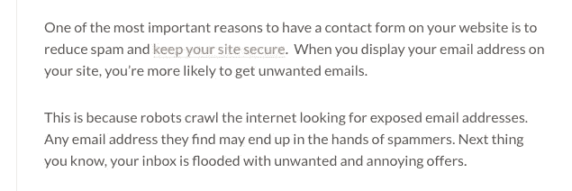

由 WPForms 博客提供…你可以在这里查看完整的文章

恶心，谁喜欢垃圾邮件？显然，在网站上打印一封电子邮件很容易，但是现在你知道为什么添加一个联系表单很重要了，即使它有点复杂。其他几个原因:它们看起来很酷，很花哨，为访问者提供了最简单的反馈方式，而且实现起来并不困难。在这篇文章中，我将使用一些不同的资源。

[语义 UI 反应](https://react.semantic-ui.com/) —这是我将用来构建表单的组件框架。随意构建自定义表单或使用不同的框架。

[EmailJs](https://www.emailjs.com/) —这将用于处理从网站发送电子邮件到你想要的电子邮件地址。只要你没有收到+200 封电子邮件/月，这是免费的！

Sweetalert2 —这将用于在事情进展顺利或不顺利时给来访者一个很好的提醒。同样，如果您愿意，可以随意使用常规提醒或不同的库。

第一步是注册 EmailJs。这是免费的，所以不要担心。

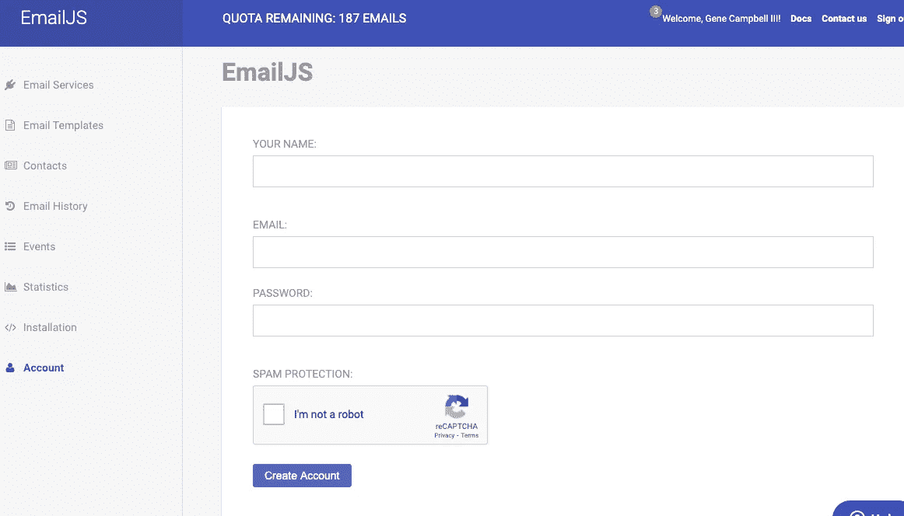

我已经有一个帐户，所以信息显示在上面的紫色

一旦您创建了一个帐户，添加一个电子邮件及其尊重的服务。正如你在下图中看到的，我正在使用 gmail。

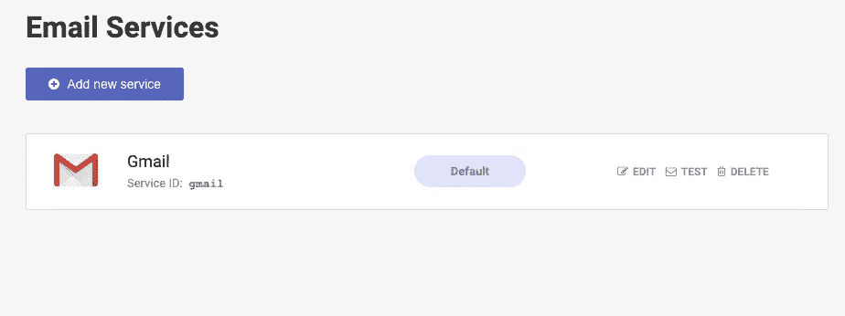

您可以向选定的地址发送测试电子邮件。我绝对推荐这个。接下来，是时候为电子邮件设置模板了。选择左侧的电子邮件模板选项卡。

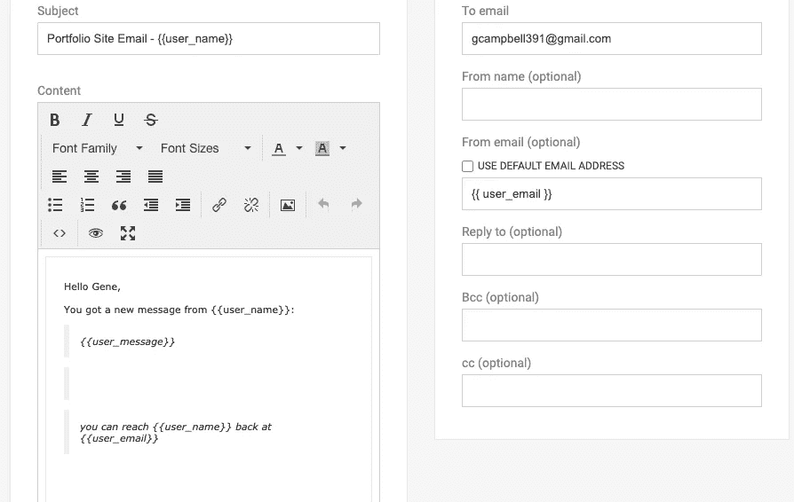

这一步真的很重要。基于表单的输入，双括号中的所有内容都是动态的。务必确保右上角的收件人电子邮件地址设置正确。你可以让邮件模板说你喜欢的任何内容。我保持简单，因为信息是发给我自己的。一旦你有了你喜欢的模板，保存它。然后单击“保存”按钮左侧的“代码”按钮。当我点击代码时，我的屏幕是这样的。

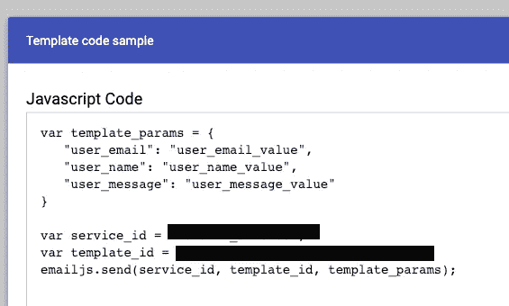

当我们在我们的项目中使用 Emailjs 库时，我们将需要这些密钥，但是请确保您的 id 保密！我们现在还不需要这些信息，但是我们会继续下去的。稍后您还需要您的服务 id，您可以通过转到“帐户”选项卡来访问它。然后转到右边的 API 选项卡。你的屏幕应该是这样的。您的用户 id 就在这里，上面写着用户 ID:

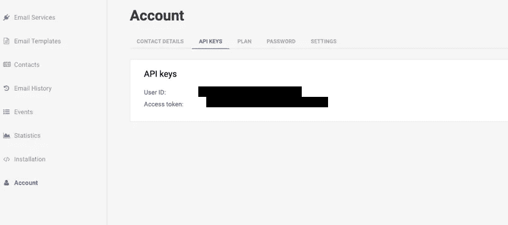

现在我们可以开始向项目添加一些代码了！在您使用“npm start”启动 React 项目之前，我们需要添加前面提到的这些库/包。Emailjs 可以用这个命令安装，

```
npm install emailjs-com --save
```

我将添加的下一个库是语义 UI React。您可以用下面的命令安装这个框架，

```
npm install semantic-ui-react semantic-ui-css
```

您还需要将这个脚本添加到 index.html 文件的头部，以便导入语义 UI React 的样式。脚本看起来是这样的，

<link rel="”stylesheet”" href="”//cdn.jsdelivr.net/npm/semantic-ui@2.4.2/dist/semantic.min.css”">

最后，我们将为 Sweetalert 2 添加 npm 包，您可以通过在终端上添加以下命令来安装它。

```
npm install sweetalert2
```

厉害！现在，如果您打算将您的项目添加到 github，我建议将以下 3 个键添加到. env 文件中，并将。env 到你的。gitignore 文件以防止其他人访问您的密钥。这 3 个键是服务 id、模板 id 和用户 id。因为我的项目是托管在 github 上的，所以我把我的添加到了 a .env 中。我的看起来像下面的图片。

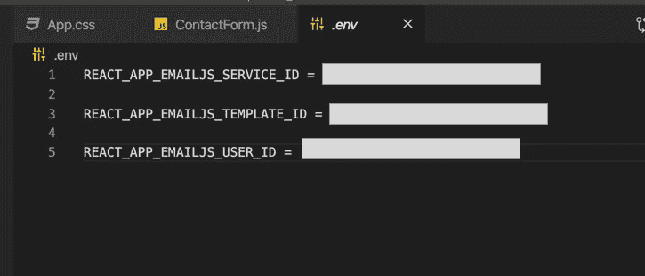

记住，如果你想在一个 react 应用程序中使用 env 变量，你必须以 REACT_APP 开始变量，后跟变量名！

这是我们在实际编写联系人表单之前需要设置的最后一部分。如果您从访问密钥时遇到问题。env 文件，记住每当您对。你必须重启你的服务器！因为这个，我已经把头撞墙好几次了。不要让它发生在你身上！在 React 中，我们可以通过调用 process.env.VARIABLE_NAME 来访问这些变量。

剩下的就超级简单了！我们的 js 文件中只需要两样东西，表单本身和一个提交表单句柄函数。我的 js 文件名为 ContactForm.js。我们可以通过将导入添加到文件的顶部来启动该文件。我的文件的顶部看起来像下面的图片。

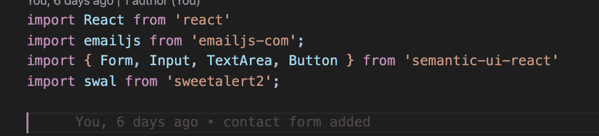

如果你跟随着我使用的所有东西，你的应该看起来一样。因此，我们将在导入后添加的第一部分是表单。我的看起来像下面的图像。

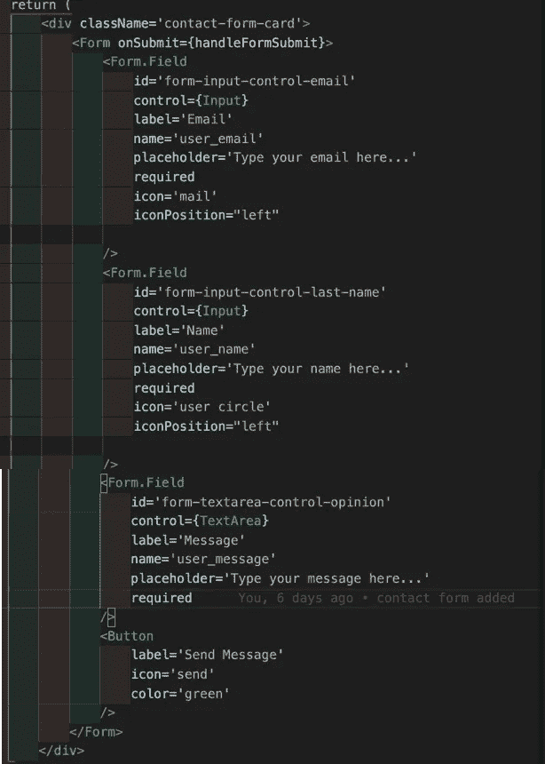

不要让图标、图标位置、标签、占位符、id 或控件分散你的注意力。这些都是为了造型，想怎么玩就怎么玩吧！我建议使用 required，因为它要求在提交表单之前填写该字段。你还可以在语义 UI React 的官方网站上查看更多示例“表单组件”。表单最重要的部分是输入姓名！在表格中确认。字段标记，其名称与您在模板中创建的名称相匹配。我的匹配与下图中的 template_params 相同。


因为 Emailjs 太棒了，我们不必担心跟踪表单输入的变化状态。只要确保变量匹配就像我已经提到过几次的那样。这很重要！！！您还可以看到，我在表单标签的开头添加了一个 onSubmit 动作。它被设置为调用我在同一个文件中创建的另一个函数 handleFormSubmit。下面是所述功能的图片。

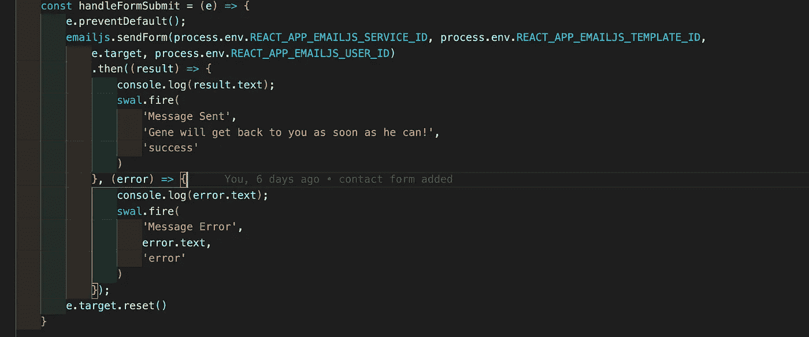

我将尽可能容易地为你分解这个函数。

1.  e.preventDefault() —防止页面重新加载
2.  emailjs.sendForm(service_ID，template_ID，e.target，user_ID)后跟一个 then 来处理结果，这是我们用来访问电子邮件服务的命令。参数由 3 个键和表单(例如目标)组成。只要您完全按照这个设置，emailjs 将使用表单中的正确输入设置您的定制模板，然后将完成的模板发送到为它设置的地址。真的就这么简单！
3.  中的第一次回调。那么哪个是(result) => {} —它处理如何处理成功发送的电子邮件的结果。我喜欢向用户显示一个通知，告知他们成功发送了消息。
4.  swal.fire() —是 sweetalert。这是一个简单的警报，由参数中的 3 个参数组成。第一个是警报的标题，第二个是警报的消息，最后一个是警报的图标。您可以在其网站上查看更多关于 Sweetalert2 的官方文档。
5.  中的第二次回调。那么哪一个是(error) => {} —它处理如何处理错误。错误可能是从错误的服务 id 到没有互联网连接。如果出了问题，让用户知道是件好事。
6.  我测试时，控制台日志就在那里
7.  e.target.reset() —将通过重置表单来清除表单输入字段

就是这样！！！如果你需要额外的参考，你可以在下面查看我的整个文件的完整截图。

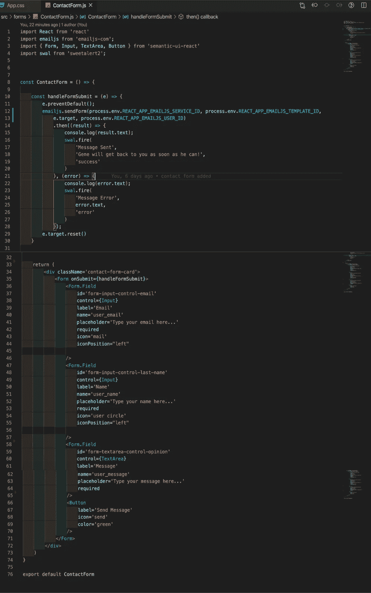

如果你正确地遵循了所有的步骤，你应该得到这样的结果(除了一些样式)..我用 CSS 做到了这一点)。你的表单和提醒应该是有效的，这也是本文的重点。这是我的截图。

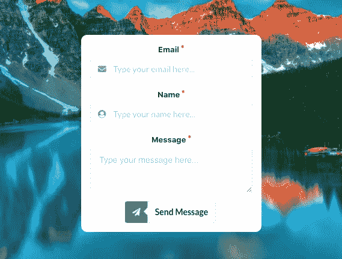

当我成功发送消息时，会有一个提示！

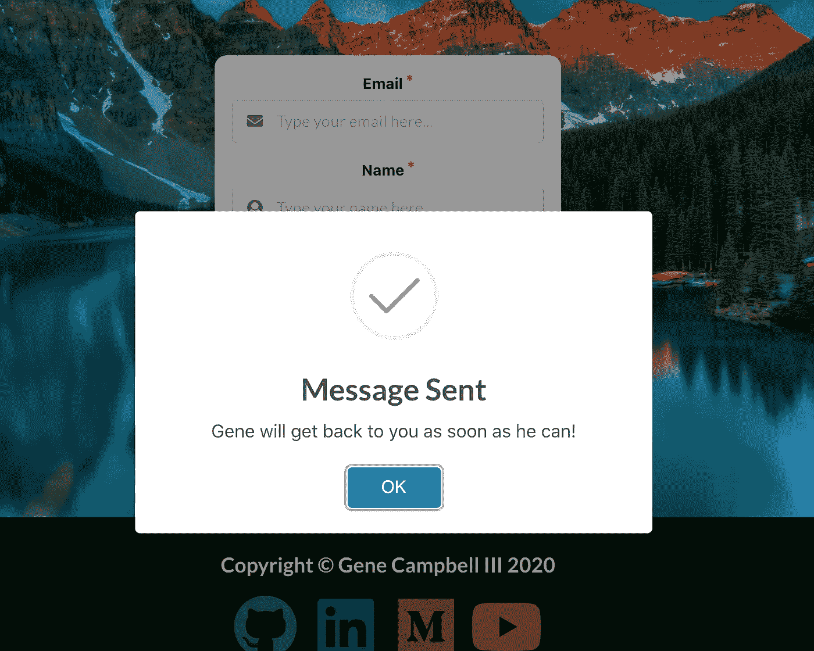

几秒钟后，我收到了一封电子邮件，看起来像这样…

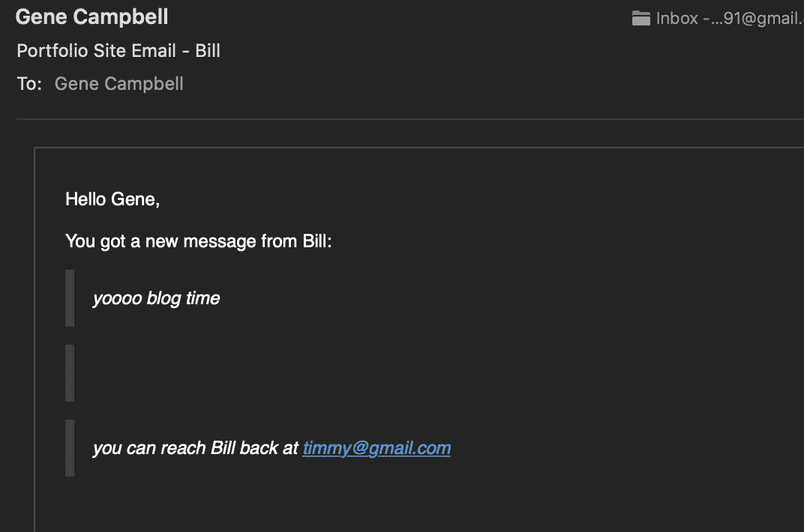

就是这样！你现在有了一个体面的联系方式，当访问者访问你的网站时，他们可以联系你。我希望这篇文章对你有所帮助，如果你有任何问题，请随时通过 LinkedIn 或我在 T2 的作品集网站联系我。感谢阅读！！！