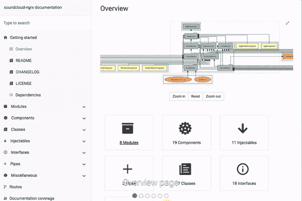
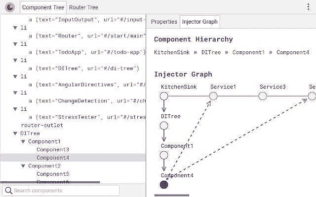
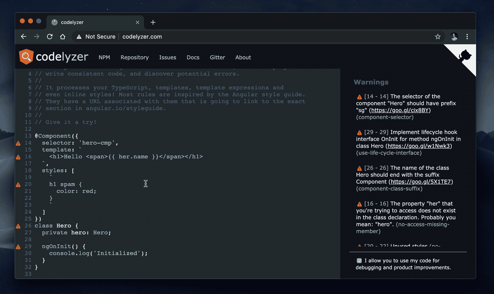
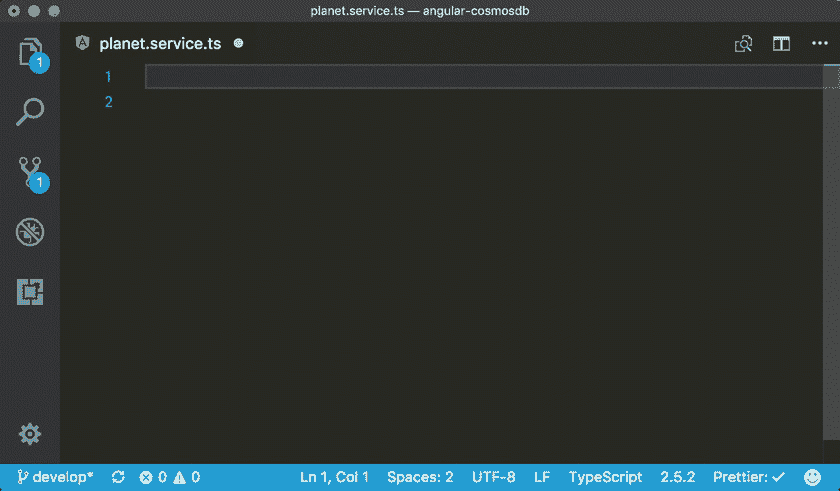
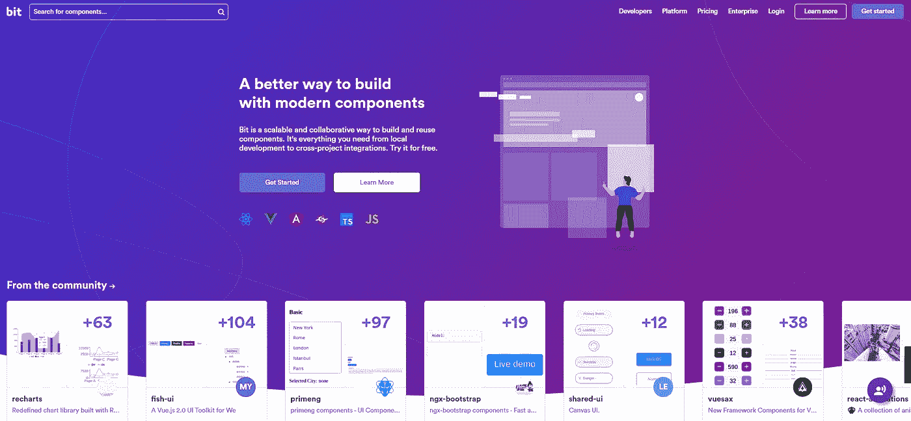

# 在 Angular 中配备正确的打字工具

> 原文：<https://levelup.gitconnected.com/get-equipped-with-the-right-typescript-tooling-angular-6f789e222b30>

## 通过丰富您的工具箱来改善您的开发体验


谁不希望自己的生活更轻松呢？谁不想变得高效和多产呢？今天我向你们列出了我的打字工具箱。作为开发人员，工具对于提高生产率是必要的。因此，为什么不增强您的工具来提高您的生产力呢？

准备好了吗？我们走吧！

# Compodoc:自动化文档生成

我在我从事的一个项目中发现了这个工具。这个工具太棒了，你可以专注于拥有干净的代码和架构，对于文档，你可以让 Compodoc 自动为你做，多么令人高兴！

这是必须的，尤其是当您有一个包含许多组件的大型企业应用程序时。

[行动中的 Compodoc](https://compodoc.app/) :



[Compodoc](https://compodoc.app/)

**怎么安装？**

```
*# Install compodoc with npm*$ 
**npm install -g @compodoc/compodoc***# Run compodoc in your project* 
**compodoc -p tsconfig.app.json src -s**
```

在我的例子中，我们在 Gitlab 中部署了 Compodoc，应用程序也部署在那里。因此，GitLab 上的每个开发人员都可以访问文档。

# 预兆

当渲染 Angular 应用程序时，我们通常会面临一些困难的行为，因为组件具有可变的状态。预兆来拯救我们的神经和时间。占卜是国家监察员。有了这个了不起的工具，您将能够探索给定组件或服务的依赖关系，而无需深入研究代码。它不仅为你检查。它还用它的注射器图绘制了整个画面。(我喜欢这个家伙😍！！)



你可能已经注意到了 chrome 开发工具。是的，你的预言是插入 Chrome DevTools 的 Chrome 扩展。

**然后就可以:**

*   探索应用程序中组件之间的关系(如果你是这个项目的新手，并开始发现它，这是最好的选择)
*   跟踪每个组件的状态
*   手动触发事件并测试很多东西

安装扩展的链接👉[此处](https://chrome.google.com/webstore/detail/augury/elgalmkoelokbchhkhacckoklkejnhcd)。

# ngrev:动态代码分析

这只是我开始一个新的角度项目时的必备。你愿意通过逐个组件检查来分析整个应用程序以了解全貌吗？老实说，我不能。我懒得做那件事🙄。

恩格雷夫过去是，现在仍然是我的救命恩人。使用这个工具的效率和时间收益简直令人难以置信。当看到这个工具运行时，您就会明白为什么:

ngrev 在行动

想象一下你用这个工具节省了多少时间。你可以在几分钟内得到应用程序的猪图片和大脑图像！！

老实说，当我开始新项目时，我的清单上增加了一个新的仪式。推出我的 ngrev ❤

特别感谢 ngrev 的所有贡献者。

# 共析器

你尊重官方[棱角风格指南](https://angular.io/styleguide)吗？你的团队也一样吗？你愿意在每个开发者背后验证它是否被尊重，并且每次都重复你自己吗？我个人不愿意！

如果有一个工具可以在实时编码时通知开发人员，会怎么样？是的，你已经有了一个工具，那就是 [codelyzer](https://github.com/mgechev/codelyzer) 。它的工作是为您的应用程序提供复杂的分析。

如果你已经在使用 Angular CLI，那你只需要运行。

```
***ng lint***
```

要了解更多关于 codelyzer 的信息👉[此处](https://github.com/mgechev/codelyzer#how-to-use)。

Codelyzer 的应用:



[共析器](https://www.npmjs.com/package/codelyzer)

# 角度 CLI

谁没用过 [Angular CLI](https://github.com/angular/angular-cli) ？该工具由 Google 构建，用于自动生成和提供组件、服务、模块等等。

为了让您了解 Angular CLI 的效率和速度，这里有一个示例:

```
ng generate **application**
```

我刚刚生成了一个完整的功能角度应用程序。要了解它是如何工作的，这里有一篇文章:

[](https://famzil.medium.com/2-steps-to-create-launch-test-discover-angular-application-713387952e69) [## 创建、启动、测试和发现角度应用的 2 个步骤

### 发现角度应用的快速简单步骤

famzil.medium.com](https://famzil.medium.com/2-steps-to-create-launch-test-discover-angular-application-713387952e69) 

# 有角度的片段

如果你的项目因为某种原因没有使用 Angular CLI 怎么办？我曾经做过一个不使用 Angular CLI 的项目。因此，没有组件、服务、模块..等等。

因为我懒得写东西，所以我寻找解决我问题的方法。而且我发现了金块*_* [有棱角的片段](https://github.com/johnpapa/vscode-angular-snippets)。

[**角度片段 VScode 扩展**](https://marketplace.visualstudio.com/items?itemName=johnpapa.Angular2) **动作中**



太棒了，对吧？我同意它没有生成整个组件及其模块和测试文件…等等。，有一个命令，但有一句谚语说:

> “看不清总比瞎了好。”

特别感谢 [johnpapa](https://github.com/johnpapa/vscode-angular-snippets/commits?author=johnpapa) 为❤带来的精彩延伸

# 少量

我最近发现了这个很棒的[网站](https://bit.dev/)，它给你一个更好的方法来构建现代组件并与你的团队分享。这意味着即使你有初级开发人员，你的应用程序代码也将是同质的。因为 [Bit](https://bit.dev/) 将是团队需要组件时的目录，无论是在 React、Angular、VueJS 中..等等。

如果你想分享或者从别人分享的东西中得到启发，你也可以和全世界分享。



[B](https://bit.dev/) 它

享受；)

亲爱的读者朋友们，感谢你们的支持和宝贵时间。我希望这对你有用和有帮助。

**关注我上** [**中**](https://medium.com/@famzil/)**[**Linkedin**](https://www.linkedin.com/in/fatima-amzil-9031ba95/)**，**[**Twitter**](https://twitter.com/FatimaAMZIL9)**了解更多文章。****

**回头见(ﾉ◕ヮ◕)ﾉ*:･ﾟ✧)**

****FAM****