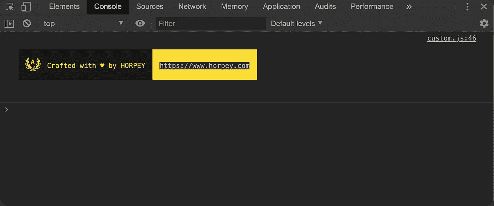
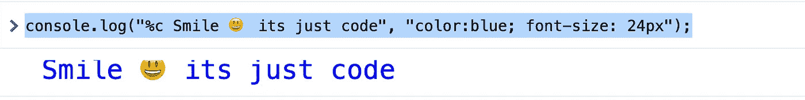
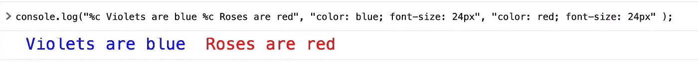
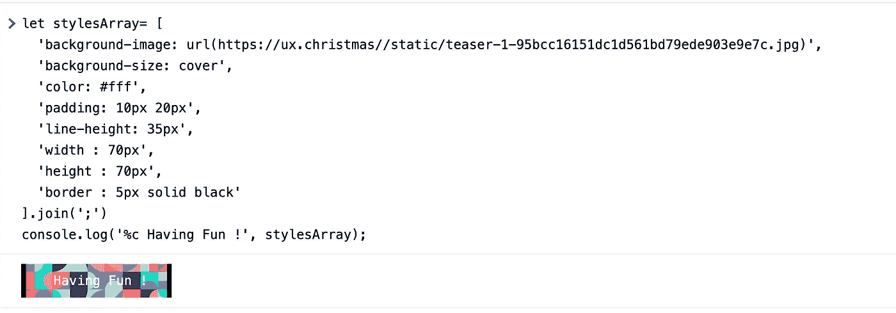
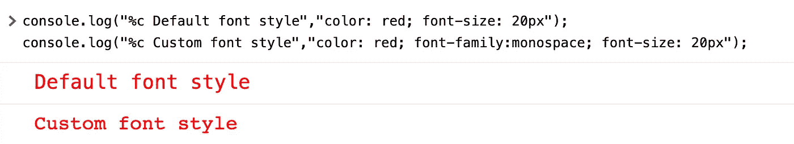
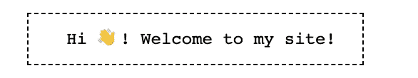

# 在控制台上玩得开心

> 原文：<https://levelup.gitconnected.com/get-funky-on-the-console-a1362662b9d3>

## 使用带有格式说明符的 Javascript 和 CSS 在浏览器控制台中创建签名



> 你想听一个有趣的提示吗？我们将在浏览器控制台中构建一个自定义签名，您可以在每个项目后使用它！这将给我们的游戏机增加一些色彩和变化。

要查看顶部的自定义签名，请在您的浏览器中访问[https://horpey-site.web.app/](https://horpey-site.web.app/)，右键单击选择检查，单击控制台选项卡，瞧，您会在您的浏览器控制台中看到很酷的签名。

这最多需要 10 分钟。为了使事情更简单，我们可以在 [JSConsole](https://jsconsole.com/) 上运行一些示例代码。我们将使用普通的 Javascript。

可以在 DevTools 中使用 CSS 格式说明符来设置 console.log 输出的样式。我们还将涉及操作 console.log 输出颜色和字体。

# **控制台**

控制台是每个开发过程中有益的一部分。出于各种原因，我们使用它来记录项目、查看数据、保留某些数据以备后用，等等。因此，考虑到我们经常与它直接或间接互动，我们应该想办法给它一个吸引人的外观和感觉。

各种控制台日志记录方法`log`、`info`、`error`和`warn`是远远不够的，尤其是当您调试一个巨大的应用程序，并且有大量日志进入浏览器控制台时。

在本文中，我们将学习如何在浏览器控制台中记录条目时应用样式。我们希望在本文结束时，您已经了解了设计控制台内容样式所需的所有知识。

# 添加样式和格式

## **格式说明符**

格式说明符定义了要在标准输出上打印的数据类型。我们可以使用格式说明符告诉`log`函数应该如何打印数据。

`%s` —将值格式化为字符串。

```
let data = 10;
console.log("%s treated as string", data);
```

JavaScript 中的格式说明符列表:

```
%s → Formats the value as a string%i or %d → Formats the value as an integer%f → Formats the value as a floating-point value%o → Formats the value as an expandable DOM element. As seen in the Elements panel%O → Formats the value as an expandable JavaScript object%c → Applies CSS style rules to the output string as specified by the second parameter
```

您可以将自己的样式应用于日志消息，方法是在消息前面加上`%c`标志，并提供一个 CSS 样式属性字符串作为 log 方法的第二个参数，如下所示:

```
console.log(“%c Smile 😃 its just code”, “color:blue; font-size: 24px”);
```



代码输出

## 添加多种样式

我们还可以对消息应用多种样式。在字符串的每个部分之前使用`%c`，并为每个`%c`传递一个单独的样式:

```
console.log("%c Violets are blue %c Roses are red", "color: blue; font-size: 24px", "color: red; font-size: 24px" );
```



代码输出

## 将图像添加到控制台

我们可以使用 CSS 中的`background-image`属性和其他属性(如背景大小、背景位置等)向控制台添加图像。

```
let stylesArray= [ 
     ‘background-image: url(https://ux.christmas//static/teaser-1-     95bcc16151dc1d561bd79ede903e9e7c.jpg)', 
     ‘background-size: cover’, 
     ‘color: #fff’, 
     ‘padding: 10px 20px’, 
     ‘line-height: 35px’, 
     ‘width : 70px’, 
     ‘height : 70px’, 
     ‘border : 5px solid black’ ].join(‘;’) console.log(‘%c Having Fun !’, stylesArray);
```



代码输出

## 更改输出字体

与我们将排版样式应用于控制台输出的方式相同，我们也可以更改控制台输出字体。让我们看看如何去做。

```
console.log("%c Default font style","color: red; font-size: 20px"); console.log("%c Custom font style","color: red; font-family:monospace; font-size: 20px");
```



代码输出

# 让我们定制🎉



```
let msg = “%c Hi 👋! Welcome to my site!”; 
let styles= [ 
    ‘font-size: 12px’, 
    ‘font-family: monospace’, 
    ‘background: white’, 
    ‘display: inline-block’, 
    ‘color: black’, 
    ‘padding: 8px 19px’, 
    ‘border: 1px dashed;’ 
].join(‘;’) console.log(msg, styles);
```

感谢观看👍

我希望你喜欢这个。要了解更多关于这款游戏机的信息以及你可以应用到它上面的许多风格，请随意查看官方文档。

去 horpey.com[参观](https://horpey.com/)，了解我更多