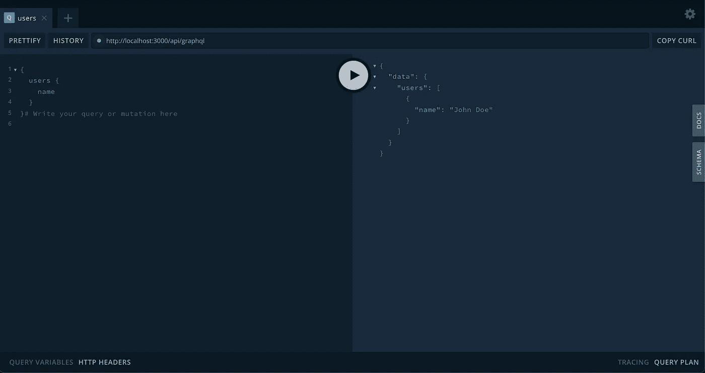

# 让 GraqhQL Playground 在 NextJS 中运行起来

> 原文：<https://levelup.gitconnected.com/get-graqhql-playground-up-and-running-in-nextjs-2da7a2105713>

我最近开始涉足 NextJS，我惊讶地发现，除了它对 React 组件和特性的常规包装之外，它还提供了对 API 开发的支持。在进入 NextJS 一周之前，它一直很棒，我已经对它为快速开发和测试所提供的东西感到兴奋。

就理解其架构而言，NextJS 非常简单。神奇之处在于`pages`目录。该目录下的文件被映射为客户端或前端编译。在`pages`目录中的`api`目录保存了所有的服务器端代码。维护项目和编写一些次要的服务器端脚本变得非常容易。

我想从一个查询我的 scraper 服务器的小项目开始。我认为最好从客户端的 graphQL 服务器开始，它将处理所有后端网络服务，这也将增加安全性，并提供对实际服务器的抽象。nextJS Github 上的示例项目似乎不适合我。我深入研究了一个示例代码是如何引起问题的**。**

**调试**

来自 nextJS 的样板文件在这里是。这是非常基本的，看起来这里的代码应该工作。那问题是什么？

让我们看看这里的一部分代码，找出问题所在。

1.  我们使用阿波罗服务器微包，它为我们提供了一个精简版的阿波罗服务器。这对于保持优化的应用包大小是有效的。
2.  `handler`函数是服务器的默认入口点函数。NextJS 将对此进行解析，并用文件名创建一个路由。在这种情况下，这个文件被命名为`graphql.js`。所以这里的路线是`localhost:3000/graphql`

当我试图运行这段代码时，您会看到 graphQL 服务器开始运转，但是请求失败了。现在让我们用 Playground 调试一下。根据最新的 Apollo 更新，GraphQL Playground 作为一个独立的插件被转移。为了做到这一点，现在让我们看看修改后的代码，看看我们是如何包括操场的。

对这段代码的一些补充。我们来分析一下。

1.  如前所述，插件被转移到阿波罗核心。我们从`apollo-server-core`导入操场插件
2.  我们也从`micro-cors`导入 Cors。我们一会儿会谈到这个。
3.  我们将插件定义添加到`ApolloServer`的插件列表选项中。
4.  我们现在用在文件顶部创建的`cors`函数包装整个处理程序。

**为什么是 cors？**

默认情况下，Apollo Playground 只将`https://studio.apollographql.com`域列入白名单。当您在本地主机上运行 playground 时，服务器会拒绝请求。为了满足请求，我们使用 cors 函数包装服务器。这类似于在开发`expressjs` web 应用程序时使用`cors`中间件。

这就对了，现在使用`npm run dev`运行应用程序，在小路上看到操场。注意，我们已经改变了路径，它的`/api/graphql`

本地主机上的 GraphQL 操场

如果你想马上使用样板文件，这里有 [Github repo](https://github.com/adityak74/nextjs-graphql-playground-boilerplate) 。

 [## GitHub-adityak 74/nextjs-graph QL-playground-boilerplate

### 这是一个用 create-next-app 引导的 Next.js 项目。首先，运行开发服务器:打开…

github.com](https://github.com/adityak74/nextjs-graphql-playground-boilerplate) 

关注我更多这样有趣的文章，如果这有助于你，然后给它一个大胖子👏。