# 去找 HTTPS🔐！如何在 AWS 中为 EC2 托管的应用程序获取 SSL\TLS 证书？

> 原文：<https://levelup.gitconnected.com/get-https-how-to-get-ssl-tls-certificate-in-aws-for-ec2-hosted-application-8d14771a6ff6>

今天，我们将看看如何为 EC2 上的网站/应用获得 HTTPS。

如果您之前已经将 nginx 配置为 HTTP，我们需要设置它。一旦你完成了 can，我们就可以进入下一步。

**获得 HTTPS 的步骤**

1.  获得 SSL/TLS 认证
2.  创建负载平衡器
3.  通过负载平衡器路由所有流量
4.  所有交通都要经过 HTTPS

在本例中，我们使用了 route 53 的域名服务。即使你没有一个，你仍然可以使用本教程，稍作修改，这将被提及。

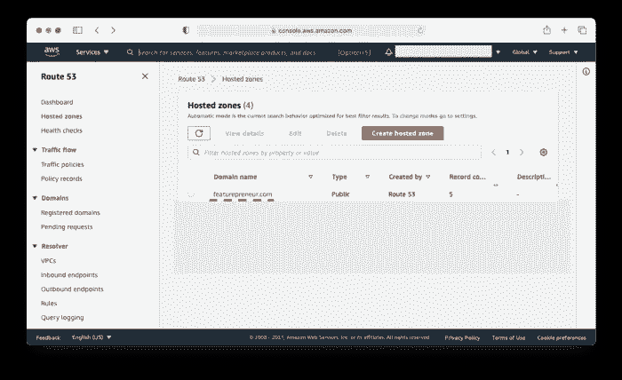

# 获得 SSL/TLS 认证

现在我们可以从 AWS 证书管理器获得一个免费的证书

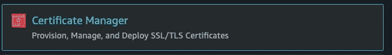

1.  转到证书管理器

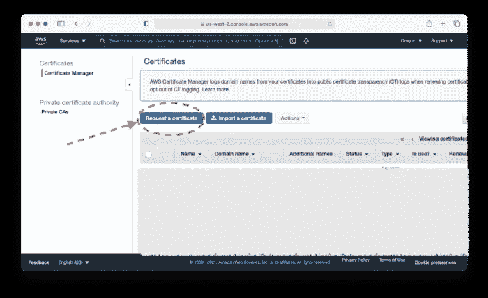

2.点击申请证书

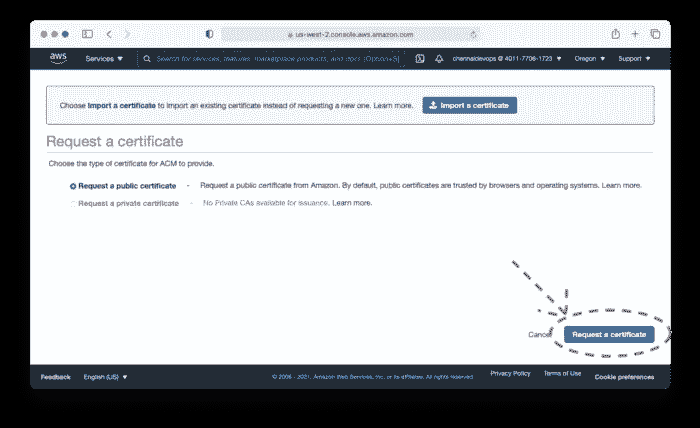

3.选择公共证书并单击请求证书

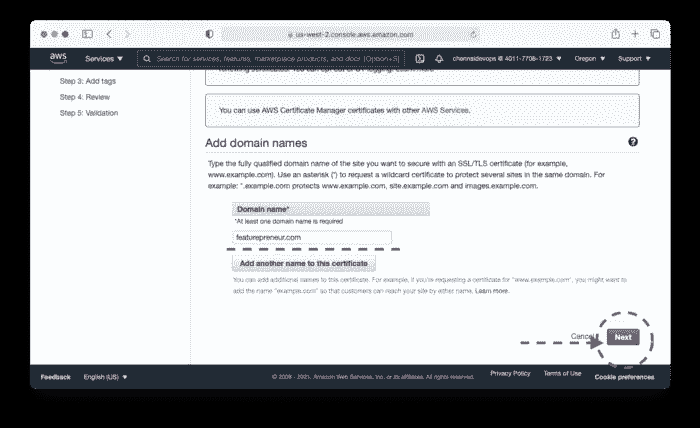

4.输入您的域名。com 或任何子域，如果需要的话。&单击下一步

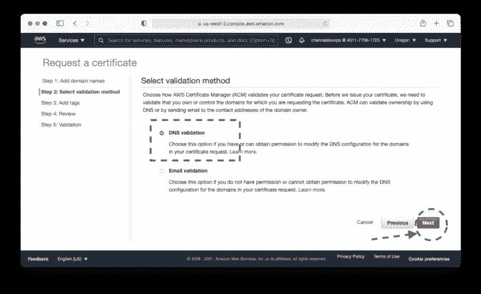

5.选择 DNS 验证以快速生成证书，当然，如果需要，您也可以使用电子邮件验证&单击下一步

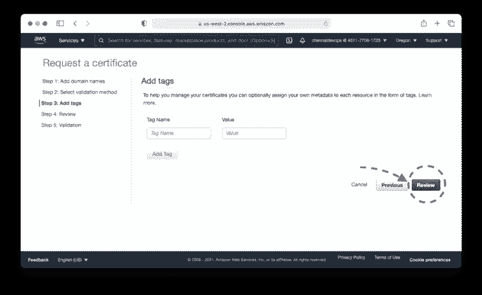

6.如果你想添加标签，你可以，但我现在跳过&点击审查

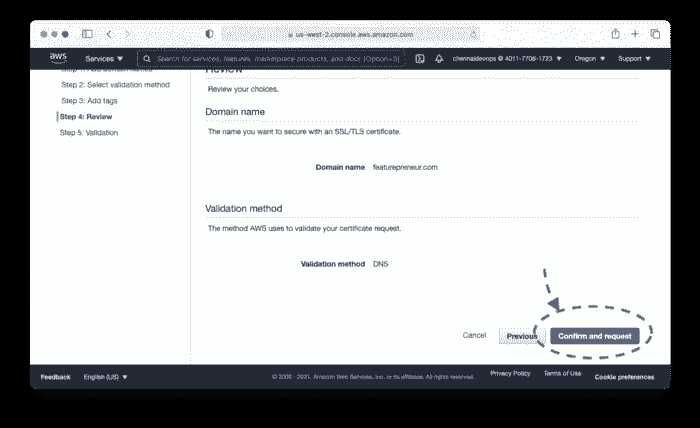

7.查看所有详细信息，如果正确，现在单击确认并请求。

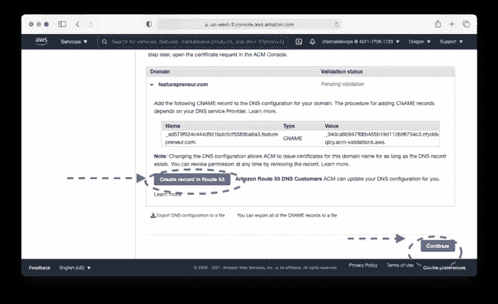

8.现在，您需要在您的托管区域中用这个值创建一个记录。但是 AWS 让你来替你做这项工作。因此，您可以在 53 号公路上点击“创建记录”,或者自己手动创建记录，然后点击“继续”

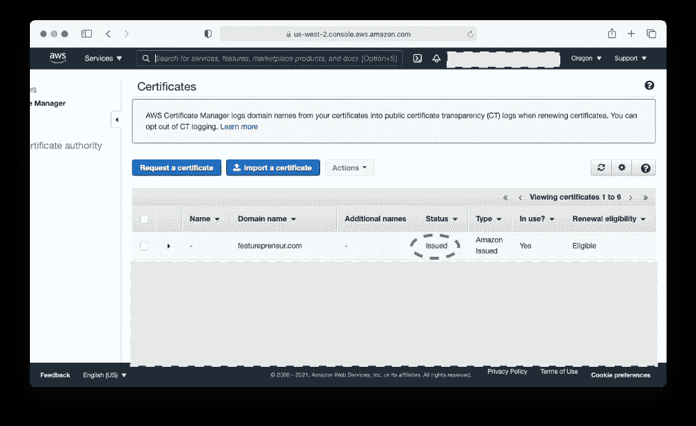

等待几分钟，你会得到一个已发布的状态。一旦你做到了，你就可以进入下一步。

# 创建负载平衡器

如果您的应用程序托管在 EC2 实例上，我们需要确保我们已经通过负载平衡器传输了它。

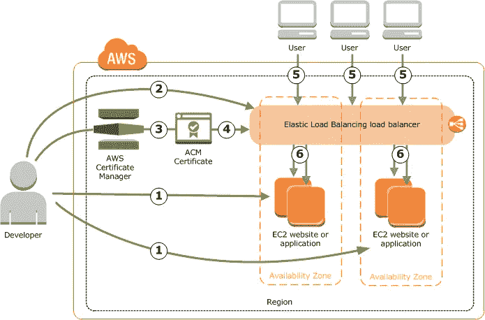

我们只能通过负载平衡器附加 ACM 证书。

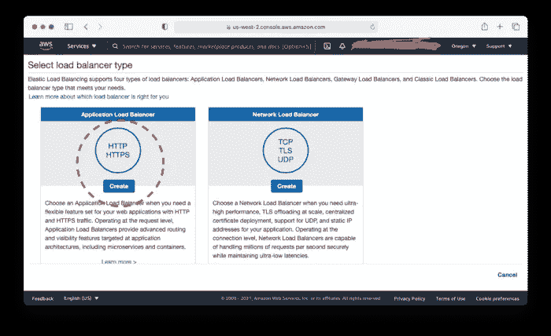

1.  创建新的负载平衡器选择 https/https

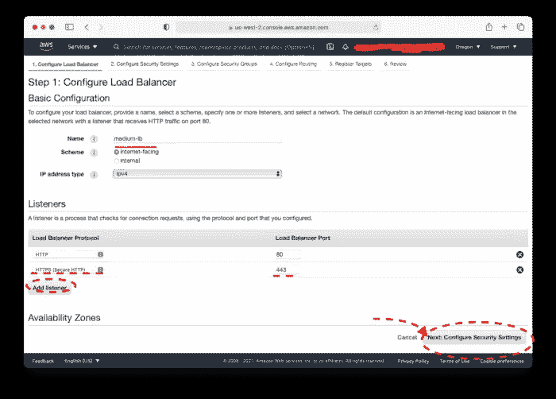

2.添加一个监听器，并使用端口 443 添加 https 单击配置安全设置

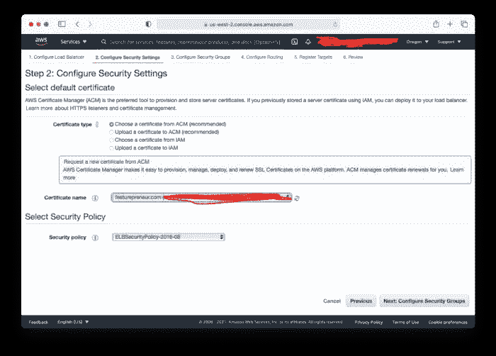

3.选择从 ACM 中选择一个证书，并选择您刚刚获得的证书&单击下一步

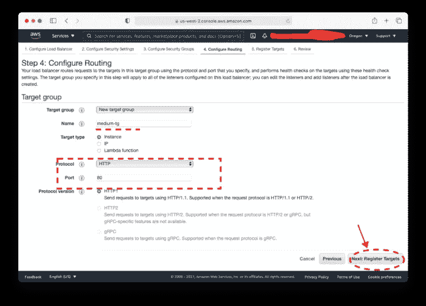

4.选择使用端口 80 连接到目标组的 HTTP 协议，因为您不需要 loadbalncer 通过 HTTPS 与 ec2 实例对话，HTTP 足以完成这项工作&单击 next

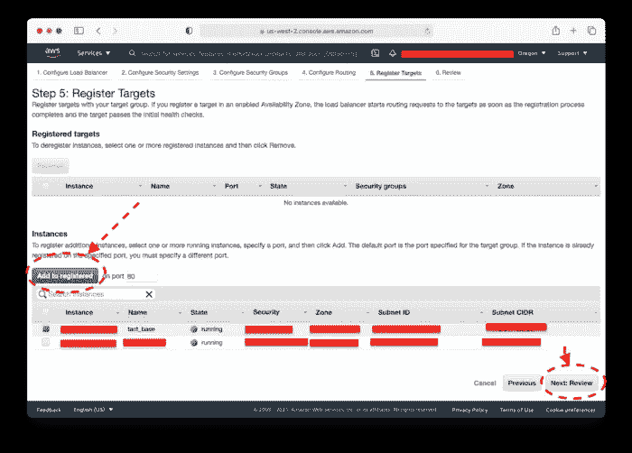

5.将 EC2 添加到您的目标组，然后单击“下一步”

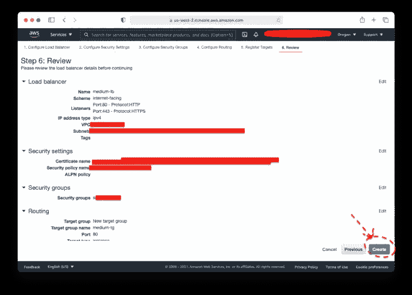

6.查看所有信息，然后单击“创建”

现在，我们已经成功地创建了一个负载平衡器，HTTPS 应该在几分钟内工作。

清除您的浏览器缓存或查看您的目标组是否通过端口 80 设置。

# 所有交通都要经过 HTTPS

这肯定是最短的一步。我们在这里试图实现的是强制流量通过 HTTPS，即使他们试图通过 HTTP。

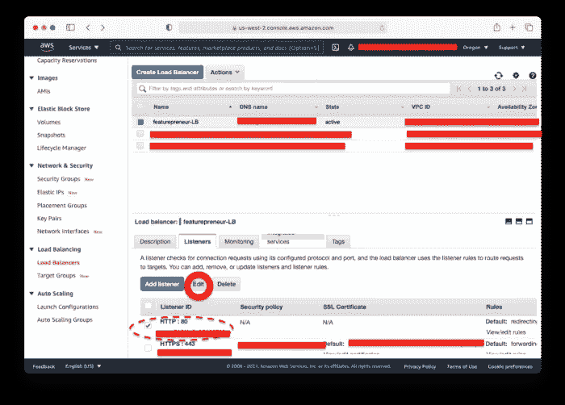

1.  转到您的负载平衡器并选择您的负载平衡器，然后选择端口 80 并点击编辑

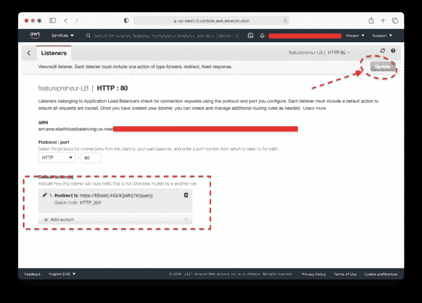

2.将路线更改为重定向至 HTTPS，然后单击顶部的更新。

> *🥳就是这样，你已经成功将你的 HTTP app 改为 HTTPS*

 [## 软件工程师- EY | LinkedIn

### 在全球最大的职业社区 LinkedIn 上查看 Alvis F 的个人资料。阿尔维斯有 5 个工作列在他们的…

www.linkedin.com](https://www.linkedin.com/in/alvisf/)