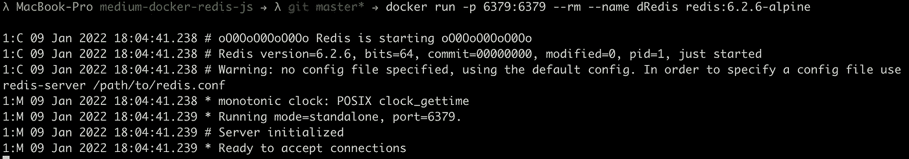
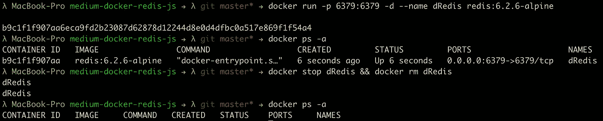
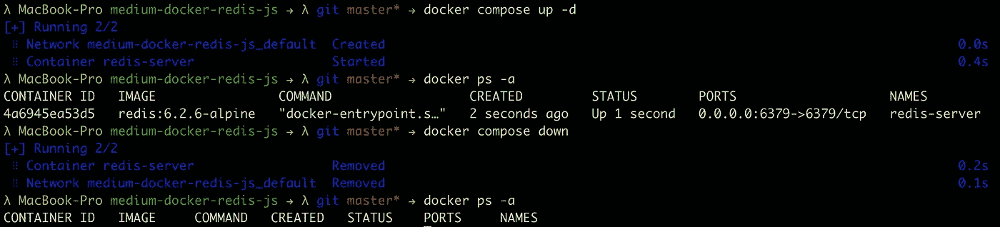

# 让 Redis 在 Docker 上运行

> 原文：<https://levelup.gitconnected.com/get-redis-up-and-running-on-docker-4af011db9bc7>

通过 CLI 和 Docker Compose 在本地机器上设置 Redis Docker 容器的分步指南。


照片由[张秀坤·吕克曼](https://unsplash.com/@exdigy)在 [Unsplash](https://www.unsplash.com/) 上拍摄

先决条件

*   [码头工人](https://www.docker.com/get-started)

## 我们将在本教程中做什么

本教程将教你如何直接通过 CLI 启动我们的本地 [Redis Docker 映像](https://hub.docker.com/_/redis)作为 Docker 容器，并准备一个 Docker 组合文件来设置它。

和往常一样，您可以在链接的 GitHub 资源库中找到本教程中使用的代码:

[](https://github.com/Abszissex/medium-docker-redis) [## GitHub-abszisex/medium-docker-redis

### 此时您不能执行该操作。您已使用另一个标签页或窗口登录。您已在另一个选项卡中注销，或者…

github.com](https://github.com/Abszissex/medium-docker-redis) 

## 通过 CLI 在 Docker 容器中运行 Redis

在本地机器上运行 Redis 最简单的方法是使用一个[预构建的 Docker 映像](https://hub.docker.com/_/redis)。

使用 Docker，您可以使用两种不同的方式来启动您的容器。要么通过`docker run ...` CLI 命令直接运行它，要么使用 [Docker Compose](https://docs.docker.com/compose/) 并采用声明式方法。

我将向您展示这两种方法，但是我总是推荐声明性方法(Docker Compose)而不是命令性方法(Docker CLI)。

**以附加模式运行 Redis 容器**

第一种也是最直接的方法是通过 Docker CLI 直接运行 Redis。以下命令就是这样做的:

```
docker run -p 6379:6379 --rm --name dRedis redis:6.2.6-alpine
```



通过 Docker CLI 运行 Redis

让我们一步一步地检查上面提到的命令，看看各个参数是做什么的。

*   `docker run` —我们正在触发`run`命令来启动一个新的容器
*   `-p 6379:6379` —我们通过将 docker 容器的端口`6379`转发到主机的端口`6379`来进行端口映射。Redis 在端口`6379`上默认运行。
*   `--rm` —我们希望在中断命令时删除 Docker 容器。如果您只想运行容器一次，并且不想在运行后留下“浪费”,那么`—-rm` 参数非常好。
*   `--name dRedis` —指定容器名称。如果以后要引用容器，命名容器非常有用，这样就不必使用自动生成的哈希值/id。请记住，容器名称需要在您的系统中是唯一的。
*   `redis:6.2.6-alpine` —我们要运行的 Docker 映像。在这种情况下，我们希望在版本 6.2.6 中运行 Redis 的 alpine 版本。

您可能已经注意到，如果中断该命令，Redis 容器会被删除。所以`--rm`变体对于开发来说是极好的，但是如果你想让你的 Redis 容器继续运行的话，就相当糟糕了。

**以分离模式运行 Redis 容器**

所以通常你会用`-d`代替`--rm`参数。`-d`参数是“detached”的简称，表示容器要从终端脱离，在后台运行。

使用以下命令，您可以在后台运行 Redis 容器:

```
docker run -p 6379:6379 -d --name dRedis redis:6.2.6-alpine
```

但是现在，您需要另一种方法来停止并再次移除容器。幸运的是，我们为 Docker 容器添加了一个名称，以便于引用它。

以下命令停止并删除创建的 Redis 容器

```
docker stop dRedis
docker rm dRedis
```

在下一张图中，你可以看到我是如何

*   通过`docker run`启动一个分离的 Redis Docker 容器
*   使用`docker ps -a`检查运行中的容器
*   通过`docker stop`和`docker rm`停止并移除创建的容器
*   检查码头工人是否通过`docker ps -a`移除了容器



处于分离状态的 Redis Docker 容器

`docker ps`命令的`-a`参数显示所有容器。因为默认情况下，`docker ps`命令只显示当前正在运行的，所以我们可以验证我们的容器不仅仅是被停止了，而是被删除了。

## 通过 Docker Compose 在 Docker 容器中运行 Redis

除了通过 Docker CLI 运行 Redis 之外，一种更容易再现的方法是使用 Docker Compose。此外，它使其具有声明性，您还可以将它添加到 VCS 中，这对于命令式命令来说并不总是那么容易。

在下面的`docker-compose.yaml`中，您可以看到与 Docker CLI 相同的定义。我们通过`image`定义我们想要运行的图像，通过`container_name`定义我们容器的名称，尽管我们在这里选择了一个不同的名称，并通过`ports`定义端口映射。

现在剩下的唯一一件事就是使用下面的命令运行这个声明:

`docker-compose up -d`

这里的`-d`也是“detached”的简称，所以我们不把容器的运行与我们的终端联系起来。

当我们不再需要我们的容器时，我们可以使用`down`命令再次关闭它:

`docker-compose down`

现在，让我们验证 Docker 是否正确设置了所有内容，并且运行正常:



通过“docker-compose”重新分发 Docker 容器

正如你所看到的，当你选择`docker-compose`而不是`docker run`时，理解发生了什么变得超级容易和容易。特别是当它变得更复杂时，比如在一个 Docker 合成文件中定义多个容器或添加卷，CLI 方式很快就会变得混乱。

## 摘要

几乎所有的东西都应该在 Docker 容器中运行以方便使用，尤其是考虑到本地开发。我希望本教程能够为您提供一个在本地机器上运行自己的 Redis 实例的快速入门。

## 你想联系吗？

如果你想联系我，请在 LinkedIn 上打电话给我。

另外，请随意查看我的书籍推荐📚。

[](https://mr-pascal.medium.com/my-book-recommendations-4b9f73bf961b) [## 我的书籍推荐

### 在接下来的章节中，你可以找到我对所有日常生活话题的书籍推荐，它们对我帮助很大。

mr-pascal.medium.com](https://mr-pascal.medium.com/my-book-recommendations-4b9f73bf961b) [](https://mr-pascal.medium.com/membership) [## 通过我的推荐链接加入 Medium—Pascal Zwikirsch

### 作为一个媒体会员，你的会员费的一部分会给你阅读的作家，你可以完全接触到每一个故事…

mr-pascal.medium.com](https://mr-pascal.medium.com/membership)