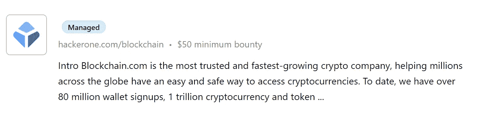
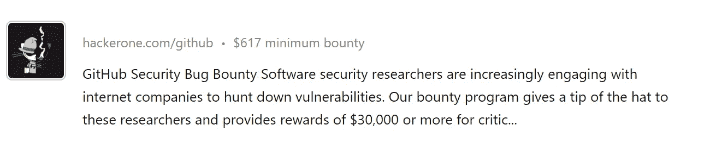
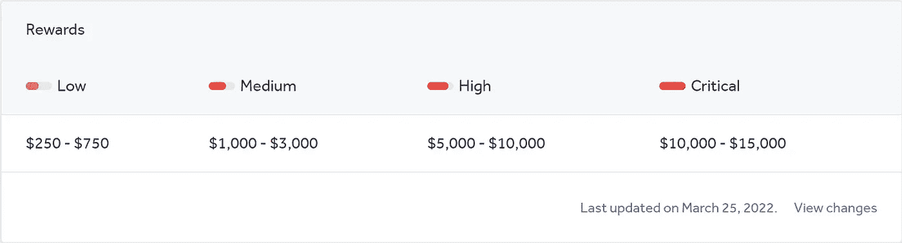

# 靠找 bug 发财

> 原文：<https://levelup.gitconnected.com/get-rich-by-finding-bugs-92561fc04f06>

## 这些网站会付钱给你

Andrea Piacquadio 的照片

你想让**兼职赚点钱吗？或者也许你想发现一种新的方式来赚取一些额外的收入。**

不管怎样，让我给你介绍一个令人兴奋的侧推。它只需要一台笔记本电脑，一个稳定的互联网连接，和你的时间。

其实现在想想。互联网连接甚至不需要稳定。笔记本电脑不一定是你的，但无论如何。

我说的是找虫子。我不是指那些在你房子周围游荡的讨厌的小生物。我说的是软件中的 bug。

有许多人辞掉了工作，只为了全职寻找 bug。

这意味着只有一件事。这是一个很好的赚钱机会。但这容易吗？让我们一起来了解一下。

# 什么是昆虫奖励

软件中的错误很常见。毕竟软件是人做的。所有人*(除了我)*都会犯错。

所以如果你用的是软件*(那不是我创造的)*。很有可能里面会有 bug。

但是为什么一个公司会付钱给你去找这些漏洞呢？

## 臭虫奖励解释

因为一件简单的事情，公司会很乐意为你找到一个 bug 付钱。

你刚刚帮他们省了一大笔钱！

想象一下，如果某个心怀不轨的人发现了和你一样的错误。但是他们没有通知公司，而是决定利用这一点来伤害公司。

这可能会让公司损失数千甚至数百万美元。

GIF by [Giphy](https://giphy.com/gifs/DefyTVNetwork-duck-dynasty-defytv-pRvVi7HEooPp0j16Uv)

这就是为什么公司会乐意付钱给有道德的人，让他们发现一个漏洞，并通知给公司。

## 成为臭虫赏金猎人

既然知道了为什么，那就来说说怎么做吧。

正如你可能猜到的，这不是一个快速致富的计划。这需要时间和努力。但是如果你愿意投入，它会产生好的结果。

但首先，你需要学会如何发现软件中的 bug。为此，你不必是一个程序员或知道如何编码。你所需要知道的就是软件一般是如何工作的。然后在这些信息的基础上进行构建。

把你送上一条通往兔子洞的路。我会从看下面的视频开始。

# 作为昆虫赏金猎人获得报酬

如果你觉得你知道足够多的信息。你觉得已经准备好找到你的第一个 bug 了。你可以开始参与昆虫奖金。

不幸的是，你不能随便上几个网站就能找到漏洞。你可以，但没人会为此给你赏金。

为了挣钱，你需要加入臭虫奖励计划。

## 臭虫赏金程序解释

你可以把 bug 赏金项目想象成一个连接公司和赏金猎人的市场。

市场列出了所有愿意付钱找人查找漏洞的公司。另一方面，有赏金猎人，或者有道德的黑客愿意接受他们的挑战。

黑客们相互竞争寻找漏洞。他们因发现漏洞而获得报酬。他们也因发现漏洞而获得积分。这些点数将提高他们的 bug 赏金排名。

**最受欢迎的公开 bug 赏金计划有:**

*   [钢骨](https://hackerone.com/bug-bounty-programs)
*   [硬石膏](https://portswigger.net/)

在这些平台上发现 bug 的奖励各不相同。50 美元起。

一直涨到 600 美元。

但是当然，奖励将取决于您发现的错误的严重程度。关键的 bug 会付出更多。但是，他们更难找到。

话虽如此，这是优步支付的赏金比率。

优步支付的昆虫赏金

优步总共支付了将近 300 万美元的臭虫奖金。平均一次赏金 600 美元。

在这些平台上起步是一个很好的起点，但这不是赚大钱的方法。

Gif by [Giphy](https://giphy.com/gifs/nbcgoodgirls-nbc-good-girls-JRUeMkrHnlIf2oE3Hs)

为了赚真钱，你需要找到外部的赏金程序。

## 寻找外部 Bug 赏金程序

没有特定的方法可以找到这些程序。通常，这些程序将由公司自己直接管理。

你最好的选择可能是寻找软件网站，看看他们是否有自己的 bug 赏金程序。

正如你所猜测的，这是一个耗时的过程，但它可以很好地回报。这些节目的竞争会更低，bug 的奖励会高很多。

所以如果你准备好接受虫子赏金挑战。做大，加入大联盟，这才是值得探索的路径。

# 总结想法

在线查找漏洞似乎是一个有利可图的机会。

没有准入门槛。没有前期投资。如果你把时间投入其中，它会给你带来巨大的额外收入。

然而，这不是那种能让你迅速致富的旁门左道。它需要你奉献你的时间。最有可能的是，很多努力。

可能会有一整天都没有发现任何 bug 的时候。但是有时候你会在一次会议中发现很多这样的问题。

有点未知的领域。但是如果你是那种喜欢打碎东西的人。对事物如何运作很好奇。这对你来说可能是个绝佳的机会。

***想要更多这样的故事？*** [***成为会员。***](https://bernardbad.medium.com/membership)

# 分级编码

感谢您成为我们社区的一员！更多内容见[升级编码出版物](https://levelup.gitconnected.com/)。
跟随:[推特](https://twitter.com/gitconnected)，[领英](https://www.linkedin.com/company/gitconnected)，[通迅](https://newsletter.levelup.dev/)
**升一级正在改造理工大招聘➡️** [**加入我们的人才集体**](https://jobs.levelup.dev/talent/welcome?referral=true)