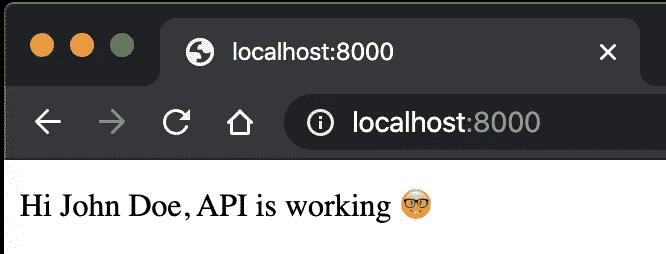

# 通过向您的 Typescript 项目添加绝对导入来消除相对导入路径地狱

> 原文：<https://levelup.gitconnected.com/get-rid-of-relative-import-path-hell-in-your-typescript-project-9952adec2e84>

## 键入指向 Typescript 模块的又长又容易出错的路径可能是一项令人沮丧的任务


> 如果你不知道如何建立一个 TypeScript 项目，可以看看这篇文章。

你见过这样的导入语句吗？

```
import { formatName }  from '../../helpers/format-name'
```

这些不一致的相对路径看起来很难看，让代码维护成为一场噩梦！

想象一下，有一天你必须更新目录结构，这意味着部分或全部的相对路径必须改变。虽然大多数 ide 可以尽力更新引用，但并不总是正确的…

不要担心，这个向导会帮助你的。

# 概观

我们希望缩短这种代码:

```
import { formatName }  from '../../helpers/format-name'
```

对此:

```
import { formatName }  from '~/helpers/format-name'
```

其中`~`表示`src`目录。

# 第一步

让我们创建一个虚拟的`User`模型类和一个`formatName`函数。项目的根:

```
touch src/app/models/User.ts src/helpers/format-name.ts
```

在`src/app/models/User.ts`中添加以下代码:

以及随后的`src/helpers/format-name.ts`:

在`src/handlers.ts`中，导入`User`型号:

```
import { User } from "./app/models/user";
```

并修改`rootHandler`功能如下:

```
export const rootHandler = (_req: Request, res: Response) => { const user = new User(); return res.send(`Hi ${user.fullName}, API is working 🤓`);};
```

现在运行`yarn dev`，您应该会看到这个错误:


TS 编译器不知道`~`代表什么，所以我们必须在下一步让它知道。

# 第二步

我们将在`tsconfig.json`中做一个小改动。在`paths`属性下，添加另一个路径定义指明`src`文件夹:

```
...
    "paths": { ... "~/*": ["src/*"] },...
```

执行`yarn dev`，成功了！继续进行，运行`yarn build && yarn start`进行生产。但是糟糕的是，又抛出了一个错误:


解释就是你只让 TS 编译器知道了`~`符号，但是`node` runner 还是不明白这是什么。我们会再一次让这家伙知道。

# 第三步

为了让它在生产中发挥作用，我们将需要`link-module-alias`包的帮助:

```
yarn add link-module-alias
```

将该属性添加到`package.json`:

```
...
  "_moduleAliases": { "~": "dist" }...
```

基本上，这里的想法是我们使用`link-module-alias`来初始化一个到`dist`目录的符号链接。

在`start`脚本中，执行`link-module-alias`命令:

```
"start": "link-module-alias && node dist/index.js",
```

现在再运行`yarn dev`，应该可以了。运行`yarn build && yarn start`，控制台应该也不会抛出任何错误。让我们看看它在浏览器中是否有效:



如果您使用 VS 代码(我也强烈推荐使用 TS)，别名将出现在自动完成下拉列表中:


# 结论

模块别名将节省你的时间和处理四处飞溅的`../` 的挫败感。使用这个包的另一个很大的好处是，它不像大多数解决方案那样需要运行时挂钩到应用程序的入口点。运行时挂钩可能会修改默认的导入行为，给应用程序增加不必要的计算和复杂性，应该谨慎使用。