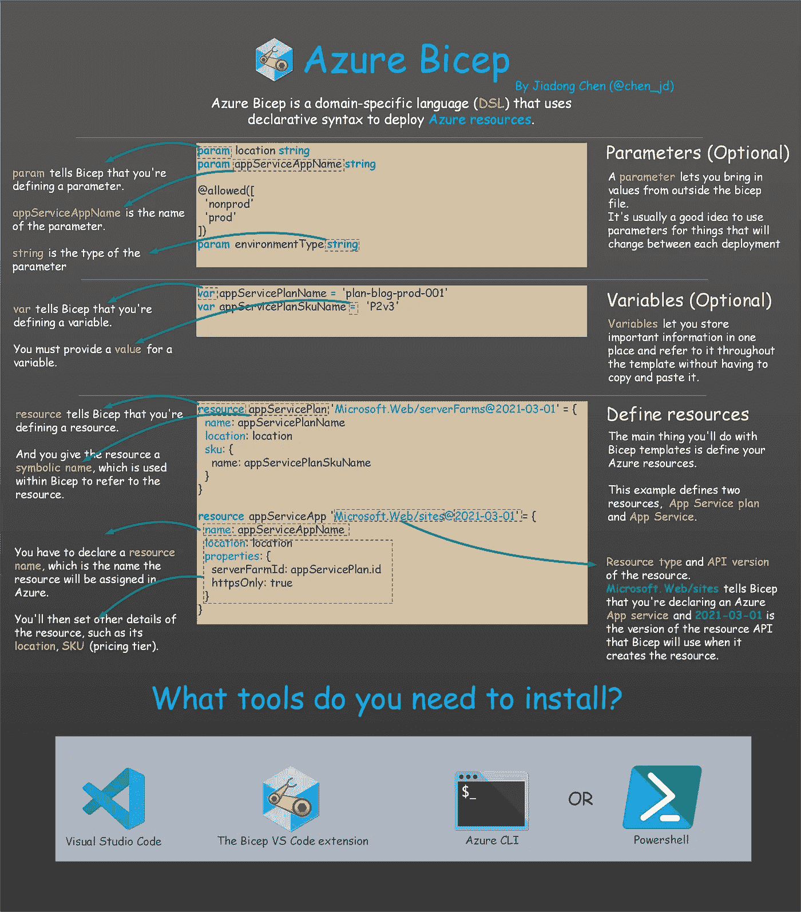
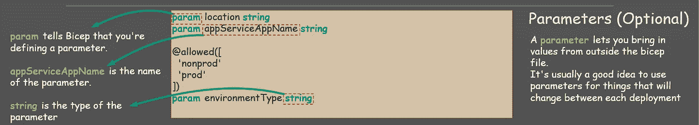
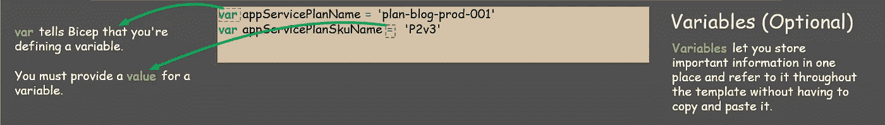
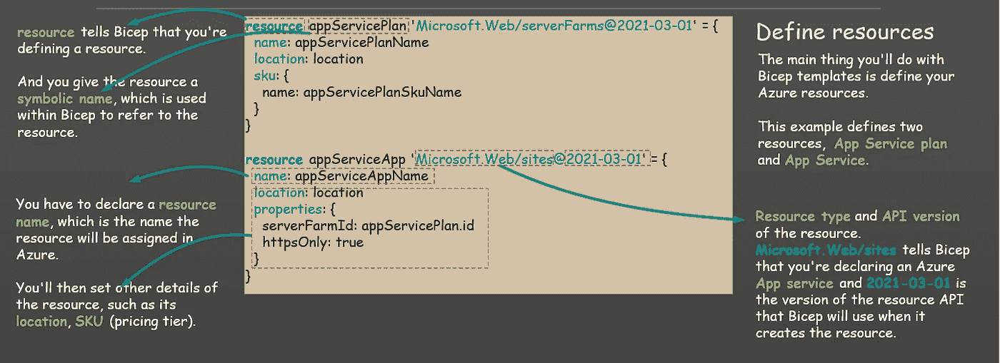
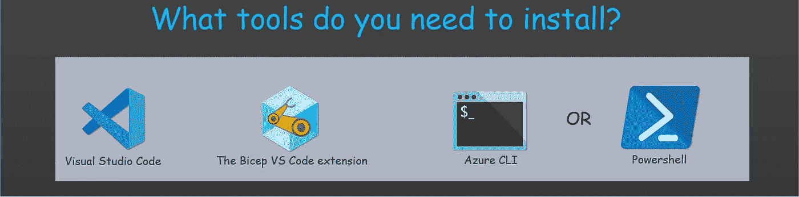

# Azure Bicep 入门——新的 Azure 部署技术

> 原文：<https://levelup.gitconnected.com/get-started-with-azure-bicep-the-new-azure-deployment-technology-2980330e3d19>

我已经创建了这个图表，它将带你了解什么是 Azure Bicep，剖析一个基本的模板文件，并介绍开发 Azure Bicep 模板应该安装的工具。

让我们继续前进！⬇️⬇️⬇️

# 💪Azure 二头肌是什么？

**Azure Bicep** 是一种特定于领域的语言( **DSL** )，它使用声明式语法来部署 Azure 资源，并为 Azure 中的基础设施即代码( **IaC** )解决方案提供一流的创作体验。

此外，虽然 Azure 的资源管理器仍然基于 Json 格式运行，并且你的 **Azure Bicep** 模板在提交时会被转换为 Json 格式，但很明显 **Azure Bicep** 模板比基于 JSON 的 Azure 资源管理器(ARM)模板更具可读性，也更容易维护。

# 💪 𝗧𝗵𝗲 𝘀𝘁𝗿𝘂𝗰𝘁𝘂𝗿𝗲 𝗼𝗳 𝗮 𝗯𝗮𝘀𝗶𝗰 𝗕𝗶𝗰𝗲𝗽 𝗳𝗶𝗹𝗲

## 因素

参数允许您从 bicep 文件外部引入值。对于每次部署之间会发生变化的事物，使用参数通常是一个好主意。

您可以声明一个新参数，如下所示:

`𝗽𝗮𝗿𝗮𝗺 <𝗽𝗮𝗿𝗮𝗺_𝗻𝗮𝗺𝗲> <𝗽𝗮𝗿𝗮𝗺_𝘁𝘆𝗽𝗲>`

*   `𝗽𝗮𝗿𝗮𝗺`告诉 Bicep 您正在定义一个参数。
*   `<𝗽𝗮𝗿𝗮𝗺_𝗻𝗮𝗺𝗲>`是参数的名称。
*   `<𝗽𝗮𝗿𝗮𝗺_𝘁𝘆𝗽𝗲>`是参数的类型。

## 变量

变量使您可以将重要信息存储在一个地方，并在整个模板中引用这些信息，而不必复制和粘贴这些信息。

您可以声明一个新变量，如下所示:

`**var** <**var_name**> **=** <**var_value**>`

*   `**var**`告诉 Bicep 你正在定义一个变量。
*   您不需要提供变量的类型，但必须提供变量的值。

# 资源

使用 Bicep 模板要做的主要事情是定义 Azure 资源。本例定义了两个资源， **App 服务计划**和 **App 服务**。

您可以按如下方式声明新资源:

`**resource <symbolic_name> ‘<resource_type>@<API_version>’**`

*   `**resource**`告诉 Bicep 您正在定义一个资源。
*   `**<symbolic_name>**`在 Bicep 中用来指资源。
*   `**<resource_type>**` 告诉 Bicep 您想要创建什么资源类型。
*   `**<API_version>**`是 Bicep 在创建资源时将使用的资源 API 的版本。

# 💪需要安装哪些工具？

## 开发工具

让我们从可以用来创建 Bicep 文件的开发工具开始:

*   **Visual Studio Code** ，通常也被称为 VS Code，是微软为 Windows、Linux 和 macOS 开发的源代码编辑器。
*   **Bicep VS 代码扩展**提供语言支持和资源自动完成，并帮助您创建和验证 Bicep 文件。

## 部署工具

除了开发工具，您还需要为您的部署环境安装 **Bicep CLI** 和以下两个工具之一:

*   **Azure CLI** ( **版本 2.20.0 或更高版本**)会在执行需要的命令时自动安装 **Bicep** CLI。
*   **Azure PowerShell(版本 5.6.0 或更高版本)**不会自动安装 Bicep CLI。

𝗥𝗲𝗳:

 [## 设置 Bicep 开发和部署环境——Azure 资源管理器

### 让我们确保您的环境是为开发和部署 Bicep 文件而设置的。要创建二头肌文件，您需要一个…

docs.microsoft.com](https://docs.microsoft.com/azure/azure-resource-manager/bicep/install?WT.mc_id=DT-MVP-5001664#vs-code-and-bicep-extension)  [## 二头肌基础——学习

### Bicep 使您能够部署 Azure 资源。Bicep 使用一种声明性语法，您可以像对待应用程序代码一样对待它…

docs.microsoft.com](https://docs.microsoft.com/en-us/learn/paths/fundamentals-bicep/?WT.mc_id=DT-MVP-5001664) 

# 我的新书！

嘿，朋友们，我非常兴奋地宣布，我的新书已经可以在亚马逊上预购了！

 [## 游戏开发与统一。NET 开发者:用 Unity 创建游戏的终极指南…

### 游戏开发与统一。NET 开发者:用 Unity 和微软游戏制作游戏的终极指南…

www.amazon.com](https://www.amazon.com/Game-Development-Unity-NET-Developers-dp-1801078076/dp/1801078076/) 

在本书中，我们将探索如何使用 **Unity 游戏引擎**和**微软游戏开发**，包括**微软 Azure 云**和**微软 Azure PlayFab** 服务来创建游戏。

跟上我:

 [## 陈家东——高级软件开发人员——X 公司| LinkedIn

### 陈家东是国际上公认的 3000 名微软最有价值职业(MVP)获奖者之一

www.linkedin.com](https://www.linkedin.com/in/chenjd/)