# 开始使用 Flask！

> 原文：<https://levelup.gitconnected.com/get-started-with-flask-aa0f7b76f235>

> (反正是不含酒精的那种)

由约翰·韦恩在原版电影《大地惊雷》中提供

作为一名刚刚从训练营毕业的普通代码爱好者，我掌握了许多技能，包括一些先进的前端技术知识，如 [React](https://reactjs.org/) 和 [Redux](https://redux.js.org/) 。我学到的栈是使用那些 JavaScript 框架作为我的前端，使用 [Ruby on Rails](https://rubyonrails.org/) 作为我的后端(这个术语我一直觉得很有趣)，或者换句话说，在访问一个网站的间隙用作存储信息的数据库。

现在我对 Ruby on Rails 有了很多看法，这是一个强大但现在有点过时的框架。实际上，我认为 Ruby 是一门美丽的语言，Rails 是一个神奇的框架。这很容易理解，它给了你很大的力量，让你在不知道很多代码的情况下轻松地创建一些东西，Ruby 有用的错误消息帮助学生理解并从错误中学习，这是至关重要的。它甚至处理和编写 [SQL 查询](https://www.w3schools.com/sql/)，传说中这是绝对可怕和烦人的。

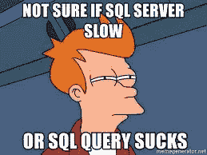

你两端都是对的，弗莱！

但这并不是一个关于讨厌 SQL 的博客，还有很多东西，比如 [ActiveRecord](https://guides.rubyonrails.org/active_record_basics.html) 或 [Sequelize](https://sequelize.org/) 或 [MySQL](https://www.mysql.com/) ，它们的唯一目的就是让 SQL 不那么讨厌。

关键是我想学些新东西。

我想学一些更模块化的东西，一种更时尚、更强大的语言，一种需求量很大的语言，一种基于一个著名的英国小品秀的语言。我想学 [PYTHON](https://www.python.org/) 。

我们是说…巨蟒的骑士！

Python 是一种非常酷的面向对象的语言，用于 web 抓取、web 开发、机器学习、数据科学、数学等等。这是市场上最受欢迎的技能之一。而且学起来很好玩！

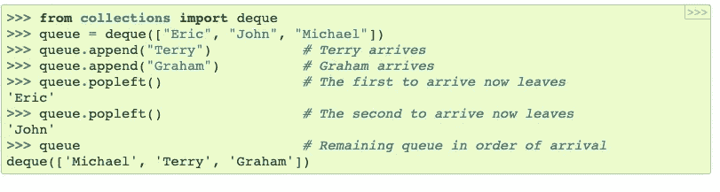

垃圾邮件垃圾邮件垃圾邮件。

教程甚至是用 Monty Python 编写的！是的，我直到 23 岁才有了第一个女朋友！但你不是为了指控个人信息而来的。你来这里甚至不是为了 Monty Python 参考资料或者[到他们最好的作品之一](https://www.youtube.com/watch?v=jYFefppqEtE)的直接链接。你是来找弗拉斯克的信息的。

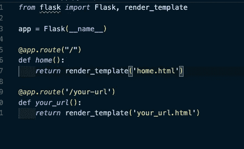

忽略弯曲的线条！

托盘项目制作的烧瓶是一个非常酷的东西。这是一个非常轻量级的 Python 框架，就像是有史以来最小的“Ruby on Rails”。

要开始使用 Flask:

1.  确保您已经安装了 python3(键入 Python 3 进行验证)和 Pip/Pip3(键入 Pip 进行验证)以及 pipenv(键入 Pipenv 进行验证)，如果您需要 Python/Pip [入门帮助，请查看此处！](https://docs.python.org/3/installing/index.html)

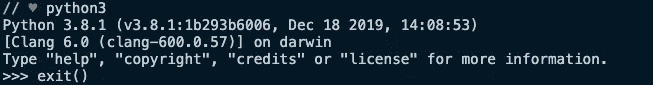

2.创建一个新文件夹，名为“Test-Flask”

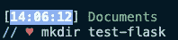

3.光盘到文件夹中，并运行“pip3 安装烧瓶”

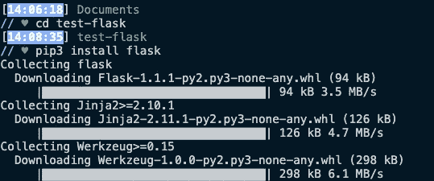

4.创建一个名为 app.py 的文件，打开它并使用 python 导入语法在文件顶部写入“从 flask 导入 Flask”。

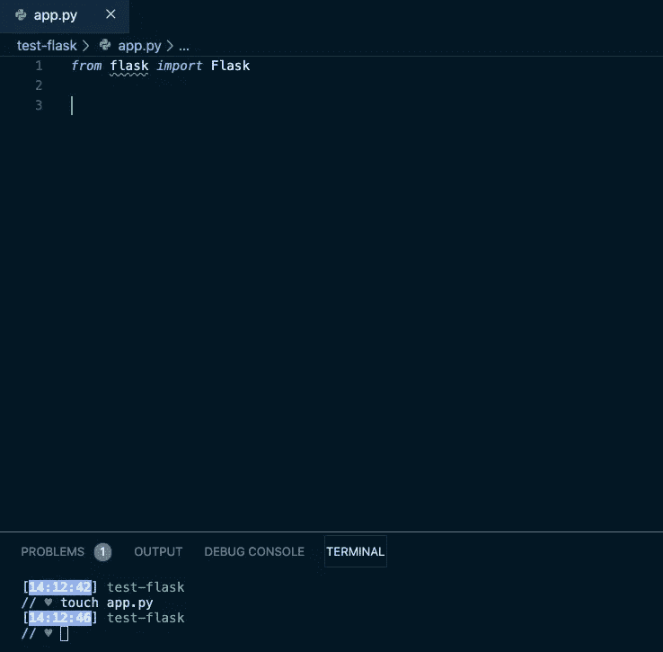

5.通过编写`app = Flask(__name__)`创建一个新的 Flask 应用程序。这告诉您的文件创建一个以您的文件名命名的 Flask 的新实例。

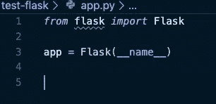

6.定义一条路线和你想让它做的事情！我们通过使用语法`@app.route`来做到这一点，所以让我们为主页设置一个默认位于`/`的路径。它还接受一个函数，这个函数告诉这个路由返回什么。既然这是 PYTHON，我就要返回一些好玩的东西。

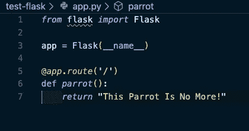

7.首先输入“pipenv shell”启动你的 flask 应用程序(希望你安装了 pipenv！)，等待，然后输入“export FLASK_APP”和“flask run”

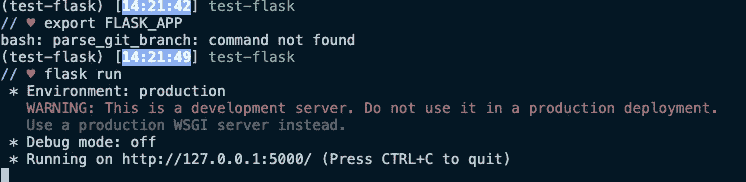

7a。好吧，暂停一下应用(我要下车！)使用“CTL + C”。我还建议输入“export FLASK_ENV=development”。这将为你提供一个免费的调试器，并在你每次保存新信息时更新你的应用程序，有点像 Rails！然后再次输入“烧瓶运行”来启动！

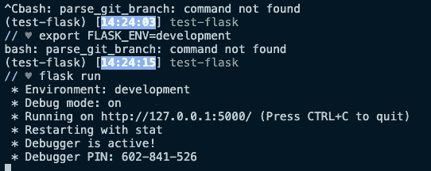

8.最后，让我们通过访问提供的链接来测试我们的应用程序！

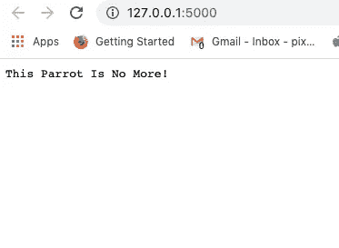

合适！

我们可以看到我们正在收回我们放进去的东西！

很明显，Flask 还有很多值得探索的地方。Flask 使用 [Jinja](https://jinja.palletsprojects.com/en/2.11.x/) 将信息从 Python 函数传递到“HTML 模板”中。你也可以使用 [Flask 来创建一个 API](https://www.freecodecamp.org/news/build-a-simple-json-api-in-python/) ，这是它的主要用途之一！您可以连接它进行 SQL 查询。这就像一个“铁路”(或其最接近的竞争对手，[姜戈](https://www.djangoproject.com/))，你只建造你想要的东西！

我知道这是一个非常入门的外观，但我希望我已经帮助阐明了少量关于烧瓶，如果没有，那么，这里有一个可爱的狗一如既往。

BOOOOOOOONES

这是骨头，奇妙的金嘟嘟。他喜欢亲吻桌子，但他更喜欢亲吻你。你只是不在身边！他是绒毛，舌头和拥抱。

再见，记住，不要从马上掉下来；)

-尼克