# 拥抱脸汽车列车入门

> 原文：<https://levelup.gitconnected.com/get-started-with-hugging-face-auto-train-5a2ac5fa2fa4>

## 拥抱脸汽车列车实践教程

[](https://jorgepit-14189.medium.com/membership) [## 用我的推荐链接加入媒体-乔治皮皮斯

### 阅读乔治·皮皮斯(以及媒体上成千上万的其他作家)的每一个故事。您的会员费直接支持…

jorgepit-14189.medium.com](https://jorgepit-14189.medium.com/membership) 

拥抱脸已经推出了 [**自动训练**](https://huggingface.co/autotrain) ，这是一种自动训练、评估和部署最先进的机器学习模型的新方法。它使我们能够通过简单地上传数据来训练定制的机器学习模型。在引擎盖下，它自动运行不同的模型。最后，我们直接从[拥抱面部中枢](https://huggingface.co/models)使用我们的模型。目前，它支持以下任务:

*   图像分类
*   文本分类
*   令牌分类
*   问题回答
*   翻译
*   摘要
*   文本回归
*   表格数据分类
*   表格数据回归

在本教程中，我们将研究一个文本分类的例子。

# 基于拥抱人脸自动训练的文本分类

让我们开始使用拥抱脸自动训练建立我们的文本分类模型。你必须在[拥抱脸](https://huggingface.co/autotrain)上签到。然后，你点击“**创建新项目**按钮。

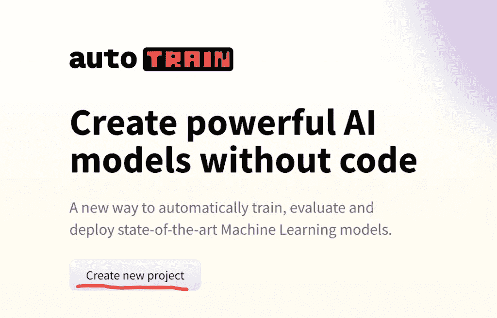

然后，您给出项目名称，并选择一个任务。在我们的例子中，我们将使用一个“**文本**”任务，更具体地说是一个“**文本分类(二进制)**”，最后我们单击“**创建项目**

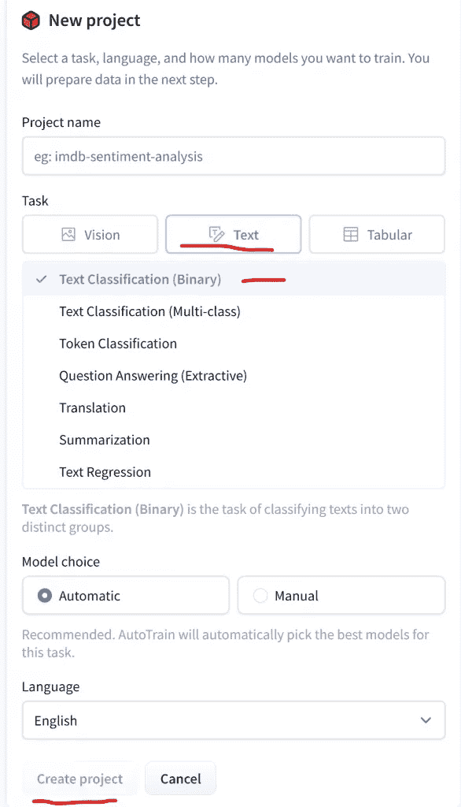

然后，我们可以上传两栏的`.csv`文件，比如`text`和`target`。

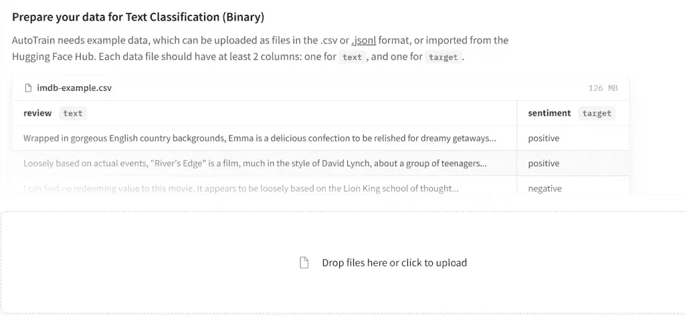

对于这个例子，我从酒店评论中选择了一个数据集。该文件由两列组成，文本和目标采用两个值， **0(负)或 1(正)**。

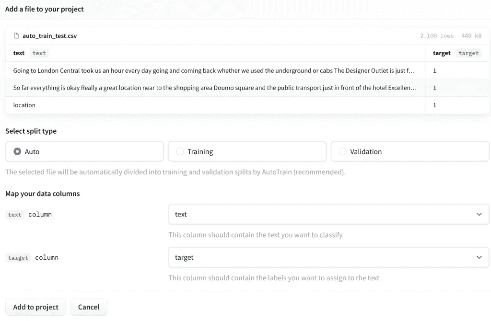

注意，对于**免费**版本，数据集**必须少于 3000 行！**上传数据后，我们点击“**添加到项目**”。然后我们准备好训练模型，通过点击“**进入训练**”。

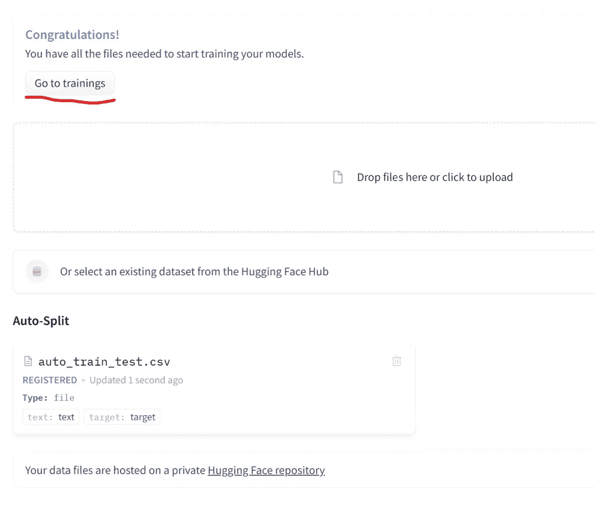

免费版允许我们训练多达 5 个模型。

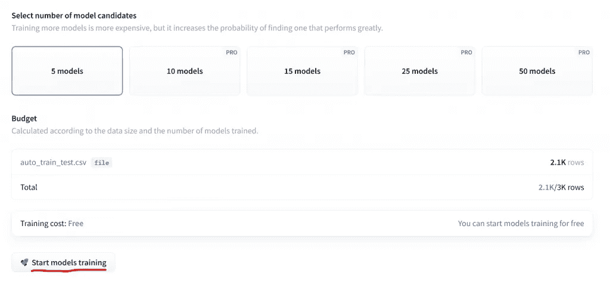

这 5 个模型并行运行，您可以看到它们的准确性。

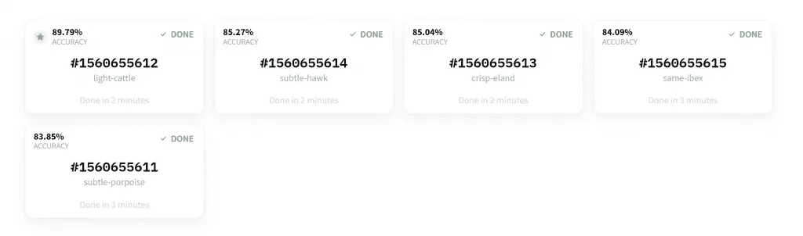

如果我们单击该模型，我们可以看到其他指标，如精确度、召回率、Auc、F1 和损失。

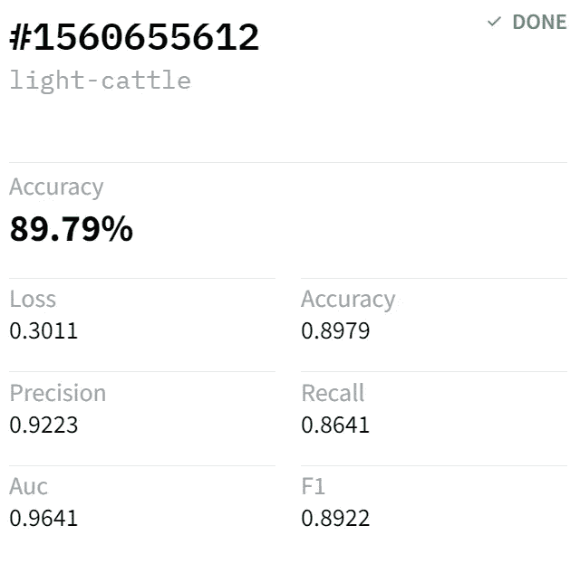

或者，如果我们转到指标部分，我们可以看到所有模型的摘要视图。

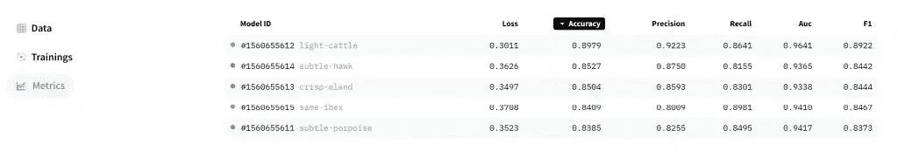

# 从用户界面进行预测

当我们在指标部分时，我们可以单击任何型号 ID。让我们试试评论“**这家酒店太棒了**”。

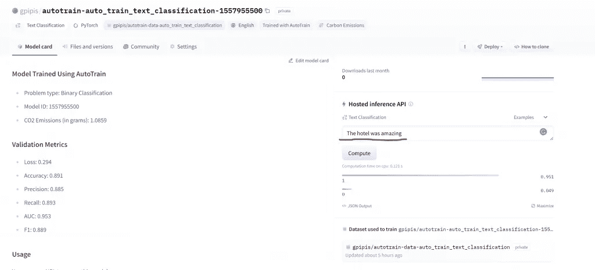

我们得到一个标签=1，这意味着有 95%的概率是肯定的。

# 使用 Python 进行预测

在左下方，你可以看到一个名为“**用法**的部分，它展示了如何进行 curl 和 Python 调用。我们只需要复制粘贴 Python API 代码片段的代码。

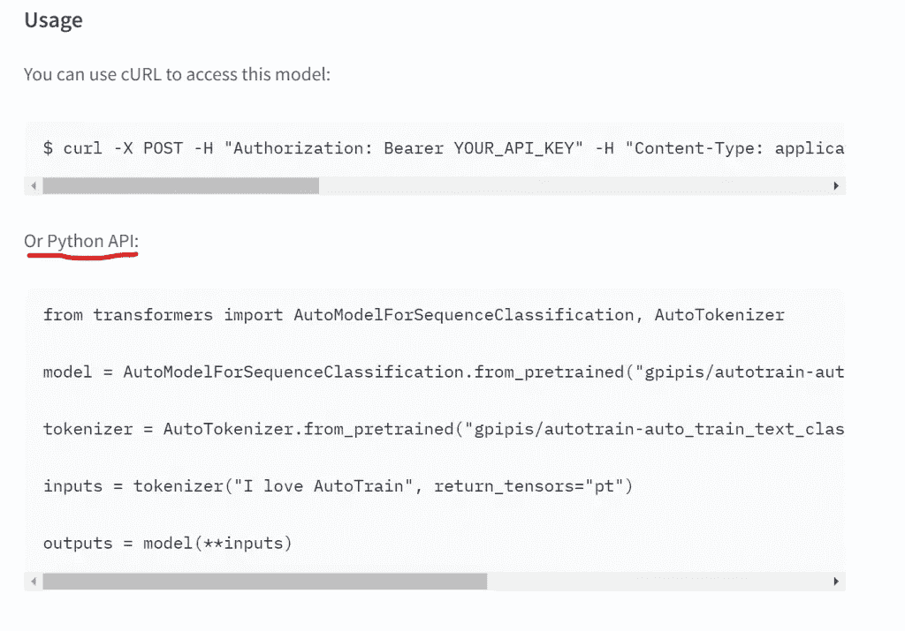

为了从 Python API 调用模型，我们需要创建一个`use_auth_token`。我们应该转到[设置/令牌](https://huggingface.co/settings/tokens)并为 auto_train 创建一个新令牌。

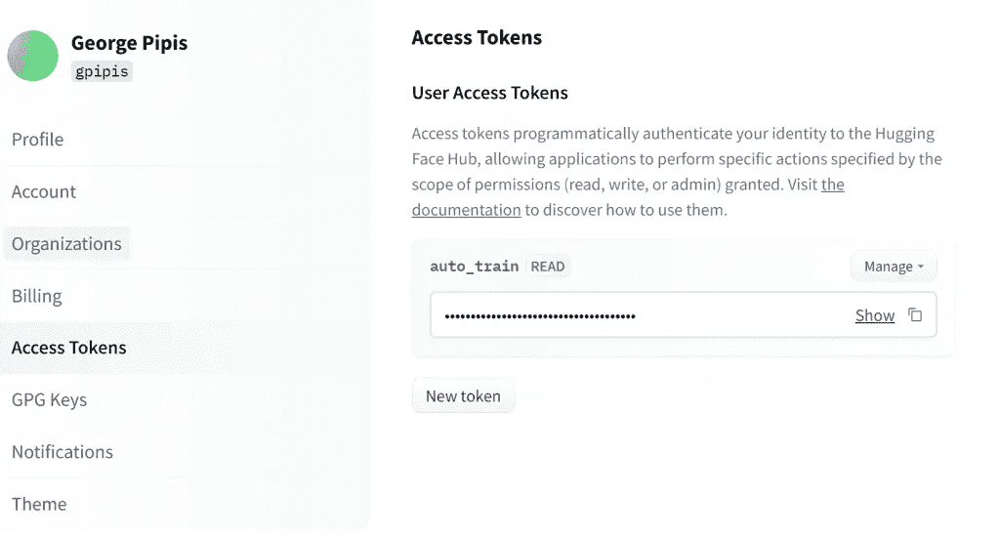

一旦我们创建了访问令牌，我们就可以复制并使用它，如下所示。现在，让我们转移到 Colab。我们必须安装 transformers 库，然后简单地粘贴我们上面复制的代码片段。对于`use_aut_token`，我们将传递我们之前生成的访问令牌。

```
!pip install transformersfrom transformers import AutoModelForSequenceClassification, AutoTokenizermodel = AutoModelForSequenceClassification.from_pretrained("gpipis/autotrain-auto_train_text_classification-1557955500", use_auth_token='xxx')tokenizer = AutoTokenizer.from_pretrained("gpipis/autotrain-auto_train_text_classification-1557955500", use_auth_token='xxx')inputs = tokenizer("I love AutoTrain", return_tensors="pt")outputs = model(**inputs)outputs
```

输出

```
SequenceClassifierOutput(loss=None, logits=tensor([[-1.3991,  1.5701]], grad_fn=<AddmmBackward0>), hidden_states=None, attentions=None)
```

输出返回逻辑。如果我们想得到每一类的概率，我们需要使用 softmax 函数，如下所示:

```
from torch import nnpt_predictions  = nn.functional.softmax(outputs.logits, dim=-1)
pt_predictions
```

输出

```
tensor([[0.0488, 0.9512]], grad_fn=<SoftmaxBackward0>)
```

## 使用管道进行预测

我们可以使用如下管道进行预测。

```
from transformers import pipeline
my_pipeline = pipeline(task="text-classification", model=model, tokenizer=tokenizer)my_score = my_pipeline('The hotel was amazing')
my_score
```

输出

```
[{'label': '1', 'score': 0.9511635303497314}]
```

正如我们所看到的，我们在 UI 上得到了相同的结果，这意味着标签等于 1 的概率为 95%。

# 更多关于变形金刚和抱脸？

*   [掌握句子相似度的句子变形器](https://predictivehacks.com/mastering-sentence-transformers-for-sentence-similarity/)
*   [如何使用 Transformers 和 HuggingFace 微调 NLP 回归模型](https://predictivehacks.com/how-to-fine-tune-an-nlp-regression-model-with-transformers-and-huggingface/)
*   [如何在 AWS SageMaker 上用变压器建立 NLP 分类模型](https://predictivehacks.com/how-to-build-an-nlp-classification-model-with-transformers-on-aws-sagemaker/)
*   [如何使用变压器和 HuggingFace 微调 NLP 分类模型](https://predictivehacks.com/how-to-fine-tuned-an-nlp-classification-model-with-transformers-and-huggingface/)
*   [如何使用变形金刚意译文档](https://predictivehacks.com/how-to-paraphrase-documents-using-transformers/)
*   [用变形金刚回答问题](https://predictivehacks.com/answering-questions-with-transformers/)
*   [变形金刚文本摘要](https://predictivehacks.com/text-summarization-with-transformers/)
*   [如何更改 HuggingFace 数据集中的列名](https://predictivehacks.com/?all-tips=how-to-change-column-names-in-huggingface-datasets)
*   [如何加载 CSV 文件作为 Huggingface 数据集](https://predictivehacks.com/?all-tips=how-to-load-csv-files-as-huggingface-dataset)

最初由[预测黑客](https://predictivehacks.com/get-started-with-hugging-face-auto-train/)发布