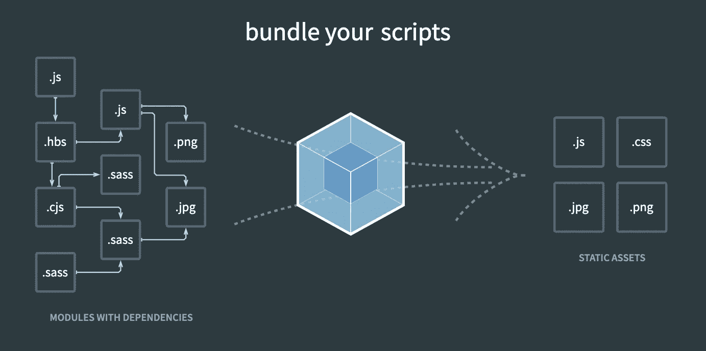

# JavaScript 模块入门

> 原文：<https://levelup.gitconnected.com/get-started-with-javascript-modules-4024757c7400>

**目录**

[背景](#d22f)
我们为什么需要模块？
[我们如何在 JS 中使用模块？](#6bcf)∘[1。模块模式](#5d68)
∘ [2。模块规格&API](#2aa4)∘
3。ES6 模块
[有哪些模块概念相关的工具？](#9cf6)∘
1。包经理
∘ [2。编译者](#eaa2)∘
3。任务执行人 t31】∘[4。模块装载器](#eb4a)t34】∘[5。模块捆绑器](#87aa)
[引用](#3858)

# 背景

当开始使用 Webpack 时，我对它正在解决的底层问题以及 Webpack 诞生前的情况感到困惑。这让我开始研究底层的基本概念——JavaScript 模块。

模块是一段独立的、分开的代码，服务于一个独特的功能，并且在理想情况下是高度自包含的。

它应该是可导出的，其他代码可以导入一个模块供自己使用。

**例题**

我们创建一个 *calculator.js* 模块，并导出它的几个函数，这样这些函数就可以在代码的其他地方使用。

模块演示

然后，我们可以在另一个文件中导入 *calculator.js* ，并使用它公开的函数。

导入模块的演示

# 为什么我们需要模块？

## 可维护性

将代码分割成独立的模块更易于维护，因为我们很容易直观地找到不同的功能。

## 避免命名空间污染

在某些模块实现方法中可以避免命名空间污染。模块内部的代码不会影响外部范围，反之亦然(除非明确启用)

## 复用性

因为它可以从代码中的其他地方导入，所以它提供了很高的可重用性，不仅是对同一个项目，甚至是跨多个项目。

# 我们如何在 JS 中使用模块？

在 JS 中实现模块概念有 3 种主要方式。

## 1.模块模式

我们可以使用普通的 JS 实现模块。有[种不同的模式](https://www.freecodecamp.org/news/javascript-modules-a-beginner-s-guide-783f7d7a5fcc/#.jw1txw6uh)来这样做，但是主要思想是声明一个全局变量定义。

**例题**

模块模式演示

模块模式有一定的局限性:

*   命名污染可能发生
*   依赖性很难管理

这些带来了以下模块规范和 API 的诞生。

## 2.模块规格和 API

关于如何在 JavaScript 中实现模块，有几种设计，每种设计都有一些基于它们构建的实现。

**2.1 常见问题**

Common JS 作为一个整体是 JS APIs 的设计和实现。模块规格只是其中的一部分。

**例句**

CommonJS 模块的演示

导入 CommonJS 模块的演示

**特性**

*   仅支持对象作为模块
*   服务器优先的方法，与文件系统、IO 等服务器端功能兼容
*   同步加载模块= >性能差

**2.2 异步模块定义(AMD)**

**例题**

AMD 模块的演示

导入 AMD 模块的演示

**特性**

*   支持多种数据类型作为模块(例如:对象、函数、构造函数、字符串、JSON)
*   浏览器优先的方法，与服务器端功能不兼容
*   异步加载模块

**2.3 通用模块定义(UMD)**

**特性**

*   支持 CommonJS、AMD 特性和全局变量定义
*   支持服务器端和客户端(浏览器)

## 3.ES6 模块

ES6 为模块概念带来了支持。使用“导出”和“导入”关键字。

**例题**

ES6 模块的演示

导入 ES6 模块的演示

**特点**

*   异步加载模块
*   通过使用树摇动方法在编译时静态分析你的代码来节省空间(只包括需要的代码，但不删除不用的代码)
*   不是浏览器中的本地实现->需要额外的工作来使它们兼容在浏览器中运行(例如:使用 transpiler 将 ES6 代码转换为 ES5 代码)
*   模块文件处于严格模式= >默认情况下，其中的所有变量和函数都不会添加到全局范围内

# 有哪些模块概念相关的工具？

当我们在代码中引入模块概念时，会出现不同类型的衍生问题。这里有几类工具。

## 1.包管理器

有了共享模块，开发人员不必重新发明轮子。为了便于分享，下面是一些管理模块包的工具。

例子: [Npm](https://www.npmjs.com/) ，[纱线](https://yarnpkg.com/)， [Bower](https://bower.io/)

## 2.编译程序

编译器将浏览器不支持的代码转换为浏览器支持的代码。就像上面 *ES6 模块*部分提到的将 ES6 转换成 ES5。

例子:[巴别塔](https://babeljs.io/)

## 3.任务运行程序

Task Runner 工具通常被拿来与 Webpack 这样的模块捆绑工具进行比较，因为它们都支持一些共同的特性。但它们是不同的。

Task Runner 是一个支持多个 web **构建阶段**任务的**自动化**的工具，例如代码精简、CSS 预处理、自动前缀、单元测试、林挺。

例子:[咕哝](https://gruntjs.com/)，[大口](https://gulpjs.com/)

## 4.模块装入程序

模块加载器的主要任务是帮助管理依赖关系和支持浏览器。

**依赖管理** 当你的代码包含很多模块时，很难管理所有模块的导入&以确保它们处于正确的顺序。模块加载器会为您完成这项工作。

**对浏览器的支持** 浏览器无法解释非原生模块系统(即 CommonJS、AMD)，以及 ES6 模块(需要额外处理)。模块加载器帮助我们将代码从这些可解释的格式转换成浏览器支持的格式。

示例: [RequireJS](https://requirejs.org/) (用于加载 AMD 模块)， [SystemJS](https://github.com/systemjs/systemjs) (用于所有不同的规格)

## **5。模块捆扎机**

模块捆绑器的主要任务是将代码的不同模块打包成浏览器支持的捆绑文件。

以下图为例，理想情况下，多个。sass 文件(浏览器不支持)被捆绑成一个单一的。css 文件(浏览器支持)。

截图来自 Webpack 官方网站——web pack 的功能

它们可能还附带许多有用的特性。例如，Webpack 支持代码分割，因此您的捆绑代码库被分成几个块，只在需要时加载，以提高性能。

示例: [Webpack](https://webpack.js.org/) ， [Browserify](https://browserify.org/)

# 参考

 [## JavaScript 模块:初学者指南

### 《JavaScript 模块:初学者指南》来源:https://www.flickr.com/photos/qubodup/16258492451If…

www.freecodecamp.org](https://www.freecodecamp.org/news/javascript-modules-a-beginner-s-guide-783f7d7a5fcc/#.jw1txw6uh)  [## JavaScript 模块第 2 部分:模块捆绑

### 在这篇文章的第一部分，我谈到了什么是模块，为什么开发人员使用它们，以及各种方法来合并…

medium.com](https://medium.com/free-code-camp/javascript-modules-part-2-module-bundling-5020383cf306)  [## NPM vs .鲍尔 vs .布罗斯里夫 vs .咕噜 vs .咕噜 vs .网络包

### 如果您仍然不确定前端开发，您可以快速浏览这里的优秀资源…

stackoverflow.com](https://stackoverflow.com/questions/35062852/npm-vs-bower-vs-browserify-vs-gulp-vs-grunt-vs-webpack)  [## 任务跑者(Gulp，Grunt 等)和捆绑者(Webpack，Browserify)。为什么要一起用？

### Grunt 和 Gulp 实际上是任务运行器，它们有不同之处，比如配置驱动的任务和基于流的任务…

stackoverflow.com](https://stackoverflow.com/questions/33561272/task-runners-gulp-grunt-etc-and-bundlers-webpack-browserify-why-use-toge)  [## 全面了解 ES6 模块

### 摘要:在本教程中，您将学习 ES6 模块以及如何从一个

www.javascripttutorial.net](https://www.javascripttutorial.net/es6/es6-modules/)