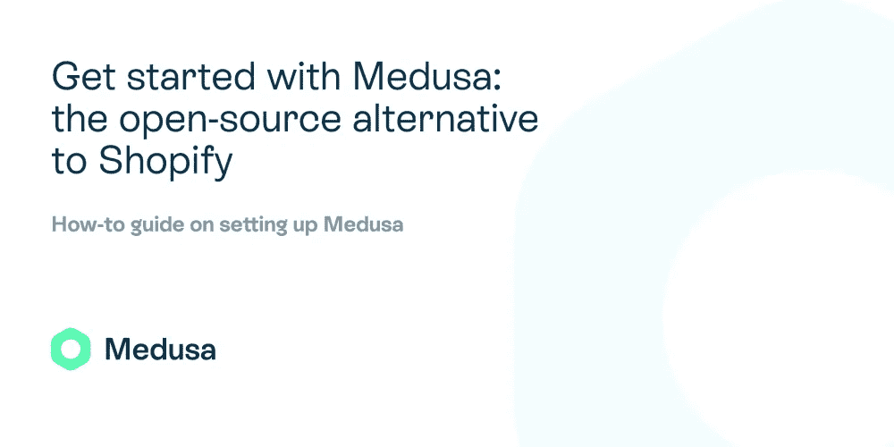
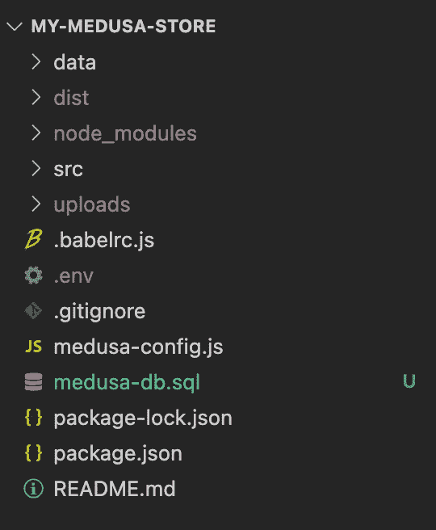
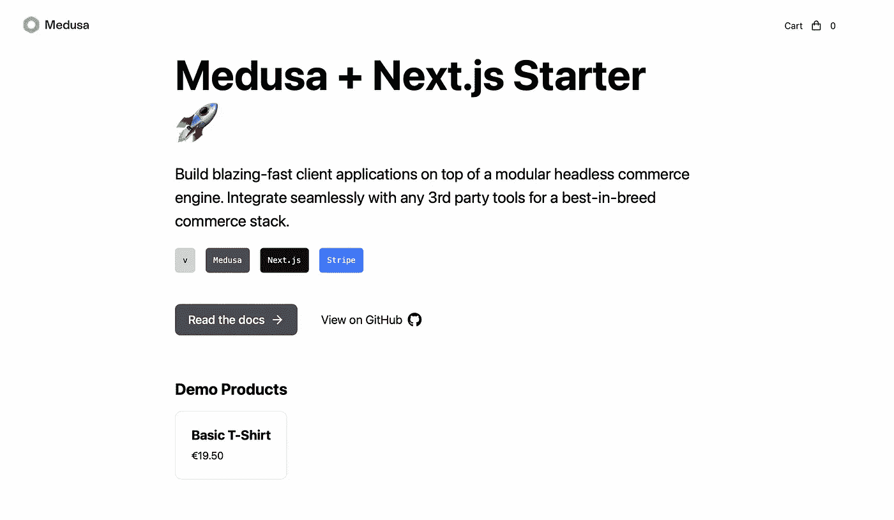
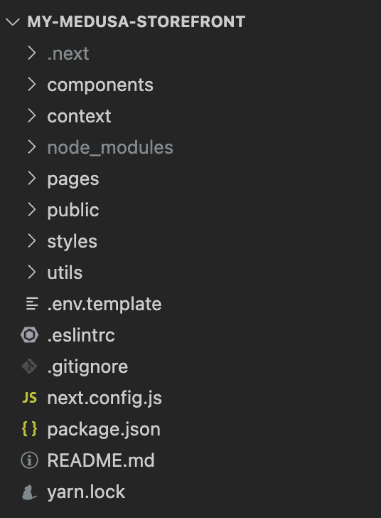
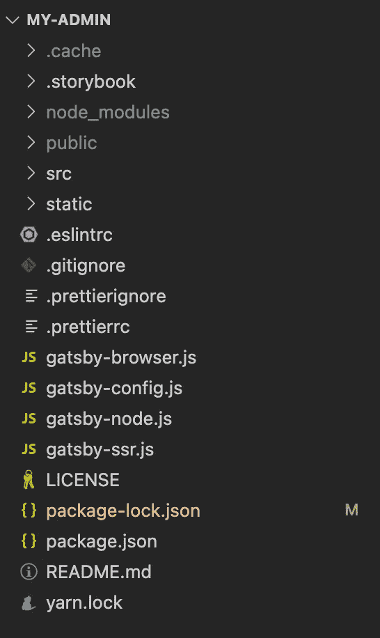

# 开始使用 Medusa:Shopify 的开源替代方案

> 原文：<https://levelup.gitconnected.com/get-started-with-medusa-the-open-source-alternative-to-shopify-2ba61af0e03c>



开发者首先想到的是许多流行的电子商务平台，其中之一就是 Shopify。Shopify 已成为为任何企业创建电子商务商店的首选平台之一。然而，它有许多缺点，包括它不是免费的和它有最小的可定制性。这就是美杜莎出现的地方。

[Medusa](https://www.medusa-commerce.com) 是一个开源的无头商业引擎，速度快，可定制。由于 Medusa 分为 3 个核心组件——为您的商店公开 REST APIs 的 headless commerce 部分、商店的前端和管理面板——您可以自由地使用平台作为一个整体，或者使用您的电子商务商店所需的部分。

在这个系列教程中，你将学习如何用 Medusa 创建一个电子商务商店。这包括设置您的开发环境，添加功能和插件到您的后端，前端和管理面板，以及一切您可能需要设置您的电子商务商店与美杜莎。

在教程系列的这一部分中，您将学习如何分别安装和运行平台的每个部分，并且您将学习每个部分的结构，以了解您需要在哪里做什么。然后，您将学习如何用一个命令设置所有不同的部分。

# 为什么是美杜莎

## 定制能力

如果你正在创建一个不需要定制的基本商店，或者你不是一个精通技术的人，Shopify 是一个很好的选择。但是，如果您希望拥有自己的技术堆栈并根据业务需求进行更改，则不应该使用 Shopify。当您选择 Shopify 时，您会被该平台提供的开箱即用的功能和架构所束缚。

另一方面，Medusa 的主要特点是它的灵活性和可扩展性。您可以一起使用所有 3 个核心组件，或者将其中一些组件与其他技术或系统耦合或集成。

你仍然可以把它作为一个整体来使用，你会得到很好的开发和用户体验。当您第一次安装服务器并选择使用 [PostgreSQL](https://www.postgresql.org/) 和 [Redis](https://redis.io) 时，后端构建在 Node.js、Express 和默认的 SQLite 上。

对于前端，您可以选择使用由 [Next.js](https://nextjs.org/) 或 [Gatsby](https://www.gatsbyjs.com) 构建的初始店面。与这两种选择一样，你最终会得到一个连接到无头服务器的静态网站，你的网站速度几乎可以保证很快。

至于后端，也是用 Gatsby 搭建的，和前端一样连接到你的服务器。

这使得 Medusa 有别于其他紧密耦合、复杂而缓慢的电子商务平台。Medusa 提供了许多现成的功能，并允许您根据自己的需求进行定制。与 Shopify 相比，它对您的技术堆栈提供较少的所有权，它允许您完全拥有您的技术堆栈。

*建议阅读:* [*美杜莎:打造快速且高度可定制的电子商务商店*](https://blog.shahednasser.com/medusa-create-fast-and-highly-customizable-ecommerce-store/)

## 定价

Shopify 的定价模式可能是一个很大的劣势，因为有很多其他选择，包括美杜莎，免费提供他们的电子商务平台。

不仅要付费使用和部署平台，而且很难找到免费的插件或主题。此外，由于平台的不灵活性，安装插件并不容易。

这就是开源的闪光点。你可以免费使用和部署美杜莎。您还有一个开源社区支持您，提供免费插件供您使用。由于美杜莎的灵活性，安装插件非常容易。

## 业务用例

如前所述，Shopify 不灵活，难以定制。这意味着大量的业务用例，包括 B2B、市场、定制购物体验等等，在 Shopify 中是不可用或不可能的。

如果你确定你的业务只是销售传统电子商务体验的产品，那对你来说可能不是问题。然而，如果你已经在规划你的业务增长，并且需要一个可以根据你的业务用例增长和扩展的电子商务平台，那么选择 Shopify 将是一个麻烦。

Medusa 的无头 API 和灵活性允许您轻松创建插件，根据您的使用案例定制购物体验，或者根据需要将 Medusa 与其他服务集成。

# 先决条件

在我们开始之前，如果您还没有安装 [Node.js](https://nodejs.org/en/) ，请确保您已经安装了。你还需要 [NPM](https://www.npmjs.com) ，但是它会在你安装的时候和 Node.js 一起安装。

要检查是否安装了 Node.js 和 NPM，可以运行以下命令:

```
node -v
npm -v
```

如果每个命令的输出都显示一个数字版本，那么您已经安装了它们。否则，您需要安装它们。

# 设置美杜莎

在其核心，Medusa 是后端，公开了 REST APIs，这将允许您的前端或管理面板检索或修改数据。您可以用连接到 API 的自己的平台来替换店面或管理面板，但您至少需要在您的系统中安装 Medusa 的这一部分。

## 安装美杜莎

安装美杜莎很容易。首先，您需要安装允许您设置服务器的 CLI 工具:

```
npm install -g @medusajs/medusa-cli
```

完成此部分后，您可以使用 CLI 在您的计算机上设置新的 Medusa 存储:

```
medusa new my-store --seed
```

这将在 my-store 目录中创建新的 Medusa 安装。您可以通过更改 my-store 来更改存储或目录的名称。通过应用— seed 选项，它将用包括演示产品在内的基本数据植入数据库。

## 运行美杜莎

一旦这个命令完成，您就可以运行您的服务器了！首先，转到 medusa 存储的目录:

```
cd my-store
```

然后，使用 CLI 工具运行`develop`命令来运行服务器:

```
medusa develop
```

默认情况下，这将在`localhost:9000`运行服务器。你可以在浏览器中点击`localhost:9000/store/products`进行测试，你应该会看到一系列 JSON 产品。它将只包括一个产品，因为播种者只添加一个产品。

您可以在文档中查看 [API 端点的完整列表。对于店面，所有端点都带有前缀`/store`，而对于管理面板，所有端点都带有前缀`/admin`。](https://docs.medusa-commerce.com/api/store/auth)

## 结构概述

让我们看一下服务器的目录结构。它应该是这样的:



如您所见，我们有以下目录:

1.  `data`:该目录保存将用于植入数据库的数据。它有一个包含基本存储配置的文件`seed.json`。这些数据是我们添加`--seed`选项时添加到商店的数据。
2.  `dist`:当您运行`npm run build`时，这个目录将保存您的服务器的构建版本。当您部署您的服务器时，您将运行这个命令，并且将使用在`dist`目录中编译的文件。
3.  `src`:在`src`目录中，您可以添加任何您可能需要的插件或更改。在`api`子目录中，您可以向您的存储添加新的端点。在`services`子目录中，您可以添加新的服务，这些服务可以在不同的端点中全局使用。在`subscribers`子目录中，您可以将事件监听器添加到不同的事件中，例如下订单时。
4.  `uploads`:将包括任何要上传的文件，如产品图片。

# 设置店面

接下来，我们将安装和设置店面。如前所述，你可以使用[盖茨比](https://github.com/medusajs/gatsby-starter-medusa)启动器或者 [Next.js](https://github.com/medusajs/nextjs-starter-medusa) 启动器。对于本教程，我们将使用 Next.js starter。

## 安装店面

要安装 Next.js storefront，只需运行以下命令:

```
npx create-next-app -e https://github.com/medusajs/nextjs-starter-medusa my-storefront
```

这将在 my-storefront 目录中创建一个 Next.js storefront。如果您想将其命名为其他名称，您可以在命令中更改名称。

## 经营店面

在运行 storefront 之前，确保服务器首先运行，因为 storefront 将连接到服务器以检索商店的数据。要运行服务器，您可以遵循上一节中的步骤。

要运行店面，首先要转到店面的目录:

```
cd my-storefront
```

然后，运行以下命令来运行店面:

```
npm run dev
```

这将默认在`localhost:8000`运行店面。如果你打开它，你应该看到一个基本的店面，链接到不同的文件。您还可以看到产品，体验完整的结账体验。



## 添加条带集成

要添加[条带](https://stripe.com)集成，首先将`.env.template`复制到`.env.local`:

然后，更改 Stripe 公钥的环境变量:

```
NEXT_PUBLIC_STRIPE_KEY =pk_test_something
```

## 结构概述

目录的结构应该如下所示:



1.  `components`:这个目录包括店面中的不同组件，如购物车、收银台、导航栏等等。如果需要，您可以在这里对组件进行更改。
2.  `context`:这包括一些通过上下文轻松切换或更改商店设置的功能。例如，您可以通过更改`defaultDisplayContext`对象中`cartView`的值来切换在`context/display-context.js`中显示完整的购物车。
3.  `pages`:这包括店面中的不同页面。默认情况下，店面将有 3 个页面:结帐，产品页面和登录页面。你可以在此处添加更多页面。
4.  `public`:您可以在这里添加图像等公共资产。
5.  `styles`:这个目录保存了店铺的所有风格，你可以在这里进行修改来改变店面的风格。
6.  `utils`:这包括辅助函数，如获取 Stripe 的公钥、辅助函数、配置等。

# 设置管理面板

最后，我们将安装和设置管理面板。管理面板是用 Gatsby 构建的。通过管理面板，您可以使用服务器公开的 API 来查看或更改存储中的数据。这包括查看和添加产品、订单、客户等。

## 安装管理面板

要设置管理面板，首先，克隆管理面板的库[:](https://github.com/medusajs/admin)

```
git clone https://github.com/medusajs/admin my-admin
```

然后，转到管理面板的目录，即 my-admin。您可以通过在上面的命令中更改它来更改它。

```
cd my-admin
```

之后，您需要安装 NPM 的依赖项:

```
npm install
```

## 运行管理面板

一旦安装了所有依赖项，我们就可以运行管理面板了:

```
npm start
```

默认情况下，这将在`localhost:7000`打开管理面板。第一次打开时，会要求您登录。要登录，你可以使用电子邮件“[admin@medusa-test.com](mailto:admin@medusa-test.com)”，密码为“超级秘密”。

当您登录时，您将看到一个带有侧边栏的管理面板，您可以使用它来查看订单、客户、产品等。

## 结构概述

目录的结构应该如下所示:



1.  `src`:这里你会发现管理面板的主要代码。您可以编辑组件、页面、上下文等。对管理面板的任何编辑或添加都可以在这里完成。
2.  `public`:这将包括 Gatsby 为管理面板生成的构建。
3.  `static`:管理面板需要的公共静态资产，如图像。

如前所述，这个管理面板是用 Gatsby 构建的。尽管您不一定需要学习 Gatsby 来设置和运行它，但是对它进行更改需要对 Gatsby 的工作原理有所了解，这取决于您将要进行的更改的类型。

# 替代解决方案:创建美杜莎应用程序

如前所述，Medusa 将平台的三个核心组件解耦，为您提供了定制适合您的平台的灵活性和能力。但是，如果您要使用这三个组件，您可以一次性安装它们。

美杜莎介绍 [create-medusa-app](https://docs.medusa-commerce.com/how-to/create-medusa-app) 。如果你以前用过 [React](https://reactjs.org) ，你会注意到这与 [create-react-app](https://create-react-app.dev) 类似。通过使用此工具，您将能够一次设置好平台的 3 个组件。

## 设置 Medusa 应用程序

在您的终端中，您只需运行以下命令:

```
npx create-medusa-app
```

然后你会被问到一些与商店命名相关的问题，你想在平台的不同部分使用什么技术等等。

一旦安装完成，你将有 3 个目录准备好。一个用于服务器，名为`backend`，一个用于店面，名为`storefront`，一个用于管理员，名为`admin`。

## 运行 Medusa 应用程序

类似于第一种方法中每个组件的说明，当我们分别安装它们时，您将不得不分别运行每个组件。

storefront 和管理面板都需要 Medusa 服务器，因此在运行它们之前，请确保它正在运行。

要运行 Medusa 服务器，您需要转到后端目录，然后运行它:

```
cd backend
npm start
```

要运行 Medusa storefront，您需要转到 storefront 目录，然后运行它:

```
cd storefront
npm start
```

要运行 Medusa admin，您需要转到 admin 目录，然后运行它:

```
cd admin
npm start
```

# 结论

虽然没有人能否认 Shopify 的受欢迎程度和许多优点，但认识到它的一些缺点以及您有哪些其他选择或替代方案也是很好的。

当你为你的系统选择一个电子商务平台时，它缺乏可扩展性和所有权是不应该被忽视的缺点。

谈到这些缺点，美杜莎是一个很好的选择。Medusa 是一个开源平台，将为您提供可扩展的快速开发体验，您可能已经从本教程中看到了这一点。它的设置很快，您可以轻松地对其组件的任何部分进行更改或添加。

除此之外，美杜莎背后的团队总是很乐意帮助你解决任何关于如何在 [the Discord](https://discord.gg/F87eGuwkTp) 上设置美杜莎的问题！

在本系列的下一部分中，您将看到如何对服务器进行更改。这包括如何添加 API 端点、服务等等。通过我们的系列教程，你将能够掌握和理解美杜莎的每个组件，以帮助你建立你的电子商务商店。

*最初发布于 2021 年 11 月 2 日*[*https://dev . to*](https://dev.to/medusajs/get-started-with-medusa-the-open-source-alternative-to-shopify-305j)*。*