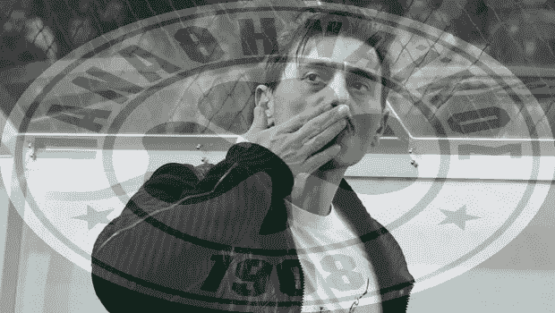

# OpenCV 入门

> 原文：<https://levelup.gitconnected.com/get-started-with-opencv-3c973215f849>

## Python 中的 OpenCV 入门

在本帖中，我们将提供一些使用 OpenCV 可以做什么的例子。

[](https://jorgepit-14189.medium.com/membership) [## 用我的推荐链接加入媒体-乔治皮皮斯

### 阅读乔治·皮皮斯(以及媒体上成千上万的其他作家)的每一个故事。您的会员费直接支持…

jorgepit-14189.medium.com](https://jorgepit-14189.medium.com/membership) 

# 在 OpenCV 中混合图像

我们将给出一个例子，演示如何使用 [Python OpenCV](https://opencv-python-tutroals.readthedocs.io/en/latest/py_tutorials/py_tutorials.html) 混合图像。下面我们代表目标和过滤器的图像。

**目标图像**


**过滤图像**


```
import cv2

# Two images
img1 = cv2.imread('target.jpg')
img2 = cv2.imread('filter.png')

# OpenCV expects to get BGR images, so we will convert from BGR to RGB

img1 = cv2.cvtColor(img1, cv2.COLOR_BGR2RGB)
img2 = cv2.cvtColor(img2, cv2.COLOR_BGR2RGB)

# Resize the Images. In order to blend them, the two images
# must be of the same shape

img1 =cv2.resize(img1,(620,350))
img2 =cv2.resize(img2,(620,350))

# Now, we can blend them, we need to define the weight (alpha) of the target image
# as well as the weight of the filter image
# in our case we choose 80% target and 20% filter
blended = cv2.addWeighted(src1=img1,alpha=0.8,src2=img2,beta=0.2,gamma=0)

# finally we can save the image. Now we need to convert it from RGB to BGR

cv2.imwrite('Blending.png',cv2.cvtColor(blended, cv2.COLOR_RGB2BGR))
```

**瞧！**



# 在 OpenCV 中处理图像

我们将展示如何在 Python 中使用 OpenCV 应用图像处理。我们将使用从 Unsplash 获得的这张[图像](https://images.unsplash.com/photo-1566487097168-e91a4f38bee2?ixlib=rb-1.2.1&ixid=eyJhcHBfaWQiOjEyMDd9&auto=format&fit=crop&w=1050&q=80)。


# 如何模糊图像

```
import cv2
import numpy as np
import matplotlib.pyplot as plt
%matplotlib inline

img = cv2.imread('panda.jpeg')
img = cv2.cvtColor(img, cv2.COLOR_BGR2RGB)
blurred_img = cv2.blur(img,ksize=(20,20))
cv2.imwrite("blurredpanda.jpg", blurred_img)
```


# 如何应用索贝尔算子

你可以在维基百科上看一下 [Sobel 算子](https://en.wikipedia.org/wiki/Sobel_operator)，你也可以开始用一些滤镜[做实验](https://setosa.io/ev/image-kernels/)。让我们应用水平和垂直 Sobel 算子。

```
img = cv2.imread('panda.jpeg',0)
sobelx = cv2.Sobel(img,cv2.CV_64F,1,0,ksize=5)
sobely = cv2.Sobel(img,cv2.CV_64F,0,1,ksize=5)

cv2.imwrite("sobelx_panda.jpg", sobelx) 
cv2.imwrite("sobely_panda.jpg", sobely)
```


# 如何对图像应用阈值

我们也可以将图像二值化。

```
img = cv2.imread('panda.jpeg',0)
ret,th1 = cv2.threshold(img,100,255,cv2.THRESH_BINARY)
fig = plt.figure(figsize=(12,10))
plt.imshow(th1,cmap='gray')
```


# OpenCV 中的人脸检测

我们将讨论如何使用 [OpenCV](https://opencv.org/) 应用人脸检测。我们用一个可重复的实际例子来说明。

逻辑如下:我们从 URL(或从硬盘)获取图像。我们将其转换为`numpy array`，然后转换为灰度。然后通过应用适当的**级联分类器**我们得到人脸的边界框。最后，使用 [PIllow](https://pillow.readthedocs.io/en/stable/) (甚至 OpenCV)我们可以在初始图像上画出盒子。

```
import cv2 as cv
import numpy as np
import PIL
from PIL import Image
import requests
from io import BytesIO
from PIL import ImageDraw

# I have commented out the cat and eye cascade. Notice that the xml files are in the opencv folder that you have downloaded and installed
# so it is good a idea to write the whole path
face_cascade = cv.CascadeClassifier('C:\\opencv\\build\\etc\\haarcascades\\haarcascade_frontalface_default.xml')
#cat_cascade = cv.CascadeClassifier('C:\\opencv\\build\\etc\\haarcascades\\haarcascade_frontalcatface.xml')
#eye_cascade = cv.CascadeClassifier('C:\\opencv\\build\\etc\\haarcascades\\haarcascade_eye.xml')

URL = "[https://images.unsplash.com/photo-1525267219888-bb077b8792cc?ixlib=rb-1.2.1&ixid=eyJhcHBfaWQiOjEyMDd9&auto=format&fit=crop&w=1050&q=80](https://images.unsplash.com/photo-1525267219888-bb077b8792cc?ixlib=rb-1.2.1&ixid=eyJhcHBfaWQiOjEyMDd9&auto=format&fit=crop&w=1050&q=80)"
response = requests.get(URL)
img = Image.open(BytesIO(response.content))
img_initial = img.copy()

# convert it to np array
img = np.asarray(img)

gray = cv.cvtColor(img, cv.COLOR_BGR2GRAY)

faces = face_cascade.detectMultiScale(gray)
# And lets just print those faces out to the screen
#print(faces)

drawing=ImageDraw.Draw(img_initial)

# For each item in faces, lets surround it with a red box
for x,y,w,h in faces:
    # That might be new syntax for you! Recall that faces is a list of rectangles in (x,y,w,h)
    # format, that is, a list of lists. Instead of having to do an iteration and then manually
    # pull out each item, we can use tuple unpacking to pull out individual items in the sublist
    # directly to variables. A really nice python feature
    #
    # Now we just need to draw our box
    drawing.rectangle((x,y,x+w,y+h), outline="red")
display(img_initial)
```

最初的图像是这样的:


画完边界框后，我们得到了:


正如我们所看到的，我们设法正确地得到了四张脸，但是我们也发现了窗户后面的一个“鬼”

## 裁剪面部以分离图像

我们也可以裁剪面部来分离图像

```
for x,y,w,h in faces:

    img_initial.crop((x,y,x+w,y+h))
    display(img_initial.crop((x,y,x+w,y+h)))
```

例如，我们看到的第一张脸是:


注意:如果您想从硬盘中读取图像，您可以简单地键入以下三行:

```
# read image from the PCinitial_img=Image.open('my_image.jpg')
img = cv.imread('my_image.jpg')
gray = cv.cvtColor(img, cv.COLOR_BGR2GRAY)
```

# OpenCV 中的人脸检测视频

这篇文章是一个实际的例子，展示了我们如何使用 [OpenCV](https://opencv.org/) 和 Python 来检测视频中的人脸。在之前的帖子中，我们解释了如何在 Tensorflow 中应用[对象检测，以及在 OpenCV](https://predictivehacks.com/example-of-object-detection-in-tensorflow/) 中应用[人脸检测。一般来说，计算机视觉和目标检测是人工智能领域的一个热门话题。想象一下](https://predictivehacks.com/face-detection-in-opencv/) [**自动驾驶汽车**](https://en.wikipedia.org/wiki/Self-driving_car) ，它必须连续检测周围许多不同的物体(行人、其他车辆、标志等)。

## 如何录制人脸检测视频

在下面的例子中，我们使用 USB 摄像头进行人脸检测，并将视频写入一个`.mp4`文件。正如你所看到的，OpenCV 能够检测人脸，当它藏在手后面时，OpenCV 就会丢失它。

```
import cv2
# change your path to the one where the haarcascades/haarcascade_frontalface_default.xml is
face_cascade = cv2.CascadeClassifier('../DATA/haarcascades/haarcascade_frontalface_default.xml')

cap = cv2.VideoCapture(0) 

width = int(cap.get(cv2.CAP_PROP_FRAME_WIDTH))
height = int(cap.get(cv2.CAP_PROP_FRAME_HEIGHT))

# MACOS AND LINUX: *'XVID' (MacOS users may want to try VIDX as well just in case)
# WINDOWS *'VIDX'
writer = cv2.VideoWriter('myface.mp4', cv2.VideoWriter_fourcc(*'XVID'),25, (width, height))

while True: 

    ret, frame = cap.read(0) 

    frame = detect_face(frame)
    writer.write(frame)

    cv2.imshow('Video Face Detection', frame) 
    # escape button to close it
    c = cv2.waitKey(1) 
    if c == 27: 
        break

cap.release() 
writer.release()
cv2.destroyAllWindows()
```

## 计算机视觉代码的输出

用动态人脸检测录制这个视频只需要几行代码。如果你运行上面的代码块，你会得到一个类似的视频(当然是不同的面孔

*原载于*[*https://predictivehacks.com*](https://predictivehacks.com/get-started-with-opencv/)*。*