# React Native + Google Sign In 入门。

> 原文：<https://levelup.gitconnected.com/get-started-with-react-native-google-sign-in-4a03cef373c5>

## 如何在 React Native & Firebase 中设置 Google 登录？


如何在 react native (Firebase)中添加 google sign

谷歌登录是一个安全的登录功能，可以在 React 本地应用中实现，我将向大家展示如何通过几个简单的步骤将谷歌登录添加到应用中

我将使用一个名为`react-native-community/google-signin`的 React 本地社区支持包。

注意:`This post is made for react-native >= 0.60, if you are using react-native <= 0.59.x then this is not for you`


# 特征

*   支持所有 3 种类型的身份验证方法(标准、服务器端验证或离线访问(也称为服务器端访问))
*   Android 和 iOS 之间一致的基于承诺的 API
*   用于打字稿和流程的打字
*   本机登录按钮

# 版本

## 反应原生 0.61.5

## react-native-community/谷歌登录 4.0.0

*   首先，在终端中使用以下命令创建应用程序

```
npx react-native init TypeYourAppNameHere
```

*   像这样在终端中导航到 RNGoogleSignInDemo

```
cd TypeYourAppNameHere
```

*   现在安装`react-native-community/google-signin`

```
yarn add @react-native-community/google-signinORnpm install --save @react-native-community/google-signin
```

由于支持 React Native >= 0.60 `AutoLinking`，我们不需要运行链接命令。

我们确实需要在本机上做一些配置，但我保证这很容易。

有两种方法可以做到这一点，有或没有 Firebase 和我将使用一个与 Firebase。

# 重火力点

*   搜索 Firebase 并转到 Firebase 控制台
*   通过点击`Add Project`创建一个项目【我已经创建了】。

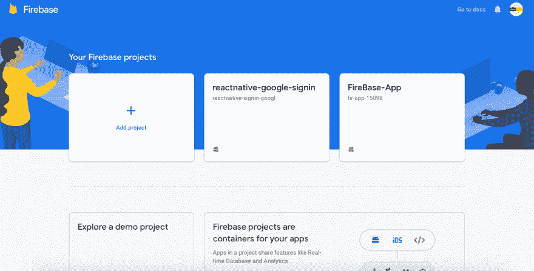

键入您的项目名称，然后单击继续

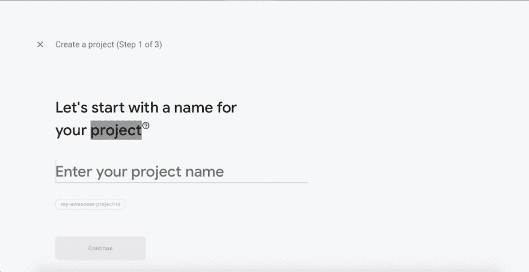

键入您的项目名称，然后单击继续

选择是否要添加数据分析。默认情况下，它是启用的。按继续。


选择是否要添加分析，这取决于您的偏好。默认情况下，它是启用的。按继续。

现在您的项目已经创建好了。

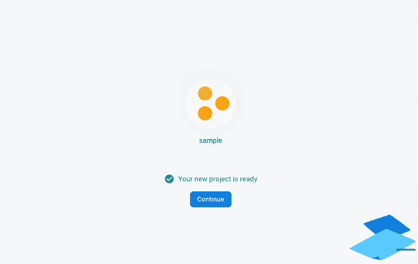

单击 firebase 控制台仪表板中的 android 图标

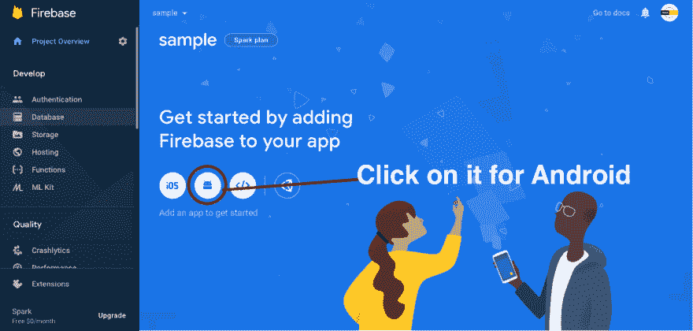

单击 firebase 控制台仪表板中的 android 图标

填写“将 Firebase 添加到您的 Android 应用程序”的以下字段，以生成配置文件(即 google-services.json)

*   Android 包名称
*   调试签名证书 SHA-1

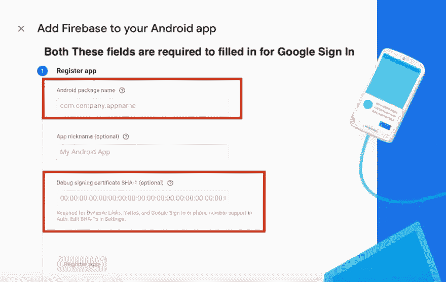

*   你可以在`android/app/main/AndroidManifest.xml`文件中找到应用程序的包名

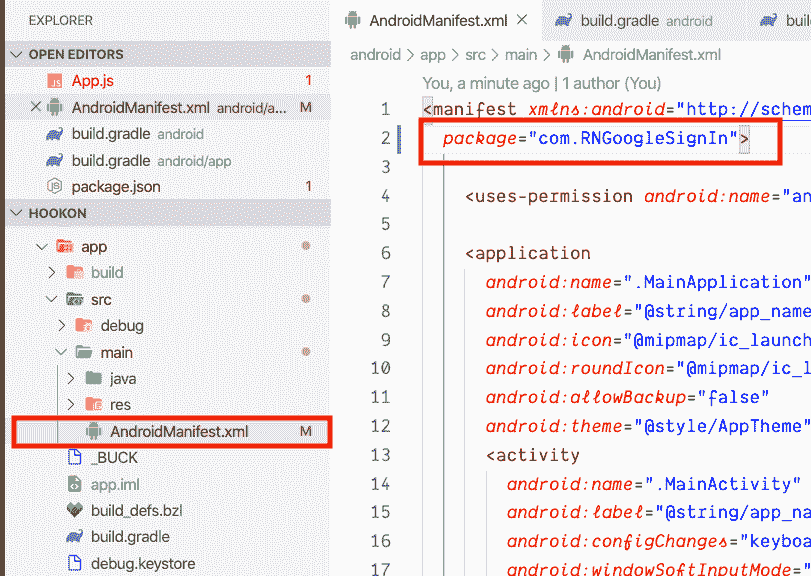

# 对于调试签名证书 SHA-1

在终端中键入调试 SHA1 的命令(项目的根目录)

# Mac/Linux

```
keytool -J-Duser.language=en -list -v -keystore ~/.android/debug.keystore -alias androiddebugkey -storepass android -keypass android
```

# Windows 操作系统

*   将目录更改为 JDK bin 目录。JDK 的路径取决于您使用的操作系统

```
cd C:\Program Files\Java\jdk1.8.0_121\bin
```

*   现在我们必须使用 JDK/bin 中的 keytool.exe 文件运行以下命令

```
keytool -list -v -keystore "%USERPROFILE%\.android\debug.keystore" -alias androiddebugkey -storepass android -keypass android
```

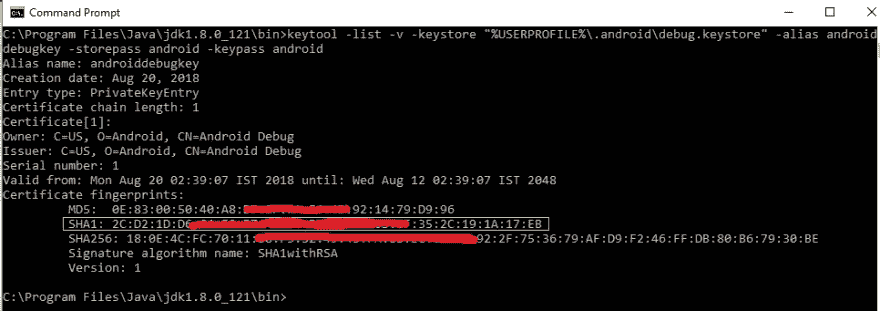

如果你不喜欢终端，那么你可以使用 Android Studio

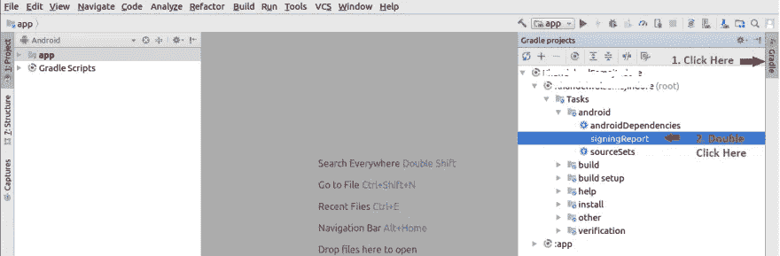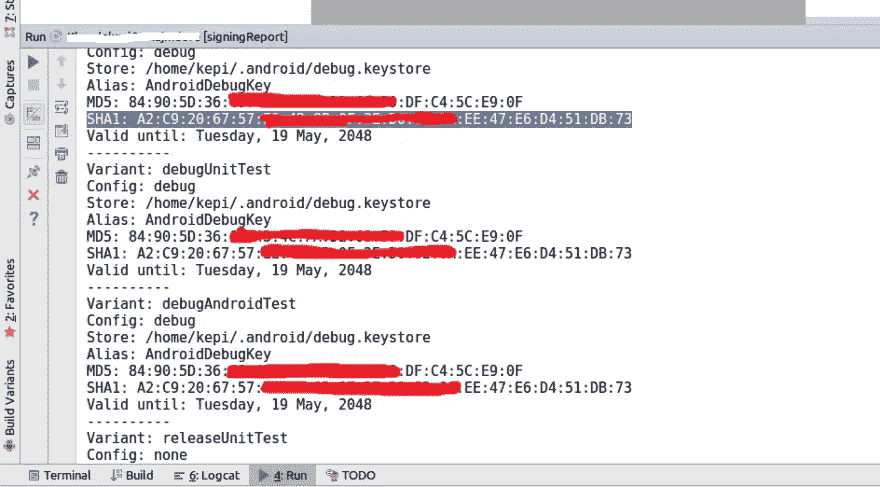

*   当你在 firebase 上注册完你的 android 应用程序后，点击`Download the Config file`并将其放入`android/app`

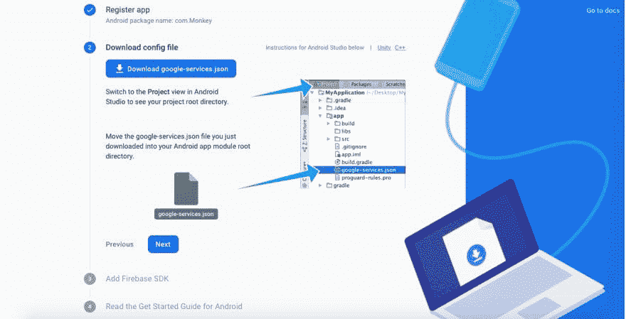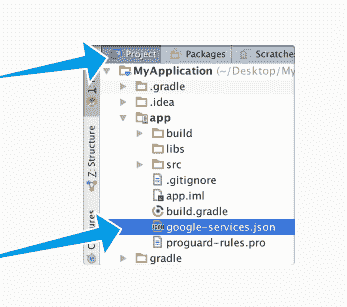

在项目级 build.gradle 中添加 Firebase SDK，即`android/build.gradle`

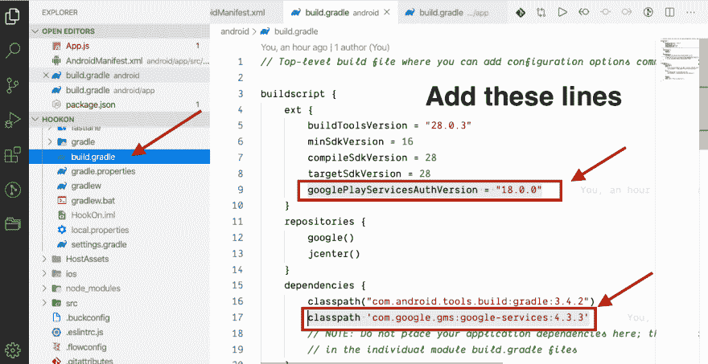

```
buildscript {
    ext {
        buildToolsVersion = "28.0.3"
        minSdkVersion = 16
        compileSdkVersion = 28
        targetSdkVersion = 28
        googlePlayServicesAuthVersion = "18.0.0" // Add this line
    }
    repositories {
        google()
        jcenter()
    }
    dependencies {
        classpath("com.android.tools.build:gradle:3.4.2")
        classpath 'com.google.gms:google-services:4.3.3' // Add this line
        // NOTE: Do not place your application dependencies here; they belong
        // in the individual module build.gradle files
    }
}
```

*   在 App 级 build . gradle(Android/appp/build . gradle)中添加 Google Play 服务插件:

```
apply plugin: 'com.google.gms.google-services' // Add at end of the file
```

# 例如

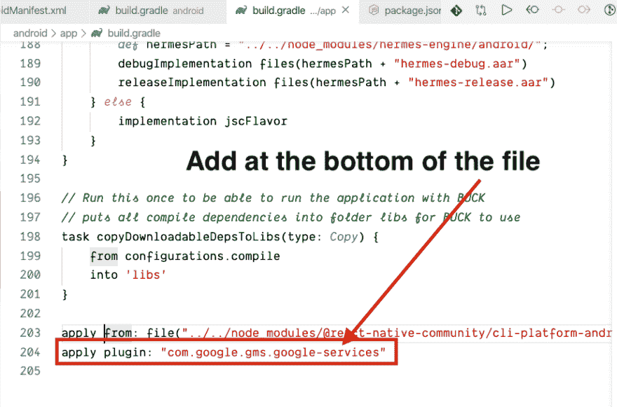

*   在 firebase 中，您需要在登录方法部分启用 Google 选项

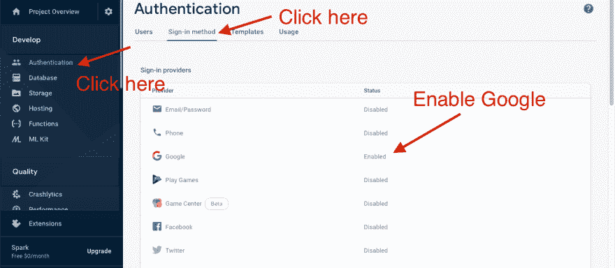

启用 Google 时，请从那里复制`Web Client ID`,我们稍后需要它。

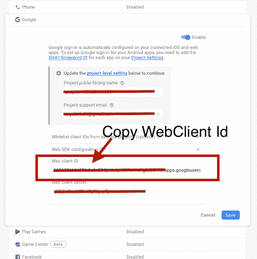

# 让我们用代码弄脏我们的手

我将制作一个简单的应用程序，只包含 App.js(默认情况下已经存在)的两个组件，第二个是 Home.js。

*   导入`@react-native-community/google-signin`的公共 Api

```
import {
  GoogleSignin,
  GoogleSigninButton,
  statusCodes,
} from '@react-native-community/google-signin';
```

*   但在你可以使用上述进口你需要调用一次，谷歌登录的配置。你可以在 **ComponentDidMount** 生命周期方法中调用它，也可以使用 **useEffect** 钩子

```
 GoogleSignin.configure({
 webClientId: WebClientID, // client ID of type WEB for your server(needed to verify user ID and offline access)
 offlineAccess: true, // if you want to access Google API on behalf of the user FROM YOUR SERVER
 forceCodeForRefreshToken: true, // [Android] related to `serverAuthCode`, read the docs link below *.
 accountName: '', // [Android] specifies an account name on the device that should be used
    });
```

*   登录功能

```
signIn = async () => {
    try {
      await GoogleSignin.hasPlayServices();
      const info = await GoogleSignin.signIn();
      console.warn({userInfo: info});
      setUserInfo(info);
    } catch (error) {
      if (error.code === statusCodes.SIGN_IN_CANCELLED) {
        // user cancelled the login flow
      } else if (error.code === statusCodes.IN_PROGRESS) {
        // operation (e.g. sign in) is in progress already
      } else if (error.code === statusCodes.PLAY_SERVICES_NOT_AVAILABLE) {
        // play services not available or outdated
      } else {
        // some other error happened
      }
    }
  };
```

*   注销功能

```
signOut = async () => {
    try {
      await GoogleSignin.revokeAccess();
      await GoogleSignin.signOut();
      setUserInfo(null); // Remember to remove the user from your app's state as well
    } catch (error) {
      console.error(error);
    }
  };
```

# 演示应用预览

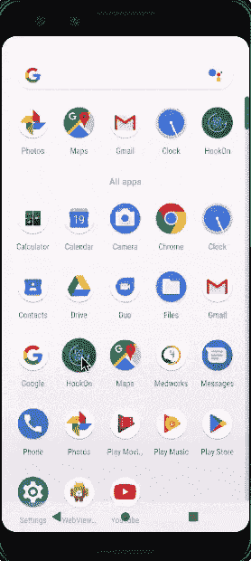

*做检查**[***正式文件***](https://github.com/react-native-community/google-signin) *如果有任何问题告诉我。**

*我希望你喜欢这个帖子，我会很快发布更多的帖子，最重要的是，欢迎所有的建议。*

**

**原载于 2020 年 4 月 19 日*[*https://dev . to*](https://dev.to/anwargul0x/get-started-with-react-native-google-sign-in-18i5)*。**