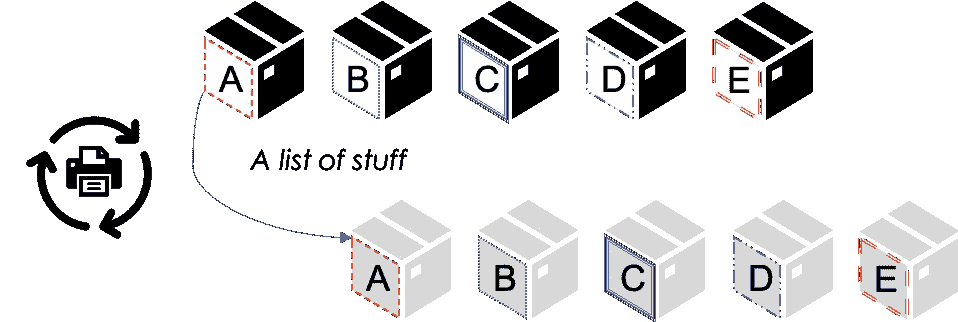
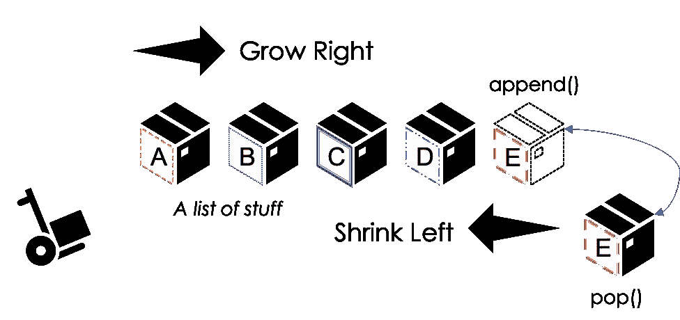
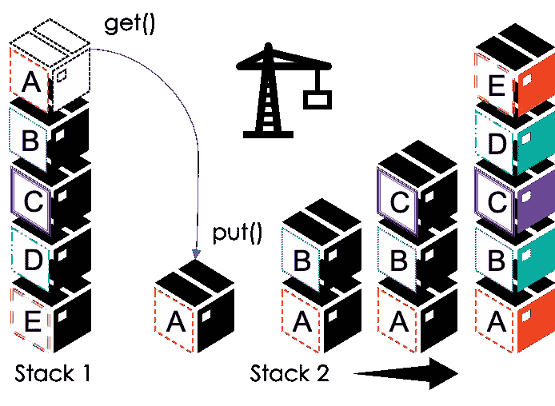
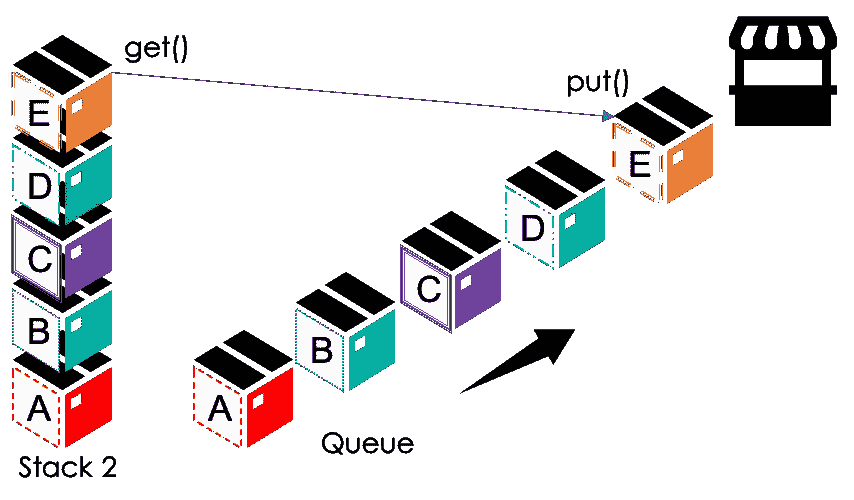
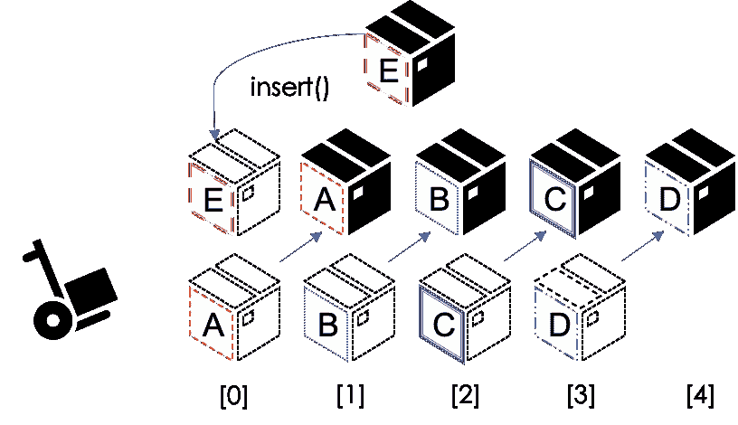
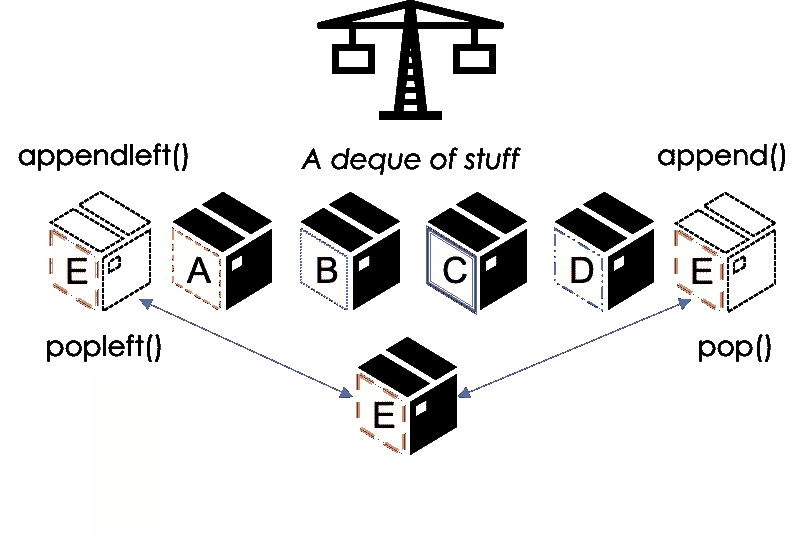

# Python 中的堆栈和队列入门

> 原文：<https://levelup.gitconnected.com/get-started-with-stacks-and-queues-in-python-57a7ea273629>

超越 Python 中的 lists 与 Stack，如 LifoQueue()、Queue()和 Deque()，高效地处理任务——内有工作代码示例和插图。不包括煎饼。


照片由 [nikldn](https://unsplash.com/@nikldn?utm_source=medium&utm_medium=referral) 在 [Unsplash](https://unsplash.com?utm_source=medium&utm_medium=referral) 上拍摄

# 关于这个故事

我最近了解到一些很酷的工具，可以处理标准 Python 列表之外的数据，我认为它们棒极了！当然，这些主题都是老生常谈了，但我还是想分享一些例子，帮助我理解 Python 中的 Stack()、Queue()和 Deque()。

# 在这个故事中

1.  [列表](https://docs.python.org/3/tutorial/introduction.html#lists):回顾一种在一个地方收集物品的熟悉方式
2.  [栈](https://docs.python.org/3/library/queue.html#queue.LifoQueue):看起来像一个列表，但是有一个*后进先出*实现
3.  [队列](https://docs.python.org/3/library/queue.html):看起来像一个堆栈，但是有一个*先进先出*实现
4.  [Deques](https://docs.python.org/3/library/collections.html#collections.deque) :解决列表大问题的双端队列

# 名单

在 Python 中，list 是最通用的复合数据类型。例如，在搞清楚“你好，世界”这一点后，管理列表是我们将学习的第一件事。此外，列表是如此有用，以至于我们最终会尝试将它们用于所有事情。然而，尽管我们可以用列表做令人惊奇的事情，最终，我们需要一些其他的朋友，比如元组和集合。但是仍然有一些非常特殊的工作需要特殊的工具，这就是我们的伙伴 Stack()、Queue()和 Deck()发挥作用的地方。

## 遍历一个列表

有了这个列表，我们就有了一个非常容易管理的方法来组织数据。在我们能做的许多事情中，如果我们有一个盒子列表，我们可以用迭代打印一个列表。



通过迭代，我们可以打印对象列表。作者的插图。

如上所示，我们可以在下面的代码中使用一个简单的循环来打印带有迭代的盒子列表。重要的是要注意，对于迭代，我们从列表中的第一件事情开始，然后移动到下一件事情，直到我们到达末尾。

```
**# Example 1: Print a list with Iteration**lst_of_stuff = ['Box A', 'Box B', 'Box C', 'Box D', 'Box E']for i in lst_of_stuff:
  print(i)'''
Output:Box A
Box B
Box C
Box D
Box E
'''
```

## 用 Append()和 Pop()操作列表

除了简单的打印工作，当我们想到用 **append()** 和 **pop()** 编辑列表时，事情开始变得有趣起来。在上面的示例#1 中，我们只打印了框列表中的数据，但没有编辑列表。但是，使用 append()和 pop()，我们可以在列表的右侧添加和移除框。

正如我从一些地方读到的，他们说一个*列表向右增长，向左收缩*。



使用 append()和 pop()在列表右侧添加或删除数据。作者的插图。

在第二个例子中，就好像我们简陋的一排箱子在一个狭窄的车库里——移动东西的唯一方法是拿起排在最后的箱子。在下面的代码示例中，我们可以通过弹出框 E 并追加一个新的框 f 来看到这种类比。

```
**# Example 2: Edit a list with pop and append**lst_of_stuff = ['Box A', 'Box B', 'Box C', 'Box D', 'Box E']**# pop off the last thing in the list**print(lst_of_stuff.pop())# >>> Box E**# append something new to the end of the list**lst_of_stuff.append('Box F')
print(lst_of_stuff)# >>> ['Box A', 'Box B', 'Box C', 'Box D', 'Box F']
```

# 堆栈

在了解了 append()和 pop()如何让列表变得简洁之后，我们感觉到列表的工作方式有一些特殊的规则。例如，当 append()和 pop()从列表的右侧或末端开始工作时，我们实际上是在观察堆栈的行为。换句话说，最后一个进来的盒子是第一个出去的盒子。

在箱子类比中，考虑用起重机实际堆叠和卸载箱子是有帮助的——在任何给定的时间，只有顶部的箱子是可接近的。因此，我们有一个**后进先出实现，称为 *LIFO* 。**



使用队列类中的 LifoQueue()堆栈—总是从顶部或“后进先出”作者的插图。

**这里需要注意一件重要的事情，因为它可能会引起混淆**——在 Python 中，**堆栈是用队列类 LifoQueue()** 实现的。对我来说，这个术语可能会引起误解，因为队列不同于堆栈，也没有称为“堆栈”的类或方法抛开困惑不谈，对**有帮助的是记住:** **栈是关于 LIFO 生命的，所以当你看到 LifoQueue()时，你真的有一个栈**。

```
# Example 3: Stack with LifoQueue**# import from queue class**
from queue import LifoQueue lst_of_stuff = ['Box A', 'Box B', 'Box C', 'Box D', 'Box E']**# create two empty stacks as LifoQueue objects**
stack1 = LifoQueue()
stack2 = LifoQueue()**# iterate to stack a list of boxes with put()
# use reverse() on the list to start stacking 
# with 'Box E' and end with 'Box A'**for i in reversed(lst_of_stuff):
  stack1.put(i)**# while the stack has boxes
# get the top of stack1 with .get() as 'box'
# build stack2 with one box at a time**while not stack1.empty():
  box = stack1.get()
  stack2.put(box)
```

在上面和下面的示例#3 代码中，我们创建了两个堆栈，并使用我们想象的起重机来移动东西。首先，颠倒盒子列表，我们从盒子 E 开始堆栈，并创建一个盒子 A 位于顶部的堆栈。当我们拆分和重新堆叠盒子时，stack2 最终再次颠倒了顺序，从上到下。为了演示，我们可以用下面的 while 循环打印 stack2。

```
**# Until the stack is empty, get and print each box**while not stack2.empty():
  print(stack2.get())'''
Output:Box E
Box D
Box C
Box B
Box A
'''
```

# 队列

如果列表有点像 Stack()，而 Stack()实际上是 LIFO queue()——什么是实际的队列？谢天谢地，事情开始有意义了。从表面上看，有了队列，我们就有了真正的队列！比如，想象一下我们的小盒子已经出厂，现在正在排队等着吃冰淇淋，可爱吧？在这种情况下，**队列中的第一个盒子先得到冰淇淋——这就是先进先出或先进先出。**



从堆栈到队列:后进先出(LIFO)和先进先出(FIFO)的区别。作者的插图。

如果我们继续上面例子 3 中的代码，将盒子从堆栈 2 移动到一个队列中，那么注意在每次迭代中发生了什么。我们从栈顶拿到一个盒子，然后把盒子放在排队买冰淇淋。每次我们拿到下一个盒子，它就会进入下一个位置。

```
**# Example 4: From Stack to Queue** **# import the Queue**
from queue import Queue**# create a new empty Queue()** q = Queue()# while there are boxes in the stack
# get a box and place it in queuewhile not stack2.empty():
  box = stack2.get()
  q.put(box)
```

为了证明 Box E 在队列的前面，我们可以再次使用 get()方法返回 Box E。结果，我们看到队列中的第一个对象是第一个出来的对象。相比之下，如果队列是一个堆栈，我们将得到盒子 A 而不是盒子 e。

```
print(q.get())# >>> Box E
```

# 德克(“甲板”)

当学习一个编程概念的时候，那些杜撰出来的词总是让我感到害怕。问题是，一个如此抽象的概念令人担忧，以至于他们*不得不*为它造了一个词。然而，在这种情况下，我向你保证，没有理由逃跑。Deque()或者我头脑中的“deck”只是一个双面队列。

我们为什么关心？

像堆栈和队列一样，在某些特定情况下，您可能希望使用 Deque()而不是 list。虽然有很多方法，但是我将只提供一个技术示例来说明为什么以及什么时候 deque 是首选的。在这个过程中，我将向您展示一个 deque 是如何工作的。

## 回到列表

回想一下例子#1，从列表中添加和弹出数据有一个限制——似乎我们只能从列表的右边添加或减去数据。为什么会这样呢？


与编辑例 1 中的列表作为摘要的图示相同。作者的插图。

需要说明的是，我们并不局限于只从右侧编辑列表。实际上，我们*希望*从列表的末尾添加和弹出数据，因为**在前面插入数据可能效率很低。**例如，我们知道列表中的每个对象都有一个索引。在 Python 中，我们从第一个元素的[0]开始，并从那里递增。**如果我们在列表前面的索引 0 处插入()框 E 会发生什么？**



在索引 0 处将数据插入到列表的前面时出现的问题——插入后的每个对象都必须移动到索引中的一个点上。作者的插图。

在上图中，如果我们使用 insert()为框 A 腾出空间，那么**我们必须将列表中的每个框移动一个索引位置**。在一个非常简单的例子中，移动四个盒子来为一个盒子腾出空间很容易，而且有点烦人。但是如果有一百盒或者一万盒呢？单个插入任务不仅变得非常烦人，而且在效率方面也变得非常昂贵。

## 回到德克

有了 deque，我们就不会有 insert()出现的索引问题。例如，为了添加或删除数据，deque 不仅提供 append()和 pop()，还提供了它们各自的左版本！

*   [appendleft()](https://docs.python.org/3/library/collections.html#collections.deque)
*   [popleft()](https://docs.python.org/3/library/collections.html#collections.deque)
*   [追加()](https://docs.python.org/3/library/collections.html#collections.deque)
*   [pop()](https://docs.python.org/3/library/collections.html#collections.deque)

啊，但是等等——我们不是对列表使用 append()和 pop()吗？是的，我们有，这就是为什么一个**队列同时像一个双端队列和一个列表。**因此，我下面的盒子和起重机插图看起来有点像队列和列表，但有一点扭曲，这并不奇怪——这是一个队列。



部分列表、部分队列 deque 为我们提供了从集合的任意一端追加和弹出数据的有效方法。作者的插图。

## 清单五

让我们看看 deque 在代码中是如何工作的，同时将性能与列表进行比较。在下面的例子中，我们可以使用 **timeit** 来设置各种测试。

```
import timeit
```

首先，对于 insert():将 10，000 个数字插入到索引为 0 的列表中。如下所示，在运行测试 5 次后，该语句的计时大约为 0.581 秒。

```
**# Example 5: Insert() Test
# insert() at index 0
# statements as strings for timeit**my_setup = '''
alst = []'''statement = '''
for i in range(10000):
  alst.insert(0,i)'''**# evaluate the statement with timeit**timeit.timeit(stmt=statement, setup = my_setup, number=5)# >>> 0.5816648300024099
```

相比之下，在下面的示例 6 中，deque 的执行速度比 insert()快几个数量级。使用 **timeit** 时，使用 deque 进行相同的操作只需 0.0056 秒。虽然测试越多，结果可能会有所不同，但我们的差距大约是 100 倍——这是很大的差距！

```
**# Example 6: Deque() Test
# appendleft with deque
# statements as strings for timeit**my_setup = '''
from collections import deque
deck = deque()'''statement = '''
for i in range(10000):
  deck.appendleft(i)'''**# evaluate the statement with timeit**timeit.timeit(stmt=statement, setup = my_setup, number=5)# >>> 0.00567837600101484
```


[喇嘛罗斯库](https://unsplash.com/@lamaroscu?utm_source=medium&utm_medium=referral)在 [Unsplash](https://unsplash.com?utm_source=medium&utm_medium=referral) 上的照片

# 结论

在编程中，列表是最基本的。列表帮助我们组织和管理数据。尽管有时会被过度使用和误用，但是学习和掌握列表仍然非常重要。然而，尽管列表功能多样，有时我们需要更好的工具来完成特定的工作。在这些情况下，我们需要使用堆栈、队列和队列。

在 Python 中，栈是用队列类中的 LifoQueue 实现的，队列是用队列类中的 Queue 实现的，队列是用集合类中的 dequee 实现的。

列表、堆栈、队列和卡片组之间的差别很小，但是它们的实现差别很大。

*   对于列表，我们通常从左到右操作。我们可以用 insert 来打破常规；然而，这可能是昂贵的。
*   对于堆栈，我们意识到列表实际上表现为堆栈，但令人困惑的是，堆栈是用 LifoQueue 而不是 stack()方法实现的——堆栈是 LIFO 实现。
*   对于队列，我们发现真正的队列表现为逻辑上来自 queue 类的队列——队列是 FIFO 实现。
*   最后，有了 deques，我们可以在集合的两端高效地操作——它看起来同时像一个列表和一个队列——dequee 可以有效地追加或弹出集合的任何一端。

最后，和往常一样，阅读官方文件以获得最准确的信息——全文提供的链接和下面的参考链接。我希望这些例子是有帮助的，我真的很感谢你的任何意见或问题！

[](https://www.python.org/) [## 欢迎来到 Python.org

### Python 编程语言的官方主页

www.python.org](https://www.python.org/)