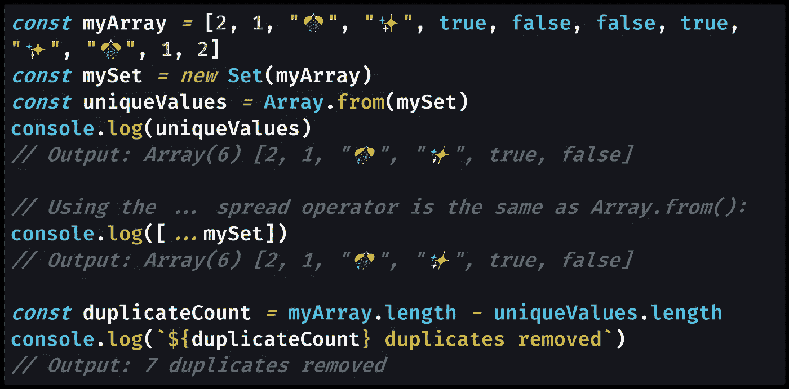

# 使用 Set (ES6)从 JavaScript 数组中获取唯一值

> 原文：<https://levelup.gitconnected.com/get-unique-values-from-a-javascript-array-using-set-es6-32b0bc8f1870>

## 当您有一个具有重复值的数组时，您可以通过调用数组上的`Set`构造函数:`new Set([])`来获得唯一值。

Igor Starkov 在 [Unsplash](https://unsplash.com?utm_source=medium&utm_medium=referral) 上拍摄的照片

# 从数组中删除重复值

ES6(也称为 ECMAScript 2015 或简称为“现代 JavaScript”)中我最喜欢的部分之一是添加了`[Set](https://medium.com/coding-at-dawn/how-to-use-set-to-filter-unique-items-in-javascript-es6-196c55ce924b)`，这是一种新的对象类型，只允许你一次添加任何给定值。

乍一看，`Set`与常规的 JavaScript 对象有一些相似之处，后者需要惟一的对象键(也称为属性或属性名)。对象只允许您一次添加任何给定的属性名，因此似乎您可以使用它们从 JavaScript 数组中获取唯一的值。

但是，JavaScript 对象键必须是字符串；除了特殊类型`[Symbol](https://medium.com/p/30c3f294ea65)`，其他类型不能作为对象键。此外，对象关键点不记得它们的“插入顺序”，即它们最初被添加到对象中的顺序。

这使得对象不适合从数组中查找唯一值，特别是如果您希望以唯一值在数组中出现的相同顺序来获取它们。这就是为什么我们现在有了`Set`。

正如我们将在本文中看到的，因为`Set`对象是[可迭代的](https://developer.mozilla.org/en-US/docs/Web/JavaScript/Reference/Iteration_protocols)，所以很容易将数组转换成`Set`对象，反之亦然。

# 用`Set`寻找唯一的数组值

让我们举一个包含不同类型的数组的代码示例，一些重复的[数字](https://medium.com/javascript-in-plain-english/how-to-check-for-a-number-in-javascript-8d9024708153)、[字符串](https://medium.com/javascript-in-plain-english/how-to-check-for-a-string-in-javascript-a16b196915ff)和[布尔值](https://medium.com/javascript-in-plain-english/how-to-check-for-a-boolean-in-javascript-98fdc8aec2a7)。

虽然我使用的是更常见的[原始类型](https://medium.com/p/671909def6ca) , `Set`实际上对`[null](https://medium.com/javascript-in-plain-english/how-to-check-for-null-in-javascript-dffab64d8ed5)`、`[undefined](https://medium.com/coding-at-dawn/how-to-check-for-undefined-in-javascript-bcedd62c8ad)`和`[NaN](https://medium.com/coding-in-simple-english/how-to-check-for-nan-in-javascript-4294e555b447)`值也很有效。

[查看原始代码](https://gist.github.com/DoctorDerek/36210807db004c3ba464f823737fe7d0)作为 GitHub 要点

我们在示例中看到，项目的插入顺序保持不变，因此一旦删除了 7 个重复值，在得到的 6 个唯一值的数组中，`2`仍然位于`1`之前。

我们如何从数组中获得不同的值？我们只是用`[new](https://developer.mozilla.org/en-US/docs/Web/JavaScript/Reference/Operators/new)`关键字(`new Set()`)调用[的](https://developer.mozilla.org/en-US/docs/Web/JavaScript/Reference/Global_Objects/Set/Set) `[Set](https://developer.mozilla.org/en-US/docs/Web/JavaScript/Reference/Global_Objects/Set/Set)` [构造函数](https://developer.mozilla.org/en-US/docs/Web/JavaScript/Reference/Global_Objects/Set/Set)，将数组作为唯一参数传递给构造函数。

> "`**Set**` **构造函数**允许你创建`Set`对象来存储任何类型的唯一值，无论是[原始值](https://developer.mozilla.org/en-US/docs/Glossary/Primitive)还是对象引用。"— [MDN 文档](https://developer.mozilla.org/en-US/docs/Web/JavaScript/Reference/Global_Objects/Set/Set)

我们可以通过使用`[Array.from()](/how-to-copy-an-array-in-javascript-with-array-from-298c7e66eebc?gi=25ca4049065)`或者[带方括号`[]`的](https://medium.com/coding-at-dawn/how-to-use-the-spread-operator-in-javascript-b9e4a8b06fab) `[...](https://medium.com/coding-at-dawn/how-to-use-the-spread-operator-in-javascript-b9e4a8b06fab)` [扩展操作符](https://medium.com/coding-at-dawn/how-to-use-the-spread-operator-in-javascript-b9e4a8b06fab)转换回数组。后者也被称为使用带有“数组文字符号”的`...`扩展语法

将两者放在一起，我们可以用一行代码从数组中获得唯一的值:`Array.from(new Set(oldArray))`。使用`...`扩展语法的等效代码是:`[...new Set(oldArray)]`。

请注意，[使用](https://medium.com/better-programming/how-to-find-unique-objects-in-an-array-in-javascript-by-object-reference-or-key-value-pairs-131338898d7a) `[Set](https://medium.com/better-programming/how-to-find-unique-objects-in-an-array-in-javascript-by-object-reference-or-key-value-pairs-131338898d7a)` [和 JavaScript 对象](https://medium.com/better-programming/how-to-find-unique-objects-in-an-array-in-javascript-by-object-reference-or-key-value-pairs-131338898d7a)的工作方式略有不同，这取决于您是否需要唯一的对象引用或者比较那些对象的内容。

默认行为使用唯一的对象引用，因此`Set`将删除多次找到的对象的任何副本。您必须采用不同的方法来比较对象的内容。

关于这种寻找唯一值的方法的更多信息，请阅读我的在 JavaScript 中使用`[Set](https://medium.com/coding-at-dawn/how-to-use-set-to-filter-unique-items-in-javascript-es6-196c55ce924b)` [的完整指南:](https://medium.com/coding-at-dawn/how-to-use-set-to-filter-unique-items-in-javascript-es6-196c55ce924b)

 [## 如何使用 Set 来过滤 JavaScript ES6 中的唯一项

### JavaScript 中需要唯一值？这就是 Set 对象出现的原因。以下是如何使用 Set 来过滤一个列表…

medium.com](https://medium.com/coding-at-dawn/how-to-use-set-to-filter-unique-items-in-javascript-es6-196c55ce924b) 

我希望这篇文章已经帮助你理解了为什么当你需要从一个数组中获取唯一值时,`Set`是一个可以使用的工具。

**编码快乐！**🎭👔🎠🎄🎁

[德里克·奥斯丁](https://www.linkedin.com/in/derek-austin/)博士是《职业编程:如何在 6 个月内成为一名成功的 6 位数程序员 一书的作者，该书现已在亚马逊上架。