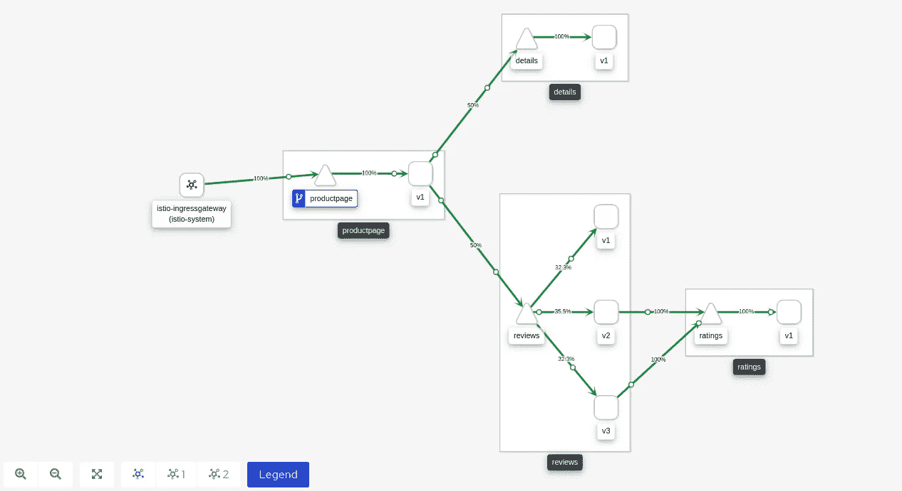

# 使用 Openshift Service Mesh Operator 对您的应用进行全面观察、监控、跟踪和保护

> 原文：<https://levelup.gitconnected.com/get-your-application-fully-observed-monitored-traced-and-secured-using-openshift-service-mesh-43300ffe6aa8>

迁移到微服务方法几乎没有什么挑战，这主要是因为应用程序有很多活动部件。当您拥有一个整体式应用程序时，您已经将所有组件组合成一个整体—更易于部署、监控、观察和保护。

随着微服务变得非常受欢迎，Kubernetes/Openshift 等容器编排引擎也变得非常受欢迎，其中每个微服务实际上是一个 pod(一般来说)，所有微服务都位于 Kubernetes 集群中。有了这些小组件，监控、观察、跟踪和保护您的应用程序变得越来越困难。例如，您有一个应用程序，您的客户苦于响应时间长，您如何跟踪有问题的组件？你从哪里开始？

这就是我想和你谈谈服务网格运营商的原因。使用最新版本的 Openshift，只需点击几下鼠标，您就可以观察、跟踪、保护和监控您的微服务应用，为此，我们将使用 5 种操作方法:

# 相关组件

*   **基亚里操作员**——负责观察，将实时呈现架构
*   **耶格操作员**——负责追踪，将帮助我们找到分布式追踪的瓶颈
*   **Elasticsearch Operator** —收集请求，与 Jaeger 集成以跟踪请求
*   **服务网状运营商** —整个包，将上述所有内容收集到一个 CR 中，并提供 Istio 管理系统
*   **Portshift** **操作员** —负责自动化运行时安全。

# Bookinfo 应用程序

在我们的演示中，我们将使用 bookinfo 应用程序。Bookinfo 是一个版本化的应用程序，其中每个请求都会将我们带到应用程序的不同版本。通过访问产品页面，我们将在每次页面刷新时点击不同版本的 reviews 微服务，草图:


Bookinfo 应用程序架构

让我们从进入我们的 Openshift UI 仪表板开始，安装那些操作符(我推荐使用 RedHat 提供的那些)。安装 Elasticsearch，Kiali，Jaeger，Service Mesh，Portfish 操作器，集群方式。

安装完这些操作符后，转到`Installed operators`，您应该会看到类似这样的内容:


已安装的操作员

```
$ oc new-project istio-system
```

现在我们有了项目，让我们创建一个 CR 来创建服务网格运营商的管理系统，该 CR 将创建所有提到的组件:

```
$ oc create -f - <<EOF 
apiVersion: maistra.io/v1
kind: ServiceMeshControlPlane
metadata:
  name: basic-install
  namespace: istio-system
spec:
  version: v1.1
  istio:
    gateways:
      istio-egressgateway:
        autoscaleEnabled: false
      istio-ingressgateway:
        autoscaleEnabled: false
        ior_enabled: false
    mixer:
      policy:
        autoscaleEnabled: false
      telemetry:
        autoscaleEnabled: false
    pilot:
      autoscaleEnabled: false
      traceSampling: 100
    kiali:
      enabled: true
    grafana:
      enabled: true
    tracing:
      enabled: true
      jaeger:
        template: all-in-oneEOF
```

如你所见，在最后几行，我们可以启用/禁用创建基亚利、格拉夫纳和耶格。这意味着如果我们选择启用它，服务网格运营商将为我们创建到其他运营商的 CR。创建 CR 后，让我们验证我们的管理系统是否已完全安装:

```
$ oc get pods 

NAME                                      READY   STATUS    RESTARTS   AGE
grafana-5b6d886976-vnh5p                  2/2     Running   0          25s
istio-citadel-6784798885-x2dvr            1/1     Running   0          3m16s
istio-egressgateway-b8d7d6fcf-l7sck       1/1     Running   0          68s
istio-galley-7549bb654b-4h7rx             1/1     Running   0          2m22s
istio-ingressgateway-7f6fcf4bc9-h9krz     1/1     Running   0          68s
istio-pilot-75d4fdb54f-rd5td              2/2     Running   0          87s
istio-policy-7cb97db7c8-5fhzj             2/2     Running   0          2m3s
istio-sidecar-injector-866fccd4d9-ntxxw   1/1     Running   0          38s
istio-telemetry-6585f4479c-pq9b6          2/2     Running   0          2m3s
jaeger-6599dbb7c6-kd9cp                   2/2     Running   0          2m20s
kiali-694c9ff744-q4zm8                    1/1     Running   0          4m
prometheus-6df66d57cd-jbqrd               2/2     Running   0          2m51s
```

太好了！我们有 Prometheus & Grafana 用于监控，Istio 用于服务网格，Kiali 用于观察，Jaeger 用于分布式跟踪。一个 CR 中的整个堆栈！现在我们已经有了管理系统，让我们创建一个示例应用程序，这样我们就可以看到我们的管理系统如何对它做出反应:

```
$ oc new-project bookinfo
```

现在让我们创建实际的`ServiceMeshMemberRoll` CR，它将告诉我们的`ServiceMeshControlPlane`我们有一个要管理的候选对象，这实际上是我们的 bookinfo 项目。一旦我们创建了这个 CR，我们的管理系统将开始管理 bookinfo 项目。它将注入 Istio 的 sidecars，并开始收集我们应用程序的信息:

```
$ oc create -f - <<EOF
apiVersion: maistra.io/v1
kind: ServiceMeshMemberRoll
metadata:
  name: default
  namespace: istio-system
spec:
  members:
    - bookinfo
EOF
```

现在让我们创建实际的应用程序。bookinfo 应用程序是一个简单的基于 web 的应用程序，分为几个版本。通过这个应用程序，我们将看到如何使用 Istio 在版本之间均匀地路由流量(强调 canary 部署)，如何观察我们的架构并跟踪请求和响应时间。

```
$ oc apply -n bookinfo -f [https://raw.githubusercontent.com/Maistra/istio/maistra-1.1/samples/bookinfo/platform/kube/bookinfo.yaml](https://raw.githubusercontent.com/Maistra/istio/maistra-1.1/samples/bookinfo/platform/kube/bookinfo.yaml) -n bookinfo
```

现在，让我们验证我们的应用程序已经启动并正在运行:

```
$ oc get pods -n bookinfo

NAME                              READY   STATUS    RESTARTS   AGE
details-v1-d7db4d55b-8sx24        2/2     Running   0          54s
productpage-v1-5f598fbbf4-v9q2j   2/2     Running   0          47s
ratings-v1-85957d89d8-slh99       2/2     Running   0          52s
reviews-v1-67d9b4bcc-2cdw2        2/2     Running   0          50s
reviews-v2-67b465c497-cjftq       2/2     Running   0          50s
reviews-v3-7bd659b757-brlnn       2/2     Running   0          49s
```

如您所见，我们的 pod 中有 2 个容器在运行，其中一个用于应用程序，另一个是应用程序启动时注入的 Istio 的边车。现在，我们将创建一个网关，它将告诉 Istio 我们希望为我们的应用程序创建一个入口规则，以便客户可以在我们的 Openshift 集群之外访问它:

```
$ oc apply -n bookinfo -f [https://raw.githubusercontent.com/Maistra/istio/maistra-1.1/samples/bookinfo/networking/bookinfo-gateway.yaml](https://raw.githubusercontent.com/Maistra/istio/maistra-1.1/samples/bookinfo/networking/bookinfo-gateway.yaml) -n bookinfo
```

现在，让我们为我们的服务创建目的地规则，基本上，这些目的地规则将决定 Istio 如何在我们的微服务之间路由其流量:

```
oc apply -n bookinfo -f [https://raw.githubusercontent.com/Maistra/istio/maistra-1.1/samples/bookinfo/networking/destination-rule-all.yaml](https://raw.githubusercontent.com/Maistra/istio/maistra-1.1/samples/bookinfo/networking/destination-rule-all.yaml) -n bookinfo
```

太好了！我们的应用程序已完全运行，现在让我们创建一个无限循环，这样我们将有一些基本流量流向我们的应用程序，该循环将尝试获取 productpage，默认情况下它使用所有其他服务:

```
$ while :; do curl -s $(oc get route -n istio-system | grep istio-ingressgateway | awk '{print $2}')/productpage | grep -o "<title>.*</title>"; sleep 1; done
```

## 自动化运行时安全性的 Portshift

在我们创建了`Portshift CR`之后，我们看到我们的 bookinfo 应用程序现在为每个 pod 提供了 3 个容器，pod 中的第三个容器被 Portshift 用来应用我们为阻止/检测运行时漏洞(针对连接、pod 安全策略等)而创建的规则:

```
$ oc get pods -n bookinfo

NAME                              READY   STATUS    RESTARTS   AGE
details-v1-d7db4d55b-z74kp        3/3     Running   0          45s
productpage-v1-5f598fbbf4-kw792   3/3     Running   0          47s
ratings-v1-858bf6d7b6-vmhsm       3/3     Running   0          46s
reviews-v1-67d9b4bcc-gmnwg        3/3     Running   0          51s
reviews-v2-67b465c497-6dkx6       3/3     Running   0          44s
reviews-v3-7bd659b757-mgmkv       3/3     Running   0          75s
```

让我们看看如何分析应用程序中的风险，为此，我们将打开 Portshift 仪表板并导航到`Navigator`，在这里我们可以看到我们的网状架构正在被实时分析:


我们可以看到，Portshift 在我们的应用程序中标记了有问题的服务，风险属于连接类型，我们可以看到检测漏洞的规则。该规则是由管理员创建的，以防止 pod 之间的不安全连接，这样我们可以减轻检测到的风险并阻止潜在的攻击。

现在，让我们为我们的应用收集风险评估，导航到`risk assessment`，在这里您可以看到我们的网格风险摘要:


在我们的应用程序中，有 6 个关键风险和 36 个高风险，很可怕吧？没有那么多，我们可以使用`Policy Advisor`，它会建议做一些修改，以解决我们的问题:


政策顾问

通过点击`apply`，我们可以阻止漏洞，这样我们的微服务应用将得到保护，`Policy Advisor`将采取行动并应用策略。

## 可观测性的 Kiali

基本上，我们现在有一个客户端执行对我们的产品页面的请求，这样我们将开始观察我们的应用程序。对于可观测性部分，我们将使用 Kiali，收集已创建的 Kiali 路线:

```
$ oc get routes -n istio-system | grep kiali | awk '{print $2}'
```

现在打开您的浏览器并粘贴结果以进入 Kiali 仪表板。当我们进入 Kiali 仪表板时，我们看到我们的服务网格管理系统管理的每个应用程序都有一个摘要图表，单击`Graph`查看您的微服务架构:


Kiali 入口页面

现在让我们观察一下我们的架构，并开始收集一些关于我们的`bookinfo`应用程序的信息:



基亚里图

如您所见，我们有一个完整的应用程序架构，实时显示路线百分比。我们看到，默认情况下，Istio 在我们的版本之间均衡地负载流量，这与我们几次刷新页面会发生的情况非常相似(评论下的星星会将其颜色从红色变为黑色再变为白色)。

现在，如果我们导航到 Kiali 仪表板中的`workloads`，在`Metrics`下，我们将看到反映`details`微服务的响应时间和每秒操作数的图表(我们可以对我们应用中的每个微服务都这样做)。我们还可以点击`View in Grafana`链接，该链接会自动将我们转到 Grafana 中的相关仪表板，如果我们遇到一些问题，我们可以在那里进行进一步调查。


Kiali 工作量

接下来，导航到`Services`并单击`details`服务，除了我们之前看到的图表之外，我们还可以跟踪对我们服务的请求，因此我们会看到一个迷你 Jaeger 仪表板，向我们显示该特定服务的响应时间，我们可以再次单击`View in Tracing`链接，它会自动将我们重定向到 Jaeger 仪表板:


基亚里服务公司

## 用于分布式跟踪的 Jaeger

现在让我们与 Jaeger 仪表板交互，收集仪表板的端点:

```
$ oc get routes -n istio-system | grep jaeger | awk '{print $2}'
```

现在打开浏览器，粘贴结果进入 Jaeger 仪表板。当我们输入它时，我们看到左侧面板用于查询定义，我们可以通过 HTTP 状态代码、响应持续时间以及微服务名称进行过滤。


耶格仪表板

选择`service`下的`productpage`，点击`Find Traces`。您将看到一个图表，显示了该特定微服务的响应时间。选择最高的点并单击它，这将显示一个图表，显示每个微服务的响应时间:


耶格请求响应时间

## 普罗米修斯·格拉夫纳用于监控

在我们了解了如何跟踪和观察我们的`bookinfo`应用程序之后，让我们看看如何深入 Grafana 提供的现成性能仪表盘，收集 Grafana 路线:

```
$ oc get routes -n istio-system | grep grafana | awk '{print $2}'
```

现在打开您的浏览器，粘贴结果以进入 Grafana 仪表板，浏览您的仪表板，您会看到有几个自动加载的仪表板:


Grafana Istio 仪表板

点击`Istio Mesh Dashboard`，确认您看到了与我们的 bookinfo 应用程序相关的仪表板:


Istio 网状仪表板

## 小费

有时，性能问题是由资源不足(RAM/CPU)引起的，如果是这样，您只会看到响应时间很长，但不知道为什么。要解决这个问题，您可以使用 Openshift 集群使用的中央 Grafana，它是安装的一部分:

```
$ oc get route -n openshift-monitoring | grep grafana | awk '{print $2}'
```

打开浏览器并粘贴结果以进入中央 Grafana 仪表板。在您的仪表盘中，使用`Compute resources / Namespace (Workloads)`仪表盘:


中央 Grafana 资源仪表板

现在将名称空间上下文更改为我们的`bookinfo`应用程序，您会看到:


Bookinfo 资源消耗

这样，您可以通过获得应用程序资源的完全可观察性来更好地调查性能问题。恭喜你！您已经观察、监控、跟踪了您的应用程序，安装只需点击几下鼠标！

# 结论

我们看到了如何使用 Kiali、Jaeger、Service Mesh 和 Grafana 为我们的 Openshift 应用程序获得一个完整的管理系统。我们可以继续水平添加应用程序，我们的`ServiceMeshControlPlane`将像对我们的`bookinfo`应用程序那样做。希望你喜欢这个演示，下次再见:)