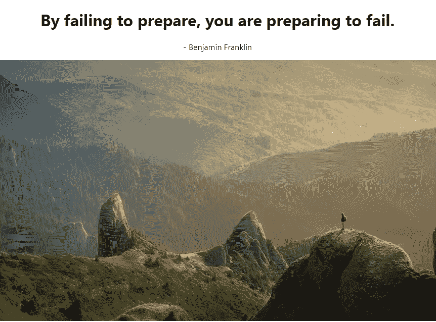

# 如何在 React 中使用 API

> 原文：<https://levelup.gitconnected.com/get-your-daily-dose-of-inspiration-with-reactjs-fa529940326d>

## 循序渐进教程

## 使用 React 获取数据的指南


来源:[约书亚·厄尔在 Unsplash](https://unsplash.com/photos/9idqIGrLuTE)

初学者在学习框架时可以做的最有趣的项目之一是构建一个随机报价生成器。在本教程中，我们将构建一个 web 应用程序，当我们运行该程序时，它会向我们发送当天的励志名言。在这个过程中，我们还将了解 ReactJS 中的`fetch`方法。

最终，这将是我们程序的结果:


今日引语。这将是我们的目标

# 入门指南

就像创建任何 React 应用一样，让我们运行`create-react-app`。

```
npx create-react-app quotes-app
```

我们不会安装任何其他模块。然而，我们将使用[今日 API](https://theysaidso.com/api/#qod) 来获取我们的金玉良言。

他们引用了包括`inspire`在内的几个类别的内容。顾名思义，这个`inspire`类别会给我们励志的说法。根据他们的服务条款，我们也要对网站进行归属。

对于归属，这将是 API 网站提供的模板:

```
<span style="font-weight: bold;">
      
      <a href="https://theysaidso.com" title="Powered by quotes from theysaidso.com" style="color: #ccc;">
        They Said So®
      </a>
</span>
```

现在让我们从我们的应用程序开始吧！

# 获取报价

## 定义 FetchQuote 函数

在你的项目的根目录下，创建一个名为`quotesFetcher`的新文件。

让我们从导入`react`开始，从`react`导入`useState`和`useEffect`函数:

在`**quotesFetcher.js**`

```
import React,{useState,useEffect} from "react"
```

我们将使用`useState`来分配几个钩子。这些钩子的值将显示在页面上。如果我们要使用基于类的组件，`useEffect`将是`onComponentMount`的等价物。

让我们定义`FetchQuote`函数，然后像这样导出它:

现在转到根目录中的`App.js`,将所有代码替换为:

*   `Line 3`:导入我们刚刚从`quotesFetcher`文件中导出的`FetchQuote`函数。
*   `Line 7`:将`FetchQuote`组件渲染到 DOM 中。

这将是代码的输出:


代码的输出

这和预期的一样有效。我们需要挂钩来显示网页的报价和作者。

## 声明挂钩

我们将在我们的`FetchQuote`函数中声明一些钩子。

*   `quote`:会包含实际的说法。
*   `author`:包含说话人的价值。
*   `loading`:包含一个布尔值(默认为`true`，当我们成功从服务器获取数据时，该值将变为`false`。这个钩子改成`false`后，我们就会显示相关数据。

在`FetchQuote`函数中，像这样声明你的钩子:

```
const [quote,setQuote] = useState(‘’);
const [loading,setLoading] = useState(true);
const [author,setAuthor]= useState(‘’);
```

## 获取数据

现在我们有了钩子，是时候获取数据了。

在`FetchQuote`函数中，找到`useEffect`函数:


在此函数中，编写以下代码:

```
fetch('http://quotes.rest/qod.json?category=inspire')
.then(res=> res.json())
.then(data=>{
console.log(data);
})
```

这基本上意味着每当应用程序第一次启动时，我们将对 Quotes API 执行`fetch`函数。
`fetch()`功能基本上是向网站发送一个请求，然后以`Promise`的形式将收到的数据返回给我们。我们将把这些数据转换成`json`，然后输出到控制台。

重新运行程序，查看控制台输出。这将是结果:


显示 JSON 数据的控制台输出

我们现在有了 JSON 数据。让我们将这些数据分配给我们的钩子。

*   `quote`钩子将被赋予`contents.quotes[0].quote`的值。这与实际报价相符。
*   `author`钩子将被赋予`contents.quotes[0].author`的值。这对应于位于 JSON 数组中的作者姓名。

现在是时候给钩子赋值了。

## 给挂钩赋值

在您的 useEffect()方法中，在您的`fetch()`调用中，编写以下代码:

```
setQuote(data.contents.quotes[0].quote);
setAuthor(data.contents.quotes[0].author);
```

这段代码意味着我们现在已经将`quote`和`author`钩子赋予了它们适当的值。

## 显示数据

这可能是这篇文章中最简单的一步。在`return`块中使用简单的 JSX 来显示钩子的值。为此，请修改以下代码:

```
return(
<>
<h1>{quote}</h1>
<p>- {author}</p>
</>
)
```

我们现在已经在`h1`标签中显示了`quote`钩子的值，在`p`标签中显示了`author`钩子的值。

这将是代码的输出:


本杰明·富兰克林今日励志名言！

那是一句相当激励人心的话！

这就是制作报价生成器的全部内容。但是有办法让这个应用程序变得更好。

# 如何让我们的应用变得更好

## 使用背景图像

让我们回溯到 JSON 数组的截图。


我们的 JSON 数组

注意，我们在`contents.quotes[0]`属性中也有一个`background`值。这个值是图像的来源，所以我们可以在页面上显示它和报价。

让我们这样声明它:

```
const [imgSrc,setImgSrc] = useState('');
```

在`fetch()`调用内，

```
setImgSrc(data.contents.quote[0].background)
```

在返回块中，呈现一个`img`元素:

```

```

这将是输出:



代码的输出

看起来太棒了！

或者，您可以使用由 [Unsplash](http://api.unsplash.com) 提供的图像。

## 按时间间隔提取报价

让我们假设你在一台 24/7 开机的显示器上运行这个网站。你显然不会每天刷新页面。相反。我们可以使用一个间隔来获取每 24 小时的数据。

为此，让我们将这个`fetch`调用放在一个方法中。

现在让我们在一个`setInterval`方法中调用这个函数，这样它可以每 24 小时运行一次。

```
useEffect(()=>{
getQuote();
const intervalID = setInterval(()=>{
getQuote()
}, 24 * 60 * 60 * 1000);
return ()=>{
clearInterval(intervalID);
}
},[])
```

最后，我们运行`clearInterval`方法来防止内存泄漏，以防用户终止应用程序。

# 概述

这是`quoteFetcher.js`

这是`App.js`

# 链接

*   [该项目的 Github 回购](https://github.com/HussainArif12/Inspirational-Quote-Generator)
*   [如何在 React 中使用 RESTful API](https://pusher.com/tutorials/consume-restful-api-react)

# 结论

这是一个非常简单的教程，但是如果你有一些困惑，我建议你学习一下钩子和 React 的其他核心特性。此外，我们也鼓励你玩代码，解构上面给出的程序。

非常感谢你坚持到最后，祝你有美好的一天！

下篇:[用 Node 搭建一个登录系统。Js](https://medium.com/better-programming/build-a-login-system-in-node-js-f1ba2abd19a?source=your_stories_page---------------------------)
上一篇:[在 Node.js 中搭建一个带有房间功能的聊天 App](https://medium.com/better-programming/build-a-chat-app-in-node-js-with-room-functionality-6ebbd4b19133?source=your_stories_page---------------------------)