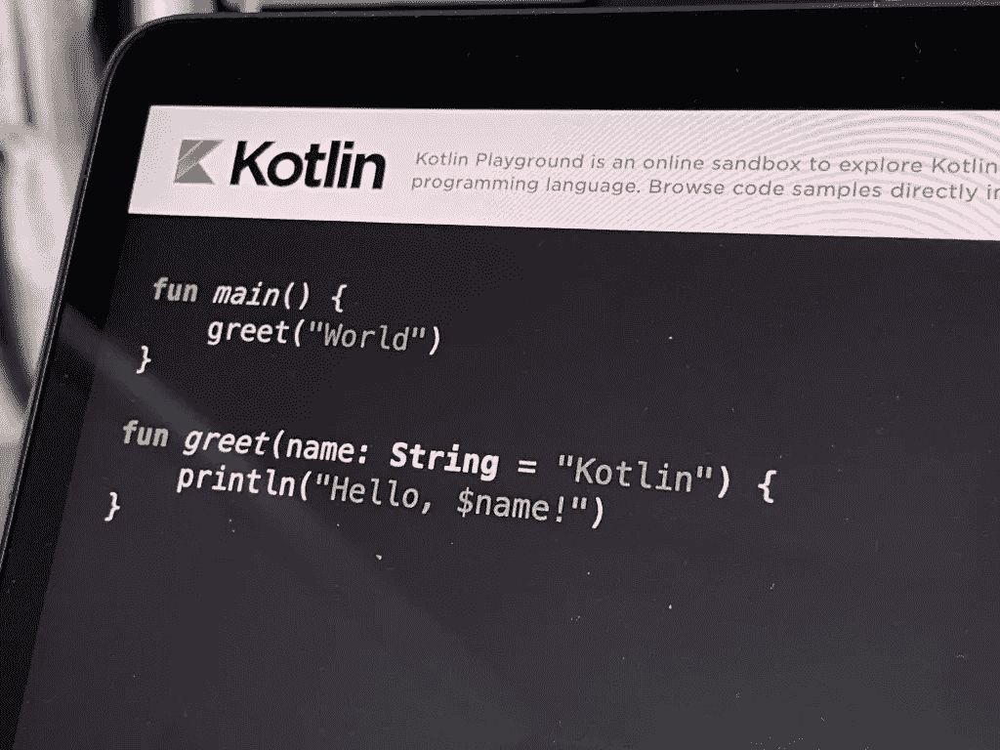

# 科特林的 Getters 和 Setters

> 原文：<https://levelup.gitconnected.com/getters-and-setters-in-kotlin-e6dbeab9751d>



如果你是科特林的新手，这个话题可能会有点混乱。我们来分解一下。

在面向对象的世界里，我们用类来构造代码，并创建对象，这样我们就可以有更多可重用的和更可读的代码。在类内部，我们有**字段**和**属性**。

很少，我们不应该在类外暴露我们的字段，相反，我们应该**用属性封装**,也许在属性内添加一些简单的提升逻辑。不建议在属性中包含大量逻辑。

科特林想出了如何通过在后台生成一些东西来让我们的生活变得更简单。

到目前为止一切顺利。现在让我们看看如何在 Kotlin 中定义字段和属性

```
class Human {
    var requireVaccineDose = 3
}
```

对，就是这样。Kotlin 将在后台生成属性(*read getter 和 setter*)。

这与以下内容相同:

```
class Human { var numOfVacineDose = 3
     get() = field set(value) { 
         field = value
     }}
```

在这个例子中，这些 getters 和 setters 是多余的，因为它们是在后台生成的。但是，有时我们需要一些定制的逻辑来编写干净简洁的代码。

```
class Human {var numOfVacineDose = 2 //this is default value  
   get() = field
   set(value) = if(numOfVacineDose > 2) {
         field = value
     }}
```

要为该属性设置一些值，您需要添加 **var** 关键字，因为它表示可变状态，如果您希望拥有只读访问权限，还需要添加 **val** 关键字。

在这里，我们可以添加一个不可变的属性，如果一个人受到完全保护，该属性将返回。

```
val isFullyProtected get() = this.numOfVacineDose > 3
```

如果我们想在 getter 中使用一些繁重而缓慢的操作，就像上面的例子一样，你应该创建一个方法来提供清晰性。

现在，如果我们想从外部创建只读访问，从类内部创建只写访问，该怎么办呢？Kotlin 通过 setter 添加一个可见性修饰符来提供对属性的访问模式。

```
var vaccineCertificateNum: Int = 31345
     private set
```

现在任何人都可以看到 **vaccineCertificateNum，**但是只有****人类类**可以改变这个属性的值。**

**在 Kotlin 中访问属性是通过“点语法”,如下所示。**

```
// creating some Human clone and set the number of vaccine doseval human = Human()
human.numOfVacineDose = 3 //accessing the setter methodprintln("Is human with certificate number {$human.certificateNum} fully protected from the virus: {human.isFullyProtected}) //accessing the getter logic and returning value after execution.
```

**因此，我们可以看到，Kotlin 已经找到了一个隐藏的好概念，并创建了一种更干净的编写代码的方式。日志记录、检查输入验证、数据转换以及所有这些业务逻辑都可以很容易地添加到 getters 和 setters 中。这样，您可以确保逻辑将被执行。**

**感谢阅读。编码快乐！**