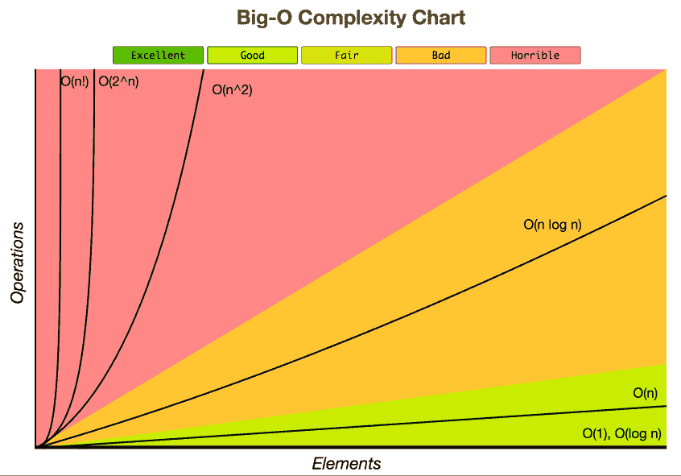

# 如何在亚马逊找到工作

> 原文：<https://levelup.gitconnected.com/getting-a-job-at-amazon-589ec1394b88>

## 以及为什么你不想要


来源:[商业资讯](https://www.businesswire.com/news/home/20190916005249/en/Amazon-Expands-Chicago-Tech-Hub-Announces-Plans)

作为一名年轻的开发人员，每个人都想在 FAANG(脸书、亚马逊、苹果、网飞和谷歌)之一工作。我也是，但是在面试并得到一份工作后，我意识到我想要的是知道我可以。我会告诉你如何通过面试，并给你一些帮助你成功的资源。最后，我会分享为什么我最后没有去亚马逊工作。

# 获得面试机会

进入 FAANG 公司的第一步是获得面试机会。据我所知，有 4 种方法可以参加第一次面试。

1.  在线申请(我是如何进入的)
2.  现场招聘活动
3.  认识亚马逊的人
4.  让亚马逊头猎你

在这些步骤中，成功的关键是成为亚马逊想要雇佣的那种人。亚马逊喜欢看到从事开发工作的人和渴望学习的人。你不需要有超级巨星 GitHub 或者疯狂的简历。你只需要对工作之外的编程表现出兴趣。不相信我？查看我的[简历](https://drive.google.com/open?id=1bZFsmeKdVP6wFxRevZAV0JsdFNliEAfr)和 [GitHub](https://github.com/dtaivpp) (简历是我提交的，当然 GitHub 还在更新中)。

做一些副业来展示你的兴趣和一份格式良好的简历。检查你简历的一个方法是使用类似于 TopResume.com 的东西。我用它们来检查我的简历，看看公司是如何通过他们的 ATS(申请人跟踪系统)来看待我的。

成为亚马逊想要雇用的人的另一部分是匹配工作描述。如果他们有 3 年以上的软件经验，你需要有他们列出的那种或任何同等的经验。如果你不这样做，他们会立即淘汰你。

我不能谈论太多其他的方法，因为我没有经验可以分享。然而我要说的是，众所周知，这些公司通过查看谁对相关开源软件或 Kaggle 上的排行榜做出了贡献来寻找人才。

# 通过代码面试

这里是我推荐花费最多时间的地方之一。如果你做对了，你真的可以让自己脱颖而出，甚至可以直接跳到招聘经理面前。编码面试或资格预审考试通常是两个问题，你有 90 分钟的时间来解决。然后你会有后续部分来描述你做了什么，你为什么这么做，以及它的时间复杂度。可以使用最常见的语言(C++、Java、C#、Python、C、Ruby 或 JS)。

为了做好最好的准备，我建议做以下事情:

## 1.了解数据结构和算法


来源:[疯狂的程序员](https://www.thecrazyprogrammer.com/2018/10/types-of-data-structures.html)

这篇[另一篇文章](https://medium.com/@codingfreak/top-algorithms-data-structures-concepts-every-computer-science-student-should-know-e0549c67b4ac)涵盖了你需要了解的数据结构和算法的大部分内容。你需要知道的常见数据结构是树、栈、队列、列表、图形和字典。对于它们中的每一个，你都应该知道如何搜索、排序、迭代、添加和删除。这里是学习[这些](http://www.codechef.com)的另一个很好的资源。

使用提到的数据结构和算法是代码考试的关键部分。这里有一些你可以练习的地方

*   [ProjectEuler 上的第一个 100。](http://projecteuler.net/)网
*   [谷歌代码竞赛示例](http://code.google.com/codejam/contests.html)
*   [高可扩展性架构](http://highscalability.com/blog/category/example)

这是一个你可能会在考试中遇到的问题类型的例子。一家公司需要能够优先考虑他们需要添加到手机中的功能。给出一个代表兴趣的单词列表[“电池”、“防水”、“相机”、“存储”]和一个评论列表，计算包含每个单词的评论数。你应该只计算一次每个评论的字数，评论可以包括大写和小写。返回最想要的两个特性以及在中提到的每个特性的评论数量。

## 2.认识大 O



来源:[杰西卡·容](https://www.jessicayung.com/big-o-notation-a-common-mistake-and-documentation/)

时间复杂度是代码挑战的一大部分。重要的是要有一个解决方案，并知道为什么你的解决方案是好的，或者你的解决方案可以在哪里工作。例如，在上面的问题中，有一种方法可以把它归结为 O(n)。

下面是一些解决方案的伪代码。

```
features = dict.fromKeys(feature_list, 0)for comment in comment_list:
    word_set = set()
    for word in comment.split(" "):
        word_set.add(word.lower())
    for feature in features
        if feature in word_set:
            features[feature] += 1sorted(features.items(), key=lambda x: x[1], reverse=True)
```

我将把这段代码描述为 O(n)解决方案。这是因为它在遍历列表时就地处理数据。对评论中的单词使用集合有助于我们确保每个单词只计数一次，并允许我们在 O(1)时间内搜索长评论，因为集合与字典具有相同的时间复杂度。

# 通过现场面试

亲临现场是一个完全不同的领域。代码无法判断你是一个善良的人还是一个有品质的人。你需要亲自带着你的 A-game。值得庆幸的是，有几个有用的指南可以帮助你解决这个问题。我将添加的另一个播放列表是技术假人系统设计播放列表。这本书非常详细地描述了可伸缩系统是如何构建的。

你将被要求亲自解决一些代码和架构问题。这通常可以在白板上完成，或者在某些情况下，您可以要求使用计算机。不管怎样，学习材料见上一节。

面试时，非常熟悉你的简历是很重要的。如果你把经验放在上面，面试官可能会问你这个问题。说到回答问题，你应该确保用明星法回答面试官的问题。这代表情境任务行动结果。下面有一个视频很好的解释了这一点。

在某个时候，他们会带来“酒吧老板”。老实说，这对于一个 WWE 摔跤手来说是个邪恶的名字。酒吧经营者之所以存在，是因为每一个新员工都应该比 50%的酒吧经营者的同事更优秀。他会问一堆具有挑战性的问题，旨在看看你是否会提高亚马逊的门槛。下面是一组你应该有某种答案的问题。回答的时候记得用星法！

# 为什么我不接受这个提议

即使我拒绝了那份工作，为 FAANG 公司工作仍然是我的一个梦想。对我来说，这个决定很简单。我需要做对我的家庭最有利的事。

这些工作所在地的生活成本是一个非常重要的考虑因素。对我来说，我有两个提议。亚马逊的那个比我接受的职位的报价高 30%。这听起来是一个简单的选择，然而，亚马逊工作附近的生活成本几乎是我目前生活成本的两倍。除此之外，在我们有了第一个孩子后，我不得不离开我的家庭。

我正在继续研究和制造东西，以便跟上技术的发展。有一天我可能会为一家公司工作，但与此同时，我将享受在所有亲戚附近发展我的家庭。