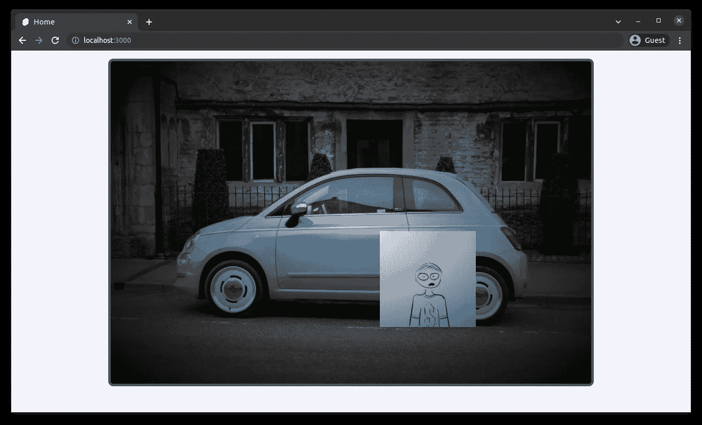

# 利用 CSS 背景属性发挥创造力

> 原文：<https://levelup.gitconnected.com/getting-creative-with-the-css-background-property-2455aedcb408>


在 CSS 中使用背景是很常见的，通常是在给网页添加颜色或图像的时候。但是背景不仅仅如此。

# `background`属性

`background`本质上是以下属性的**组合**:

*   `background-image`
*   `background-size`
*   `background-position`
*   `background-color`

以及更多，但我将在本文中重点讨论以上内容。

这使得背景更加**动态**和**可定制**。

# 多个图像

见见鲍勃。


鲍勃。我画的

鲍勃是一个喜欢呆在室内的人，他整天呆在房间里编码。结果他从来没有经历过什么叫做“摸草”。所以，今天，我们要帮助他做到这一点。

在这张`<div>`中，我们有一张背景图片。

它被定位在`center`中，并且具有尺寸`cover`，因此它将填满整个`<div>`。`no-repeat`用于背景不重复。使用正斜杠(`/`)分割位置和大小

```
*background*: center / cover no-repeat url("/img/bg.jpg");
```


照片由[阿卜杜勒·拉法伊·谢赫](https://unsplash.com/@arafays?utm_source=unsplash&utm_medium=referral&utm_content=creditCopyText)在 [Unsplash](https://unsplash.com/s/photos/rocks-grass?utm_source=unsplash&utm_medium=referral&utm_content=creditCopyText) 上拍摄

让我们把鲍勃添加到同一行的背景中。

`background`中的多个图像/元素可以用**逗号**隔开。这里，我们可以让 Bob 的宽度/高度为`<div>`的 30%。

```
*background*: center / cover no-repeat url("/img/bg.jpg"),
   center / 30% no-repeat url("/img/bob.png");
```


阿卜杜勒·拉菲·谢赫在 [Unsplash](https://unsplash.com/s/photos/rocks-grass?utm_source=unsplash&utm_medium=referral&utm_content=creditCopyText) 上拍摄的照片

啊？为什么看不到鲍勃？

`background`属性中的元素按照 CSS 代码中指定的**顺序**显示。在上面的代码中，Bob 是在背景后面加上**的，所以实际上，Bob 是在**背景后面的**。**

让我们把鲍勃带到前面来。

```
*background*: center / 30% no-repeat url("/img/bob.png"),
   center / cover no-repeat url("/img/bg.jpg");
```


由[阿卜杜勒·拉法伊·谢赫](https://unsplash.com/@arafays?utm_source=unsplash&utm_medium=referral&utm_content=creditCopyText)在 [Unsplash](https://unsplash.com/s/photos/rocks-grass?utm_source=unsplash&utm_medium=referral&utm_content=creditCopyText) 上拍摄的照片

就这样，鲍勃出现了。但是，他仍然不碰草。让我们给他重新定位。

重新定位和调整大小相当简单。我将把他放在 x 轴 30%的位置，y 轴 20%的位置，并将他的大小调整为宽度/高度的 15%。

```
*background*: 30% 20% / 15% no-repeat url("/img/bob.png"),
   center / cover no-repeat url("/img/bg.jpg");
```


阿卜杜勒·拉菲·谢赫在 [Unsplash](https://unsplash.com/s/photos/rocks-grass?utm_source=unsplash&utm_medium=referral&utm_content=creditCopyText) 上的照片

最后，鲍勃在我们希望他在的地方，他终于可以摸到草了。

这就是如何在`background`属性中调整不同图像的大小和位置。

啊哦，看来我们已经打扰了恐龙，让我们尽快离开这里吧…


照片由[阿卜杜勒·拉菲·谢赫](https://unsplash.com/@arafays?utm_source=unsplash&utm_medium=referral&utm_content=creditCopyText)在 [Unsplash](https://unsplash.com/s/photos/rocks-grass?utm_source=unsplash&utm_medium=referral&utm_content=creditCopyText) 上拍摄

# 线性梯度和径向梯度

迪诺可能很快，但我们设法逃到了车里。

鲍勃为他的车感到自豪，他想拍一张照片。这是鲍勃站在他的车前:


奥利·伍德曼在 [Unsplash](https://unsplash.com/s/photos/car?utm_source=unsplash&utm_medium=referral&utm_content=creditCopyText) 上拍摄的照片

让我们在图像周围制作一个晕影效果。

在这里，我们可以使用`**radial-gradient**`作为叠加。记住，**顺序**很重要。

```
*background*: radial-gradient(rgba(0, 0, 0, 0.05), rgba(0, 0, 0, 1)),
   70% 75% / 20% no-repeat url("/img/bob.png"),
   center / cover no-repeat url("/img/bg2.jpg");
```



奥利·伍德曼在 [Unsplash](https://unsplash.com/s/photos/car?utm_source=unsplash&utm_medium=referral&utm_content=creditCopyText) 上的照片

我们也可以使用`linear-gradient`作为一个覆盖，而不是一个不同的效果。

```
*background*: linear-gradient(rgba(0, 0, 0, 1), rgba(0, 0, 0, 0.05), rgba(0, 0, 0, 1)),
   70% 75% / 20% no-repeat url("/img/bob.png"),
   center / cover no-repeat url("/img/bg2.jpg");
```


[奥利·伍德曼](https://unsplash.com/@braintax?utm_source=unsplash&utm_medium=referral&utm_content=creditCopyText)在 [Unsplash](https://unsplash.com/s/photos/car?utm_source=unsplash&utm_medium=referral&utm_content=creditCopyText) 上的照片

这就是我如何在我开发的产品网站上应用该技术的。


[WeTix 网站](https://wetix.my) WeTix Sdn Bhd。2022

# 结论

使用`background`属性，我可以将背景用作画布，这非常灵活。我觉得通过大量的实验也有很大的潜力去创造酷炫的效果。希望这些演示对你有帮助。感谢您的阅读！

## 来源:

*   [MDN 网络文档-背景](https://developer.mozilla.org/en-US/docs/Web/CSS/background)