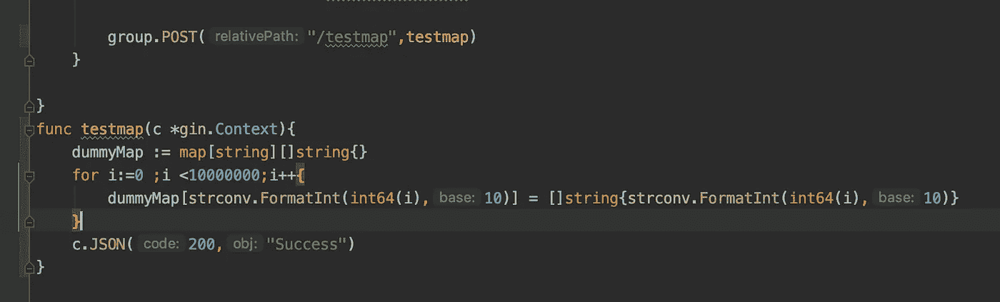

# 被 Golang 的垃圾收集者抛弃

> 原文：<https://levelup.gitconnected.com/getting-dumped-by-golangs-garbage-collector-639fe38408e7>

众所周知，Go 是一种垃圾收集语言，我们的应用程序运行时创建的任何堆栈|堆内存都将被 Go 自动垃圾收集。

我也和其他人一样有着相似的假设，直到我遇到了由垃圾收集员造成的第一个障碍。

从问题陈述开始，我们有一个每天运行两次的计划生成任务。就内存和 CPU 而言，这是一项非常资源密集型的任务，它对从多个来源收集的数据进行一些复杂的聚合，并将其转储到数据库中。

我们用来保存所有聚合数据的内部数据结构是一个复杂的地图数据结构，其中键是一个字符串，值是一个字符串片段。

**预期地图大小- > 6 个键，每个键的值为 15-30 个字符串的片数。**

当我们使用 pprof 对内存和 CPU 进行基准测试时，一切似乎都很好，没有一个内存泄漏或比预期更高的 CPU 利用率。我们对性能分析的结果非常有信心，因此我们将该特性投入使用，它在我们的后台机器上运行任务，这是一台高端虚拟机。

当任务执行时，一切似乎都很好，我们从未回顾过资源消耗，直到对基础设施成本进行了审查。这是我们发现一些异常行为的时候。

我们有一个 40GB RAM 的后台机器，每当执行计划的任务时，它都会消耗大约 24GB 的 RAM，因为我们将数据存储在 map 中，这没什么问题，但是一旦生成结束，map 消耗的内存就不会释放回操作系统，我们的后台机器不是以 40GB 的空闲空间运行，而是 60%被填满，并以 16GB 运行，直到容器再次重新启动。

我开始调试这种异常行为，研究为什么即使在执行了垃圾收集器之后，内存也没有被释放。

第一个问题是->作为 go 例程或并发的一部分，是否有任何内存泄漏？(我调试了好几天，没发现任何漏洞)

调试开始了，秒变分，分变小时，小时变天，却不知道为什么会这样。

经过数百次的试验和错误，以及数十次的测试发布，我终于明白了，当堆对象被创建时，即使手动运行**运行时，GO 运行时也无法释放为它分配的内存。GC()。**作为证实我的怀疑的一部分，我用 2.5 GB RAM 运行了一个 docker 容器，并编写了一个测试 API，它所做的只是创建一个 1000 万条记录的映射，然后返回一条成功消息。

结果令人震惊。

如果您看一下上面的截图，在运行 API 之前，容器的内存是 2.4GB，在填充 map 的过程中，内存逐渐减少。但是，根据我的假设，即使 API 创建了 1000 万条记录并将成功响应返回给客户端，GO runtime 占用的内存也必须释放回 OS，这是不可能的。此时，我开始意识到代码中没有内存泄漏。这都是因为分配的堆内存没有被释放。

此时，我的脑袋一片空白，因为修复的范围超出了我的控制，我没有失去希望，开始尝试各种可能性。

*   步骤 1:我试着在延迟时将贴图设置为零。不出所料，结果不太好。
*   第 2 步:我尝试了 defer 上的 **delete 函数**，在返回之前我删除了每一个键。但令人惊讶的是，这并没有成功，容器仍然拥有 60%的内存
*   步骤 3:我尝试执行运行时。令我惊讶的是，这也不起作用。
*   就在我失去希望的时候，**调试的这个神奇的功能出现了。FreeOSMemory()** 与垃圾收集器的功能相同。让世界停下来，做标记，然后横扫一切，但这并不局限于更小的数据点。这个函数的作用是试图扫描所有没有被使用或空闲的内存，并将内存返回给操作系统。
*   FreeOSMemory 是这样工作的。在任务被执行并且垃圾收集器被触发后，它会清除保存我的 GO 运行时的内存，并通知操作系统这些堆对象是空闲的，可以被操作系统回收。现在取决于操作系统是否回收内存。

**使用 FreeOSMemory 释放内存后的结果**

从所有这些分析中，我学到的是不要盲目地相信垃圾收集器会处理所有的事情。在大规模工作时，一定要跟踪系统资源是如何被利用的。

哦，对了，我忘了通知一件更重要的事。FreeOSMemory 只能在 Go 版本 1.12 以下运行。根据 Go 1.12 的官方发行说明，堆消耗的内存将被重用，直到满足某些条件才会返回给操作系统。

为了退回到以前的版本，使用 **GODEBUG=madvdontneed=1** 启用您的容器，这将最终从运行时释放内存并将其返回给操作系统。