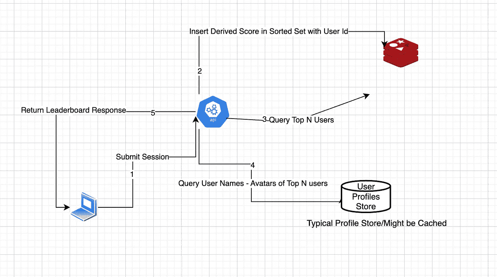
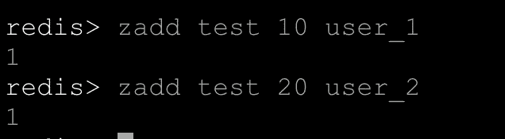
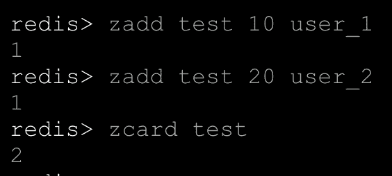
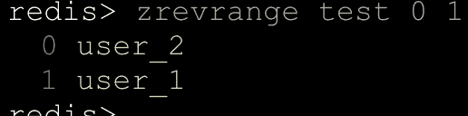
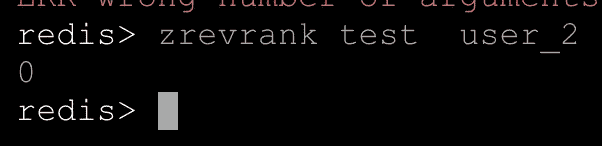

# 使用 Redis 快速获取实时排行榜

> 原文：<https://levelup.gitconnected.com/getting-fast-realtime-leaderboards-with-redis-792e1393c43c>


**排行榜无处不在**，观众喜欢看到自己的排名靠前。但是你知道他们更喜欢什么吗，**实时排行榜！**

是的，**排行榜是一个很难解决的问题，尤其是让它们实时化。**所以在这篇文章中，让我们看看如何使用我们的 Redis 来实现超快的实时排行榜。

# **为什么选择 Redis 实时排行榜？**

排行榜从根本上来说是一个排序问题，而 [Redis](http://redis.io) 提供了经过实战检验的**排序集**数据结构，可用于构建实时排行榜。

# **排序集确定，还有什么？**

[Redis 的](http://redis.io)建立在单线程架构上，这允许 score upsert 请求被顺序处理。这意味着排行榜将保持一致。

性能提升:对于大多数操作，排序后的集合得到 O(log(n))，其中 n 是集合中的成员数。

Redis 的持久性选项允许您保留数据备份，因此在任何停机的情况下，您都不会丢失所有数据。

# **解决方案概述:**

虽然实时排序集可能会解决您的分数排序问题，但您可能会发现自己面临一些常见的问题，如:

1.  如果我希望我的排行榜中有用户名和头像，该怎么办？
2.  如果我的排名逻辑基于多个因素，比如 SQL 多列 order by，该怎么办？

因为你只能在一个排序的集合行中保存分数和成员标识符，所以你可以从其他地方解析用户名、头像等数据。理想情况下，如果您使用用户 id 作为成员字符串，这应该很容易，这将允许您从系统中解析任何与用户相关的内容。

对于像排序这样的多列 SQL，您需要从您的分数中加减权重来实现这种行为。

*示例:级别(最高优先级)、分数(第二高)*

*分数- >等级* 10e5 +分数(假设分数限制为 3 位数，等级为 100)*

更多关于这个的细节[在这里](https://www.dr-josiah.com/2013/10/multi-column-sql-like-sorting-in-redis.html)。

**所以一般的流程可能是这样的:**

1.  对于每次提交，获得分数并将其作为成员字符串添加到针对用户 id 的排序集中。
2.  对于每个排行榜获取请求，从排行榜获取前 N 名成员 id，并根据前 N 名用户 id 从您的用户档案数据存储中解析其余详细信息。
3.  确保在您的 [Redis](http://redis.io) 部署中设置好[持久性策略](https://redis.io/docs/management/persistence/)。



排行榜数据流

**重要命令:**

1: [ZADD](https://redis.io/commands/zadd/) :将所有具有指定分数的指定成员添加到排序后的集合中



2: [ZCARD](https://redis.io/commands/zcard/) :返回存储在`key`的排序集的排序集基数(元素数)。



3: [ZREVRANGE](https://redis.io/commands/zrevrange/) :返回存储在`key`的排序集合中指定范围的元素。这些元素被认为是从最高分到最低分排序的。降序字典顺序用于得分相等的元素。



4: [ZREVRANK](http://Returns the rank of member in the sorted set stored at key, with the scores ordered from high to low. The rank (or index) is 0-based, which means that the member with the highest score has rank 0.) :返回`member`在`key`存储的排序集合中的排名，得分从高到低排序。排名(或指数)以 0 为基础，这意味着得分最高的成员拥有排名`0`。



注意:Redis 使用从 0 开始的索引，因此这意味着 user_2 位于第 1 级。

**节点 JS 编码:**

```
//Package used : "ioredis": "^5.2.4"
export const upsertScore = async ({score, username, timetaken}, {redis} ) => {
    //Giving Highest Priority to Score, inflating it's value to have less impact of time taken.
    //Here we are prioritising score desc and tike taken asc.
    const modifiedScore = score * 100 - Math.floor(timetaken/10);
    return  redis.zadd(KEY, modifiedScore, username);
}

export const getRankUser = async ({ key, username }, { redis }) => {
    const rank = await redis.zrevrank(key, username);
    if(rank >= 0) return rank + 1;
};

export const getRanks = async ({ key, startIndex, endIndex }, { redis }) => {
    return redis.zrevrange([key, startIndex, endIndex, "WITHSCORES"]);
};

export const totalCount = async ({ key }, { redis }) => {
    return redis.zcard(key);
};

export const getLeaderBoard = async ({ page, perPage, username }, { redis }) => {
    const startIndex = perPage * (page - 1);
    const endIndex = (perPage * page) - 1;
    const [ranks, count, userRank] = await Promise.all([
        getRanks({ key: KEY, startIndex, endIndex }, { redis }),
        totalCount({ key: KEY }, { redis }),
        getRankUser({ key: KEY, username }, { redis })
    ]);
    return {
        ranks: ranks,
        count: count,
        userRank: userRank
    }
}
```

演示应用的视频。

# 资源:

1.  [演示 app 源代码](https://github.com/gaurav1999/redis_leaderboard_demo_app)
2.  [Redis 文档](https://redis.io/docs/data-types/sorted-sets/)