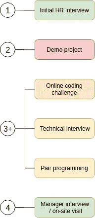

# 编码面试被打破——如何更有效地处理这个过程

> 原文：<https://levelup.gitconnected.com/getting-hired-as-a-coder-d72461ea16e0>


蒂姆·高在 [Unsplash](https://unsplash.com/search/photos/interview-technical?utm_source=unsplash&utm_medium=referral&utm_content=creditCopyText) 上拍摄的照片

我最近一直在与朋友和同事讨论科技行业的招聘问题，最近我还读了[埃里克·斯廷斯](https://medium.com/u/90aa09d45e84?source=post_page-----d72461ea16e0--------------------------------)的文章[关于被聘用为高级程序员的简短想法](https://medium.com/swlh/brief-thoughts-on-getting-hired-as-a-senior-coder-94f38998bb08) ，他在文章中指出了我和我的同事们在这个问题上的许多挫败感。我会尽量让这篇文章“独立”存在，我会通篇引用 Eric 的文章。

# 成为一个高效的候选人

> 这四个线对线的采访过程每一个都需要 40 到 60 个小时

在他的文章中，Eric 提到他经历了四个端到端的申请过程，包括各种可能的面试技巧，但只收到了一份工作邀请。我也被介绍了 4-有时 5 步的过程，我的一个朋友最近开始了一个过程，从家庭作业式的应用程序开发项目开始。

这里有一个面试问题给你:*给定一个完美正方形的数组，Ben 想找出所有的偶数根。他的代码有什么问题？*

```
function evenSquareRoots(numbers) {
  return numbers
    .map(num => Math.sqrt(num))
    .filter(num => num % 2 === 0);
}
```

你不需要成为 JavaScript 专家也能看出这种算法效率低下。它最初的选择性不够，最终使用资源来处理死胡同线索(奇数)。

以下是相同的代码，但顺序不同:

```
function evenSquareRootsFast(numbers) {
  return numbers
    .filter(num => num % 2 === 0)
    .map(num => Math.sqrt(num));
}
```

现在的功能大约快了 35%，不客气*本*。

就像你不会使用第一个功能一样，你也不应该同意这样的招聘流程:



低效的招聘过程

在这里，我根据投入的时间和精力对科技招聘过程中的典型步骤进行了颜色编码，红色是最昂贵的，绿色是最便宜的。你可以想象，如果你经历了一个演示项目和多达三个不同的技术评估，只是为了见你未来的经理，并意识到他是一个混蛋，你将白白浪费无数(或 *40 到 60，*根据埃里克)小时的开发、研究和压力。

科技世界充斥着时髦的词语和时髦的概念，其中之一就是*快速失效*。作为一名开发人员，尤其是一名高级开发人员，您应该在工作中遵循这一原则。我认为作为一名候选人，你也应该遵循这个原则。

当然，每家公司都有自己的招聘流程和习惯，你不能只是走进去，决定不做一半的步骤，就指望被录用。但是你*可以*礼貌地问到:

1.  重新安排步骤，这样你就可以先做成本较低的步骤。
2.  接受那些你将会与之共事的人的面试，这样你就能感受到氛围和你将会与之共事的人。

这里有另一个效率的例子:我的朋友被要求用自己的时间创建一个基于浏览器的石头剪子布游戏。也许明天另一家公司会要求他构建一个 CRUD API，下一家公司会要求一个 pimped-out docker 图像，等等。这些家庭项目中的每一个都是很大的时间*成本*，但是它不是*投资*，因为它不会从一个公司转移到另一个公司。虽然家庭项目对许多人来说是一种更有吸引力、压力更小的体验，但你可以利用这 10 个小时来修改你所在领域的基本概念，而且你会在随后的每个技术面试中看到这种投资的回报，而不仅仅是对一家公司。

一些候选人可能害怕表现得难以相处和吹毛求疵(我敢肯定一些招聘人员确实会这么想)，但它真正表明的是你知道如何区分轻重缓急并聪明地工作。如果你的要求受到挑战，解释你的想法，看看会发生什么。要么他们会断然拒绝(危险信号)，要么他们会看到雇佣一个三思而后行的人的价值。能够礼貌合理地挑战需求是一项非常有用的技能！

一些公司(尤其是大公司)有一套一成不变的流程，不会为像你这样的候选人让步，但是不要害怕展开谈判。即使你没有得到你想要的，你也让自己成为了一个知道他们有价值的人，至少你可以让自己为金钱谈判热身；)说到这……

# 信息不对称

> 不公布工资信息太烂了。埃里克·斯坦斯

在这一点上，我完全同意 Eric 的观点，我想用一个比较来支持他的观点:

一家公司会希望你提供一份简历:一份清楚地陈述你的技能、经验水平和以前职位的文件，白纸黑字，让他们评估。

作为候选人，我们经常期待并接受一份半吊子的招聘启事，这份启事通常由非技术型人力资源人员撰写，列出了世界上所有的框架和技术，除了一份“有吸引力的薪资包”，几乎没有给出任何薪酬信息。

这种信息不对称被公司利用，为你的工作支付尽可能少的报酬。这是一个聪明而有效的策略，但它只在我们允许的情况下才有效。有许多网站，如 Glassdoor，试图对此进行反击，但我们应该*所有人*都在推动一个更公平的系统。

也就是说，不要被缺乏信息打败。公司知道你在招聘过程中投入的时间越多，你最终因为条件不太适合你而放弃的可能性就越小。所以一开始就要求至少有一个工资范围。我抓住每一个机会都这样做了，只有一次事与愿违，其他时候我得到了我需要的信息，而且非常礼貌。

有一次，谷歌的一名招聘人员拿着一份工作清单找到我，在我询问了薪水范围后，他说在巴黎工作，我的年薪大约是€4.5 万英镑。谢谢，但是不用了。通过问这个问题，我为我们节省了很多时间的评估，因为我在 10 分钟内就知道它对我不起作用。

# 谈判

当我读到这里时，我不同意埃里克的观点:

> 不要讨价还价，因为对不喜欢讨价还价的人来说这很糟糕。
> ——埃里克·斯坦斯

这部分是因为我个人认为谈判是谈判过程中最令人兴奋的部分，但即使我把它放在一边，事实是讨价还价是一种生活技能。学会有效地谈判将在你生活的许多方面帮助你，合理而自信地谈判会赢得他人的尊重。玩欲擒故纵的游戏在约会中有效，在商业中也是如此！

我最近与之讨论这个问题的一位同事提出了一个观点，我发现自己也同意:要求得到与你价值相称的报酬不是一个尴尬的社交失误，而是一种责任。对你自己和你的同事，因为通过贬低你自己，你也通过关联贬低了你领域内的其他人。

有上百万本关于谈判的书籍和文章可供你阅读，但我只想说:做好准备。你应该知道自己的价值，但你仍然需要向他人解释。确保你的要求有正当的理由(钱，灵活性，桌子上的华夫饼干机，等等)。)尽管这可能很难，但以一种针对你的对话者的方式推销自己。你可能已经成功地将一个单一的应用程序分解成了许多微服务，这很棒，但这对人力资源招聘人员或非技术经理来说毫无意义，除非你关注它为你的团队节省了多少工时。

这里有一个我们很多人都熟悉的实际例子:作为候选人，我们经常反复无常地对待公司要求的经验水平。例如，对于一个有 3 年经验的开发人员来说，申请要求 5 或 6 年经验的职位是很常见的。如果你在面试中表现出色，得到了这份工作，你认为这份工作会因为你 3 年的经验而变得更容易吗？不，你得到了一份高级别的工作，你会得到这样的待遇…但是作为一个初级的人，你会得到报酬，除非你去谈判。

# 获得反馈

> 我*从未*提供过反馈。一次都没有！
> ——埃里克·斯坦斯

在他的文章中，Eric 正确地指出，向被拒绝的候选人提供反馈并不是招聘文化的一部分。出人意料地得到反馈是前所未闻的，但即使在明确提出要求后，得到回应的情况也很少见。这是有道理的，没有人愿意花时间把他们的批评变成礼貌的、建设性的反馈，给一个他们可能再也见不到的陌生人。老实说，上一次*你*在*你*缩短申请后给面试官反馈是什么时候？

然而，我已经得到了我所做的每一次技术面试的反馈，那些我通过的和那些我灾难性失败的。怎么会？如果你一直在密切关注这篇文章，你现在可能已经猜到了:在面试中要求它… **。**

好处是你几乎肯定会得到反馈(我是说他们会怎么做？拒绝？不行，太别扭了)。不利的一面是，它可能会比几天后给出的反馈更严厉，因为面试官没有时间润色他们的评论。如果你搞砸了(每个人都会这样)，他们甚至可能会感到沮丧，你可能会在他们的评论中感觉到这一点。但是当你申请失败时，你会受到伤害，而当你受到伤害时，有一颗难以下咽的止痛药总比没有好；)

关于反馈的问题:非常感谢您的反馈！你最好/最糟糕的面试经历是什么？招聘人员:当前的科技招聘文化对你有什么影响？

我是这方面的新手，所以几乎没有人会读这篇文章。这对我来说很糟糕，但这意味着我可以与评论者进行更多的互动，所以请随时给我你的意见。