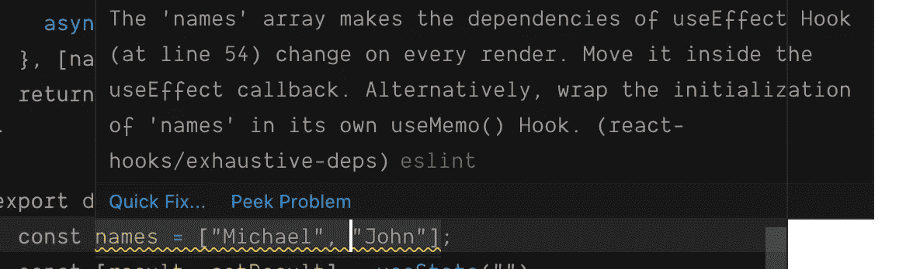

# 被钩子钩住了？

> 原文：<https://levelup.gitconnected.com/getting-hung-up-on-hooks-de747bda4fc8>

## 如何避免常见的陷阱

道格拉斯·巴格在 [Unsplash](https://unsplash.com?utm_source=medium&utm_medium=referral) 上的照片

我两年前才第一次有所反应。怀着巨大的悲伤，我放弃了 EmberJs。另一份[JS](https://2019.stateofjs.com)状态报告出炉，很明显它没有获得任何起飞所需的牵引力。我花了几年时间等待急需的打字稿支持功能和 Glimmer 的新奇功能，但它还没有出现。但是我得到了教训，至少我认为，大部分前端世界还没有为复杂的 web 框架做好准备，它需要简单易懂。

一个好朋友说得好，Ember 很容易，但是不简单。简单是指你可以用很少的努力做一些事情，比如用很少的几行代码。简单不是关于代码行，而是关于学习曲线。当你*知道*余烬的时候，你可以变得如此高效，它让你不再做很多傻事。但是对于许多传统的 JS 开发人员来说，学习曲线太长了，他们需要学习十几个新概念。

另一方面，React 很简单，你不需要知道太多就可以开始，你不需要选择路由解决方案，你可以在以后选择和添加数据层，所以基本的 Todo 应用程序不会对此做任何假设，但是，当你把它与 jQuery 相比时，它更好地拥有了响应和绑定状态。

然而，我很失望地得知，除非你的 React 组件是纯的，否则状态是不受约束的。如果您的组件有副作用，而这是您在许多实际情况下最有可能需要的，那么您就会陷入这样的困境:

您必须手动检查适当更改，并将它们应用到您的状态！如果你认为这仍然可行，看看这个来自 [BlueprintJS](https://blueprintjs.com/) 的[代码片段](https://github.com/palantir/blueprint/blob/526722781159da8f2992d26fc2026b062de4cd92/packages/core/src/components/overflow-list/overflowList.tsx#L156)，它是我最喜欢的 React 组件库之一。这是你在 React 类组件中经常看到的一系列逻辑检查。您需要在组件中使用新的道具和行为来更新所有这些。这很容易搞砸，如果你的框架为你跟踪事情，你就不应该写这些代码。在 Ember 和 Vue 拥有相当于`computed`属性的世界中，当输入改变时，它可以重新计算状态，这似乎是落后的，当你不必像上面那样做所有的手动属性检查时，它节省了很多麻烦和错误。

但是 React 开发人员似乎也感觉到了这种挫败感，因为新的钩子机制是对模式的一个很好的改变，它摆脱了这种限制和其他许多限制。当我第一次通读文档和例子时，我被说服了。这是我现在编写所有组件的方式，差不多两年后，情况依然如此。

# 钩子的美丽

有了钩子，你现在就有了一个计算属性的等价物，如果我想计算一个属性，当我改变其他值的时候，我只需要

这段代码将监视名字和姓氏的变化，并仅在需要时重新计算全名。

更好的是，您不再需要大型函数来更新真实世界 React 组件的复杂状态。现在，您可以将状态分解成小块，以便在组件间重用。我有一个连接查询参数和本地存储持久性的 go-to react 钩子库，除了

然后嘣！我的变量存储在浏览器查询参数中，当它改变时更新。通过一个简单的`useQueryParamPersistance('darkMode')`，它也在页面刷新和导航之间被记住。

在这种情况下，钩子看起来是如此优雅，以至于你可以再次享受代码的简洁之美。离开烬后我渴望的东西。

# 钩子带来的无尽痛苦

现在每天投入生产使用钩子。人们很容易被它的简单性所迷惑，以至于你可能会中一个非常狡猾的诡计。

假设我们有一个很好的端点来从服务器获取 hello world。我会用这个来嘲笑

请注意，与普通的 hello world 不同，我们的世界可以向多人问好。

这是一个基本的应用程序，它只取一个名字并调用我们的异步函数。这种异步获取数据+呈现数据的模式非常常见，它被内置到 ember 框架中。这是一个简单的例子，我们不做承诺清理，我们可以也应该使用任何第三方库来更好地做这件事，但基本概念和问题仍然存在。

向一个人问好

这个例子工作得很好。它说在加载的同时“获取”数据，然后呈现结果，这太棒了！

但是当我们向多人打招呼时会发生什么呢？我们把`name`的传球改成`...names`，把`"Michael"`换成`["Michael", "Jane"]`。

在 [Unsplash](https://unsplash.com?utm_source=medium&utm_medium=referral) 上[拍照](https://unsplash.com/@photoholgic?utm_source=medium&utm_medium=referral)拍照

可怕的无限循环！你的浏览器甚至可能因为这个而崩溃。

让我们一步步深入了解这里发生了什么。

1.  **使用状态**初始化为默认值，页面呈现“正在加载”。所有的依赖关系都是新的，所以 **useEffect** 被启动。
2.  **asyncFetch** ()被启动，并将新的结果和加载状态设置为假。
3.  在下一次渲染时，**结果**现在是“Michael，Jane”并且**加载**为假。 **useEffect** 检查依赖关系的变化， **setResult** 和 **setLoading** 没有变化，但是 **names** 被重置为新数组。在 JavaScript 中，`["Michael", "Jane"] != ["Michael", "Jane"]`因为数组和对象是通过引用比较的，而不是通过值。因此 **useEffect** 会再次被踢开。渲染结果是“迈克尔，简”。
4.  启动 **useEffect** 将 loading 设置回“真”，使页面再次显示“正在加载”。
5.  回到步骤 2 并重复！

在我的基本示例中，避免这个问题似乎很容易，但只要等到您进入一个生产应用程序，其中 useEffect 可以隐藏在任何自定义钩子后面，并且您永远不知道何时传入一个列表或对象可能会导致无限的重新呈现。

有趣的是，当把这个例子放在一起时，编辑警告了我这个问题。如果名称是作为一个道具传入的或者是由一个函数提供的，那么这个警告就不够聪明。

我经常遇到这个问题，无论我多么小心，它仍然会抓住我。我不能很快修复它，因为每当它发生时，我的浏览器就会慢下来，嘎然而止。我害怕它，因为我可能不得不挖得离我所在的地方很远，才能找到在我的应用程序或我正在使用的第三方库的某个地方导致它的一对括号。它不仅抓住了我，也抓住了我的许多同事。起初，我认为我做错了什么，但似乎每次我开始使用新的 React 应用程序时，这种情况都会再次发生。

如果只是我，我会克服的。我可以解决这些问题，并随着时间的推移在防止这种情况方面做得越来越好，但我主要担心的是，像这样的打嗝会成为使 React 开发不再简单的 T2 的障碍。您的变量具有非常具体的范围，如果在错误的地方声明，可能会引发意想不到的后果，这一事实使事情变得复杂。

我担心我的组织和其他人会继续使用类组件或者更糟，转换框架，选择退出 React 和新的 *easy* 语法，因为其中隐藏的复杂性。如果 EmberJs 教会了我什么，那就是这种隐藏的复杂性不是开发社区可以忍受的…它会让人们放弃。我希望如果有足够深入的关于这些问题的文章，它们可以成为共享知识的一部分，就像每个人如何注意 node 中的竞争条件和未捕获的承诺异常一样。

# 课程

比起类组件，我还是更喜欢钩子。我仍然喜欢优雅，但已经痛苦地学会了超级仔细地仔细检查我的组件。React 文档和大多数教程根本没有说清楚这一点，但确实需要。

> 避免在 React 组件的顶层逻辑中创建新的对象或数组

你可以在全局范围内的组件之外创建它们，或者在 useEffect 或 useMemo 中创建它们(useMemo 目前有效，但将来可能[对此不起作用](https://reactjs.org/docs/hooks-reference.html#usememo)),但是要小心，即使只是一个`useCustomHook({ name })`也是自找麻烦。你甚至可能认为你的 JSX 模板是一个放置新对象的安全地方，但是当有人不知不觉地添加了一个基于你传递的道具的 useEffect 时，你可能会陷入无限循环。

我看到的一些典型的潜在问题模式

这里有一个额外的提示，我倾向于使用，但不经常看到。JSON.stringify 你的依赖。这当然会降低性能，而且对新手来说可能看起来很奇怪，所以不要到处都这样做，但是在人们经常忘记记忆输入(比如查询对象和选项)的地方，这可能是一个简单的快速修复方法。如果您的输入可能是日期、映射、集合、函数或其他对象，用类似于 [serialize-javascript](https://www.npmjs.com/package/serialize-javascript) 的东西替换内置的 JSON.stringify 可能会更好，但是要注意，函数和对象不会随它们的状态一起序列化，因此如果您不注意，可能会遇到一些奇怪的行为。此外，将 stringify 封装在如下函数中可以使你想做的事情更加清晰。在简单的情况下，你的棉绒可能会对此感到不安。如果你想严格一点，你可以将字符串化的结果赋给一个变量，并在 useEffect 中解析它，但是我认为满足 linter 不值得做额外的解析工作。我认为，在像这样的地方，只要你小心并且知道你有一个完整的依赖列表，取消一些 linter 检查是可以的。它很粗糙，但使用很少，我认为这种方法是可以接受的。

有一种更干净的方法来处理与 **useRef** 的深度相等，但是理解起来有点复杂，但是从 linter 的角度来看是安全的，并且取决于你使用的相等函数，可以比字符串化更高效。这就是流行的 graphql 库 [Apollo Client](https://www.apollographql.com/apollo-client) 现在在幕后为他们的异步钩子所使用的。查看 useDeepMemo 的[实现](https://github.com/apollographql/apollo-client/blob/main/src/react/hooks/utils/useDeepMemo.ts),了解更广泛的工作方式。也有像 [useDeepCompareEffect](https://github.com/kentcdodds/use-deep-compare-effect) 这样的库为你实现这一点。

阿波罗客户端对无限重渲染的优雅解决方案

# 结论

当然，在很多情况下，在组件中创建新对象是没问题的，它并不总是导致重新渲染，但问题是它很容易忘记，当你后来添加一个依赖于变量的 useEffect 或将一个变量传递到一个可能有 use effect 的自定义钩子中时，你必须追溯到该变量可能被赋值的每个地方，并确保它们都是安全的。这很难发现，因此也很难捕捉，无限循环不会告诉你哪一行代码导致了它。

这就是为什么按照规则，让所有的对象实例化都是安全的更安全。React 社区需要开始推荐这种方法作为最佳实践。相反，文档说 useMemo 是可选的，没有它你的代码也应该工作。没有帮助！当你调用一个隐藏在第三方库中的 useEffect 时，有时 useMemo 似乎是避免无限重渲染的唯一方法，应该有一个关于如何处理这些类型的对象实例化的明确消息。

从 React 钩子中获得无限循环还有其他方法(比如在同一个 useEffect 中使用一个状态变量及其 setter)，但这是我遇到的最常见的场景。它导致开发时间的损失，并吓跑了许多人。很少有博客提到这一点，所以把你自己当成知情人吧。帮助传播掌握 React 钩子的消息和秘密，希望开发社区不会在有公平的机会之前放弃它。

## 资源

[无限循环代码沙箱](https://codesandbox.io/s/react-inifinite-loop-example-gpt18?file=/src/App.js) —尝试无限循环的沙箱