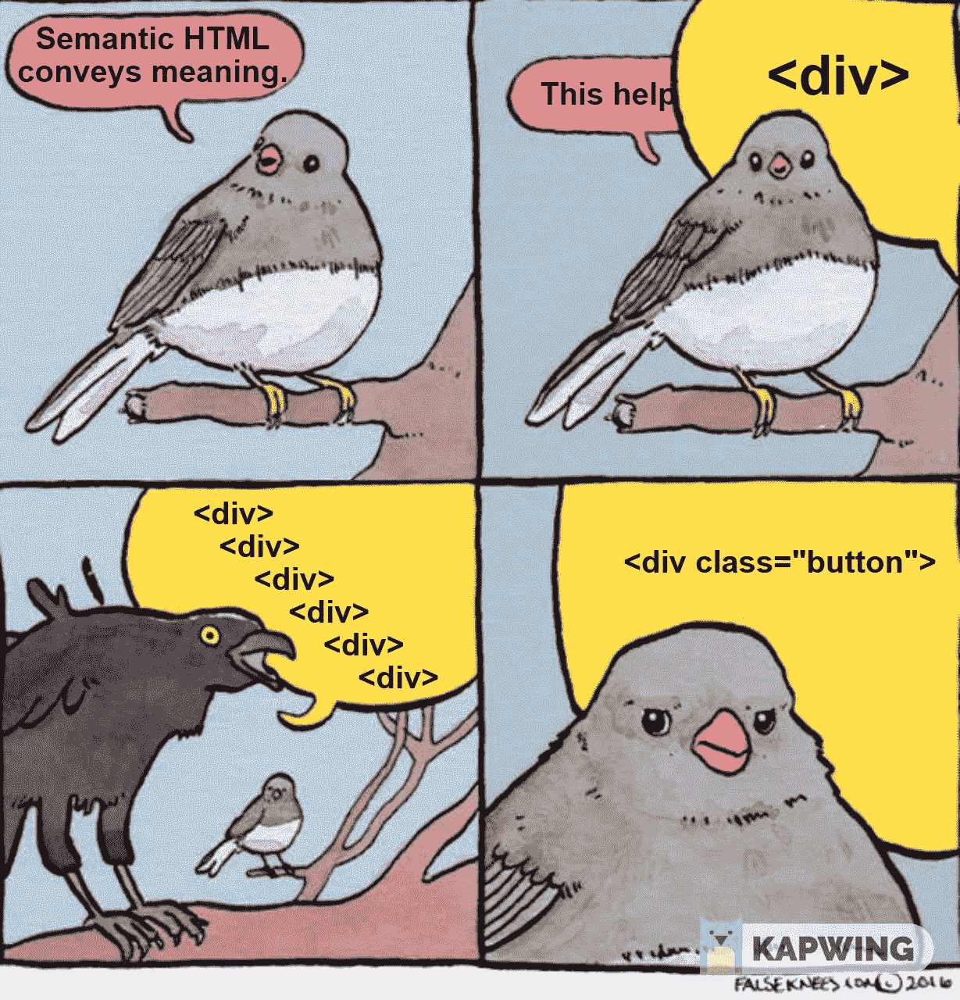

# 养成编写语义 HTML 的习惯

> 原文：<https://levelup.gitconnected.com/getting-in-the-habit-of-writing-semantic-html-c7e507606385>

从语义上使用一个词就是以正确的方式使用它。从语义上写 HTML 非常类似。这意味着你使用的标签必须描述里面的内容。比如你的页脚应该是

，而不是。另一个常见的陷阱是根据 HTML 标签在页面上的外观来选择标签。页面的外观应该和你应该选择的 HTML 标签无关。把这完全留给 CSS 吧。

# 为什么要用语义 HTML？

1.  **无障碍**

对于使用屏幕阅读器的人来说，使用语义元素有很大的不同。如果你的标记更有意义，逻辑结构更合理，那么使用屏幕阅读器的人会更容易浏览它。

**2。搜索引擎优化**

从语义上编写 HTML 可以让搜索引擎和浏览器更容易理解内容。例如，假设你写了一篇关于当地新闻的文章。你可以很容易地把你的文章放在一个

中，并使用一个 p 标签作为标题。但是，您应该使用文章标签和 h1 标签。搜索引擎将能够更容易地识别你的内容是否相关。

**3。易于维护(为自己和他人)**

如果不使用语义 HTML，大型项目会很快变得混乱和难以维护。对于其他人来说，处理你的代码会特别困难。真的很容易把一个

和另一个混淆。A和 a有点难搞混。

使用语义 HTML 的这三个原因有一些共同点。他们必须帮助其他人理解你写的代码和你创建的网站。如果这对其他人有帮助，让你有条理，为什么不去做呢？

这篇文章的目的不是告诉你在每种情况下使用什么标签。那太疯狂了。如果你不确定用什么元素，你可以查一下！MDN 对每一个 HTML 元素都有很棒的文档。他们也有专门关于语义 HTML 的文章，包括哪些元素是语义的完整列表。

需要记住的一点是，只有当你恰当地使用一个元素时，它才是真正的语义元素。一个

可能是一个语义元素，但是如果你用它来代替一个或者一个就不是了。名称本身并不能使元素具有语义。

# 需要注意的几个坏习惯

1.  **出于美学目的使用 HTML**

例如，使用

**2。使用除<按钮>以外的任何东西来表示按钮**

这里最常见的违规者是

和。这对任何使用屏幕阅读器、同事或搜索引擎的人来说都没有意义。

**3。默认情况下将所有内容放在一个< div >中**

例如，让你的 header、footer 和 nav 都是带有“header”、“footer”、“nav”等类名的

标签(这可能是我犯的最大错误)。

**4。不良头球练习**

永远不要有一个以上的

# 标签。从语义上来说，你应该每页只有一个

# ，并且它应该和你的标题相匹配。你的标题也应该越往下越小。尽量避免跳过任何标题级别。

感谢您的阅读！