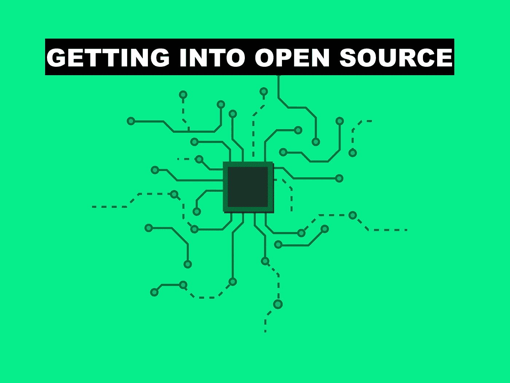
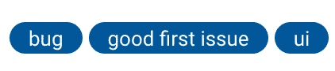

# 进入开源开发领域

> 原文：<https://levelup.gitconnected.com/getting-into-open-source-development-4a635aadd1ef>

从外面看，开源开发对于外行来说可能是一个可怕的前景，但是现实是这样吗？

不要对自己或鼓励他人做出更多贡献失去希望。我们很幸运能够成为数字时代的一部分，在这个时代，任何懂一点代码的人都可以为**工具制造者**、**大创意**和**软件包**做出贡献，让你的项目继续下去……你甚至可以自己成为工具制造者，或者拥有那个大创意。开源开发可以帮你做到这一点。

# 为什么？

想象一下这个场景——你正在做一个项目，你发现有些东西不工作了，甚至可能丢失了？你是做什么的？大多数人会继续前进。一些人甚至会向工具制造者提出这些问题，而更少的人会挺身而出，构建出对所有人都有帮助的新工具。

你认为在那个场景中谁是男主角/女主角？正是这个人挺身而出，掌控局面，并从他们的努力中获得**新知识**，为所有开发人员和所有**荣耀**改善**更广泛的生态系统**。

# 但是，我从哪里开始呢？

这是可怕的部分。每个人都知道开源对你的职业生涯有好处，提升你的技能，让你的手指保持在发展本身的脉搏上。困难在于问题“*嗯*，*我从哪里开始*？

不久之后，怀疑悄然而至，你怀疑自己是否足够优秀？然后你向自己保证现在不是时候，你不可能给任何人贡献任何东西，因为你没有时间，甚至没有专业知识...

这种恶性循环不断重复，直到你吞噬掉做开源的欲望。至少在下一次你有这种想法之前。

## 首先重新规划你的心态

很大一部分人甚至会害怕考虑接近开源这个简单的概念。

‘太难了，太费时间了，我肯定不够好’。

是不是太难了，是不是太费时间了，或者是不是人们害怕的事情？简单的回答是**没有**。

## 它到底是什么

开源是一个开放的代码体，来自优秀的全球开发者社区的贡献是开放的，我们都很幸运成为其中的一员。

像所有代码一样，项目中有复杂的元素，而*(幸运的是)*项目中有非常简单的元素。这同样适用于项目中需要解决的问题。所有代码库中都有复杂和简单的问题。

# 伟大的开始贡献

这里有一些很好的地方，今天就开始吧！

## **文档**

所有项目都有某种文档，可以调整得更好，它们甚至可能直接过时。这些可以采取以下形式

—读给我听
—代码中的注释

## **低垂的果实**

除了文档之外，您可以随时查看代码库，看看是否有更简单的代码可以减少重复？您甚至可以看一眼忽略文件，看看是否有需要改进的地方。这一切都是为了对开源社区做出最初的一些贡献。

—重构代码不枯燥(不重复)
—忽略文件

**只要叉出回购的**和**加上你的零钱**，然后 PR 回给他们。这里有一个关于如何做到这一点的很好的指导 [**这里**](https://gist.github.com/Chaser324/ce0505fbed06b947d962) 由[***chaser 324***](https://github.com/Chaser324)撰写。这是令人惊讶的直截了当的，以上都是很棒的开始方式。尽管这是*做出贡献的唯一方式吗？*

# 你甚至不需要 git 来贡献

是的，你听到了，以上都是基于 git 的贡献，开源社区不仅仅是 git 库。

这是一种帮助更广泛的开发者社区的心态。

如果你觉得连以上都太恐怖了？

## **堆栈溢出贡献**

只要走出去，通过标签搜索任何你可以帮助人们的东西。在你职业生涯的这个阶段，无论你的优势在哪里，你都可以专注于最适合你的事情，例如:- `CSS`或`JavaScript`标签。

一点一点地建立你的声誉，学习阅读其他代码库并改进它们。所有这些都是有价值的技能，可以帮助你做基于 git 的开源贡献，或者只是帮助你的日常工作。

# 从伟大的项目开始

这里有一些我觉得非常适合初学者的项目。

## 麻醉椒

用`good for beginner`标签设置 GitHub 问题的 JavaScript 测试运行程序。他们似乎很清楚让更多的人参与进来，帮助他们踏上开源贡献之旅。

## 贡献者契约

贡献者契约是开源项目的行为准则。通过签署这一行为准则，项目的创始人承诺允许任何人为他们的项目做出贡献，无论“经验水平、性别、性别认同和表达、性取向、残疾、个人外貌、体型、种族、民族、年龄、宗教或国籍。”

虽然这个项目在 GitHub 上只有不到 1000 颗星，但它的受欢迎程度可以从超过 10000 名开源项目维护者签署的誓言中看出，其中包括 [Swift](https://github.com/apple/swift) 、 [Atom](https://github.com/atom/atom) 、 [AngularJS](https://angularjs.org/) 、 [RVM](https://rvm.io/) 、 [Mozilla Webmaker](https://beta.webmaker.org/#/?_k=nsv3ol) 和[。NET 基础](http://www.dotnetfoundation.org/)。Contributor Covenant maintainers 目前正在寻找愿意将誓言翻译成其他语言的非英语母语人士。如果这听起来让你感兴趣，请前往[本期 GitHub](https://github.com/CoralineAda/contributor_covenant/issues/139)。

## DuckDuckGo 的即时回答

对于那些从未听说过的人来说， [DuckDuckGo](https://duckduckgo.com/) 是一个注重隐私的搜索引擎，它不会跟踪用户。即时回答是一种无需打开网站即可提供答案的功能。

数百人已经贡献了他们的即时答案，在他们的[想法页面](https://duck.co/ideas)上还有更多建议。

DuckDuckGo 提供了很好的文档让你入门，并通过创建备忘单来推荐新用户。如果你想知道 DuckDuckGo 小抄长什么样，只要去他们的网站输入“WordPress 小抄”就能看到[小抄](https://duckduckgo.com/?q=wordpress+cheat+sheet&ia=cheatsheet)。如果你卡住了，你可以加入他们的 Slack 频道，在 GitHub 上查看他们的 [wiki。](https://github.com/duckduckgo/duckduckgo/wiki)

## Mozilla 项目

毫无疑问，Mozilla 是开源世界的领先组织之一。为 Mozilla 项目做贡献乍看起来可能并不容易——维护人员恰当地将*标为初学者友好的*问题，但是很难找到它们，因为它们太多了。

幸运的是，Mozilla 已经通过他们的网站 [**共同贡献**](https://codetribute.mozilla.org/) 支持了新的贡献者。它允许你搜索所有 Mozilla 的 bug 报告，对它们进行过滤，找到与你感兴趣的领域最相关的报告。

不要忘记检查所有标记为初学者友好的问题上的*好的第一个 bug* 标签和这个 [**方便的初学者投稿指南**](https://github.com/mozilla-frontend-infra/codetribute) 。

## Magento 2

最大的电子商务平台之一。Magento 主要是为企业级电子商务量身定制的。

作为一个开源的电子商务平台，Magento 需要编程和开发者资源，这给了你一个机会来看看是否有什么你能帮忙的。

只要浏览一下这个小列表，你就会开始有一个查看开源门票的想法，并且知道你能帮上什么忙。

一般来说，大型项目或完全开源项目是探索开源世界的绝佳、安全的地方。

当你做出第一个开源贡献，并且知道或大或小的东西上都有你的手印时，这是一种奇妙的感觉。

我敦促你们所有人，走出去尝试以上任何一种方法，谁知道呢，最终你*会成为*****工具制造者*** 。***

# **感谢阅读**

**我的名字 [**哈里加兹尼**](https://github.com/hghazni) 我在英国诺丁汉工作。**

**如果你喜欢我写的东西，你可以在[***Twitter***](https://twitter.com/harryghazni)或[***medium***](https://medium.com/@hghazni)上找到我。我热爱我所做的事情，我所学的知识，并与他人分享。**

**我也有一个 YouTube 频道叫做 [**好奇 Byt** e](https://www.youtube.com/channel/UChgP4qLeMhkcJUFMO5S05mQ/) 我在那里发布教程和建议，看看吧！**