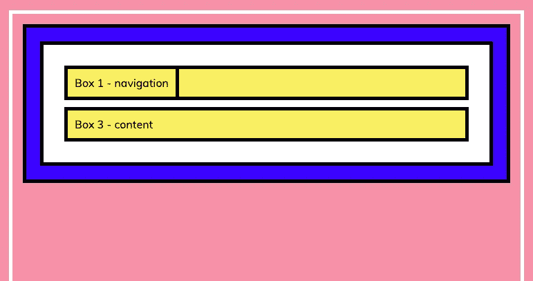

# 进入 CSS 的位置

> 原文：<https://levelup.gitconnected.com/getting-into-position-with-css-abcf2ca45680>

## 深入研究 CSS 位置属性

[CSS](https://developer.mozilla.org/en-US/docs/Web/CSS) 中的`position`属性使我们能够控制元素在网页上的位置。在这篇博文中，我将看看我们可以分配给[位置属性](https://developer.mozilla.org/en-US/docs/Web/CSS/position)的每个值——固定、绝对、相对和粘性。与 CSS 中的 position 属性一起使用，top、right、bottom 和 left 属性决定了定位元素的最终位置。对于这些方向属性，我们可以添加自动、居中、像素和百分比值等值来将元素移动到适当的位置。

我使用一个非常简单的网页来演示位置值之间的差异。这个网页由一个索引文件和一个 CSS 文件组成。正如您在下面看到的，在 HTML 文件中，我们有一个父 div，它包含三个子 div，每个框代表标准网页的一部分—导航、按钮和内容:

```
<!DOCTYPE html>
<html lang="en">
    <head>
        <meta charset="UTF-8">
        <meta http-equiv="X-UA-Compatible" content="ie=edge">
        <link rel="stylesheet" href="main.css">
        <link href="[https://fonts.googleapis.com/css?family=Muli&display=swap](https://fonts.googleapis.com/css?family=Muli&display=swap)" rel="stylesheet">
        <title>Position</title>
    </head>
    <body>
        <div class="parent">
            <div class="child-1">Box 1 - navigation</div>
            <div class="child-2">Box 2 - button</div>
            <div class="child-3">Box 3 - content</div>
        </div>
    </body>
</html>CSS file:html {
    background: rgb(247, 145, 167);
    padding: 15px;
    border: 5px solid white;
    margin: 15px;
    height: 2000px;
}body {
    background: blue;
    padding: 20px;
    border: 5px solid black;
    margin: 0;
  }

.parent {
    background: white;
    padding: 20px;
    border: 5px solid black;
    margin: 0;
  }

.parent div {
    background: rgb(255, 239, 97);
    font-family: 'Muli', sans-serif;
    color: black;
    padding: 10px;
    border: 5px solid black;
    margin: 10px;
}
```

## **位置:静态；**

具有`position: static;`值的元素根据它们在正常文档流中出现的位置来定位。如果我们没有给一个元素分配任何位置属性，它将采用默认的静态位置值。下面的网页显示了文档流中的元素，父 div 中有三个子 div，如下所示:


当 CSS 中没有分配位置属性时—所有元素都有静态属性。

对于静态值，top、right、bottom 和 left 属性不起作用。这些属性仅在 position 属性的值应用于 static 以外的任何内容时才生效。

## **位置:固定；**

如果我们将`position: fixed;`属性应用于与导航框相关联的 child-1 类选择器，我们的网页外观会发生变化:



当在 CSS-Box 1 中分配的 position: fixed 属性从文档流中取出时，如上所示。

Box 1 div 的宽度减小，现在覆盖 Box 2 div 元素。这是因为`position: fixed;`值将元素从文档流中取出，导致所有其他子元素在网页中上移。框 1 子 div 对于框 2 和框 3 子 div 不再存在。由于我们已经为 position 属性指定了 static 以外的值，现在我们可以使用 top、right、bottom 和 left 属性将它移动到我们想要的位置。由于框 1 是我们网页的导航，我们将使用以下 CSS 将其移动到顶部:

```
.parent .child-1 {
  position: fixed;
  width: 100%;
  margin: 0;
  top: 0;
  left: 0;
  box-sizing: border-box;
}
```


分配了位置固定属性和一些附加 CSS 属性的框 1，用于将导航固定到网页的顶部。

我将宽度设为 100%,这样它就占据了整个网页的宽度，并移除了页边空白，这样它就被放置在顶部，周围没有空白。在位置固定的情况下，top 和 left 属性指的是一个元素相对于另一个元素或视窗(无需滚动即可查看的屏幕部分)移动的距离，这就是所谓的定位上下文。

如果父元素被分配了位置属性，则被移动的元素将改变相对于该父元素的位置，如果没有父元素被分配位置属性，则它相对于视口移动。最后，我添加了值为 border-box 的 box-sizing 属性，这样导航元素的右边框就不会从网页上消失。固定定位既适用于像 div 这样的块级元素，也适用于像 spans 这样的行内元素。

## **位置:绝对；和位置:相对的；**

对于使用绝对值定位的元素，定位上下文略有不同-如果该元素的父元素都没有应用 position 属性，则该元素相对于网页的 HTML 元素定位。或者，如果任何父元素确实具有 position 属性，则相对于具有 position 属性的最近的父元素移动子元素。

来自 Gia Gunn 的肯定——谢谢 Gia！

为了演示绝对和相对位置值，让我们将框 2 按钮 div 移动到框 3 内容 div 的右侧。我给 Box 3 的内容 div 设置了 150 像素的高度，这样它更能代表网页上的内容。如果我们将 position 属性 absolute 赋予 Box 2 子元素及其父元素(白色 div 容器), Box 2 子元素及其父元素都从文档流中取出，您可以在下面看到它们现在出现在代表 body 元素的蓝色容器之外。


当父 div 元素也具有绝对位置属性时，使用绝对位置属性定位的框 2。

我们可以通过将父 div(白色容器)的位置值更改为`position: relative;`来解决这个问题，一旦我们进行了这一更改，页面显示将更改如下:


当父 div 元素具有位置相对属性时，使用绝对位置属性定位的框 2。

relative 的位置值不会将元素从文档流中取出，因此，白色容器的父 div 会保留在文档流中，并且因为它是 Box 2 child-2 元素的父元素，其位置值不是 static，所以我们可以使用`position: absolute;`将 Box 2 按钮移动到我们想要的位置，其顶部和右侧的值如下所示。不要忘记给边距加一个值 0，这样边距的空间就不会影响顶部和右侧的移动。

```
.parent .child-1 {
  position: fixed;
  width: 100%;
  margin: 0;
  top: 0;
  left: 0;
  box-sizing: border-box;
  z-index: 1;
}.parent .child-2 {
  position: absolute;
  top: 50px;
  right: 50px;
  margin: 0;
}.parent .child-3 {
  height: 150px;
}
```

对 CSS 中的子元素做了上述更改后，我们只剩下下面的。请注意，我还向 child-1 导航元素添加了一个为 1 的 [z-index](https://developer.mozilla.org/en-US/docs/Web/CSS/z-index) 属性，这样它就被带到了页面的顶部，允许所有内容向下滚动。如果没有这个，当你向下滚动页面时，框-2 按钮将会与导航条重叠。


如果我们从父 div 中移除 position 属性，我们需要记住这意味着子 button 元素相对于网页的 HTML 元素被定位。定位上下文从父元素变为 HTML 元素。如果我们调整 child-2 元素的 top 和 right 属性，仍然可以获得上述结果。

关于相对位置值还有一点需要注意，这个值的定位上下文是元素本身。因此，您总是可以使用带有 top、right、bottom 或 left 属性的`position: relative;`属性来将元素从其在网页上的原始位置移开。这对于相对值是唯一的，因为它没有从文档流中取出元素。

要记住的事情:

*   对于固定值和绝对值:top、left、bottom 和 right 属性指定从父元素移动的距离。
*   对于相对值:top、left、bottom 和 right 属性指定元素应该如何从其原始位置移动。

## **位置:粘性；**

`position: sticky;`属性是新的，并非所有浏览器都支持。如下图所示，Internet Explorer 不支持这个 CSS 属性，Chrome 只提供部分支持。它仍然是一个有用的属性，但最好了解它的浏览器限制。


浏览器支持来自[的位置粘滞，我可以使用](https://caniuse.com/#feat=css-sticky)吗

位置粘性是相对位置值和固定位置值的混合；它不会从文档流中取出，使用 top 属性时，元素的行为就像固定元素一样，当您向下滚动网页时，它会到达距视口顶部指定的上限值距离。然后，随着滚动的继续，当粘性元素到达其父元素的结束边界时，它再次变得不固定。我已经添加了绿色框 4 div，我们将把它临时粘贴在页面上，以及一些额外的内容框，以显示下面的操作:


用粘性位置属性定位的框 4。

```
.parent .child-4 {
  background: green;
  color: white;
  position: sticky;
  margin: 10px;
  top: 50px;
}
```

将上面的 CSS 用于绿框 4 div(带有子-4 和父组合选择器)，您可以看到，当用户向下滚动页面时，一旦绿框距离视口顶部 50 个像素(由 top 属性指定),元素就会保持不变，直到到达其父元素(白色容器 div)的底部。然后，它再次滚动其余的内容。