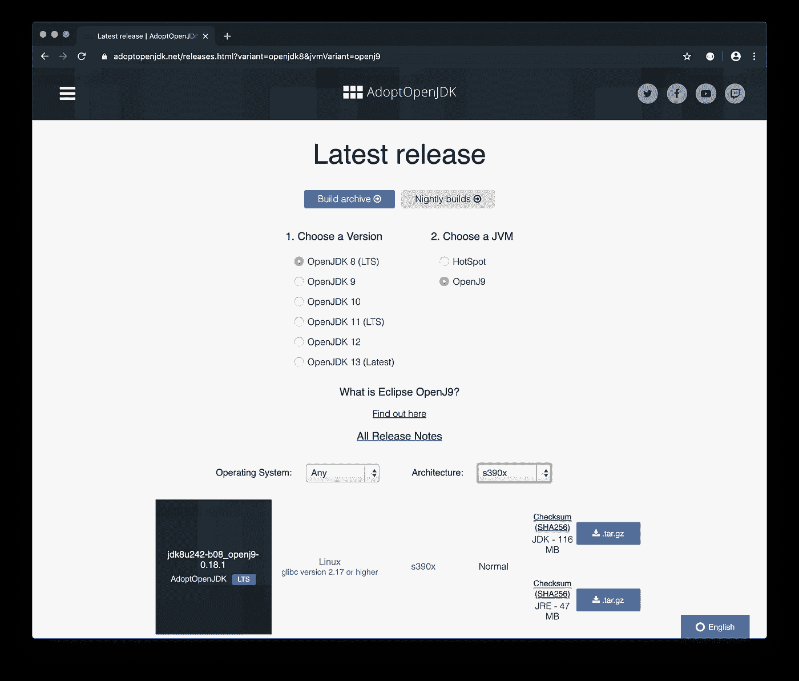
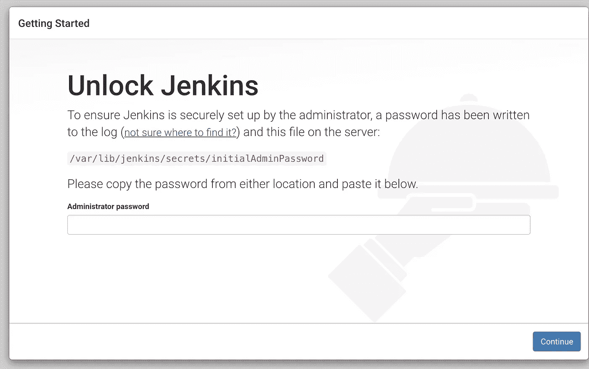

# 让 Java 和 Jenkins 在大型机上运行 Linux

> 原文：<https://levelup.gitconnected.com/getting-java-and-jenkins-working-on-linux-on-mainframe-d2a8736f2469>

在前面的故事中，我们已经了解了 IBM 大型机(System z)上的 Linux，以及如何在真正的大型机硬件上免费访问 IBM LinuxONE 机器。

[](/getting-started-with-linux-on-mainframe-fcd4b19d147d) [## 大型机 Linux 入门

### 从上个世纪末开始，在大型机(System z)硬件上运行 Linux 并从中受益是可能的

levelup.gitconnected.com](/getting-started-with-linux-on-mainframe-fcd4b19d147d) 

这个故事是关于在这样的机器上使用 Java，这样我们就可以让像 Jenkins 这样的 Java 应用程序在这个系统上很好地运行。

# 在 LinuxONE 上安装 Java

让我们试试是否已经安装了 Java:

```
[linux1@plape ~]$ java
-bash: java: command not found
```

不，不是的。IBM 推荐使用来自 https://adoptopenjdk.net/ T2 的 Java 版本。这是一个由 IBM 发起的项目，IBM 在 https://www.ibm.com/cloud/support-for-runtimes 为这些 Java 运行时提供商业支持。

打开[https://adoptopenjdk.net/](https://adoptopenjdk.net/)时，需要点击**其他平台**按钮，选择 **s390x** 架构。



可用的 JVM 版本和类型

应该选择什么类型的 JVM？HotSpot 还是 OpenJ9？IBM 投资了 Eclipse OpenJ9 项目，其好处在[https://developer . IBM . com/blogs/open JDK-with-Eclipse-open j9-no-worries-just-improvements/](https://developer.ibm.com/blogs/openjdk-with-eclipse-openj9-no-worries-just-improvements/)中有描述。

当您下载 s390x 的 HotSpot 版本时，它只能在解释模式下运行，因此 OpenJ9 是一个明确的选择。我们来装吧！

复制 AdoptOpenJDK.net 网页上的链接，并使用 curl 下载软件包:

```
curl -OL [https://github.com/AdoptOpenJDK/openjdk8-binaries/releases/download/jdk8u242-b08_openj9-0.18.1/OpenJDK8U-jdk_s390x_linux_openj9_8u242b08_openj9-0.18.1.tar.gz](https://github.com/AdoptOpenJDK/openjdk8-binaries/releases/download/jdk8u242-b08_openj9-0.18.1/OpenJDK8U-jdk_s390x_linux_openj9_8u242b08_openj9-0.18.1.tar.gz)
```

拆开包装:

```
tar -xf OpenJDK8U-jdk_s390x_linux_openj9_8u242b08_openj9-0.18.1.tar.gz
```

它创建一个新目录`jdk8u242-b08`。

将其移动到/opt:

```
sudo mv jdk8u242-b08 /opt/
sudo chmod -R a+r /opt/jdk8u242-b08
```

将其添加到路径:

```
export PATH=/opt/jdk8u242-b08/bin:$PATH
```

并检查它是否工作:

```
[linux1@plape ~]$ java -version
openjdk version "1.8.0_242"
OpenJDK Runtime Environment (build 1.8.0_242-b08)
Eclipse OpenJ9 VM (build openj9-0.18.1, JRE 1.8.0 Linux s390x-64-Bit Compressed References 20200122_505 (JIT enabled, AOT enabled)
OpenJ9   - 51a5857d2
OMR      - 7a1b0239a
JCL      - 8cf8a30581 based on jdk8u242-b08)
```

# **基准**

我们将使用**Renaissance Suite**([https://Renaissance . dev)](https://renaissance.dev/)对这套系统的性能有所了解。Renaissance 是一套 JVM 基准。我们只使用一个: **finagle-http** 。

让我们下载。jar 文件:

```
curl -OL [https://github.com/renaissance-benchmarks/renaissance/releases/download/v0.10.0/renaissance-gpl-0.10.0.jar](https://github.com/renaissance-benchmarks/renaissance/releases/download/v0.10.0/renaissance-gpl-0.10.0.jar)
```

并运行测试:

```
java -jar renaissance-gpl-0.10.0.jar finagle-http --csv jdk8u242-b08-openj9.csv
```

所有测试的平均时间(除了这个)是**1613**23 毫秒。到底好不好？在我装有 2.3 GHz Intel Core i9 的 Mac 上的结果是 11357 ms。这使得这个 LinuxONE 系统对于 Java 来说是一个相当不错的系统！

s390x 的 HotSpot JVM 运行在解释模式下，在这个基准测试中，它比 OpenJ9 慢了大约 50 倍。

您可以使用 RedHat 包管理器安装的包**Java-1 . 8 . 0-open JDK . s390x:open JDK Runtime Environment 8**会安装较慢的 HotSpot JVM。最好使用上面的步骤安装 OpenJ9 JVM。

# 詹金斯

Jenkins 是一个开源自动化服务器，Jenkins 提供了数百个插件来支持构建、部署和自动化任何项目。

当与 [Zowe CLI](https://github.com/zowe/zowe-cli/blob/master/README.md) 搭配使用时，它甚至可以用来在 z/OS 上自动执行任务。

我们将遵循[在 Red Hat 发行版上安装 Jenkins](https://wiki.jenkins.io/display/JENKINS/Installing+Jenkins+on+Red+Hat+distributions)中描述的步骤。

将 Jenkins 存储库添加到 yum repos，并从这里安装 Jenkins。

```
sudo wget -O /etc/yum.repos.d/jenkins.repo http://pkg.jenkins-ci.org/redhat/jenkins.reposudo rpm --import https://jenkins-ci.org/redhat/jenkins-ci.org.keysudo yum install jenkins
```

Jenkins 包不知道您的 Java 在哪里，因此您需要修改 Jenkins 配置参数:

```
sudo vi /etc/sysconfig/jenkins
```

将`java`可执行文件的路径添加到`JENKINS_JAVA_CMD`参数中:

```
## Type: string
## Default: ""
## ServiceRestart: jenkins
#
# Java executable to run Jenkins
# When left empty, we'll try to find the suitable Java.
#
JENKINS_JAVA_CMD="/opt/jdk8u242-b08/bin/java"
```

下一步是在防火墙上打开端口 8080:

```
sudo sufirewall-cmd --permanent --new-service=jenkinsfirewall-cmd --permanent --service=jenkins --set-short="Jenkins Service Ports"firewall-cmd --permanent --service=jenkins --set-description="Jenkins service firewalld port exceptions"firewall-cmd --permanent --service=jenkins --add-port=8080/tcpfirewall-cmd --permanent --add-service=jenkinsfirewall-cmd --zone=public --add-service=http --permanentfirewall-cmd --reloadexit
```

您需要安装另一个软件包，以便 Jenkins 可以启动:

```
sudo yum install fontconfig
```

然后，您可以启动 Jenkins 服务:

```
sudo service jenkins restart
Starting jenkins (via systemctl): [ OK ]
```

然后就可以打开网址:[http://your-Linux-one-IP-address:8080/](http://your-linux-one-ip-address:8080/)完成 Jenkins 安装。



初始 Jenkins 网页来完成安装

如果您想了解更多关于 Jenkins 安装的信息，请参见本文档:[https://jenkins.io/doc/book/installing/#setup-wizard](https://jenkins.io/doc/book/installing/#setup-wizard)。

# 摘要

我们已经了解了什么是适合大型机上 Linux 的 JVM，并且已经将 Jenkins 安装到 LinuxONE 系统上。

有了 Jenkins，您可以自动化许多事情。如果您有兴趣了解如何从另一个平台自动化 z/OS 上的流程，请学习 Zowe CLI。

[](https://medium.com/zowe/getting-started-with-zowe-cli-7a29420c6be7) [## Zowe CLI 入门

### Zowe CLI 用于 z/OS，就像 AWS CLI 用于 AWS 一样。这是一个客户端 CLI，允许访问所有基础架构…

medium.com](https://medium.com/zowe/getting-started-with-zowe-cli-7a29420c6be7) 

Zowe CLI 正在使用 Node.js，我们将在未来介绍如何在大型机上安装 Node.js，包括 Linux 和 z/OS！