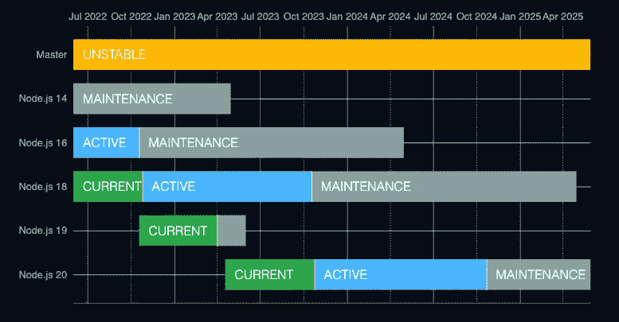
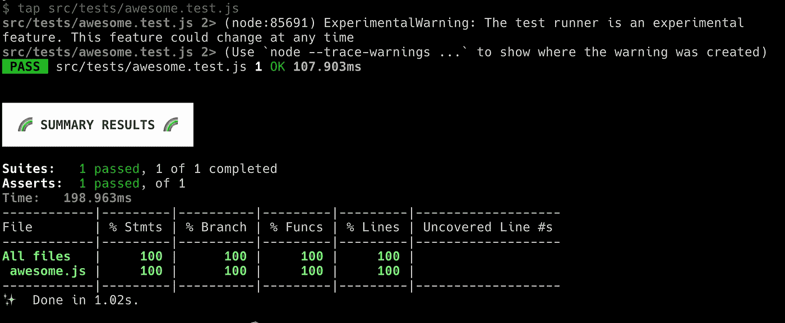

# 进入 Node.js 18 Native Test + Node-Tap 以获得更好的代码

> 原文：<https://levelup.gitconnected.com/getting-onto-node-js-18-native-test-node-tap-for-better-code-79d86f458a56>

上个月 Node.js 18 的发布令人激动。有真正伟大的功能添加和一些突出的，如本地全局获取和核心测试运行模块。这两个不仅可以让你免于运行其他外部 API 库和测试库，而且在将来有一个更清晰和更稳定的维护。了解 node 官方网站上的时间线有助于避免遗留错误。



节点发布和维护计划

# **概述**

在这篇文章中，我将花一些时间和你一起讨论如何设置并充分利用 [Node.js 18 本地测试](https://nodejs.org/api/test.html)。希望它能让你和你的组织受益。

Node.js 18 的本地测试报告采用 [TAP](https://testanything.org/) 格式，可以很好地用 node-tap to 进行增强处理。我们选择使用[节点点击](https://node-tap.org/)，这样我们可以更好地可视化报告。此外， [node-tap](https://node-tap.org/) 是一个非常活跃的维护库，具有简单的设置和易于遵循的文档设置。

# **步骤 1:设置**

从[官方发布页面](https://nodejs.org/en/about/releases/)或使用 nvm 获取您的 node 18 副本

```
nvm install 18
```

用最少的配置创建一个项目目录并初始化一个节点项目。然后安装 [node-tap](https://node-tap.org/) ，他们的 npm 页面是[这里是](https://www.npmjs.com/package/tap)

```
mkdir node-18-node-tap && cd node-18-node-tapnpm init -ynpm install tap --save-dev
```

# 步骤 2:添加逻辑和测试代码

添加逻辑代码，我将给出一个例子` awesome.js '

```
function add(a, b) {
  return a + b;
}

module.exports = add
```

添加测试代码，我将给出一个例子` awesome.test.js '

```
const awesome = require("../awesome");
const test = require("node:test");
const assert = require("assert/strict");

test("synchronous passing test", () => {
  const sum = awesome(1, 2)
  assert.strictEqual(sum, 3);
});
```

# 步骤 3:添加命令

将该命令添加到 package.json 中的脚本块

```
{
  ...
  "scripts": {
    "test": "tap"
  }
  ...
}
```

如果你想设置脚本做更多的事情，请参考详细的 cli 选项[这里](https://node-tap.org/docs/cli/)

# 第四步:跑步并感受它

运行 by 命令，然后您可以看到 tap exporting 很好地在命令行上显示覆盖率报告

```
npm run test
```



# 第五步:总会有更多

要了解更多示例，请访问 https://nodejs.org/api/test.html

# 摘要

在我的演示体验中，这个测试设置看起来非常好。虽然在现实世界中，升级现有项目的节点版本可能会导致一些严重的兼容性技术工作，特别是代码库很大而且很旧。希望每个人都将有一个顺利和有益的体验与此版本。我正在考虑写下一篇关于内部获取的文章，也许会和一些现有的流行工具进行比较，保持一致！

**呼吁行动**

如果你觉得这个指南很有帮助，请鼓掌并跟我来。谢谢大家的支持！我也会跟着回去的！

如果你想支持我，请随时加入 medium，通过下面的链接阅读更多我的文章和所有其他优秀的作家:【https://medium.com/@caopengau/membership】T2