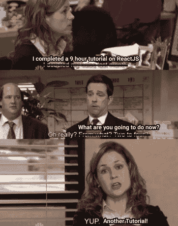

# 走出教程地狱

> 原文：<https://levelup.gitconnected.com/getting-out-of-tutorial-hell-4ed8aa788b2b>

直走&左转。梁家杰在 [Unsplash](https://unsplash.com/s/photos/hell?utm_source=unsplash&utm_medium=referral&utm_content=creditCopyText) 上的照片

## 每个人都来参观，但只有少数幸运者在合适的时间离开。

面对现实吧，我们都经历过。也许你仍然被困在教程地狱中，并正在寻找你可以出去的方法。当你在那里的时候，生活似乎很平静，但是在你头脑的某个地方，你意识到你陷入了一个循环。几天&几周很快就过去了，一个接一个的视频，一个接一个的教程，直到你意识到这就是地狱的感觉。你对外界麻木，享受着教程地狱里的伪极乐。

欢迎来到地狱教程。[ [吉菲](https://media.giphy.com/media/Lopx9eUi34rbq/giphy.gif)

好吧，这比我想象的还要黑暗。让我解释一下。

## 什么是教程地狱？

教程地狱是一个阶段，许多新程序员都被困在其中。网上有很多很棒的教程和课程，价格比以前更便宜，任何人都越来越容易获得知识。

初级程序员总是在寻找一个教程或课程，以简单的方式教他们一种新的编程语言或概念。他们想通过跟随老师所说的来“了解”一些东西，似乎不需要辅导或课程就无法获得任何新的东西。

## 如何知道自己是否在教程地狱？

想象一下。你刚刚完成了一个教程，并遵循导师说的和做的一切。现在，是时候好好利用这些知识，建立自己的东西了。您创建了一个新项目，并开始考虑自己编写一些代码。

这是当你被独自做事的巨大压力压垮的时候。你不确定该做什么或如何开始。这时你开始下一个教程&接下来你知道你已经学了 83 门课程和教程，但你仍然不知道在哪里结束。

德怀特知道。

## 为什么教程地狱一开始就存在！？

简单地说，教程看起来像一个安全屋。它们给你提供了学习和成就感。教程给你可测量的进步。

哦哇！一个 9 小时的掌握 ReactJS 的教程！太好了，你可以在一天内学会反应。然而，当你在完成了 9 个小时的教程后开始自己的项目时，似乎你知道得还不够。那你是做什么的？

是的，另一个教程。

你可能已经猜到了，我是办公室的超级粉丝。

教程地狱让你感觉活着(某种程度上)。教程没有风险。

> 嘿，约翰，你准备好开始你的项目了吗？
> 
> 我在学习一门新的语言！太牛逼了！
> 
> 哦，那就继续吧。

你听从教练平静的声音，照他们说的做。即使你在某一点上出错了，他们已经在描述或注释中链接了代码。让我们复制粘贴和哒哒！一切都好。😇

让我告诉你我被困在教程地狱的那段时间。

我刚刚辞去了 Android 开发人员的工作，想成为一名 Web 前端开发人员。我把所有的积蓄(大约 1000 美元)都花在了上新课程和教程上。我花了两个月的时间学习 JavaScript、HTML-CSS & Angular，但我意识到我无法开始，并不断回到教程，因为我认为我知道得太少，我会被认为是一个一无是处的骗子。

当我找到一份工作，被扔进现实生活中的客户需求和问题的坑里时，一切都变了。

你可能和我有类似的情况，你正在阅读这篇文章的事实意味着你想走出这个地狱。我们开始吧，好吗？

## 逃离地狱

这可能会让你感到惊讶，但是走出教程地狱最有效的方法是 ***不要再做任何教程。*** 是的，我知道这听起来像是告诉一个悲伤的人停止悲伤。但这是真的。

从你做过的所有教程中收集你的知识，然后开始画画。列出你到目前为止已经学到的东西，并思考你可以利用这些知识做些什么。

如果你一直在学习 HTML & CSS 的教程，为一家销售你喜欢的产品的虚构公司建立一个网站，可能是一家音乐商店或一家酒店。

如果你一直在学习 NodeJS 或任何其他后端技术，构建一个 API，允许你在数据库上做所有的 CRUD(创建-读取-更新-删除)操作。选择一个真实世界的主题，如在线书店或视频租赁服务。

如果你还没有准备好开始你自己的东西，构建你在教程中构建的相同的项目，而不必再看视频/教程。尝试实现一个你自己喜欢的新特性。

如果你被困在一个问题上，看在上帝的份上，不要去寻找另一个教程。在 Stack Overflow 或 Reddit 上问一个问题，有很多人可以帮助你。

> 永远记住，谷歌是你在这些时候最好的朋友。

全世界有数百万的软件开发人员在开发各种各样的产品，所以肯定有人已经面临了和你非常相似的问题。

教程就像一副拐杖，当你自己走不动的时候，它们会帮你走路，但是如果你想跑，你必须放下拐杖，自己把脚向前迈。

这可能看起来势不可挡，我从个人经历中知道确实如此。阅读文档，尝试询问关于堆栈溢出的问题，最重要的是要有耐心。

你很快就会离开辅导地狱，再也不会回来了。

祝你好运！

# 分级编码

感谢您成为我们社区的一员！ [**订阅我们的 YouTube 频道**](https://www.youtube.com/channel/UC3v9kBR_ab4UHXXdknz8Fbg?sub_confirmation=1) 或者加入 [**Skilled.dev 编码面试课程**](https://skilled.dev/) 。

 [## 编写面试问题

### 掌握编码面试的过程

技术开发](https://skilled.dev)