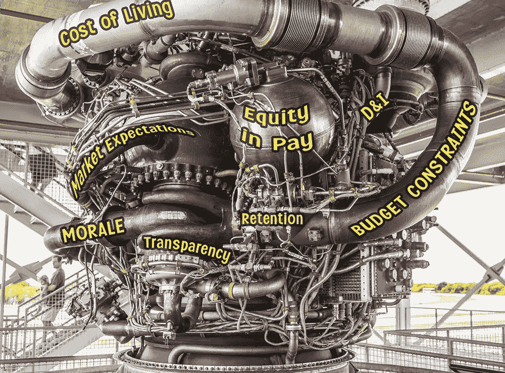

# 升职:你需要做的无聊工作

> 原文：<https://levelup.gitconnected.com/getting-promoted-the-boring-work-youll-need-to-do-398e0c9defb2>

我一直看到关于工程师如何获得晋升的建议文章。他们中的一些人沉迷于办公室政治和不公平的辛酸故事。其他人主张一套通用工程美德，这将压倒亚里士多德。我经常看到有人建议通过搬出去的方式升职，也就是“跳槽”。

我不想挑这些作家的毛病。但我感觉他们中的大多数人并不真正了解他们曾经工作过的公司。就像听青蛙讲如何逃离沸腾的锅。他们理解水、痛苦、自由和其他一些相关的概念。但是他们不太明白为什么有人会把它们放进锅里，然后把锅放在炉子上。

蛙人 2022。

当我还是工程师的时候，我已经被提升了。作为经理，我多次提拔工程师。我参与了推广标准和政策的制定。我在多家公司都这样做过。这就是我对这个话题的信心来源。

让我们来谈谈那些无聊的东西，它们是几乎任何一家超过 100 名员工的 IT 公司人才评估的必要组成部分。

# 人才评审周期

当我说“人才评审周期”这几个字的时候，你是不是开始咔哒咔哒走了？

这就是问题所在！这是超级无聊的东西。但是如果你真的想在你的公司里升职，你应该把这些事情记在脑子里。

大多数公司每年都有 1 到 4 个人才评估周期。这是一段时间，在这段时间里，你的才能、天资和贡献会得到评估。在一个周期结束时，你的经理和其他人会对你进行某种类型的评估，并记入人力资源部的记录。评估将决定晋升和加薪的资格。升职不仅仅是评估，其他的我们会谈到。

她在人才评审三轮车上表现很差。

评估的具体形式因公司而异。可能是:

*   单轴评级，例如 1 至 5 级。
*   九格评级
*   堆栈排序

每家公司的评估方式也各不相同。评估使用多组输入是很常见的。以下是员工评估中的一些典型内容。

*   员工/经理评分一致性
*   同行评审调查
*   生产率指标
*   团队 KPI(有时，整个团队的表现会影响个人晋升)
*   经理校准会议(经理召开会议以确保他们在员工评估中保持合理的一致性)

我厌倦了打字。对不起很无聊。

在你的特定公司，进入你的人才评估周期的无聊事情的确切组合还有待你去学习。

有了这篇文章，我不再遵循让人们在网上关注我的规则。因为我宁愿只告诉你有用的事实，而不是令人信服的、吸引人的东西。我用无聊的标题警告过你。它可能应该是这样的，“根据未来的比特币亿万富翁的说法，你的下一份工作已经死了”或“你昨天必须做的五件事，还有埃隆·马斯克”。

# 努力工作是不够的

让我猜猜…

今年在你的公司有一次全体会议。人力资源部的某个人就他们的人才评估计划即将进行的修改和改进唠叨了 36 分钟。超级无聊，你试着注意了一会儿。但最终，你调低了电话音量，并集中精力在冲刺阶段结束前整合你的公关。

你可能有理由退出，因为你认为你应该专注于公司付钱给你的工作，比如写代码。人们应该看到你的努力工作并相应地奖励你，例如提升你的头衔和薪水。

如果这匹马不用在身后拖着那辆车，它会干得更快。

我非常赞同这种推理方式。作为一名经理，我花了时间让这些专注于工作的工程师得到认可。

但是了解你公司的人才评估流程并参与其中符合你的最大利益。当然，*实际上是你工作的一部分，去了解与你日常工作没有直接关系的更广泛的公司事务。*

# 和你的老板一对一

你和你的经理有一对一的交流吗？周刊？如果没有，那就去问他们。

你是如何度过一对一的时间的？你和你的老板可能会转向“舒适”的话题，例如你最喜欢的编程语言。这没什么不好。但是请记住，至少在一些会议上，将你的职业发展列入议程。或者如果你的经理试图提出这个话题，那就切入这个话题。即使这对你来说很尴尬。

会有这样的问题:

*   人才评审周期是如何运作的？
*   你感兴趣的职业道路是什么？你渴望成为公司的建筑师吗？你想从事管理工作吗？
*   你的下一个晋升或角色转变目标是什么？
*   为了到达那里，你应该做些什么？

想想最后一个问题。

这个问题的答案会因情况而异。这就是为什么我对其他“如何获得晋升”文章中的一般性建议有意见。

你需要与你的经理交谈——而不是通过互联网——来了解晋升的途径，特别是你在这个世界中所占据的时间和位置。没有一个中等文章的作者，包括我，能够足够详细地阐明这条道路。就你的具体情况听取一般建议就像李·哈维·奥斯瓦尔德听信息战争来找出是谁射杀了 JFK。

下面是一些真实的例子，来自我自己的经历，经理们(包括我自己)对“我如何获得晋升？”问题:

> 经理:“因为你去年从团队领导变成了个人贡献者，我需要给你分配一些展示你工程技能的项目。”

> 经理:“在这个人才评估周期中，我无法为你准备一个强大的晋升包，所以让我们瞄准下一个。”

> 经理:“你确定要去做员工工程师吗？你将花更少的时间编码，花更多的时间开会和写文档。我们的目标也可以是让你保持目前的职位，同时获得更高的薪酬。”

> 经理:“我可以考虑让你明年升职。但是说实话，在某些方面你没有达到你目前水平的期望值，比如管理你的多个项目的时间。所以我们一起为你的晋升之路努力。但让我们期待这需要时间和真正的努力。”

…这些是来自更长对话的片段。示例中的这些具体细节可能与您无关。我的总体观点是展示你可以期待的个性化定制水平。当你在晋升的轨道上，你将至少每月一次涉及这样的话题。

谈论你的职业发展时，你会感到有些担心吗？大多数人都会。以下是可以解释这种恐惧的一些原因:

*   感觉你是在逼你的经理说这件事。
*   你不想被视为有权或过于雄心勃勃。
*   你担心你的经理对你的评价很低。
*   相对于团队中的其他人，你对自己的价值一无所知。争取升职合适吗？
*   你可以以设定目标的形式为自己创造额外的工作。
*   你担心你会被要求假装热情和对公司的忠诚，这不符合你的个性。
*   你不想因为在别人认为你准备好之前尝试升职而受到社会惩罚。

这些原因中的任何一个都可能有些许令人担忧的理由。但是不要让它们在你的头脑中占据过多的比重。请记住，与你的经理讨论你的职业道路永远不会错。你应该讨论你的职业道路，这是不可避免的，除非你的经理出于某种原因回避这个话题。

你也可以通过随意地问“我如何得到提升？”来收集信息不要承诺任何目标或行动。为此，你只需问一些谦逊的问题，倾听，保持乐观，并*阻止自己做出任何承诺*。“让我再考虑一下，”是结束任何谈话的完美方式。

# 另一方的不情愿

以下是经理可能避免谈论你的职业道路或限制谈话的一些真正原因。其中一些确实令人担忧:

*   你的经理时间紧迫。
*   你的经理缺乏与你谈论未来所需的情感能量。(说真的，这可能会非常耗费精力！)
*   您的经理还不了解人才评估流程，希望做好更充分的准备。
*   你或你的经理对你的团队来说都是新人，你的经理还没有足够的时间来了解你的工作方式和你的能力。
*   分布曲线或类似的约束条件限制了在一个人才评审周期中可以提出多少晋升候选人，而您实质上是在其他人的晋升尝试之后排队等候。
*   你的经理需要他们的团队中有一些不太雄心勃勃的人，他们的评分低到平均水平，以符合分布曲线，他希望你是其中之一。(哎哟！)
*   你的经理认为你表现不佳，出于战术或情感原因，他正在避免与你发生冲突。

同样，我在上一节中所说的也适用——与您的经理讨论职业发展道路总是合适的。如果你的经理有充分的理由推迟谈话，他们可以直接告诉你。如果在对话中有一些坏消息需要你去了解，你会更好地听到它并知道你的立场。

我想说更多关于分布曲线在补偿中的作用。大多数员工不理解它们，后果很严重。但这是另一篇文章中的微妙讨论。

# 这不是你老板能决定的

当我还是一名新工程师的时候，我曾经认为晋升决定就像我的经理告诉 HR 我已经获得了我的翅膀一样简单。也许在我工作的一些小公司里，这是真的。

但现在我更清楚了。你也应该这样。

除非你在一家初创公司工作，否则这个过程可能会遵循以下模式:

1.  你向老板寻求如何升职的指导。他们会给你设定一些目标和任务。
2.  你做了工作，你的老板对你很满意。
3.  在人才评估周期结束时，你的老板提交一份提议，将你提拔到公司内部的一个独立小组。
4.  该小组审查建议，并决定“是”或“否”你的晋升。

你需要经理的热情支持才能获得晋升。但是他们不能做最后的决定。

提交的建议书可能与常春藤联盟大学的申请文件处于相似的水平。或者验房报告。我没开玩笑。它可能有 3-10 页，包含支持内容、收集的证明和基于指标的论点的链接。

人才评估周期结束时的我。

然后，经理们会参加校准会议，互相争论为什么他们的报告应该得到不同的评级。并且这些通常与拟合分布曲线相关联，例如，一个组中 20%的员工需要具有低评级。对于经理们来说，这可能是痛苦的经历，因为他们既要公平对待自己的报告，又要满足公司提出的总体要求。

在人才评估流程中，要想让你成功获得晋升，你的经理在整个流程中需要花费 20 到 40 个小时的时间，而这仅仅是为了你。审查小组可能会拒绝该提议，希望能得到一些有用的反馈。然后，您和您的经理在下一个人才评估周期再次尝试这一流程。在一家公司，我看到同一个候选人在被录用之前被提了三次升职机会。每次被拒绝后，候选人的经理都会尽职尽责地重新整理一份厚厚的档案，以便下一轮再次尝试。

不要把你的老板想象成决策者，而更像是一个为你辩护的律师。

# 人才测评——实际上并不无聊

任何学科都有一套词汇和概念，它们本质上是你交易的工具。与其他行业相比，我们更倾向于理解我们在工作中使用的工具。

假设，作为一个项目的工程师，你告诉一个产品负责人，“我需要花一周的时间来重构这个模块，以提高代码库的可维护性。”他们可能会听到，"废话，废话，废话…我已经晚了一个星期，这是我想出的一些不相关的借口。"

同样，来自不同学科(如人力资源)的人可能会对您说，“我们已经将根据分布曲线校准评分的职责转移到部门级别，这样我们就可以有更多的人员评分来进行匹配。”你可能会听到，“等等，等等……我们正在做一些听起来令人印象深刻但可能无关紧要的随意改变。”

也许这是火箭科学。

但在公司内部搞清楚人才评估和薪酬极其复杂。人力资源必须设计一个社会技术系统，以内在的权衡来解决一系列目标。如何避免做出类似贡献的人之间的总薪酬不平等，同时又能吸引优秀员工留下来？当超过一半的员工认为他们比平均水平做得更好时，如何在提供绩效评级后保持高昂的士气？(从统计数据来看，这不可能是真的，然而大多数人都认为自己属于上半部分。)

也许用来描述人才评估的语言是一种覆盖在汹涌的道德混乱上的毯子，以掩盖它。如果你对薪酬有足够深入的思考，你会发现你的想法与卡尔·马克思和米尔顿·弗里德曼等人有所重叠。我们对决定我们如何获得报酬的规则和流程感到有些厌倦，这可能是一件好事。想想我们会陷入的史诗般的争论！

大卫·马麦特的*格伦加里·格伦·罗斯*中有一句著名的台词，一位经理用简单而有说服力的术语向一屋子的销售人员定义了一套薪酬体系:

> “你们都知道头奖是一辆卡迪拉克。有人想看二等奖吗？二等奖是一套牛排刀。三等奖是你被解雇了。”

这句简单明了的话具有激励的力量——基本上是“战斗或死亡”。但我认为，我们大多数人更喜欢在一个更加微妙的系统中工作，这个系统试图平衡公司及其员工的所有不同目标。这样一个系统，即使设计得当，也无法用简单而有说服力的术语来描述。

# 清单

我写这么长的文章。我不会怪你刨根问底。这就是为什么我在这里给你列了一个快速清单:

1.  了解贵公司的人才评估周期、期望你做出的贡献(如自我评估)，以及你在周期内的行为如何影响你的晋升机会。
2.  如果你还没有和你的经理建立每周 1 对 1 的关系。
3.  与你的经理谈论你的职业道路，并设定明确的目标和任务来支持你的晋升。
4.  实际上，从第三步开始，让你的经理相信你已经准备好升职了。
5.  你的经理会决定提拔你。运气好的话，你会得到的。

祝你事业顺利！

最近被提升为蛙人工程主管。

* * * [媒体学分](https://medium.com/@ErikH2000/where-my-media-comes-from-59761dc4be7) * * * [想要一份工作？](https://medium.com/@ErikH2000/yes-i-can-help-you-get-an-it-job-b0b51fee4c95) * * * [LinkedIn 个人资料](https://www.linkedin.com/in/erikhermansen) * * *

# 分级编码

感谢您成为我们社区的一员！更多内容见[级编码出版物](https://levelup.gitconnected.com/)。
跟随:[推特](https://twitter.com/gitconnected)，[领英](https://www.linkedin.com/company/gitconnected)，[通迅](https://newsletter.levelup.dev/)
**升一级正在改造理工大招聘➡️** [**加入我们的人才集体**](https://jobs.levelup.dev/talent/welcome?referral=true)