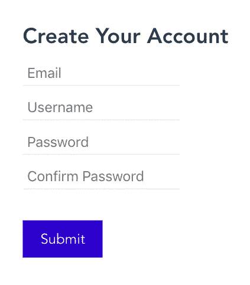
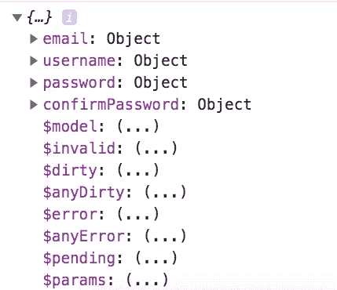
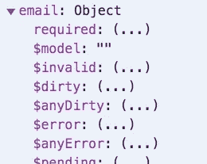
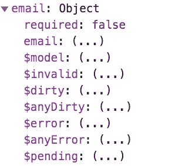
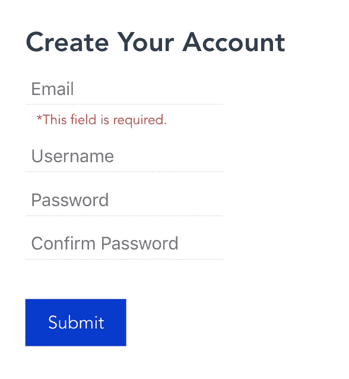
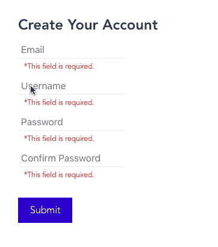
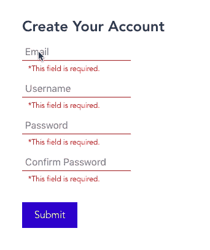

# 使用 Vue 表单验证变得更加智能— Vuelidate 教程

> 原文：<https://levelup.gitconnected.com/getting-smart-with-vue-form-validation-vuelidate-tutorial-ff9ca5b1ab9>


**Vue 表单验证是任何应用程序必不可少的一部分。你需要确保人们正在提交你的应用程序可以使用的数据！**

无论是确保用户有一个强密码，还是检查消息是否太长，输入验证在 web 应用程序中无处不在。

对 Vue 开发者来说幸运的是，Vuelidate 库为我们做了大部分艰苦的工作。我们不必编写数百个条件来验证我们的输入。我们变得更聪明地工作，而不是更努力地工作。

在本教程结束时，您应该…

*   知道 Vuelidate 是什么吗
*   安装它
*   构建基本的表单验证
*   了解一些高级的 Vuelidate 主题

Vuelidate 对所有 Vue 开发者来说都是一个很棒的库，所以让我们开始编码吧。

> 我们变得更聪明地工作，而不是更努力地工作。

# 什么是 Vuelidate？

[Vuelidate](http://vuelidate.js.org/) 为 Vue 项目提供基于模型的验证。

这是将表单验证添加到项目中的一种简单而强大的方法，因为它有许多内置的验证器。一些基础知识包括…

*   `required` -值不能为空
*   `minLength` / `maxLength` -提供值的最小或最大长度
*   `email` -值必须是有效的电子邮件地址格式
*   `alpha` -值只接受字母
*   `numeric` -值只接受数字

这只是 Vuelidate 提供的内置验证器的一个简短列表。要获得完整的列表，请务必访问[更新文档](https://vuelidate.js.org/#sub-builtin-validators)。

# 一个基本的 Vue 表单验证示例

现在我们知道了 Vuelidate 是什么，并对它能做什么有了一些概念，**让我们来实现它。**

首先，我们必须安装 Vuelidate 并将其包含在我们的`src/main.js`文件中。运行`npm install vuelidate --save`将其添加到您的 Vue 项目中。然后，在我们的 main.js 文件中，我们需要这两行将 Vuelidate 放入我们的应用程序。

```
import Vuelidate from 'vuelidate' Vue.use(Vuelidate)
```

好吧。Vuelidate 现在在我们的应用中，但是*我们如何使用它呢？*

在本教程中，我构建了一个包含 4 个字段的用户注册组件。

1.  电子邮件
2.  用户名
3.  密码
4.  确认口令

这是我们组件的代码。我添加了一些简单的样式来让我们的应用感觉不那么乏味，但是你可以一直使用许多 [Vue 输入库](https://learnvue.co/2020/01/9-vue-input-libraries-to-power-up-your-forms)中的一个。

```
<template>
  <div>
    <h2>Create Your Account</h2>
    <input class="form__input" type='text' placeholder='Email'/>
    <input class="form__input" type='text' placeholder='Username'/>
    <input class="form__input" type='password' placeholder='Password'/>
    <input class="form__input" type='password' placeholder='Confirm Password'/>
    <div class='form__submit' @click='submitForm'>
      Submit
    </div>
  </div>
</template>

<script>
export default {
  data () {
  },
  validations: {
  },
  methods: {
    submitForm () {
      alert('Form has been submitted')
    }
  }
}
</script>

<style scoped>
.form__input {
  border: none;
  outline: none;
  border-bottom: 1px solid #eee;
  font-size: 1em;
  padding: 5px;
  display: block;
  margin: 10px 0 5px 0;
}

.form__error {
  color: red;
  font-size: 0.75em;
  padding-left: 10px;
}

.form__submit {
  background-color: #0033cc;
  display: inline-block;
  color: white;
  padding: 10px 20px;
  text-align: center;
  cursor: pointer;
  margin-top: 30px;
}
</style>
```

如果我们检查我们的组件，它应该看起来像这样。



# 向我们的表单添加 Vuelidate

**Vuelidate 将新的验证属性**添加到我们的 options 对象中。这个验证对象将具有与我们正在收集的数据相同的属性。它与数据属性结合使用。

如果我们希望所有的字段都是必需的，首先我们必须从 Vuelidate 导入`required`验证器。然后，我们填充数据和验证对象。

```
import { required } from 'vuelidate/lib/validators'

export default {
  data() {
    return {
      email: '',
      username: '',
      password: '',
      confirmPassword: ''
    }
  },
  validations: {
    email: {
      required
    },
    username: {
      required
    },
    password: {
      required
    },
    confirmPassword: {
      required
    }
  }
}
```

现在我们有了一个基本的验证器，让我们的表单使用它。首先，我们必须知道 Vuelidate 在包含我们所有验证的 Vue 实例上公开了一个`$v`对象——它可以像`this.$v`一样被访问。

如果我们打印出`$v`对象，我们会看到它看起来像这样



然后，如果我们查看这些验证对象中的一个，例如`email`。我们将看到一个`$model`属性。



将我们的验证绑定到我们的数据。这就是我们如何在表单中使用 v-model 通过将我们的输入绑定到`$v.*propertyName*.$model`属性。

下面是将`v-model`添加到`email`属性的方法。所有其他输入遵循相同的格式。

```
<input 
   class="form__input" 
   type='text' 
   placeholder='Email' 
   v-model.trim='$v.email.$model'
/>
```

注意:我们可以在 v 模型中使用`.trim`修饰符来消除验证中的尾随/前导空格。想想空间是否值得保留。我只是把这个添加到邮件输入中。

# 向我们的用户显示错误

**如果我们再看一下**我们的`$v.email`对象，我们会看到我们包含的每个验证器都创建了一个新的布尔值。例如，我们的`required`属性在对象内部看起来像这样。



该值表示是否满足验证要求。对于 required，如果修剪值为空，则为 false，否则为 true。

我们可以使用这个布尔值和一个`v-if` 来向用户显示输入错误。

例如，如果我们想在电子邮件输入为空时显示*“此字段是必填的”*，可以这样做。

```
<div class="form__error" v-if='!$v.email.required'> 
   *This field is required. 
</div>
```

现在，只要我们的字段为空(并且不满足 Vuelidate 要求的验证)，这个 div 就会可见。



# 使用更高级的表单验证

**Vuelidate 提供了许多额外的内置**验证器，在这个例子中我们需要其中的一些。让我们仔细检查每个输入，并添加我们需要的验证器。

**用户名**

对于我们的注册组件的实现，我们希望对用户名输入施加以下规则。

*   `minLength` -设置用户名的最小长度
*   `maxLength` -设置用户名的最大长度
*   `alphaNum` -将我们的用户名限制为字母数字值

添加这三个内置的验证器后，我们新的电子邮件验证对象将如下所示。请记住，我们必须像对待 required 一样**导入**所有这些验证器。

```
import { required, minLength, maxLength, alphaNum, email, sameAs } from 'vuelidate/lib/validators'// ...validations: {
   username: {
      required,
      minLength: minLength(4),
      maxLength: maxLength(12),
      alphaNum
   }
}
```

然后，就像我们之前做的那样，我们可以通过添加更多的 div 语句向用户提供一些反馈。

```
<div class="form__error" v-if='!$v.username.required'>
      *This field is required.
</div>
<div class="form__error" v-if='!$v.username.minLength'>
      *Username must be at least 4 characters
</div>
<div class="form__error" v-if='!$v.username.maxLength'>
      *Username must be 12 characters or less
</div>
<div class="form__error" v-if='!$v.username.alphaNum'>
      *Username must be alphanumberic with no whitespace
</div>
```

对于内置验证器，我们不能做的一件事是确保用户名中没有空格。稍后，我们将添加一个自定义验证来检查这一点。

**电子邮件**

除了`required`，这个输入需要的另一个主要验证器是`email`，它决定这个值是否是一个有效的电子邮件地址。

```
email: {
      required,
      email
}
```

**密码**

对于这个例子，我们将保持它的基本性，并且说唯一的密码要求是它至少有 6 个字符长，所以我们将再次使用`minLength`。

```
password: {
      required,
      minLength: minLength(6)
}
```

在生产中，我们可以创建一个自定义验证来检查密码的强度，以确定它是否足够强。

**确认密码**

对`confirmPassword`字段的唯一真正要求是它匹配第一个密码。所有其他要求(在我们的例子中是长度)都应该在第一次输入密码时考虑到。

我们可以使用`sameAs`验证器检查两个输入之间的相等性，将密码验证对象(password)的名称作为它的参数。

```
confirmPassword: {
      required,
      sameAs: sameAs('password')
}
```

# 提交我们的 Vue 表单

**即使我们已经设置好了所有的**验证器，也没有什么可以阻止人们提交表单。

当我们尝试提交时，我们必须实际检查表单上是否有任何错误。

幸运的是，使用`$v.$anyError`属性非常简单。如果 Vuelidator 中的任何元素无效，则该布尔值为 true，如果一切正常，则为 false。

在我们的`submitForm`方法中，我们只需要检查表单上是否有错误。如果`this.$v.$anyError`是假的，我们都乖乖就范！

```
submitForm () {
      if (!this.$v.$anyError) {
        // actually submit form ...
        alert('Form submitted')
      } else {
        alert('Please fix errors and try again.')
      }
}
```

# 先进的虚拟技术

完成了一个基本的 Vuelidate 示例后，让我们来看看一些更复杂的技术，我们可以用它们来处理更复杂的表单。

在本教程中，我们将介绍 Vuelidate 的两个高级特性。

*   制作自定义验证器
*   执行异步验证

同样值得注意的是，表单验证可以提取到跨组件重用的和[混合](https://learnvue.co/2019/12/building-reusable-components-in-vuejs-tabs/)[中。](https://learnvue.co/2019/12/how-to-manage-mixins-in-vuejs/)

# 制作自定义验证器

**尽管有几十个内置的**验证器，但是有时候这些并不能满足你的项目需求。

即使在我们简单的示例表单中，我认为拥有一个确认器来确保在`username`输入中没有空白也是非常有用的。

要制作一个定制的验证器，我们所要做的就是编写一个普通的 Javascript 方法，返回一个布尔值。

例如，对于我们的无空白验证器，该方法如下所示。

```
const noWhitespace = (value) => value.indexOf(' ') === -1
```

然后，我们可以在用户名验证器中包含这个函数，就像内置的一样。

```
username: {
      required,
      minLength: minLength(4),
      maxLength: maxLength(12),
      alphaNum,
      noWhitespace
}
```

之后，它就像我们见过的所有其他验证器一样工作。

# 执行异步验证

**对于大多数高级应用**，你最终会需要异步验证——主要是当我们使用数据库时。这里有两个例子说明异步是必要的。

*   检查用户名是否可用
*   检查电子邮件是否已经链接到帐户

像使用定制验证器一样，我们必须编写一个 Javascript 方法。然而，这一次，我们要还一个承诺。

对于本例，我们将检查用户名是否可用。因为我们没有数据库，所以我们只使用`setTimeout`和一些硬编码的值。

```
const isUsernameAvailable = (value) => {

  if (value === '') {
    return true
  }
  const taken = ['username', 'matt', 'matthew']
  return new Promise((resolve, reject) => {
    setTimeout(() => {
      resolve(!taken.includes(value))
    }, 500)
  })
}
```

现在，如果我们检查我们的数据库，我们将看到我们的硬编码的“used”用户名集将导致一个错误。



# 额外提示—设计您的表单

让你的表单更加用户友好的最好方法之一就是提供漂亮的视觉反馈。有几种直观的方法可以做到这一点。我们就在这里讨论几个。

# 1.向输入中添加一个错误类

就像我们之前看到的，Vuelidate 中的每个验证属性都有一个`$anyError` 属性。

如果我们使用 Vue 的类绑定语法，我们可以根据`$anyError`属性的值轻松地添加/删除一个错误类。

例如，如果我们想在一个值无效时添加一个`form__input-error`类，我们可以这样做。

```
<input 
      class="form__input" 
      :class='{"form__input-error": $v.email.$error}'
      type='text' 
      placeholder='Email' 
      v-model.trim='$v.email.$model' 
/>
```

然后，我们可以随心所欲地设计这个类`form__input-error`的样式。

# 2.当一个值无效时增加一点震动

这比简单地添加一个类要复杂一点。首先，这是我们要做的



最好在`blur`事件上执行这个视觉提示——这意味着输入失去了焦点。这样，用户的最后一个动作(编辑输入)就是导致错误的原因，这一点非常清楚。

为此，我们需要两样东西:

1.  CSS 动画
2.  运行这个动画的 CSS 类

让我们将以下内容添加到我们的 CSS 代码中。

```
.form__input-shake {
  animation: shake 0.2s;
  animation-iteration-count: 3;
}

@keyframes shake {
  0% { transform: translateX(0px)  }
  25% { transform: translateX(2px) }
  50% { transform: translateX(0px)  }
  75% { transform: translateX(-2px) }
  100% { transform: translateX(0px)  }
}
```

接下来，让我们创建一个`checkIsValid`函数来检查验证器是否有任何错误，如果有，它会将动画类添加到我们的元素中，等待动画完成(0.2s * 3 = 600ms)，然后移除该类，以便以后可以再次添加它。

```
checkIsValid (val, event) {
      if (val.$anyError) {
        event.target.classList.add('form__input-shake')
        setTimeout(() => {
          event.target.classList.remove('form__input-shake')
        }, 600)
      }
}
```

最后，当我们的输入模糊时，我们必须调用这个函数。使用 Vue 的事件处理程序，有点像这样。

```
<input 
      class="form__input" 
      :class='{"form__input-error": $v.email.$error}'
      type='text' 
      placeholder='Email' 
      v-model.trim='$v.email.$model' 
      @blur='checkIsValid($v.email, $event)'
/>
```

# Vue 表单验证的结论

这就对了。

Vuelidate 是一个非常强大的工具，可以让你不用自己编写复杂的反应系统。我个人在无数个人项目中使用过。

现在，您应该知道如何开始使用 Vuelidate 了。我们涵盖了:

*   安装 Vuelidate
*   构建示例表单
*   添加 Vuelidate 的一些高级功能
*   设计表单样式以创造更好的用户体验

让我知道你是如何在你的项目中使用 Vuelidate 的。我很想听听你的创造性解决方案🙂

[如果你有兴趣了解更多关于 Vue 3 的知识，下载我的免费的 Vue 3 备忘单，里面有基本的知识，比如组合 API、Vue 3 模板语法和事件处理。](https://learnvue.co/vue-3-essentials-cheatsheet/)

*原载于 2020 年 1 月 29 日 https://learnvue.co*[](https://learnvue.co/2020/01/getting-smart-with-vue-form-validation-vuelidate-tutorial/)**。**