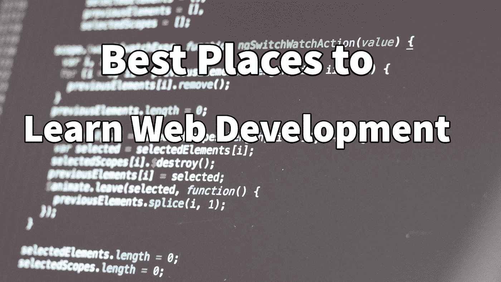

# Web 开发入门

> 原文：<https://levelup.gitconnected.com/getting-started-in-web-development-b7b3322cd536>

帮助你学习的优秀网络开发链接列表！

如果你看到这篇文章，你可能会问我:我如何开始编码？我写这篇文章是为了帮助跟踪最好的学习资源，而不是翻遍旧的 DMs。

幸运的是，所有关于编码的东西都是免费的。互联网始于分享免费知识的想法(这种想法正在慢慢消失)，所以网上有大量的资源。

首先我说我是项目学习者，所以我是通过选择项目和深潜来学习的。然而，除了学习或对编码如何工作有点好奇之外，并不是每个人都有特定的目标，所以这里的大多数链接只是一些基本的指导教程。这些链接主要关注 web 应用和网站开发，我还提供了一些学习如何使用终端和基本终端知识的资源。

这里有一篇关于[网络如何工作](https://developer.mozilla.org/en-US/docs/Learn/Common_questions/How_does_the_Internet_work)的快速文章。

还有，你想学一个好的文字编辑器。所有代码本质上都是一个文本文件(**不是**一个 Windows Word 文件！).我个人使用 [Atom](https://atom.io/) 。

## [W3 学校](https://www.w3schools.com /)

这是我开始的地方，但老实说，它要简单得多。现在他们有了更多的内容。但还是相对简单一些。

所以这是我学习的路线:

1.  超文本标记语言
2.  半铸钢ˌ钢性铸铁(Cast Semi-Steel)
3.  java 描述语言

然而，他们已经增加了这么多。它仍然是相当基础的，但它是一个伟大的开始。

## [FreeCodeCamp](https://www.freecodecamp.org/)

正如你在名字中看到的，它是免费的！

你会学到 HTML，CSS，JS。基本上所有网站编码到 web app 编码的基础知识。他们甚至会深入 React 这样的前端框架！

这是一个很棒的免费资源，你甚至可以在这里获得认证，并将其添加到你新发现的技术简历中。全部免费！

## [奥丁项目](https://www.theodinproject.com/)

Odin 项目是另一个指导性教程。它的重点是全栈开发，你可以用 Javascript 或 Ruby on Rails 做后端。

## [MDN 网络文档](https://developer.mozilla.org/en-US/)

这更像是一个参考指南，但它真的好吗？

## [Chrome 开发工具](https://developer.chrome.com/docs/devtools/)

谷歌 Chrome 和大多数网络浏览器都有某种开发工具。但在我看来谷歌 Chrome 是最好的。去学习如何使用它，并与你最喜欢的网站鬼混。了解它们是如何构建的，以及您的浏览器是如何解释代码来为您带来您喜爱的网站的。

## [极限战争游戏](https://overthewire.org/wargames/bandit/)

这与 web 编程没有太大关系，但它确实以一种非常有趣的方式教你如何导航你的终端，并学习你作为一个开发人员需要的基本 Linux 工具。加上一些基本的计算机知识。

欢迎在 Twitter 上关注我，获取更多技术文章，或者在 Medium 上关注我。

[在推特上关注我:](https://twitter.com/calickahh)@ djfronz

[在 Instagram 上关注我:](https://twitter.com/calickahh)@ djfronz

[在 LinkedIn 上联系我](https://www.linkedin.com/in/stcalica/)。