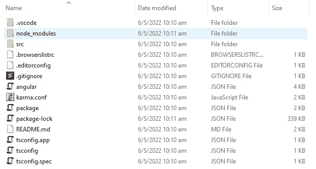
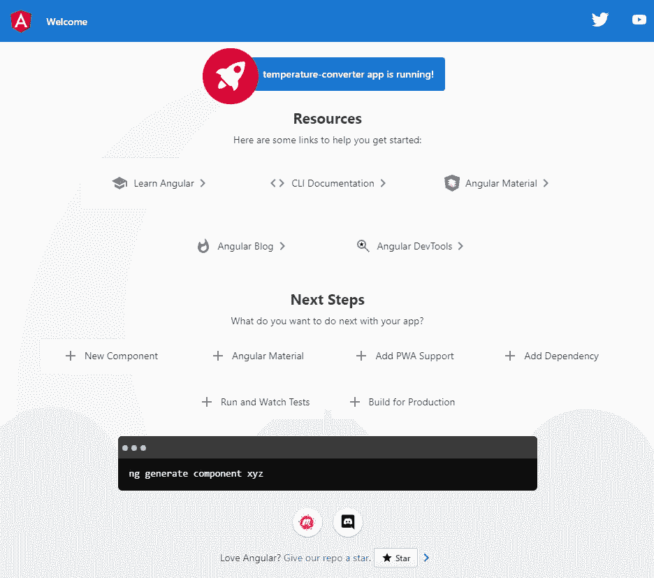
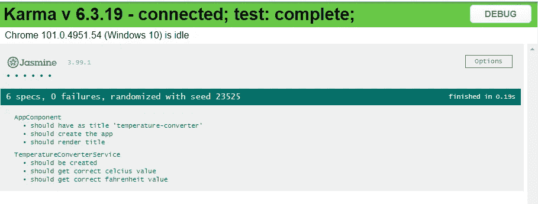
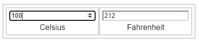

# Angular 入门

> 原文：<https://levelup.gitconnected.com/getting-started-with-angular-daf63df15c3f>

# 什么是有角？

在我看来，Angular 是构建你自己定制的 html 标签的平台和框架。虽然 html 有一组固定的标签(例如，`<h1>`、`<a>`、`<form>`、`<input>`等)可以用来建立你的网站，Angular 让你用现有的 html 标签创建你的定制标签(例如，`<temperature-converter>`、`<my-login-form>`等)，确定它们应该如何看起来和行为。

但是 Angular 内置的这些标签包含在 Angular 生态系统中，所以你不能简单地在普通的 html 页面中重复使用这些标签，但是你的整个网站是由你创建的所有这些定制标签组成的。Angular 框架提供的单个 html 页面中将有一个主标签(例如`<app-root>`)，app-root 可以包含并链接到您创建的其他定制标签，但所有内容都包含在`<app-root>`中。当然，因为你的浏览器只能识别 html 标签，所以你创建的所有定制标签都会被编译成普通的 html。**有时候，你可以把它想象成创建一个额外步骤的网站。但是创建定制标签的好处是您可以重用它，而不是重新创建 html。这些“定制标签”在 Angular 中被称为**组件**。组件不仅允许您重用外观，还允许您重用标签的行为。比如当你点击这个按钮或者在文本框中输入时会发生什么。有了框架的正确知识和实现，它也使代码更容易理解和维护。然而，我想强调的是“正确的知识和实现”，因为我已经看到了许多误用的情况，这样有时创建正常的 html 可能更容易。

# 入门指南

作为一个平台，Angular 为用户自动化了相当多的步骤，使代码清晰易懂。例如，对于你创建的每个组件，Angular 把它分成 3 个文件——行为(类型脚本)、外观(html)和格式(css)。这三个文件需要在一个文件夹中，具有相同的名称，但不同的扩展名。手动操作可能会相当麻烦。所以 Angular 附带了命令行界面(CLI)，这样这些手动任务就可以自动化了。

要开始使用 Angular 进行开发，您需要安装 NodeJS 和 NPM。然后使用以下命令安装 Angular CLI。

```
npm install -g @angular/cli
```

现在，您可以创建自己的应用程序了。

# 例子

在本文中，我将演示如何创建一个简单的温度转换器(C 到 F / F 到 C)。首先用下面的命令让 Angular 生成准系统，然后选择默认选项。

```
ng new temperature-converter
```

就是这样！文件夹的整个结构是为你创建的，它本身就是一个正在运行的应用程序。



您可以通过运行`ng serve`来运行它，看看它看起来是什么样子，并且您将被提示通过在您的浏览器中转到`http://localhost:4200`来查看该应用程序。



如你所见，`ng`是角度命令，你有不同的选项来做不同的事情。要获得完整列表和更多信息，请运行`ng help`。

你可以在`src`文件夹中看到`index.html`，还有一个不熟悉的`<app-root>` html 标签在里面。默认情况下，`<app-root>`是为您创建的，它的代码可以在`src/app`文件夹中找到。

事实上，您可能只需要关注`src/app`文件夹，其他的通常不是开发过程中的主要关注点。

# 文件描述

这些是您将在`src/app`文件夹中看到的文件:

*   应用程序.组件. css
*   app.component.html
*   应用程序.组件.规格
*   应用程序组件
*   应用程序模块

前缀为`app.component`的文件都是默认创建的`<app-root>`组件。`app.component.spec.ts`是单元测试。`app.module.ts`是模块文件，用于导入所有其他模块，并声明从您的应用程序中导出的内容。因此，模块位于层次结构的顶部，所有其他组件和服务都位于其下。

# 服务

对于 MVC 模式来说，隔离业务逻辑是一个很好的实践，这样就可以在需要时导入和重用业务逻辑。Angular 也是这么想的，所以有生成服务文件的命令。对于我们的应用程序来说，我们将创建一个温度转换服务，将摄氏温度转换为华氏温度，反之亦然。

```
ng generate service temperature-converter
```

这将创建两个文件—temperature-converter . service . ts 和 temperature-converter . service . spec . ts。扩展名为`spec.ts`的文件是单元测试。让我们关注 now-temperature-converter . service . ts 的主服务文件。注意，Angular 自动将`service`添加到您的扩展中，以便突出该文件是一个服务。生成的代码如下:

```
import { Injectable } from '@angular/core';@Injectable({
  providedIn: 'root'
})
export class TemperatureConverterService { constructor() { }
}
```

> 注意:`@Injectable`是该类的装饰器，因此可以通过依赖注入将它注入到其他类中。

我们将在这个文件中添加两个函数来转换摄氏温度和华氏温度，反之亦然。

```
import { Injectable } from '@angular/core';@Injectable({
  providedIn: 'root'
})
export class TemperatureConverterService { constructor() { } **convertCtoF(c: number): number {
    return parseFloat(((c * 9 / 5) + 32).toFixed(1));
  }** **convertFtoC(f: number): number {
    return parseFloat(((f - 32) * 5  / 9).toFixed(1));
  }**
}
```

# 测试

作为一个好的实践，我们应该编写一些单元测试来确认函数将给出正确的结果。因此，更新了温度转换器的规格。

```
import { TestBed } from '@angular/core/testing';import { TemperatureConverterService } from './temperature-converter.service';describe('TemperatureConverterService', () => {
  let service: TemperatureConverterService; beforeEach(() => {
    TestBed.configureTestingModule({});
    service = TestBed.inject(TemperatureConverterService);
  }); it('should be created', () => {
    expect(service).toBeTruthy();
  }); it('should get correct fahrenheit value', () => {
    expect(service.convertCtoF(0)).toEqual(32);
    expect(service.convertCtoF(100)).toEqual(212);
    expect(service.convertCtoF(37.9)).toEqual(100.2);
    expect(service.convertCtoF(50.1)).toEqual(122.2);
  }); it('should get correct celcius value', () => {
    expect(service.convertFtoC(0)).toEqual(-17.8);
    expect(service.convertFtoC(100)).toEqual(37.8);
    expect(service.convertFtoC(212)).toEqual(100);
    expect(service.convertFtoC(32)).toEqual(0);
  });
});
```

您可以使用`ng test`运行单元测试。



# 成分

现在，让我们关注我们的主要组件`<app-root>`。为该组件创建了 4 个文件:

*   应用程序.组件. css
*   app.component.html
*   应用程序.组件.规格
*   应用程序组件

`app.component.ts`是所有变量声明和函数应该驻留的地方，`app.component.html`是编写 html 以确定组件外观的模板，`app.component.css`是组件的样式表。默认生成的`app.component.ts`如下:

```
import { Component } from '@angular/core';@Component({
  selector: 'app-root',
  templateUrl: './app.component.html',
  styleUrls: ['./app.component.css']
})
export class AppComponent {
  title = 'temperature-converter';
}
```

`@Component`是一个装饰器，用于将文件组合在一起。`selector`表示 html 标签应该是什么，在本例中是`<app-root>`。`templateUrl`表示该组件的 html 文件，`styleUrls`表示样式表。我们班取名`AppComponent`。`title`只是一个默认生成的属性，我们不需要它，所以可以安全地删除它。我们将代码转换如下:

```
import {Component, Input} from '@angular/core';
**import {TemperatureConverterService} from "./temperature-converter.service";**@Component({
  selector: 'app-root',
  templateUrl: './app.component.html',
  styleUrls: ['./app.component.css']
})
export class AppComponent {
  **fahrenheit?: number;
  celsius?: number;** constructor(
    **private temperatureConverter: TemperatureConverterService**
  ) {
  } **updateFahrenheit(){
    if(this.celsius == null) this.celsius = 0;
    this.fahrenheit = this.temperatureConverter.convertCtoF(this.celsius!);
  }** **updateCelsius(){
    if(this.fahrenheit == null) this.fahrenheit = 0;
    this.celsius = this.temperatureConverter.convertFtoC(this.fahrenheit!);
  }**
}
```

首先，我们声明`fahrenheit`和`celsius`属性来绑定要在输入框中输入和显示的内容，这样这两个变量将自动包含在各自的输入框中输入或显示的内容。

接下来，我们将之前创建的 TemperatureConverterService 注入到构造函数中，这样我们就可以使用这些函数了。注意顶部的 import 语句— `import {TemperatureConverterService} from "./temperature-converter.service";`。然后将`private temperatureConverter: TemperatureConverterService`添加到构造函数的参数中。

最后但同样重要的是，我们添加了两个函数— `updateFahrenheit()`和`updatedCelsius()`，每当输入框中的值发生变化时，都会调用这两个函数。

我们还必须改变`app.component.html`，以便它看起来像我们想要的样子。首先，删除文件中的所有内容，并将其替换为:

```
<div class="box">
  <div class="box">
    <input type="number" data-test-id="celsius-input" [(ngModel)]="celsius" class="border" (ngModelChange)="updateFahrenheit()" />
    <div class="box-text">Celsius</div>
  </div>
  <div class="box">
    <input type="number" data-test-id="fahrenheit-input" [(ngModel)]="fahrenheit" class="border" (ngModelChange)="updateCelsius()" />
    <div class="box-text">Fahrenheit</div>
  </div>
</div>
```

`[(ngModel)]`表示 html 标签和它所赋给的变量之间的双向绑定。在`[(ngModel)]="celsius`的情况下，对输入框中的值的任何改变，将改变分配给类中的`celcius`属性的值，并且对类`app.component.ts`中的`celsius`属性的值的任何改变将反映在输入框的值中。当`ngModel`中指定的值有任何变化时，`(ngModelChange)`将调用该函数。所以，只要有人在摄氏输入框中输入，就会调用`updateFahrenheit()`函数。

`data-test-id`只是一个[数据属性](https://developer.mozilla.org/en-US/docs/Learn/HTML/Howto/Use_data_attributes)，用于我们在单元测试中识别测试的 html 标签。

要设计组件的样式，更新`app.component.css`使其如此。

```
.box {
  padding: 5px;
  border-width: 2px;
  border-color: lightgrey;
  border-style: solid;
  display: inline-block;
}.box input {
  border-color: lightgrey;
}.box-text {
  text-align: center;
  font-family: sans-serif;
  margin-top: 5px;
}
```

最后，作为一个好的实践，用测试用例来检查你的代码是否工作正常，更新`app.component.spec.ts`也是如此。

```
import {ComponentFixture, TestBed} from '@angular/core/testing';
import { RouterTestingModule } from '@angular/router/testing';
import { AppComponent } from './app.component';
import {FormsModule} from "@angular/forms";describe('AppComponent', () => { let fixture: ComponentFixture<AppComponent>;
  let component: AppComponent;
  let compiled: any;
  let celsiusInput: any;
  let fahrenheitInput: any; beforeEach(async () => {
    await TestBed.configureTestingModule({
      imports: [
        RouterTestingModule,
        FormsModule
      ],
      declarations: [
        AppComponent
      ],
    }).compileComponents();
  }); beforeEach(() => {
    fixture = TestBed.createComponent(AppComponent);
    fixture.autoDetectChanges(true);
    component = fixture.componentInstance;
    compiled = fixture.debugElement.nativeElement;
    celsiusInput = getByTestId("celsius-input");
    fahrenheitInput = getByTestId("fahrenheit-input");
    fixture.detectChanges();
  }); const getByTestId = (testId: string) => {
    return compiled.querySelector(`[data-test-id="${testId}"]`);
  }; const pushCelsiusValue = async (value: number) => {
    celsiusInput.value = value;
    celsiusInput.dispatchEvent(new Event('change'));
    celsiusInput.dispatchEvent(new Event('input'));
    await fixture.whenStable();
    await fixture.detectChanges();
  }; const pushFahrenheitValue = async (value: number) => {
    fahrenheitInput.value = value;
    fahrenheitInput.dispatchEvent(new Event('change'));
    fahrenheitInput.dispatchEvent(new Event('input'));
    await fixture.whenStable();
    await fixture.detectChanges();
  } it('should create the app', () => {
    expect(component).toBeTruthy();
  }); it('Typing value in Celsius field gets correct Fahrenheit value', async() => {
    await pushCelsiusValue(500);
    fahrenheitInput = getByTestId('fahrenheit-input');
    expect(Number(fahrenheitInput.value)).toEqual(932);
  }); it('Typing value in Celsius field gets correct Fahrenheit value upto 1 decimal values', async() => {
    await pushCelsiusValue(32);
    fahrenheitInput = getByTestId('fahrenheit-input');
    expect(Number(fahrenheitInput.value)).toEqual(89.6);
  }); it('Typing value in Fahrenheit field gets correct Celsius value', async() => {
    await pushFahrenheitValue(932);
    celsiusInput = getByTestId('celsius-input');
    expect(Number(celsiusInput.value)).toEqual(500);
  }); it('Typing value in Fahrenheit field gets correct Celsius value upto 1 decimal values', async() => {
    await pushFahrenheitValue(100);
    celsiusInput = getByTestId('celsius-input');
    expect(Number(celsiusInput.value)).toEqual(37.8);
  }); it('Perform series of actions', async() => {
    await pushFahrenheitValue(10);
    celsiusInput = getByTestId('celsius-input');
    expect(Number(celsiusInput.value)).toEqual(-12.2); await pushCelsiusValue(10);
    fahrenheitInput = getByTestId('fahrenheit-input');
    expect(Number(fahrenheitInput.value)).toEqual(50); await pushFahrenheitValue(200);
    celsiusInput = getByTestId('celsius-input');
    expect(Number(celsiusInput.value)).toEqual(93.3); await pushCelsiusValue(248);
    fahrenheitInput = getByTestId('fahrenheit-input');
    expect(Number(fahrenheitInput.value)).toEqual(478.4);
  });
});
```

我现在不会讨论如何为 Angular 编写测试用例，因为它太长了，留待以后的文章讨论。

运行`ng serve`并再次打开浏览器到`localhost:4200`。Tada！尝试在摄氏和华氏输入框中输入一些内容。



完整的代码可以在 https://github.com/thecodinganalyst/temperature-converter 上找到。