# Kubernetes 集群上的 ArgoCD 入门

> 原文：<https://levelup.gitconnected.com/getting-started-with-argocd-on-your-kubernetes-cluster-552ca5d8cf41>

在 Kubernetes 集群上设置 ArgoCD 并将资源与 GitHub 存储库同步的分步指南。


## 先决条件

对于本教程，您需要一个可用的正在运行的 Kubernetes 集群。最简单的方法是用 K3s 集群建立一个流浪者 VM，如我的另一篇文章中所示。

[](/local-kubernetes-development-using-vagrant-and-k3s-547bd5687a7f) [## 利用 vagger 和 K3s 开发本地 Kubernetes

### 在您的本地漫游机器上设置 K3s，并从您的…

levelup.gitconnected.com](/local-kubernetes-development-using-vagrant-and-k3s-547bd5687a7f) 

你应该查看我准备的 GitHub 库[这里](https://github.com/Abszissex/medium-argocd)来正确地遵循本教程，并且你的 ArgoCD 定义开箱即用。

[](https://github.com/Abszissex/medium-argocd) [## GitHub-abszisex/medium-argocd

### 此时您不能执行该操作。您已使用另一个标签页或窗口登录。您已在另一个选项卡中注销，或者…

github.com](https://github.com/Abszissex/medium-argocd) 

`manifests`文件夹包含所有 ArgoCD 应用程序资源和我们稍后将应用的舵图。

`vagrant`文件夹包含一些预先配置的自动设置 K3s 集群的浮动文件。

# ArgoCD 设置

在您确认您的集群已经启动并运行之后，就该在其上设置 ArgoCD 了。

首先，我们必须为 ArgoCD 设置一个名称空间。

```
kubectl create namespace argocd
```

其次，我们必须应用官方 ArgoCD 文档提供的 Kubernetes 清单，其中包含几个部署和服务资源，以使 ArgoCD 开箱即用。

```
kubectl apply -n argocd -f https://raw.githubusercontent.com/argoproj/argo-cd/stable/manifests/install.yaml
```

启动所有预先配置的 ArgoCD 资源可能需要一些时间，这取决于您的计算机资源，但是您可以使用以下命令定期检查 ArgoCD 是否准备就绪。

```
kubectl get all -n argocd
```

当一切准备就绪时，它应该如下所示:

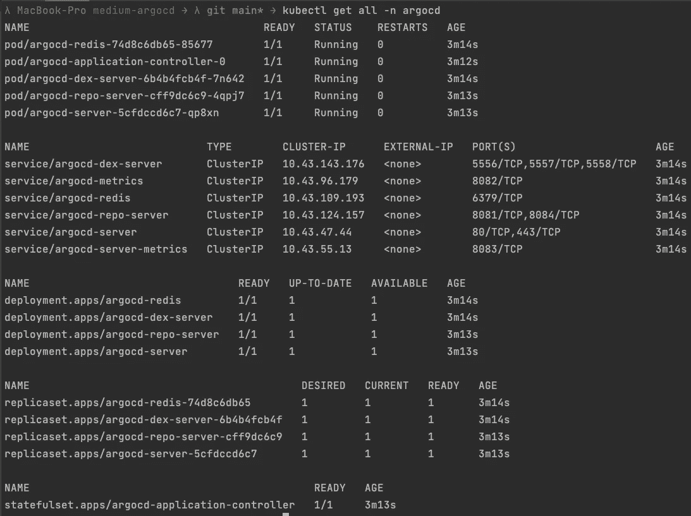

kubectl 获取全 n argocd

## 创建您的第一个 ArgoCD 应用程序

为了让 ArgoCD 正确管理您的舵图，您需要在您的 Kubernetes 集群上创建并运行一个“ArgoCD 应用程序”,它负责将您的资源与您提供的 GitHub 存储库同步。

你可以在我上面提到的位于`manifests/argo/argocd-app.yaml`的 GitHub 库或者下面的要点中找到一个例子。

让我们检查一下这个 YAML 文件最重要的属性。

*   `apiVersion`和`kind`定义该资源应该是 ArgoCD 应用程序，这是 ArgoCD 提供的“自定义资源定义”(CRD)
*   `spec.destination`告诉应用程序 ArgoCD 应该在哪里部署同步的资源。在我们的例子中，它是我们自己的本地 Kubernetes 集群。
*   通过`spec.source`,您可以定义舵图的目的地、您想要应用的值文件以及存储库 URL。请注意，在这种情况下，您的存储库需要是公共的。此外，您必须使用 HTTPS 变体而不是 SSH，因为我们的 ArgoCD 应用程序还没有配置任何 SSH 凭证来与 GitHub 进行身份验证。
*   最后但同样重要的是，`spec.syncPolicy`定义了 ArgoCD 应该如何同步资源。我们目前将它设置为一个空对象`{}`，因为我们想要手动点击“同步”按钮。但是稍后，我还将向您展示如何设置自动同步策略，以便 ArgoCD 自动更新您的资源。

您可以使用以下方法创建此资源:

```
kubectl apply -f manifests/argo/argocd-app.yaml
```

## 在您的机器上公开 ArgoCD 用户界面

因为我们想点击“同步”按钮并查看我们的应用程序部署，所以我们需要一些 GUI。幸运的是，ArgoCD 已经在我们的 Kubernetes 集群上安装了它。要访问它，唯一缺少的是我们通过一个`NodePort`服务资源公开它。

你可以在我上面提到的位于`manifests/argo/argocd-nodeport.yaml`的 GitHub 库或者下面的要点中找到一个例子。

我们不会详细讨论每个属性，但对我们来说最重要的是`spec.ports`定义。

在定义中，您可以看到我们为 30007 上的端口 80 (HTTP)和 30008 上的端口 443 (HTTPS)公开了`nodePort`。这意味着我们可以在本地机器的端口 30007 和 30008 上访问这个服务和隐藏的 ArgoCD UI。但是由于本地开发，您将很可能没有有效的 SSL 证书，所以让我们使用 30007 端口。对于生产级应用程序，我建议删除端口 80 上的映射，只暴露 HTTPS 变体。

您可以使用以下方法创建此资源:

```
kubectl apply -f manifests/argo/argocd-nodeport.yaml
```

除了分别应用这两个脚本之外，您还可以使用以下命令同时应用这两个脚本:

```
kubectl apply -f manifests/argo
```

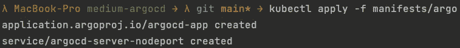

正在创建 ArgoCD 应用程序和服务| `kubectl apply -f 清单/argo '

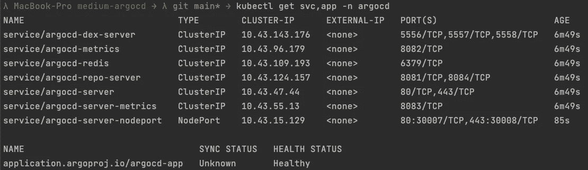

正在检查 kubectl 是否已正确部署 ArgoCD 应用程序和服务| `kubectl get svc，App-n ArgoCD ` 1

## 访问 ArgoCD 用户界面

在应用了上面提到的应用程序和服务之后，就该访问 ArgoCD UI 了。

您可以通过在浏览器中导航到 [http://localhost:30007](http://localhost:30007) 来访问 ArgoCD UI。当然，您的浏览器会警告您试图访问一个不安全的连接，但是这对于演示目的和本地开发来说是可以的。

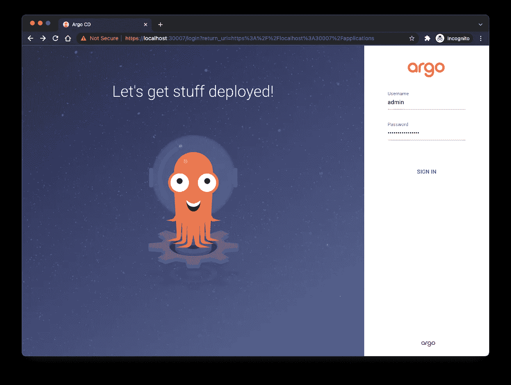

导航到 [http://localhost:30007](http://localhost:30007) 上的 ArgoCD 用户界面

ArgoCD 用户界面需要身份验证。默认用户是`admin`。并且可以使用下面的`kubectl`命令接收初始自动生成的密码。当然，如果您愿意，您可以稍后在 UI 中对此进行更改。

```
kubectl -n argocd get secret argocd-initial-admin-secret -o jsonpath="{.data.password}" | base64 -d; echo
```

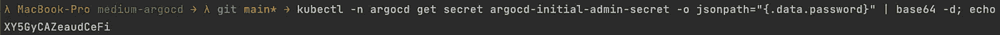

## 同步您的资源

登录后，网站会将你重定向到应用概述页面，在这里你已经可以看到你以前部署的`argocd-app`。此外，您还会看到黄色图标，根据您的掌舵图，这些图标表示资源缺失且不同步。

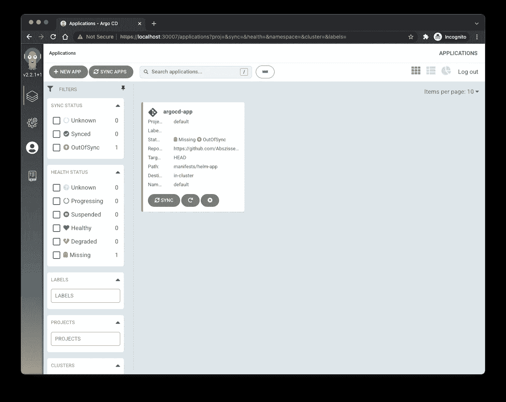

ArgoCD UI |应用程序概述

单击应用程序标题，您将看到应用程序详细信息视图。在这里，您已经注意到 ArgoCD 告诉您它需要一个名称空间、服务和一个基于 Helm 图表的部署资源，至少如果您从我的演示存储库中取出一个的话。但是它们都不可用，因为我们在`manfiests/argo/argocd-app.yaml`中阻止了自动同步。

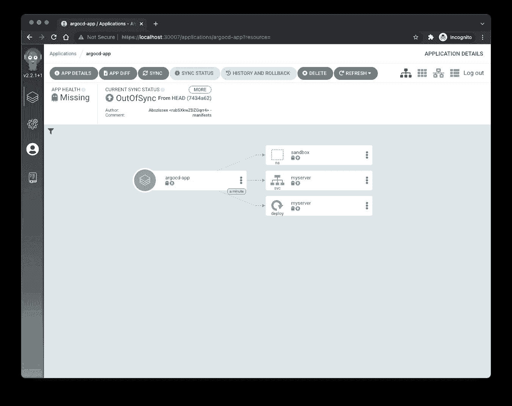

ArgoCD UI |应用程序详细视图

要让 ArgoCD 创建资源，我们可以点击顶部的`SYNC`按钮，在右侧面板上选择我们想要同步的资源(您应该总是选择所有资源)，然后点击右侧面板上的`SYNCHRONIZE`按钮，如下图所示:

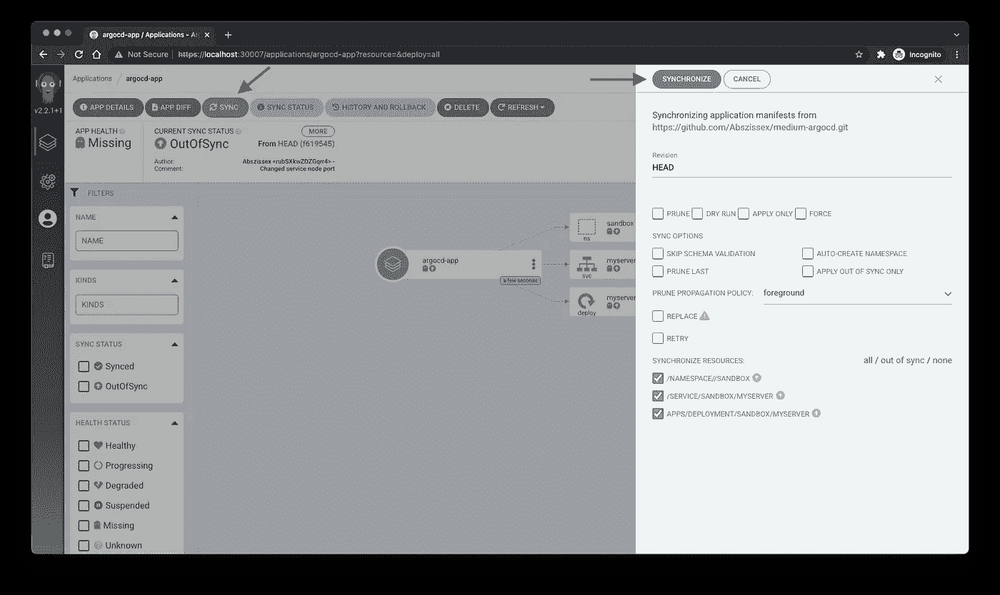

ArgoCD UI |同步资源

几秒钟后，您应该会看到 ArgoCD 如何加速所有先前丢失的资源并进入“绿色状态”，这表明一切都已同步。

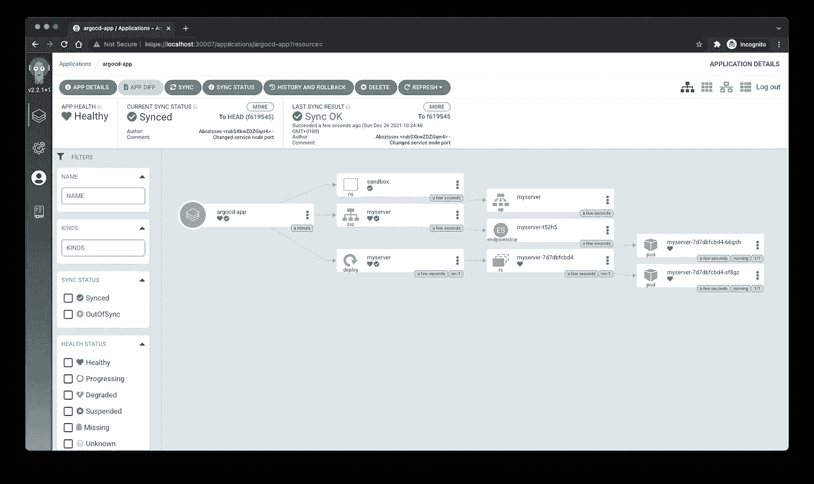

Argo CD UI |同步资源

## 改变你的资源

现在，让我们将`manifests/helm-app/templates/deployment.yaml`中部署的副本从两个更改为三个，提交并将更改推送到存储库，并重新检查我们的 ArgoCD UI。

正如你在下图中看到的，ArgoCD 告诉我们，我们的应用程序不同步，当我们点击`MORE`按钮时，它还会向我们提供最新更改的提交消息。在这种情况下，它显示我写的提交消息:“将部署副本从 2 更改为 3”

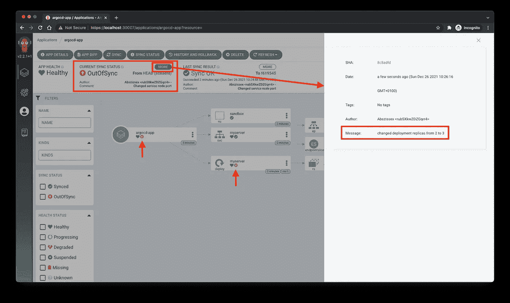

Argo CD 用户界面|不同步

当然，只要您和您的团队坚持使用正确的 git 提交消息，git 提交消息总是一个很好的指示器，一眼就能看出发生了什么变化。但是即使这样做，也不能将所有内容都放入 git commit 消息中。因此，找出与新状态相比当前状态发生了什么变化的最好方法是检查发生变化的资源的实际差异。

Argo CD UI 提供了现成的简洁的 diff 功能。当你点击左上角的`APP DIFF`按钮时，ArgoCD 将打开另一个面板，显示所有像 GitHub 或类似的 VSC 提供商改变的资源。

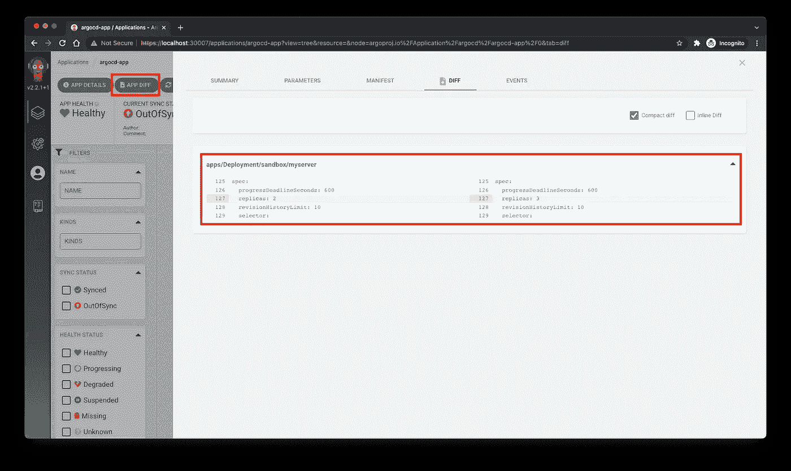

Argo CD UI |资源差异

当您对最后一次提交引入的更改感到满意时，您可以再次点击`SYNC`按钮，就像我们在开始时所做的那样，ArgoCD 将更新您的资源，变成绿色，您将在 UI 中看到三个而不是两个副本。

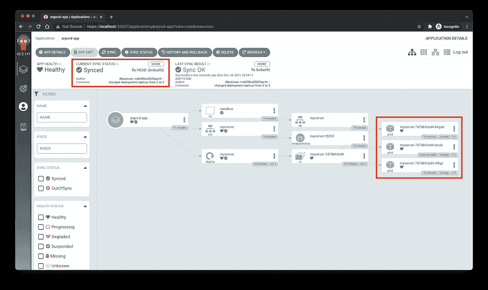

Argo CD UI |再次与三个副本同步

## ArgoCD 同步策略

尽管通过手动点击 sync 按钮可以非常容易地将更改应用到您的 Kubernetes 资源，但是仍然缺少实际的连续部署感觉，即所有内容都会自动更新。

但是不用担心。当然，ArgoCD 也能够以完全自动的方式应用您的更改。

正如在开始时已经提到的，ArgoCD 应用程序资源提供了一个`syncPolicy`属性来配置自动部署行为。

现在让我们在现有的 ArgoCD 应用程序的`syncPolicy`属性中添加一些同步策略。

自动同步策略有三种不同的属性可供您配置。

*   `prune` —如果`true` ArgoCD 被允许在自动同步期间修剪资源。
*   `allowEmpty` —如果`true`，允许在自动同步过程中删除所有应用程序资源。
*   `selfHeal` —如果`true` ArgoCD 可以根据提供的舵图自动创建和更新资源。

如果我们通过`kubectl`将更改后的 ArgoCD 应用程序再次应用于我们的集群，然后再次对我们的舵图进行另一项更改，例如，恢复我们之前更改的副本，ArgoCD 将自动应用这些更改，无需任何人工操作。

关键的一点是，自动同步不能很好地与 ArgoCD 回滚机制一起工作。这是意料之中的，因为回滚通常是手动操作，而自动同步会立即将回滚恢复为再次与存储库同步。

## ArgoCD 回滚

如果您在部署的资源上遇到问题，并且想要回滚到以前的状态，那么使用 ArgoCD 就很容易了。

要回滚，您只需点击应用程序顶部的`HISTORY AND ROLLBACK`按钮，选择您想要回滚到的提交，然后点击`Rollback`按钮。

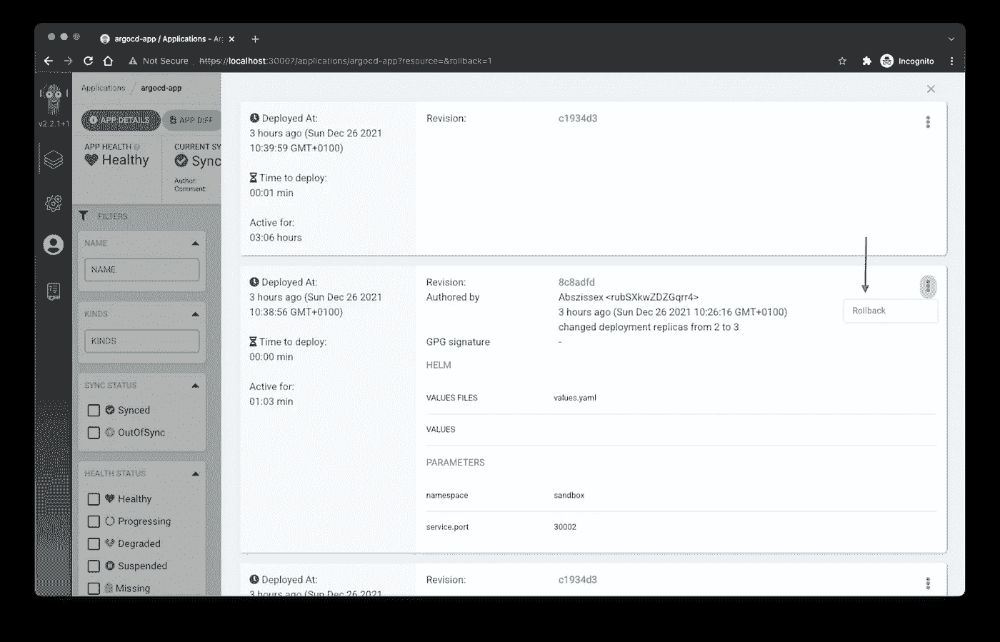

ArgoCD UI |回滚

如果您启用了一些自动同步策略，ArgoCD UI 将显示一些弹出窗口，提示您不能同时使用自动同步和回滚，以及是否应该禁用自动同步。如果您点击`OK`，ArgoCD 将从您的 ArgoCD 应用程序中删除自动同步策略并执行回滚。

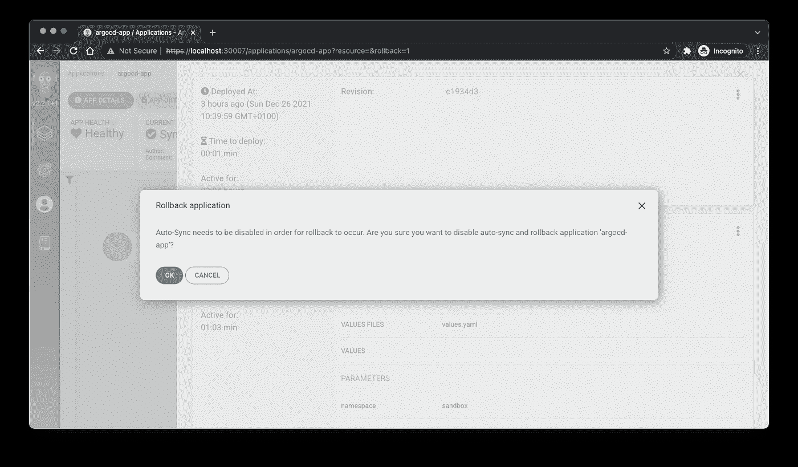

ArgoCD UI |回滚自动同步弹出菜单

但是你现在需要小心。如果您使用启用的自动同步策略重新应用 ArgoCD 应用程序清单，ArgoCD 将确保您的应用程序再次同步，并且您的回滚将被恢复。

# 摘要

如您所见，使用 ArgoCD 的第一步非常简单，也没有那么难🙂。

希望我引起了您对为您的持续部署测试 ArgoCD 的兴趣，并可以帮助您快速开始。

## 你想联系吗？

如果你想联系我，请在 LinkedIn 上联系我。

另外，可以随意查看[我的书籍推荐](https://medium.com/@mr-pascal/my-book-recommendations-4b9f73bf961b)📚。

[](https://mr-pascal.medium.com/my-book-recommendations-4b9f73bf961b) [## 我的书籍推荐

### 在接下来的章节中，你可以找到我对所有日常生活话题的书籍推荐，它们对我帮助很大。

mr-pascal.medium.com](https://mr-pascal.medium.com/my-book-recommendations-4b9f73bf961b) [](https://mr-pascal.medium.com/membership) [## 通过我的推荐链接加入 Medium—Pascal Zwikirsch

### 作为一个媒体会员，你的会员费的一部分会给你阅读的作家，你可以完全接触到每一个故事…

mr-pascal.medium.com](https://mr-pascal.medium.com/membership)