# 使用 rook 运算符在 Openshift 上开始使用 Ceph

> 原文：<https://levelup.gitconnected.com/getting-started-with-ceph-on-openshift-using-rook-operator-67d19df9e1a8>

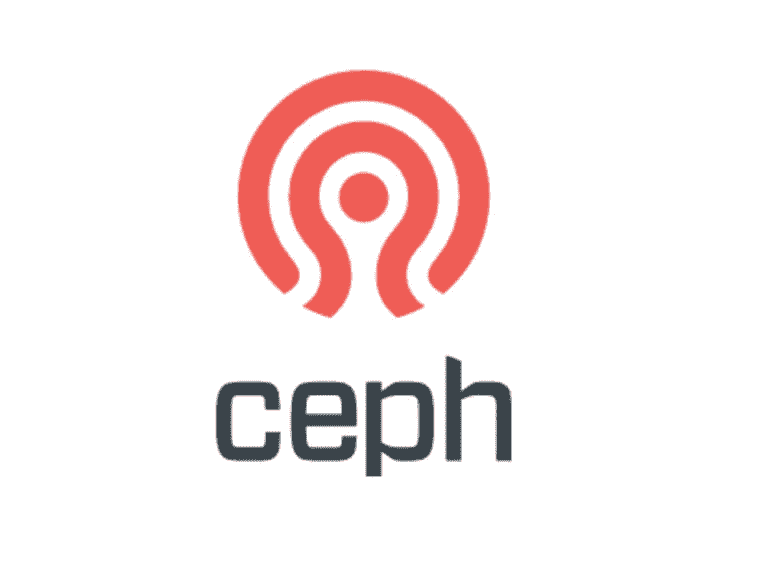

Ceph 是一个软件解决方案，旨在解决存储问题。它被设计用来解决对象、块和文件系统的存储问题，我们很少在其他软件系统中看到这种情况。

Ceph 厉害！它是最可靠、最稳定的存储软件平台之一。一周前我听说了 ceph，我的第一个想法是，“它是新的吗？有多靠谱？”。Ceph 自 2006 年以来一直存在，它的第一个稳定版本是在 2012 年左右，并且一直在积极开发中，最近的一个版本是在几天前。当我说它功能强大时，我指的是它的可靠性、敏捷性、灵活性以及它支持的不同存储类型的阵列。

## 为什么在 Openshift 上使用 ceph？

Ceph 非常适合当今的云技术。它是安全可靠的。它处理工作量。它是可以缩放的。为什么不呢？

## 什么是车，它在这里做什么？

我们上面谈到的 ceph 集群是由 rook 操作符管理的。正如他们在 rook.io 中所说，“它将分布式存储系统转变为自我管理、自我扩展、自我修复的存储服务”。

> 在这里，Rook 还为 Ceph 集群部署 osd、mon、mgr 和 rgw 守护进程作为 Kubernetes pods。

# 现在让我们开始吧…

假设您已经设置好 OpenShift 客户端 CLI，并且已经登录。

您可以从下面提到的 git repo 中克隆所需的 YAML 文件。

```
git clone [https://github.com/Streaming-multiple-video-sources-Edge/Ceph-setup-YAML-files.git](https://github.com/Streaming-multiple-video-sources-Edge/Ceph-setup-YAML-files.git)
cd <location where the files are downloaded>
```

我们从部署公共资源开始

```
oc create -f common.yaml
```

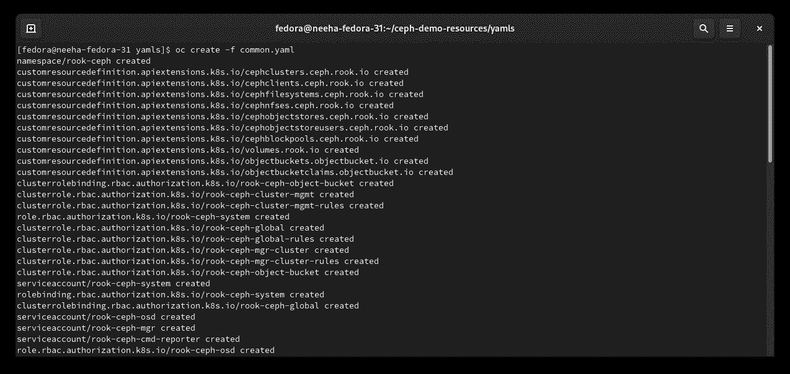

如果你看到这些项目，你会看到新创建的 rook-ceph。将当前项目改为 **rook-ceph** 。

```
oc project rook-ceph
```

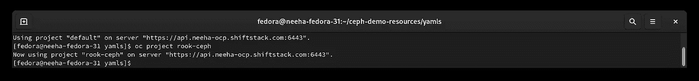

我们在上一节谈到了车操作符，下面我们部署车操作符。这将监控存储守护程序，并确保进程的健康状态。

```
oc apply -f [https://raw.githubusercontent.com/rook/rook/v1.3.6/cluster/examples/kubernetes/ceph/operator-openshift.yaml](https://raw.githubusercontent.com/rook/rook/v1.3.6/cluster/examples/kubernetes/ceph/operator-openshift.yaml)or oc create -f operator-openshift.yaml
```

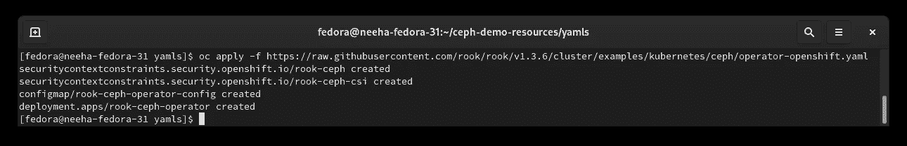

现在你可以看到车舱开始运行。

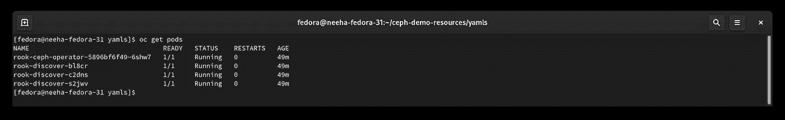

这样我们就可以部署 ceph 集群了。在部署该集群之前，您需要记住两件主要事情:

*   在这个 yaml 文件中，如果我们希望使用它来执行大规模任务，我们必须将存储设置为至少 100 GB，在本例中，10 GB 就足够了。所以你可以根据自己的需求来提尺寸。
*   默认情况下，在这个 yaml 中，存储类名是注释的，但是类名`gp2`是指 AWS 实例的默认类，为了部署到集群的默认`storageClass`,您可以使用注释了它的 yaml 文件。

```
oc create -f cluster-on-pvc.yaml
```

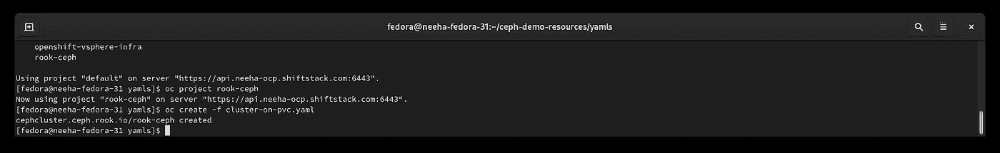

接下来，我们设置对象，

```
oc create -f object-openshift.yaml
```

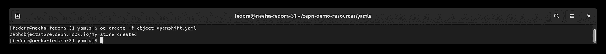

现在，我们通过运行以下命令创建一个名为`ceph-demo-user`的新 Ceph 对象存储用户:

```
oc create -f object-user.yaml
```

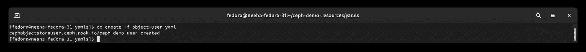

一旦以上所有命令运行，几分钟后`osd,mon,mgr,and rgw` 吊舱将被部署。下面提到的所有 pod 都已启动并运行，您可以确认到目前为止设置是正确的，没有任何问题。

检查下面的所有 pod 是否都已启动并运行，以确认到目前为止您的设置是否正确。

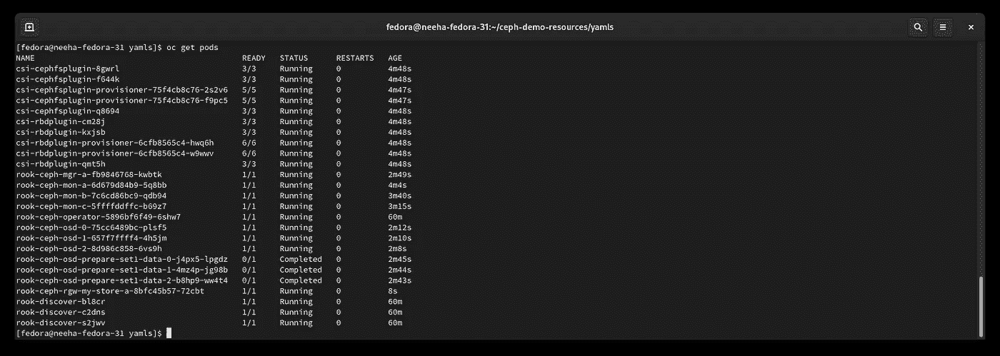

现在，我们需要在 ceph 集群内部创建路由来管理外部流量。

```
oc create -f route.yaml
```

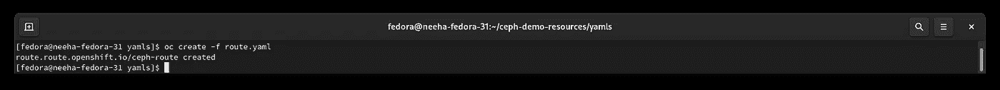

和安装工具箱，运行命令来检查 ceph 集群。

```
oc create -f toolbox.yaml
```


若要访问工具箱容器，请运行以下命令。进入工具箱后，您可以检查 ceph 集群的状态。

```
oc -n rook-ceph exec -it $**(**kubectl -n rook-ceph get pod -l "app=rook-ceph-tools" -o jsonpath**=**'{.items[0].metadata.name}'**)** bash
```

有时建立连接可能需要一些时间，您会遇到如下所示的错误，您只需要运行几次该命令，或者等待并运行以建立连接。

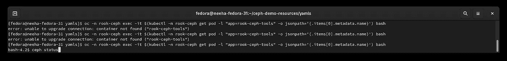

## 工具箱窗格中有用的 ceph 命令

检查集群状态

```
bash-4.2$ ceph status
```

我们获得关于集群健康、服务和数据的信息。

```
bash-4.2$ ceph status
 cluster:
 id: XXXX-XXXX–XXXX–XXXX-XXXXXXXXXXXX
 health: HEALTH_OK

 services:
 mon: 3 daemons, quorum a,b,c (age 8m)
 mgr: a(active, since 7m)
 osd: 3 osds: 3 up (since 6m), 3 in (since 6m)
 rgw: 1 daemon active (my.store.a)

 data:
 pools: 7 pools, 80 pgs
 objects: 203 objects, 4.2 KiB
 usage: 3.0 GiB used, 297 GiB / 300 GiB avail
 pgs: 80 active+clean
```

有时我们会得到，

```
health: HEALTH_WARN
 clock skew detected on mon.b, mon.c
```

这是因为时间不同步，你可以正常进行，因为这不是大问题，否则你可以终止 pod**mon b**和**mon c**pod，然后等待它们再次创建(这是隐式发生的)。

你可以按照这个文档来获得更多关于 ceph 命令【https://docs.ceph.com/docs/giant/rados/operations/control/[的信息。](https://docs.ceph.com/docs/giant/rados/operations/control/)

## 测试我们的 Ceph 集群

现在我们的 ceph 集群已经启动，我们将通过上传和下载图像来测试它。

您首先需要 S3 命令变量，您可以使用下面的命令获得所需的变量。

```
# run the below command to get the end point URL
oc get route ceph-route -o jsonpath={.spec.host}
# run the below command to get access key and secret access key
oc get secrets rook-ceph-object-user-my-store-ceph-demo-user -o jsonpath={.data}
```

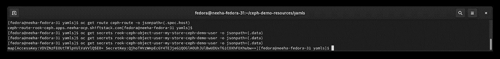

用下一节提到的 python 代码在下面的空白处填写上面得到的细节。

```
s3_endpoint_url = ""
s3_access_key_id = ""
s3_secret_access_key = ""
```

现在您可以运行演示并测试您的 ceph 集群了！

## 常见问题

我面对了很多…在这个过程中有很多问题，但是某些人和博客在这个过程中帮助了我。

rook—[https://github . com/rook/rook/blob/master/Documentation/common-issues . MD](https://github.com/rook/rook/blob/master/Documentation/common-issues.md)

ceph—[https://github . com/rook/rook/blob/master/Documentation/ceph-common-issues . MD](https://github.com/rook/rook/blob/master/Documentation/ceph-common-issues.md)

## 测试我们的集群！

最后，我们运行 python 代码来测试下载和上传特性。

**注意:** *准备一个视频文件，准备测试出来。*

在上面的代码中，您需要按照上一节提到的命令填写*‘端点 URL’，【访问密钥 id】*和*‘秘密访问密钥’*。

简单地说一下代码，我们从配置 Boto S3 客户端和 S3 资源开始。然后，我们获取存储桶名称并进行设置，然后上传一个演示视频文件。

在第 62 行，我们提到了将要上传的视频代码文件，在第 72 行，我们提到了下载细节，我们可以包括位置和我们计划在这里使用的名称。

```
python firstCeph.py
```

现在，您可以在第 72 行中提到的位置看到您上传的文件正在被下载。你可以去代码中提到的位置，或者你可以提到你自己的位置并去那里。

## **删除集群**

删除 ceph 集群是一个细致的过程，错过一个步骤或不按顺序运行下面的命令将导致分散的 pod 运行，找到它们将成为一个乏味的过程。

> 在尝试下面的代码之前，你需要安装**头盔**。

```
oc delete -f <all_above_mentioned_YAML_files>oc -n rook-ceph patch clusters.ceph.rook.io rook-ceph -p ‘{“metadata”:{“finalizers”: []}}’ –type=mergeoc -n rook-ceph delete cephcluster rook-cephhelm delete –purge rookoc delete namespace rook-ceph
```

连接到每台机器并删除

```
/var/lib/rook
```

或由指定的路径

```
dataDirHostPath
```

在尝试了这个简单的上传之后，您可以尝试多部分上传和其他存储类型，并实现 ceph 的不同应用程序。

希望你在浏览博客时玩得开心！感谢您的反馈。

感谢您的宝贵时间！这是成为开源开发社区一员的大好时机。