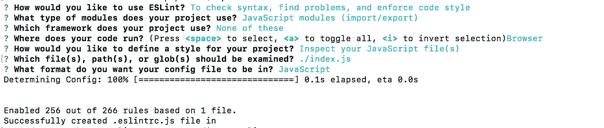
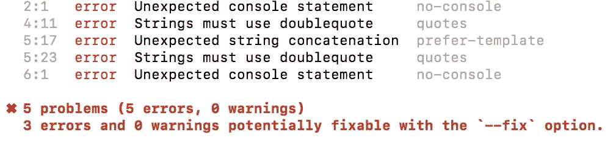
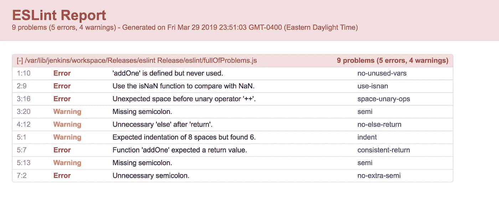

# ESLint +开发工作流程入门

> 原文：<https://levelup.gitconnected.com/getting-started-with-eslint-development-workflow-f59165fa9735>


埃斯林，礼貌埃斯林

**什么是 ESLint？**

它是 Javascript 的林挺工具。它分析你的代码来执行标准和防止错误。

**ESLint 解决了什么问题？**

它基于受 JS 中一些最佳实践启发的预定义模式，自动识别 JS 代码中涉及的一些常见错误/挑剔。

**为什么需要使用？**

我相信你已经在 PR 上留下了评论，类似于:

> *“请在此使用 ES6 字符串文字。”*
> 
> *“请确保将该变量作为常量使用，因为它在声明后不会被重新赋值。”*
> 
> *“请在此使用 ES6 扩展运算符。”*

这样的例子不胜枚举！

埃斯林特来救援了！这将确保你再也不用担心在公关上留下这样的评论了。很酷，不是吗！

我在这里试图传达的是，ESLint 将帮助你在 JS 代码库期间采用某种编码标准。

**如何快速上手**

相信我，在您令人敬畏的代码库中开始使用 ESLint 比您想象的要容易。是时候让它变得更棒了！

您需要首先安装 ESLint:

```
npm i --save-dev eslint
```

这将保存 ESLint 作为您的开发依赖项。您只需要为您的开发目的使用 ESLint。

是时候在你的代码库上运行 ESLint 来检查到目前为止你可能犯的错误了。

```
npx eslint .or./node_modules/.bin/eslint .
```

以上命令将确保您始终运行安装在您的代码库中的 ESLint 的本地版本，而不是 ESLint 的全局安装版本(如果有的话)。

*注意:我将在这篇文章中进一步使用* `*npx*` *的做事方式。*

现在你可能会得到一个错误，

```
No ESLint configuration found.
```

没有必要惊慌，因为 ESLint 需要设置一个配置文件来显示它。让我们现在创建一个:

```
npx eslint --init
```

这将会问你一些问题，关于你想如何在你的代码库中使用 ESLint。我给你抓了一个，



ESLint 配置生成示例。

我认为这将适合你的项目，如果你现在不知道你到底想从 ESLint 得到什么，这绝对是一个好的开始。

生成的配置如下所示:

现在假设我们有一些如下的 Javascript 代码，看看 ESLint 是怎么做的。

现在让我们试着运行 ESLint

```
// this will run ESLint on this file only
npx eslint ./eslinttest.js// this will run ESLint on all JS files in your project directory
npx eslint **/*.js
```

下面是 ESLint 的输出



我们只是发现了一些需要您的评论来修复的问题！呜哇！

好了，现在我们知道我们的代码有一些问题，我们如何修复它？埃斯林也支持你。它可以为您修复上面的一些问题，这可以通过运行

```
npx eslint --fix ./eslinttest.js
```

`--fix` 选项将命令 ESLint 自动修复在传递过程中捕捉到的错误。

*注意:ESLint 可能不会自动修复代码中遇到的所有错误。*

让我们看看让 ESLint 自己修复错误后，我们的 JS 代码是什么样子。

太好了！ESLint 让我们了解了一些地方，比如它用 ES6 字符串模板功能修复了字符串连接，并用双引号替换了单引号(这是 ESLint 的默认设置，您可以将其更改为使用单引号)。但是它没有自己删除控制台语句，因为 ESLint 知道它的局限性！；)

到目前为止一切都很好。现在，如果您想将所有的`var` 声明替换为 ES6 `let` / `const`声明，该怎么办呢？

有了 ESLint，就像修改配置中的规则一样简单。如果您检查我们之前创建的配置并搜索[***no-var***](https://eslint.org/docs/rules/no-var)*，您会发现:*

```
*rule: {
 ...
 ...
 no-var: "off",
 ...
 ...
}*
```

*嗯，这意味着规则[***no-var***](https://eslint.org/docs/rules/no-var)*在传递期间被 ESLint 从检查中关闭。在我们打开这个规则之前，我们需要了解一下 ESLint 规则。**

**ESLint 规则可能有 3 个以下的值:**

**0 =关，1 =警告，2 =错误。**

**所以我们希望 ESLint 在遇到 ***var*** 声明时抛出错误。为此，我们将配置更改为:**

```
**rule: {
 ...
 ...
 no-var: "error",
 ...
 ...
}**
```

**现在，当我们运行 ESLint 时，它将按照您预期的方式运行，并在遇到`var`时抛出一个错误。 ***I*** 如果你用 *fix* 选项运行它，那么它会根据代码中的用法自动将所有`var` 替换为`const` / `let` 。太酷了！**

****将 ESLint 融入您的开发工作流程****

**现在，这是一件很重要的事情，它会影响你的开发工作流程，尤其是当你在一个团队中工作的时候，大多数时候都是这样。**

**这里的重点是，当你在读这篇文章的时候，你的代码库有多大，你想引入 ESLint。对于大代码库，我指的是代码中 JS 的行数和开发人员的数量。**

**如果你刚刚开始，那么从第一天开始你就选择使用 ESLint 是很容易的。如果不是，那么在使用 ESLint 之前，您需要考虑两个因素:**

1.  **您将如何解决代码库中现有的 ESLint 错误？这可能是最疯狂的。例如，当使用`[eslint:recommended](https://eslint.org/docs/user-guide/configuring#using-eslintrecommended)`配置时，我们的代码库中有大约 600 个奇怪的错误(在 ESLint 为我们自动修复一些错误之后)。**
2.  **你如何在你的代码库中强制使用 ESLint，使它成为你日常开发工作流程的一部分？**

**我会解释我们进行的方式。**

1.  **首先，我们生成了一个 HTML lint 报告，其中包含了我们的代码库中所有被 ESLint 捕获的错误。这可以通过以下方式产生**

```
**npx eslint --ext .js -f html -o ./lint-report/errors.html **/*.js**
```

**报告看起来像这样。**

****

**lint 报告— HTML**

**使用它是直截了当和不言自明的。如果没有，您可以访问关于该规则的官方文档以了解更多详细信息，本报告中也提供了这些信息。**

**2.我们决定先修复这些错误，然后再在我们的开发工作流程中实施 ESLint。**

**3.所有的错误都在这一点上得到解决。现在，我们在代码提交期间放置了 lint 检查，这将确保即将进入我们代码库的代码通过所有 lint 检查。这可以在我们称之为 ***的预提交钩子的帮助下完成。*** 实现这一点也很简单，遵循以下步骤。**

**安装 [***哈士奇***](https://www.npmjs.com/package/husky)**

```
**npm i husky --save-dev** 
```

**在`package.json`文件中创建一个类似下面的预提交钩子**

```
**"husky": { "hooks": { "pre-commit": "./node_modules/.bin/eslint --ext .js **/*.js --fix" }}**
```

**这将确保您的所有暂存代码都被发送进行 lint 测试。现在您已经成功地自动化了这个过程，确保没有代码带着 lint 错误进入您的代码库。**

**你成功了！正如我前面提到的，与 ESLint 打交道并不复杂。**

**希望这篇文章对你有用！**

**一起说吧-> ***ESLint rocks！*****