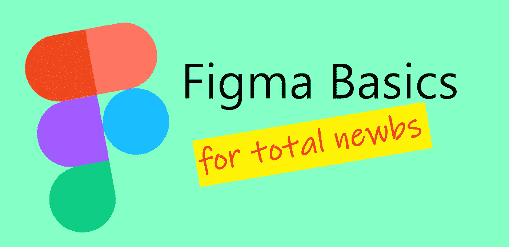
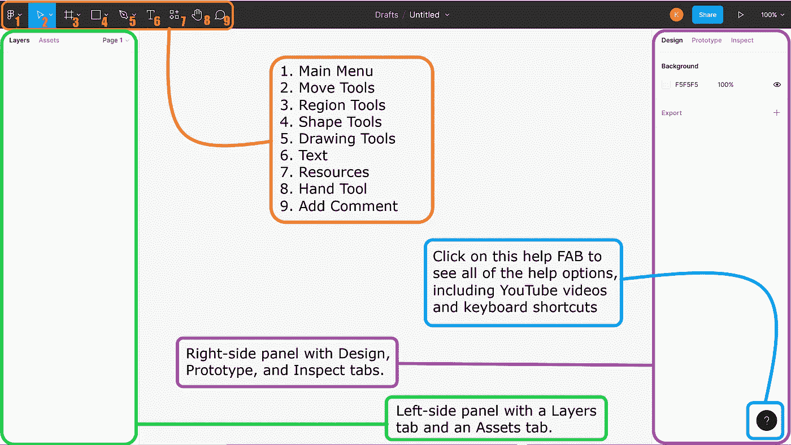
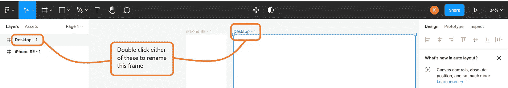
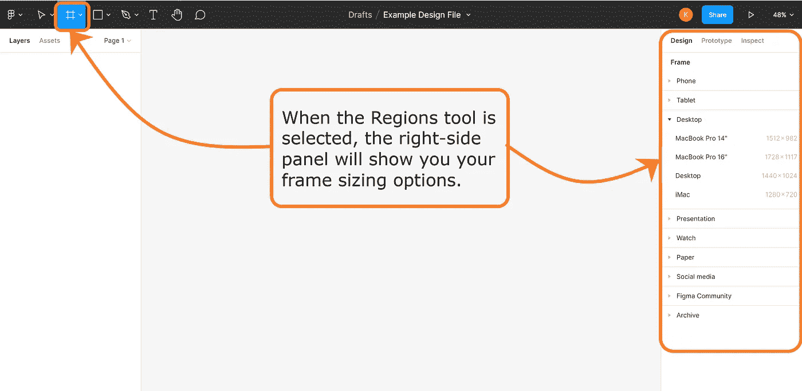
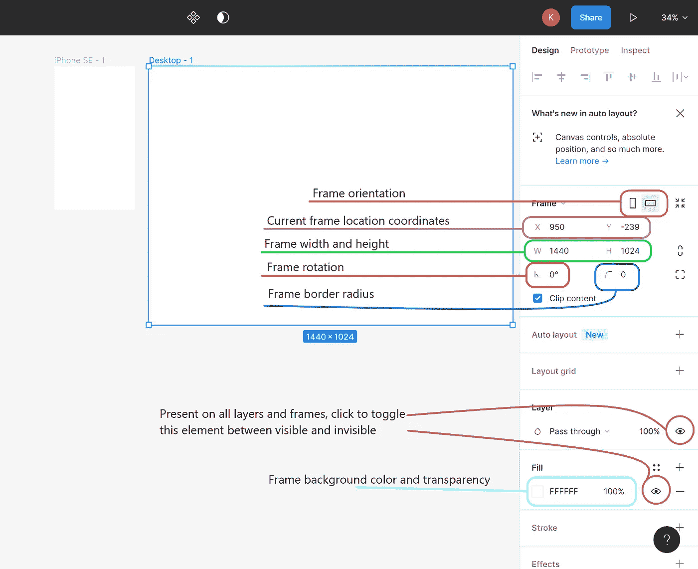
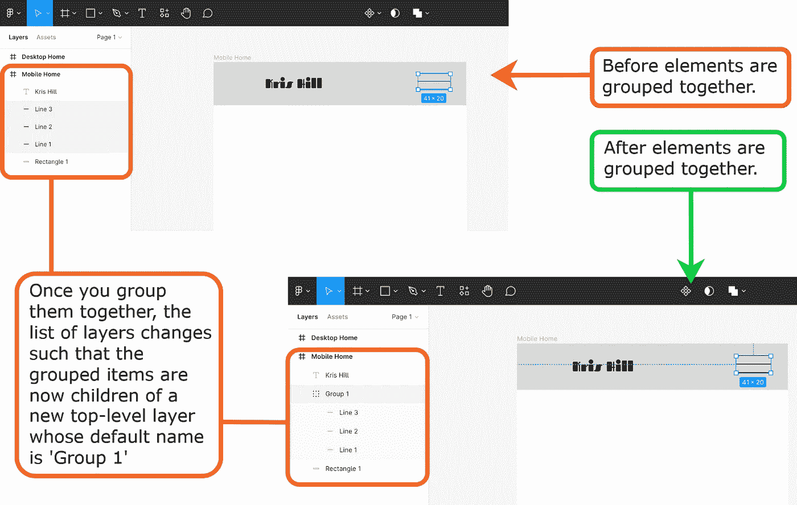
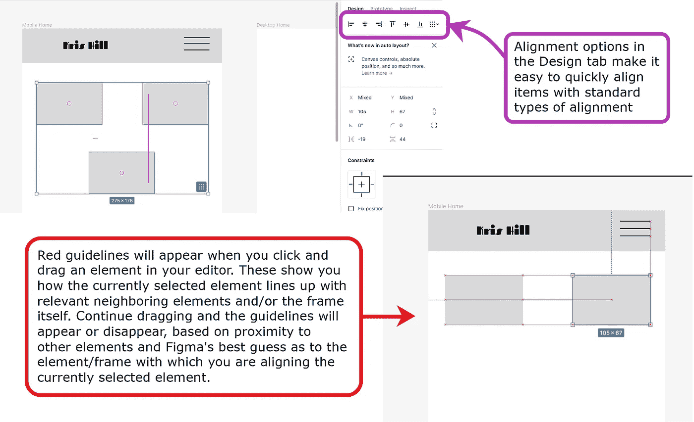

# Figma 入门

> 原文：<https://levelup.gitconnected.com/getting-started-with-figma-637f2c868017>

## 设计一个好看的网站很难，但是学习如何使用 Figma 很容易！

这是对 Figma 的一个非常基本的介绍，因此我省略了许多对入门不太必要的信息。本教程没有提到的 Figma 最重要的方面是如何将您的设计文件转换成交互式原型。本教程的重点是让你能够设计静态页面(或者在 Figma 术语中称为“框架”)，因为这是 Figma 的最小效用。此外，本教程假设您对常用的数字 illustrator 工具有所了解，如钢笔工具、文本工具和绘图工具。这并不是说我不认为这些是重要的，本教程只是已经变得太长了，所以我在我认为是 Figma 独有的本质上切断了自己。

创建新文件

*   在主用户仪表板中，单击“新建设计文件”按钮。
*   Figma 会将您重定向到文件编辑器视图。下面是编辑器中工具的概述。

为您的文件命名

*   在顶部工具栏的中间，点击“草稿/无标题”右边的向下胡萝卜
*   在出现的菜单中，找到并点击“重命名”，然后给你的文件起一个名字并按回车键

将桌面和移动框架添加到您的文件中

*   在工具栏中，单击“区域工具”选项，这是左起第三个选项，看起来像井字游戏或宽标签。
*   如果你选择这个选项而没有点击它右边的向下胡萝卜，它默认为框架工具。框架工具是我们想要的，也是我们大部分时间会用到的，所以如果你不小心点了下胡萝卜，看到了框架和切片工具，请选择框架工具。
*   一旦您选择了框架工具，编辑器右侧的面板会为您提供一大堆您想要使用的屏幕尺寸选项。仔细看看这些，决定你要用哪一个。
*   对于本教程，我们将添加两个框架:一个用于移动屏幕，一个用于桌面屏幕。我将使用 iPhone SE 框架和通用桌面框架，因为这两个框架将涵盖绝大多数情况，但你可以选择任何你喜欢的框架。

编辑框架

*   一旦您选择了一个框架，Figma 会将该框架添加到您的编辑画布中，右侧面板现在会显示您可以编辑的框架的所有属性

重命名框架

*   双击 Figma 为框架指定的默认名称，以编辑框架的名称。当您开始一个新的设计文件时，最好是边走边给元素和框架命名。随着设计变得越来越复杂，这将使你的框架和其他元素更容易组织起来。

向框架添加元素

*   要添加形状、直线、箭头或图像，请选择形状工具选项
*   形状工具的工作原理与其他数字插图软件相同(单击并拖动)

将元素分组在一起

*   要选择组中的所有元素，请执行下列操作之一:在选择“移动”工具的情况下，单击并拖动以圈住所有想要的元素，或者在按住 shift 键的同时，选择每个想要的元素，或者在按住 control 键的同时，在编辑画布左侧的“层”面板中选择每个想要的元素。
*   左侧的层列表将高亮显示当前选中的每个元素。使用它来确认您已经选择了所有想要的元素。
*   一旦选择了您想要在组中的所有元素，右键单击编辑画布中的一个选定元素或层列表中的一个选定元素，并从下拉菜单中找到并选择“组选择”。
*   请注意，在“层”列表中，单个元素“群组 1”已经替换了您组合在一起的所有元素。现在是时候给它起个名字了。
*   还要注意，当光标悬停在层列表上时，您应该会在刚刚创建的新组旁边看到一个向右的箭头/三角形/菜单指示器。单击三角形，Figma 将向您显示该组中的所有单个元素。

对齐元素

*   排列或对齐添加到框架中的元素有两种主要方式:(a)通过选择元素或将元素组合在一起，然后使用编辑器右侧设计面板顶部的对齐选项之一，或者(b)通过选择一个或多个元素并将其拖动到框架/编辑器中的所需位置。
*   当您有一组相对于彼此具有某种对齐方式并且独立于框架中其余元素的元素时，选项(a)是很好的选择。
*   选项(b)受益于一些默认的 Figma 功能，如在拖动元素时(从其边缘和中心)从框架和其他附近元素发出的红色指引线，以及当所选元素或组靠近其中一个元素时捕捉到指引线。

排序元素/层

*   图层顺序的工作方式与在其他数字插图软件中的工作方式相同。
*   对元素和组进行重新排序有两种主要方式:右键单击要移动的元素，然后选择“置于前端”或“移至后端”，或者在“层”列表中，单击并拖动要在列表中上移(与“置于前端”相同)或下移(与“移至后端”相同)的元素/层。

最后的想法

当我写这篇文章的时候，我打算设计一个新版本的网站，至少一年没有更新了，但是后来我意识到我对设计阶段不再感兴趣了。因此，希望这将有助于那些有兴趣学习设计的人利用 Figma 发挥创造力，设计一些令人敬畏的网站，这样我们的工程师就不必这么做了。

# 分级编码

感谢您成为我们社区的一员！更多内容见[级编码出版物](https://levelup.gitconnected.com/)。
跟随:[推特](https://twitter.com/gitconnected)，[领英](https://www.linkedin.com/company/gitconnected)，[通迅](https://newsletter.levelup.dev/)
**升一级正在改造理工大招聘➡️** [**加入我们的人才集体**](https://jobs.levelup.dev/talent/welcome?referral=true)