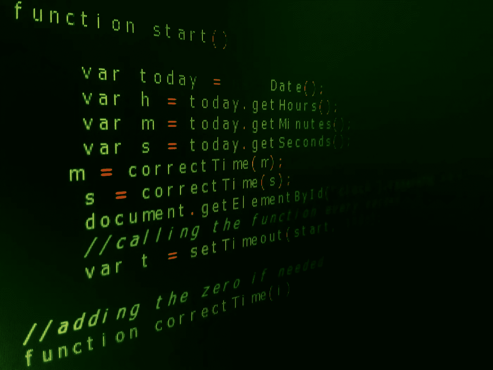

# 函数式编程入门

> 原文：<https://levelup.gitconnected.com/getting-started-with-functional-programming-1d611d91e82e>



## 你知道什么是纯函数吗？

纯函数是所有函数式编程语言中使用的一个概念。这是一个非常重要的课题，因为它是函数式编程的基础。它允许您创建简单和复杂的组合模式。

我将跳过纯函数背后的所有数学术语，我将直接讨论它们是什么以及它们看起来如何。

当一个函数满足以下条件时，可以确定它是纯函数:

*   它应该总是返回相同的值。不管你调用这个函数多少次，不管你是在今天、明天还是在未来的某个时刻调用它。
*   自包含(它不使用全局变量)。
*   它不应该修改程序的状态或者引起副作用(修改全局变量)。

## 第一个标准:它应该总是返回相同的值

以下面的函数为例，

```
Math.cos(0) // 1
```

不管你是今天调用 *Math.cos(0)* 还是明天调用或者在未来某个时刻调用，输出永远是 **1** 。让我们看一个新的例子，

```
const numberOfApples = 5;
const applesBought = 5;
const add = (num1, num2) => num1 + num2;const totalApples = add(numberOfApples, applesBought) // 10
const totalApples = add(numberOfApples, applesBought) // 10// ... one month later
const totalApples = add(numberOfApples, applesBought) //10
```

同样的事情也发生在 *add* 函数上。不管你调用这个函数多少次，或者什么时候调用，每次的输出都是一样的。

现在让我们来看一个函数，它会随着时间或者每次调用它而变化:

```
Math.random() // returns a random number
Math.random() // returns a **different** random number// one month laterMath.random() // returns a different random number
```

如你所见，每次你调用 *Math.random()* ，输出都会改变，因此我们**不能**说 *Math.random()* 是一个纯函数。

## 第二个标准:自给自足

通过使用一个**不纯的**函数，这个标准也很容易理解，所以让我们看看一个不纯的函数是什么样子的:

```
const numberOfApples = 5
const applesBought = 5
const addApplesToTotal = (num1) => numberOfApples + num1;const totalApples = addApplesToTotal(applesBought); // 10
```

从前面的例子可以看出，函数*addapplestotal*使用了上面定义的变量。它不是传递 numberOfApples 的值，而是直接访问外部作用域。因此， *addApplesToTotal* 不是**自包含的**。

## 第三个标准:它不应该修改程序的状态或者引起副作用

这个标准，就像前一个一样，可以用一个不纯的函数很好地证明。所以让我们来看看👀,

```
let totalApples = 5
const applesBought = 5const addApplesToTotal = () => {
  totalApples += applesBought
};addApplesToTotal()
```

从之前的不纯函数中你能注意到什么？它打破了过去的两个标准！！

*   它正在访问外部范围，因此它不是自包含的。
*   这会产生副作用，因为它改变了 totalApples 的值。

**为什么纯函数很重要？**

*   纯函数不太复杂
*   更容易调试🐛
*   更容易结合
*   更易于并行化

## 结论

纯函数是函数式编程中一个基本而强大的概念。学习并习惯纯函数可以让你更容易地测试和调试你的代码。它们将允许您学习关于函数式编程的更复杂的主题。

更多关于函数式编程？阅读[这篇关于阿谀奉承的文章](https://medium.com/@gmotzespina/currying-in-javascript-c0563b9b6c2c)！

推荐书籍深入探讨纯函数和函数式编程:[https://www . Amazon . com/-/es/gp/product/1661212565/ref = DBS _ a _ def _ rwt _ bibl _ vppi _ i0](https://www.amazon.com/-/es/gp/product/1661212565/ref=dbs_a_def_rwt_bibl_vppi_i0)