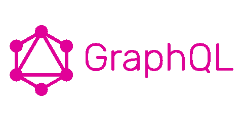
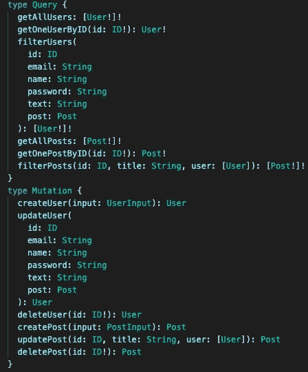

# GraphQL 入门

> 原文：<https://levelup.gitconnected.com/getting-started-with-graphql-31e28b8f3f8a>



很长一段时间以来，API 的世界一直依赖于 REST 和 SOAP。简单对象访问协议(SOAP)于 1998 年发明，而表述性状态转移(REST)于 2000 年出现。这两者已经统治了应用程序编程接口将近 15 年。2015 年，脸书发布了 GraphQL。这已经成为查询数据的新方式，可以被认为是 SOAP 和 REST 的一个有竞争力的替代方案。

GraphQL 在定义 API 方面开创了一个新时代，但是和所有技术一样，在一些特定的情况下，REST 可能会做得更好。

GraphQL 以更简单、更快、更高效而闻名，允许用户准确地获取他们需要的数据。此外，GraphQL 既是一种查询语言，也是一个执行引擎，可以绑定到任何后端服务、数据源，包括 REST 本身。

在这篇文章中，我将提供一个简单的 GraphQL 介绍和一个[工具](https://skimaql.com/sign)，它可以简化你的学习或者你可以在未来的工作中使用。

> 使用 GraphQL 开发 API 需要一个模式来定义它将要操作的资源。为了访问或修改这些资源，您需要创建一个将被发送到服务器的`Query`或`Mutation`类型。资源定义、查询和变异这三者都可以根据语言偏好在一个文件中定义。GraphQL 文件的扩展名为(。gql 或者。graphql) c cn

这里的代码输出也可以从[https://skimaql.com](https://skima.com)中创建。

每一个 GraphQL 实现都是对它可以返回什么类型的对象的描述(GraphQL 类型系统)，并且是 GraphQL 模式中最关键的部分。类型系统只是对与对象相关的特征或属性的一种解释。让我们假设我们正在构建一个 twitter 克隆体(包含用户、帖子和评论)。

用户对象可以包含[唯一标识用户的 id、姓名、电子邮件、密码、电话]所有这些都可以在 GraphQL 类型的系统中表示。

```
type User { id: ID! name: String phone: String email: String! **#Cannot be null** password: String! **#Cannot be null**}
```

这是一个简单的定义，对吗？GraphQL 支持标量类型`String`、`Int`、`Float`、`Boolean`和`ID`，因此您可以使用这些直接确定 GraphQL 要存储或检索的数据类型。

```
**Boolean**, true or false**Int**, a signed 32‐bit numeric non‐fractional value**Float**, a signed double‐precision fractional values**String**, a sequence of UTF‐8 characters**ID**, a unique identifier
```

确实存在其他类型`Date, Datetime`，但这超出了本文的范围。您可能不需要额外的类型，因为即使使用默认类型，也存在大量的变通方法。

默认情况下，每种类型都是可空的——将`null`作为任何标量类型返回都是合法的。我们用感叹号来表示一个类型不能为空，所以`String!`是一个不可为空的字符串。在我们的示例中，如果没有电子邮件和密码，就不能添加用户。

此时，您可以为帖子和评论创建类型定义。按照惯例，您将使用单数形式的类型名称*(例如 user 而不是 users 或者 post 而不是 posts)。*

如果你想在一个用户和文章之间建立一个关系呢？您可能没有注意到这一点，但是`String`、`Int`、`Float`、`Boolean`和`ID`是标量类型，我们刚刚创建了一个类型用户。

**GraphQL 类型可以引用其他类型。**这意味着一个用户类型可以引用一个文章类型， ***，这是在 GraphQL 中创建关系的基础。***

GraphQL 可以用来创建几种关系；

1.  **一对一**

一对一关系将约束置于两种类型之间的关系中，并在架构中通过引用每种类型都有一个指向另一种类型的字段来表示。

```
type User { id: ID! name: String email: String! password: String! phone: String post: Post ** location: Location**}type Location { id: ID! address: String! country: String **user: User**}
```

2.**一对多或多对一**

一对多关系只对关系的一方施加约束。它在 GraphQL 模式中由两种类型表示，其中源有一个指向目标类型的数组字段，而目标类型有一个指向源类型的非数组字段。这是我们需要链接用户和文章的关系，如下所示:—

```
type User { id: ID! name: String email: String! password: String! phone: String **post: Post  ==> One**}type Post { id: ID! createdAt: String title: String message: String! **user: [User]  ==> Many represented by [] //An array**}
```

**3。多对多**

多对多关系对关系的双方都有约束。它在 GraphQL 模式中由两种类型表示，每种类型都有相互指向对方的字段，其中所有字段都是数组。

至此，您已经有了足够的信息来开始使用 GraphQL

您知道基本类型、关系以及如何创建它们。这些只是 GraphQL 的基础，你可以随时去 https://skimaql.com 的[轻松完成所有这些。](https://skimaql.com)

在下一篇文章中，我将帮助您了解如何获取数据以及如何发布/更新或删除数据



https://skimaql.com 制造的汽车