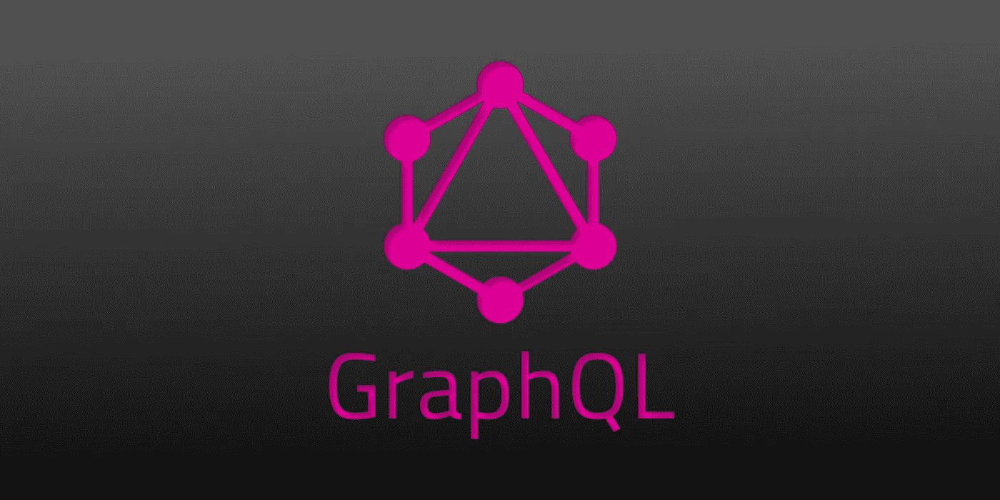
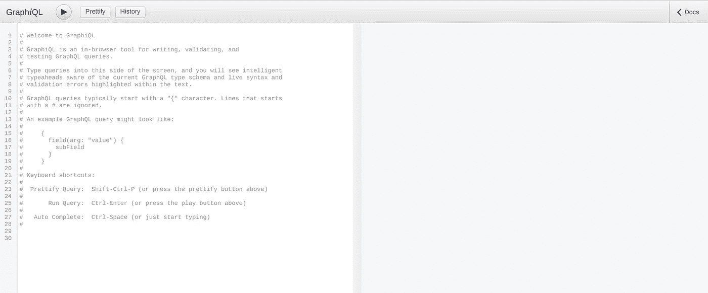

# GraphQL 入门:非常简单！

> 原文：<https://levelup.gitconnected.com/getting-started-with-graphql-its-pretty-easy-3ea803426298>

许多公司已经转而使用 GraphQL 来构建他们的 API。有一个很好的理由——这是一种关于我们如何获取数据的革命性思维方式。



# GraphQL 的起源&为什么使用它

GraphQL 来自脸书。在内部，脸书正在寻找一种方法，让他们的新闻订阅在移动设备上更加可靠。

使用传统的 REST API 结构，newsfeed 对多个 API 端点进行多次调用，以获得所需的所有数据。在这一过程中，API 调用还会溢出新闻提要不需要的额外数据。此外，在接收时，前端工程师仍然必须解析数据以找到他们想要的字段。

脸书的工程师想知道，“如果我们能编写一种查询语言，这样我们就能在一个 API 请求中指定我们需要的所有信息，那会怎么样？”

GraphQL 就是这种努力的结果。它映射数据库中对象之间的关系——创建一个[图](https://medium.com/@BennettGarner/what-the-graph-a-beginners-simple-intro-to-graphs-in-computer-science-3808d542a0e5)。然后他们设计了一种查询语言来遍历关系图。因此，命名为 GraphQL。

随着查询语言的加入，GraphQL APIs 现在可以在单个端点接受所有传入的请求。然后，它们获取并返回您请求的数据，并且只返回您请求的数据。不再过度蚀刻你不会使用的信息。

# 一个规范，而不是一个实现

至关重要的是，脸书决定开源 GraphQL 作为一种规范。

这意味着它可以用任何编程语言来实现。只要实现以指定的方式解析查询、模式等，它就能与任何其他 GraphQL 应用程序配合得很好。

事实上，现在每种主要编程语言中都有几十种 GraphQL 的实现。

在本文中，我们将使用用 JavaScript 编写的 GraphQL 的参考实现，但是相同的基本原则适用于任何语言。

您可以查看 GraphQL 实现的完整[列表](https://graphql.github.io/code/)来找到您最喜欢的语言。

# 基础建筑

开发一个正常工作的 GraphQL API 需要两个组件:服务器和客户机。

1.  服务器处理传入的查询，解析这些查询，使用定义的模式获取数据，并返回通常是 JSON 格式的响应。
2.  客户端使您的应用程序能够与服务器通信。虽然您可以向 GraphQL 端点发送一个普通的 POST 请求，但是如果您使用 GraphQL 客户端来帮助发送查询，那么您将获得更强大的功能。

构建一个 GraphQL API 可能比[构建一个 REST API](https://medium.com/@BennettGarner/build-your-first-rest-api-with-django-rest-framework-e394e39a482c) 更加密集。然而，在复杂或高性能应用程序中，速度和可用性方面的优势可能会弥补这一点。

# GraphQL 是什么样子的

我们的 API 的目标是发送一个 GraphQL 查询并得到一个响应。所以，让我们来看看那会是什么样子。

记住，GraphQL 是它自己的语言。这种语言不难学，而且在很大程度上，编写查询非常直观。

假设我们有一个包含航班和乘客信息的数据库。

在 GraphQL 中，我们可能会像这样查询航班:

```
{
  flight(id: "1234") {
    origin
    destination
  }
}
```

这是 GraphQL 的说法，“告诉我 1234 航班的始发地和目的地”

作为回应，我们将收到:

```
{
  "data": {
    "flight": {
      "origin": "DFW",
      "destination": "MKE"
    }
  }
}
```

注意:

*   我们得到的正是我们所要求的——不多也不少。
*   我们还会收到与我们发送的原始查询格式完全相同的响应。

这些是 GraphQL API 的标志。这是 GraphQL 如此快速和强大的原因。

然而，这不是我们能做的全部。假设我们想获得航班上的乘客信息:

```
{
  flight(id: "1234") {
    origin
    destination
    passengers {
      name
    }
  }
}
```

现在，GraphQL 将遍历该航班及其乘客之间的关系图。我们会得到一份乘客名单作为回报:

```
{
  "data": {
    "flight": {
      "origin": "DFW",
      "destination": "MKE",
      "passengers": [
        {
          "name": "Luke Skywalker"
        },
        {
          "name": "Han Solo"
        },
        {
          "name": "R2-D2"
        }
      ]
    }
  }
}
```

酷，现在我们可以通过一个 API 调用立即看到这个航班上的所有乘客。

为什么韩、路克和在国内飞行是一个更大的问题，但我听说密尔沃基这个时候很美。

因为 GraphQL 将数据解释为图形，所以我们也可以从另一个方向遍历它。

```
{
  person(name: "Luke Skywalker") {
    passport_number
    flights {
      id
      date
      origin
      destination
   }
}
```

现在我们可以看到卢克预订了哪些航班:

```
{
  "data": {
    "person": {
      "passport_number": 78120935,
      "flights": [
        {
          "id": "1234",
          "date": "2019-05-24",
          "origin": "DFW",
          "destination": "MKE"
        },
        {
          "id": "2621",
          "date": "2019-07-05",
          "origin": "MKE",
          "destination": "DFW"
        }
      ]
    }
  }
}
```

哇，他要在密尔沃基呆一个多月！我想知道他在那里做什么？

# 喜欢你目前读到的吗？

我免费与我的电子邮件列表分享我最好的内容。

[加入我的电子邮件系列中的其他 500 名开发人员。](https://sunny-architect-5371.ck.page/0a60026a5d)

# 待办事项列表

那么，我们需要什么来创建一个 GraphQL API 呢？

1.  选择一个框架来实现您的 GraphQL 服务器。我们将使用快递。
2.  定义模式，以便 GraphQL 知道如何路由传入的查询
3.  创建解析器函数来处理查询并告诉 GraphQL 返回什么
4.  构建一个端点
5.  编写获取数据的客户端查询

然后，您可以使用 GraphQL 查询来增强客户端应用程序。本教程不会涉及在前端使用 GraphQL 的所有不同方式，但它可以很好地与所有现代前端框架集成。

最终，GraphQL 的大多数用途将涉及与数据库的对话。在本教程中，我们不会讨论添加一个数据库到 Express 并允许 GraphQL 查询和更新该数据库。这是一个完全不同的教程的主题。

# 1.实现服务器

首先，我们需要为我们的 API 打下基础。

从现在开始，你需要安装 [nodejs 和 NPM](https://nodejs.org/en/download/)来跟随本教程。

让我们构建一个准系统 Express 服务器。首先初始化 npm:

```
$ npm initThis utility will walk you through creating a package.json file.
It only covers the most common items, and tries to guess sensible defaults.See `npm help json` for definitive documentation on these fields
and exactly what they do.Use `npm install <pkg>` afterwards to install a package and
save it as a dependency in the package.json file.Press ^C at any time to quit.
package name: (graphql-medium) 
version: (1.0.0) 
description: 
entry point: (index.js) 
test command: 
git repository: 
keywords: 
author: 
license: (ISC) 
About to write to /home/bennett/Repos/graphql-medium/package.json:{
  "name": "graphql-medium",
  "version": "1.0.0",
  "description": "",
  "main": "index.js",
  "scripts": {
    "test": "echo \"Error: no test specified\" && exit 1"
  },
  "author": "",
  "license": "ISC"
}Is this OK? (yes)
```

只需按回车键跳过初始化过程。如果你愿意，你可以回头编辑你的`package.json`。

接下来，让我们安装 Express、GraphQL 和 Express-GraphQL 库:

```
$ npm install express express-graphql graphqlnpm notice created a lockfile as package-lock.json. You should commit this file.
npm WARN graphql-medium@1.0.0 No description
npm WARN graphql-medium@1.0.0 No repository field.+ express-graphql@0.8.0
+ graphql@14.3.1
+ express@4.17.0
added 53 packages from 38 contributors and audited 151 packages in 6.169s
found 0 vulnerabilities
```

现在，我们将创建一个名为`index.js`的新文件，并在那里创建一个新的准系统 Express 服务器:

```
// index.jsconst express = require('express');
const app = express();app.get('/', function(req, res) {
  res.send('Express is working!')
});app.listen(4000, function() {
  console.log('Listening on port 4000')
});
```

试试跑`node index.js`。您应该会看到一条消息“在端口 4000 上监听”，如果您访问 [http://localhost:4000/](http://localhost:4000/) ，那么您会看到“Express 正在工作！”

# 2.在 GraphQL 中添加并定义模式

我们已经安装了 GraphQL npm 包。现在，让我们使用它。

首先，我们需要导入必要的构件:

```
const graphqlHTTP = require('express-graphql');
const { buildSchema } = require('graphql');
```

接下来，我们将使用这些构建模块。

让我们从定义 GraphQL API 的模式开始。传入的查询应该是什么样的？

现在，让我们定义一个 hello world 模式来让事情正常运行:

```
let schema = buildSchema(`
  type Query {
    hello: String
  }
`);
```

这个简单的模式让 GraphQL 知道，当有人发送一个“hello”查询时，我们最终将返回一个字符串。

注意那些小反勾号(`)。这些表明我们正在使用 JavaScript 模板文字。基本上，我们使用这些反勾号来告诉 JavaScript 我们将使用不同的语言 GraphQL 查询语言。

# 3.解决查询

因此，当有人提交对`hello`的查询时，我们知道我们最终将返回一个字符串。这是在我们的模式中定义的。

现在，我们需要告诉 GraphQL 它应该返回什么字符串。

GraphQL 中“解析器”的工作是根据传入的查询计算出返回什么数据。

在这个例子中，解析器很简单。我们将返回字符串“Hello world”

```
return 'Hello world!';
```

但是，我们需要将这个返回语句封装在一个函数中，只要有人查询 hello:

```
function() {
  return 'Hello world!';
}
```

现在，`hello`可能不是我们实现的唯一查询类型。将来，我们可能还会包括其他功能的“端点”。因此，我们应该确保我们刚刚创建的这个函数被映射到 hello，并与我们的 API 的所有其他解析器一起保存在一个对象中。

```
let root = {
  hello: function() {
    return 'Hello world!';
  },
}
```

按照惯例，调用保存所有解析器的对象`root`，但是你可以随意调用它。

# 4.设置端点

敏锐的读者会注意到我们在步骤 2 中导入了`graphqlHTTP`,但是我们还没有使用它。现在是时候了。

现在，我们已经为 GraphQL 服务器做好了一切准备。我们只需要通过 URL 端点使它可用。

在 Express 中，我们将创建一个新的路由来提供 GraphQL api:

```
app.use('/graphql', graphqlHTTP({
  schema: schema,
  rootValue: root,
  graphiql: true,
}));
```

Schema 和 root 指向我们在步骤 2 和 3 中定义的变量。

GraphQL 是一个有用的可视化工具，与 graph QL 一起安装。正如我们马上会看到的，测试你的 API 是如何工作的很容易。

这是我们 GraphQL 服务器的源代码的最终[状态。](https://github.com/bennett39/graphql-medium/blob/master/index.js)

# 5.运行它并编写一个查询

我们已经准备好测试它了！

1.  用`node index.js`启动应用程序
2.  去[http://localhost:4000/graph QL](http://localhost:4000/graphql?)

您应该会看到 graphiql 界面:



我们现在可以使用这个接口来确保我们的 API 正在工作！

让我们写一个查询。这个会非常简单。我们总是将 GraphQL 查询放在花括号中。然后，我们指定要查询的模式对象，后面跟着我们要获取的任何属性。

在这种情况下，到目前为止，我们的 API 中只有一个要获取的东西:

```
{
  hello
}
```

如果您单击提交按钮，您将看到:

```
{
  "data": {
    "hello": "Hello world!"
  }
}
```

起作用了！

# 添加更多端点

向 API 添加端点就像在模式中定义新字段，然后向`root`添加解析函数一样简单

您的查询也可以逐渐变得更加复杂。我推荐这篇来自官方文档的关于[构建掷骰子 API](https://graphql.org/graphql-js/passing-arguments/) 的指南作为你的下一步。

# GraphQL，FTW

GraphQL 非常棒，并且在采用方面增长迅速。在未来几年，它有可能成为 API 的一项无处不在的技术。

希望本指南很好地介绍了如何以及为什么可以在项目中使用 GraphQL。

在下面的评论中分享你的想法吧！我看了每一个回复。

# 关于班尼特

我是一名用 Python 和 JavaScript 构建东西的 web 开发人员。

想要我关于 web 开发和成为更好的程序员的最佳内容吗？

我在邮件列表中分享我最喜欢的建议——没有垃圾邮件，没有推销内容，只有有用的内容。

[加入我的电子邮件系列中目前的 500 名其他开发人员。](https://sunny-architect-5371.ck.page/0a60026a5d)