# 氦映射入门

> 原文：<https://levelup.gitconnected.com/getting-started-with-helium-mapping-2833914c4d3>

## 一步一步的指南，带你从零到映射！

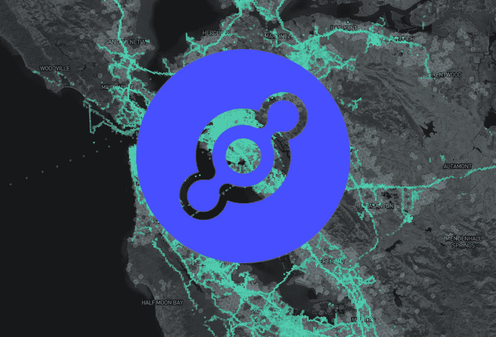

进入映射兔子洞

氦，一个真正伟大的加密货币项目，希望为大众带来极低成本的网络，是我最喜欢的区块链项目之一。它拥有一些明显有用的东西的所有元素(甚至可能参与其中很有趣)。就连讨厌加密的 NYT 也同意，[发表了一篇讽刺文章](https://www.nytimes.com/2022/02/06/technology/helium-cryptocurrency-uses.html)(它没有认识到一个包含地球上每个人的金融、货币解决方案实际上是区块链的一个惊人用例)，讨论了氦是一个具有“真正”用途的“真正”项目。

的确如此。氦已经被企业用来跟踪他们的库存和资产。但更好的是，任何人都可以参与并跟踪他们自己的资产(比如他们的狗)或获得关于他们想要测量的事物状态的信息(我漏水了吗？).

## 绘图

我不会在这里讨论整个氦项目。简单的谷歌搜索会为你提供很多关于这个项目的文章。但需要理解的一个重要方面是，该系统通过激励人们提供[网络覆盖](https://explorer.helium.com)来工作，共识机制被称为 PoC，或覆盖证明。基本上，人们购买网关或热点，将设备连接到互联网，然后他们在 HNT 提供这项服务获得报酬。要知道在哪里可以找到一个新的热点矿工，你需要一个覆盖地图。没有了。

因此，一群勇敢的志愿者正在世界各地，测量覆盖范围，核实矿工的覆盖范围，并为那些想在有冗余但不太冗余的地方建立新煤矿的人提供数据。这就是[贴图项目](https://mappers.helium.com)。这是整个氦网络:

我们还有很长的路要走！参与的绝佳时机

我在波多黎各，你可以看到有很多声称的报道(还有很多事要做！我们需要一个市民应急网络！)但并没有大量的覆盖范围得到测绘项目的验证。

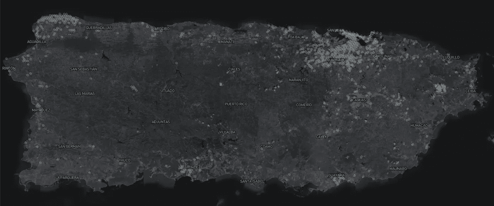

所以我才参与进来。这是我的区域，在圣胡安:

这需要一些大的工作，就像公共关系中的大多数事情一样。我们会到达那里。

所以，我写了这篇文章来记录我是如何开始绘制地图的。以及我所面临的挑战。希望这也能帮到你。很详细。可能很无聊，但我希望它在我进入这个的时候就存在了。

## 三万英尺

在一个非常高的层次上，我们需要一些东西用于[映射](https://docs.helium.com/use-the-network/coverage-mapping/)(请阅读那个链接，以便熟悉)。氦完成了所有的细节，将设备连接到插座，让你通过一个叫做[氦控制台](https://www.helium.com/console)的东西来查看这些设备的状态。所以去那里开个账户吧。

接下来你需要一些硬件。创建映射设备的方法有无数种。绘图设备(或“绘图器”)是一个简单的控制器，带有一个 LoRa 无线电和一个 GPS。您可以将这些独立的部件组装在一起，也可以购买已经将这些外设集成在一起的各种产品。现在，当我买中文时，我喜欢 Banggood，你可以得到我在那里得到的 [TTGO 设备](https://www.banggood.com/LILYGO-TTGO-T-Beam-ESP32-433-or-868-or-915-or-923Mhz-V1_1-WiFi-Wireless-bluetooth-Module-GPS-NEO-6M-SMA-LORA32-18650-Battery-Holder-With-OLED-p-1545070.htm)，但这些设备(带有有机发光二极管屏幕！)在很多地方都有。请记住，你需要得到一个与正确的无线电为您的位置(对我来说，在美国，它的 915 兆赫)。

最后，你需要能够为你的硬件编程。这里有几个步骤。首先，你需要[下载 VSCode](https://code.visualstudio.com/Download) ，这是微软为数不多的开源产品之一，真的很不错！接下来，您需要将 platform.io 安装到 VS 代码中。如果你是新来的，这部分非常吓人。我偶然发现了一个视频，是一个非常成熟的人带你完成安装 vscode 和 platformio 的所有步骤。

如果您已经设置了 vscode，那么您可以像我一样跳过很多内容。但它确实让我找到了一个好地方。最后，您需要克隆一个映射项目。都是彼此的分叉，但我最后用的是 [Max_Plastix 版](https://github.com/Max-Plastix/tbeam-helium-mapper/)。

## 深入本质

本文的其余部分将非常详细，但不幸的是，并不是很全面。我有以下内容:

*   运行 Monterey 的 Macbook Pro(基于英特尔技术)
*   [带有机发光二极管屏幕的 LilyGo LoRa GPS】](http://www.lilygo.cn/prod_view.aspx?TypeId=50060&Id=1317&FId=t3:50060:3)

我之所以写这篇文章，是因为我在入门时遇到了困难，还有一些独特的问题，因为我用的是 Mac，而 Windows 显然不会遇到这些问题。所以现在开始。

## 确保您有一根微型 usb 数据线

我浪费了一堆时间，因为我用的是只通电的 micro-usb 线。所有电源专用的 usb 电缆应该被送到阳光下，它们的制造商应该被烧成灰烬。如果你想要一个万无一失的方法来检查:按下苹果菜单->关于这台 mac，然后按下“系统报告”按钮。点击“硬件”列表底部的 USB。插入微型 usb 设备(如旧的 kindle 或 MP3 播放器),然后按下 command-R 键(⌘-R).该设备应该出现在其中一个 usb 端口上。如果你的 LilyGo 没有出现在这里，不要担心，我们稍后会遇到这个问题。

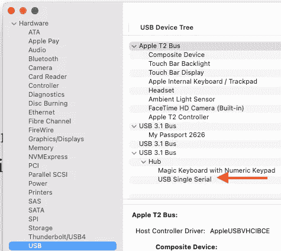

那是我的 LilyGo 设备

## 附上屏幕

抱歉，如果您订购了这个设备，您需要将屏幕连接到主板上。在 usb 连接器的另一侧，有 4 个引脚与屏幕上的 4 个引脚相匹配。下图显示了有机发光二极管屏幕的 VCC、GND、SCL 和 SDA 引脚需要如何连接到主板上的 3.3V、GND、22 和 21 引脚。用附带的 4 引脚接头焊接这些引脚，就可以开始了。

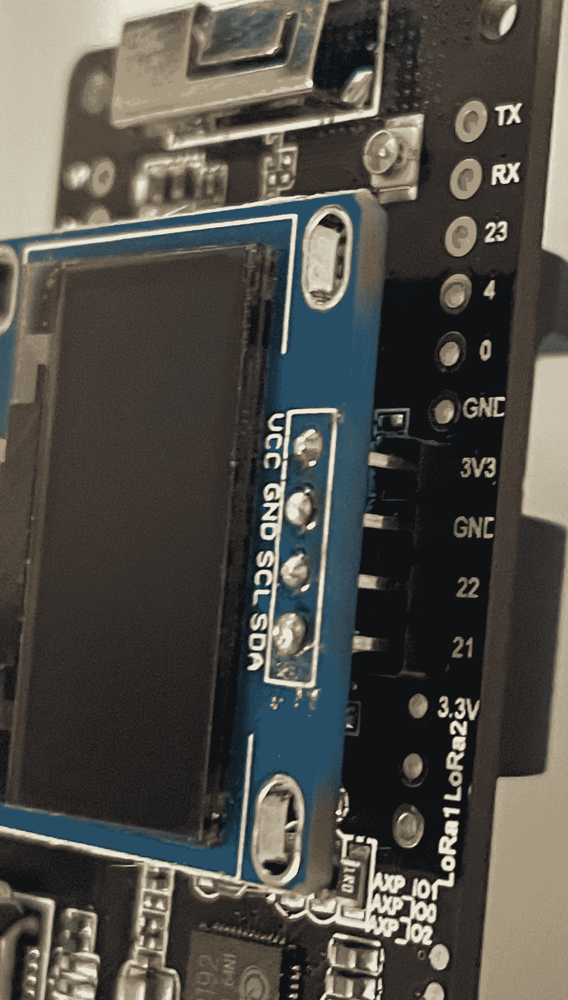

## 克隆回购

这一步对新手来说有些吓人，我知道，因为我一年前才开始使用 Github。我明白了。但这还不算太糟。所以，让我们从从 Max_Plastix 克隆 github 库开始。单击该链接，按下“代码”按钮，然后复制该链接。

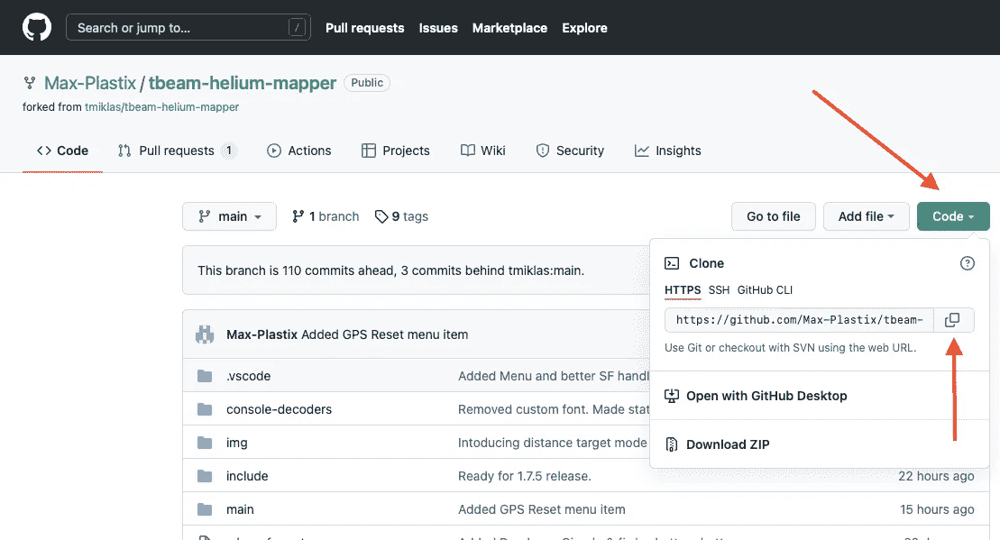

现在转到 VSCode，点击“克隆 Git 库”

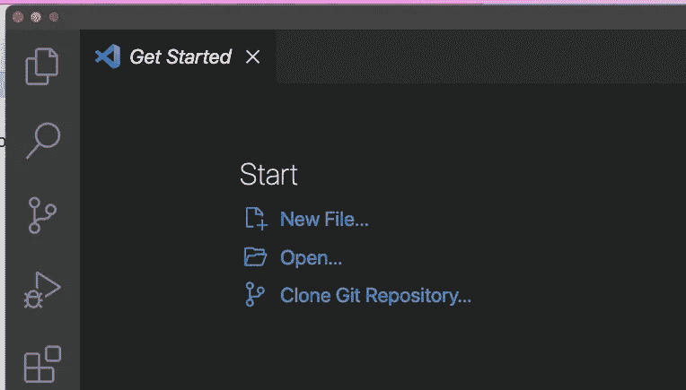

它会问你想从哪里克隆，你粘贴你刚从 Github 复制的链接。然后它会问你想把它放在哪里。您可能想为此项目创建一个新文件夹。因此，这样做，并按下“选择项目文件夹”, VSCode 会把你的项目放在那里，从 Github 克隆。您的项目已加载，这里是所有的文件夹。我们不会弄乱其中的大部分，但有几个是重要的。

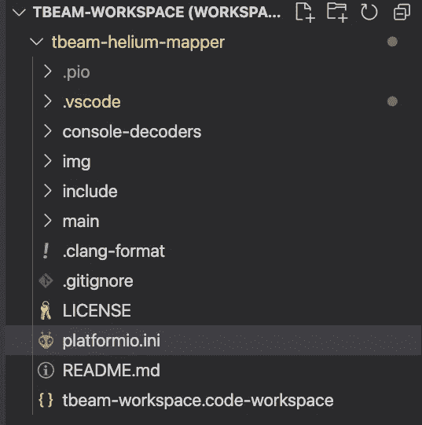

VSCode 会弹出下面这个窗口。我按下按钮来配置工作区。我真的没有试过*不是*按那个。

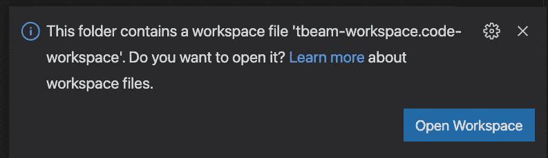

所以，我们要看的第一个文件是 **platformio.ini** 文件。有些事情你最终可能不得不改变。

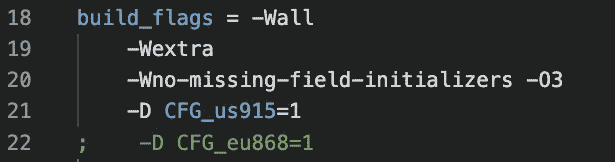

如果您不在美国，您将需要使用正确的频率进行编译，以匹配您的硬件

好了，让我们来讨论一下设备和电脑之间的通讯，因为这是我被咬的地方，对你来说可能不是问题。

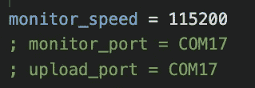

当设备通过 USB 与您的电脑对话时，有两种信息流动途径。第一种是正常的串行通信。当设备运行时，数据在“监控”通道中流出(这不是不同的线路，只是不同的模式)。另一个渠道是当你编程你的设备，这是“上传”渠道。除非默认设置有效，否则 montior 和 upload 都应该有自己的波特率和端口设置。让我们来演示一下这一点。去吧，插上你的 Lilygo。当您这样做时，应该会在屏幕上看到以下内容:

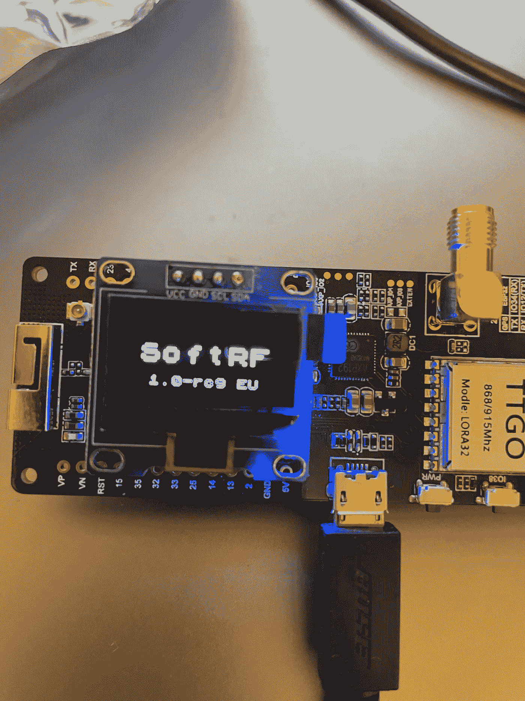

此图显示的是未连接天线的情况。这是一种不好的做法，工作台上的一些导体可能会接触到天线触点并使其短路，这可能会烧坏功率放大器。不要重蹈我的覆辙。

这只是您的设备预装的 SoftRF 软件(有些设备可能预装了 Meshtastic 软件)。我们稍后将擦除它，但现在，我们将利用它不断通过串行端口输出数据这一事实。在你屏幕的底部，蓝色区域，是一个插头的图片，如果你按下它，一个终端将会出现并与你的设备对话。我得到一个菜单，然后我按 4，但是你可能有一个不同的菜单，或者根本没有。

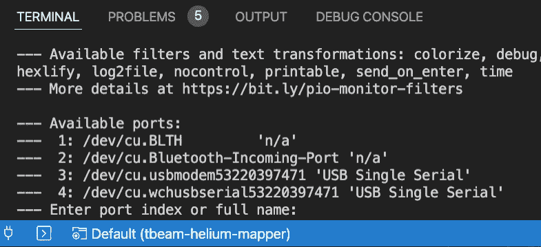

然后垃圾就开始进来。这是因为 Platformio 的监视器波特率设置为 115200，但 Meshtastic 软件的运行速率为 38400。

因此，让我们改变波特率。当出现提示时，再次按下插头以终止监控任务。如果您将监视器速度更改为 38400，并保存项目，然后再次点击那个插头符号。你会看到 GPS 数据通过(但你可能没有卫星，不要担心数据)

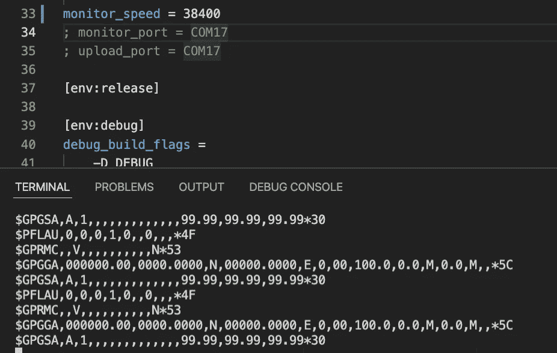

你刚刚和你的莉莉戈说话了！**它还活着！**

但是现在，我们必须让软件做我们想做的事情。将 monitor_speed 改回 115200。在项目导航器的左侧按下“main”文件夹，可以看到这个项目中的所有文件。

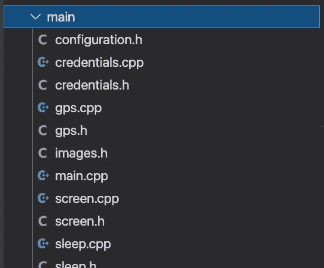

我们需要看的是 **credentials.cpp** 和 **configuration.h** 。我们先来深入探讨后者。配置文件将允许您设置希望映射器如何操作的参数。我们不会在这里浪费时间。但我喜欢改变一些东西，这样我就能确切地知道，我正在处理的代码就在设备上。因此，在这个文件中，我只更改了版本信息:

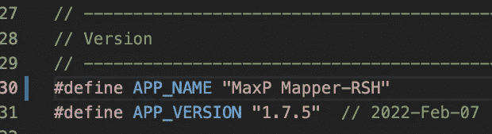

现在，对于最重要的部分:你需要设置设备的方式，它将被允许参与氦网络。是时候放下设备，前往氦气控制台，这样你就可以设置一个新的了。登录，如果没有自动进入，请按左边的“设备”。

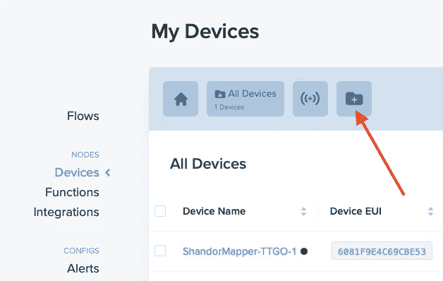

在写这篇文章之前，我已经设置了一个设备，但是请按+按钮，这样您就可以设置一个新设备。随便你怎么命名。按“保存设备”

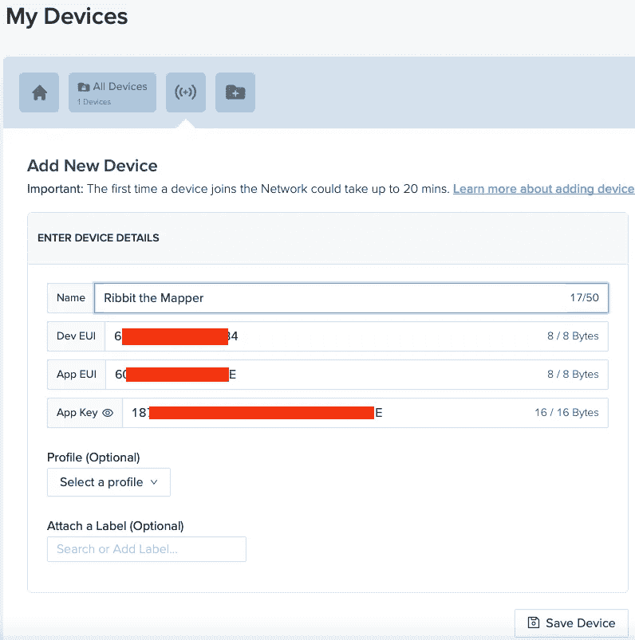

现在，你已经告诉氦网络，你有一个设备，你想连接到它。控制台给了你一些在固件中使用的凭证，以便你的设备可以识别自己。现在，您可以在设备列表中看到您的映射器。点击你的新设备，一个显示你的证书的屏幕就会出现。

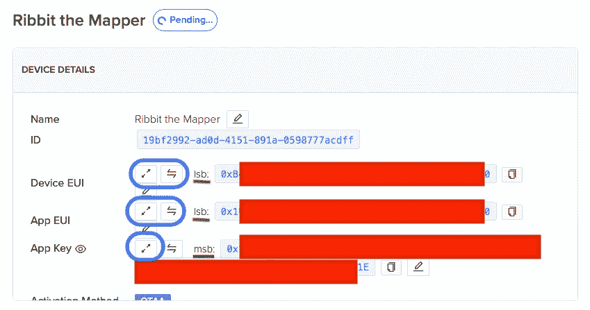

现在，您想要按扩展图标(对角箭头)将 devEUI 和 appEUI 更改为十六进制，并且您想要显示每个的 lsb。您还想扩展 AppKey，但将其保留为 MSB 格式。这是很重要的，你有这些正确的或你的设备将不会被识别的氦网络。在右边你会看到一个表示“复制”的图标，这样你就可以将这些数字复制并粘贴到你的代码中。我们现在回去吧。

回到 VSCode，点击 **credentials.cpp** 文件。该文件用于向网络识别您的设备。这里应该有一些默认代码，看起来像这样。

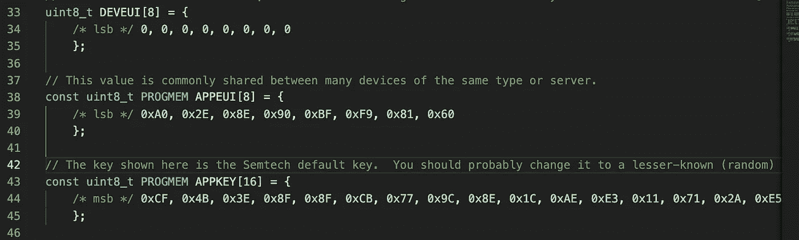

将 devEUI、appEUI 和 appKEY 复制粘贴到这里的 ***替换掉*** 的默认十六进制值。

嗯，我们已经完成了所有需要做的程序。编译上传！您可以用底部蓝色横幅中的复选标记来编译这段代码。

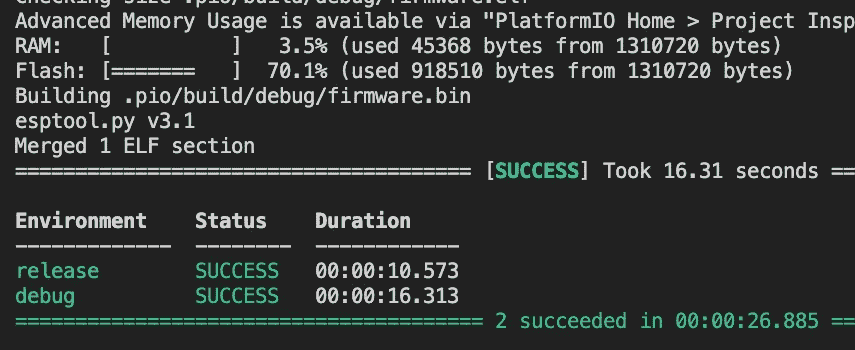

耶。现在让我们把它上传到 Lilygo！复选标记旁边的蓝色横幅中有一个指向右侧的箭头，按下该按钮。

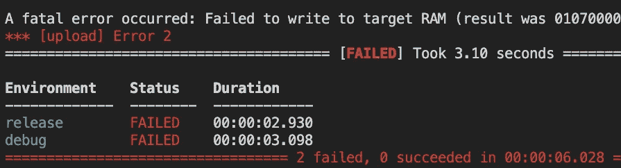

不不不。！！！！！！！！！！！

我带你经历这些是因为我在这上面困了几个小时。电脑没有通过上传通道和 Lilygo 通话。我尝试了很多方法来实现这个目标。这就是我写这篇文章的全部原因。所以让我们来解决这个问题。(跳到“它工作”，如果你在这里没有问题，有些人没有，这显然不会发生在 windows 上)

答案是 [**这里的**](https://meshtastic.discourse.group/t/failed-to-write-to-target-ram-result-was-01070000/3874/25) 。请务必阅读。Mac 可能没有 Lilygo 上 USB 芯片的正确驱动程序。你需要驱动，获取的方式是[**这里是**](https://github.com/WCHSoftGroup/ch34xser_macos) 。请遵循这些说明，尤其是验证计算机上的文件是否正确的部分，因为，您需要参考。因此，您需要查看您的确切驱动程序。为此，进入您的**/Applications/Utilities**目录并在那里打开一个终端窗口(您可以使用 finder，在下面的状态栏中右键单击并选择“在终端中打开”)。然后键入以下命令:

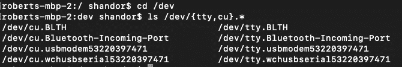

现在，回到 platformio.ini 文件，修改这个区域:

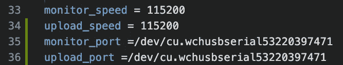

显然，使用您在/dev/目录中找到的特定文件

现在…按那个向右的箭头上传你的代码，然后…赢了！

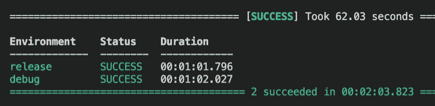

看看你的 Lilygo 屏幕，新软件！

## 有用！

过了一会儿，你应该会在 Lilygo 的屏幕上看到成功了！

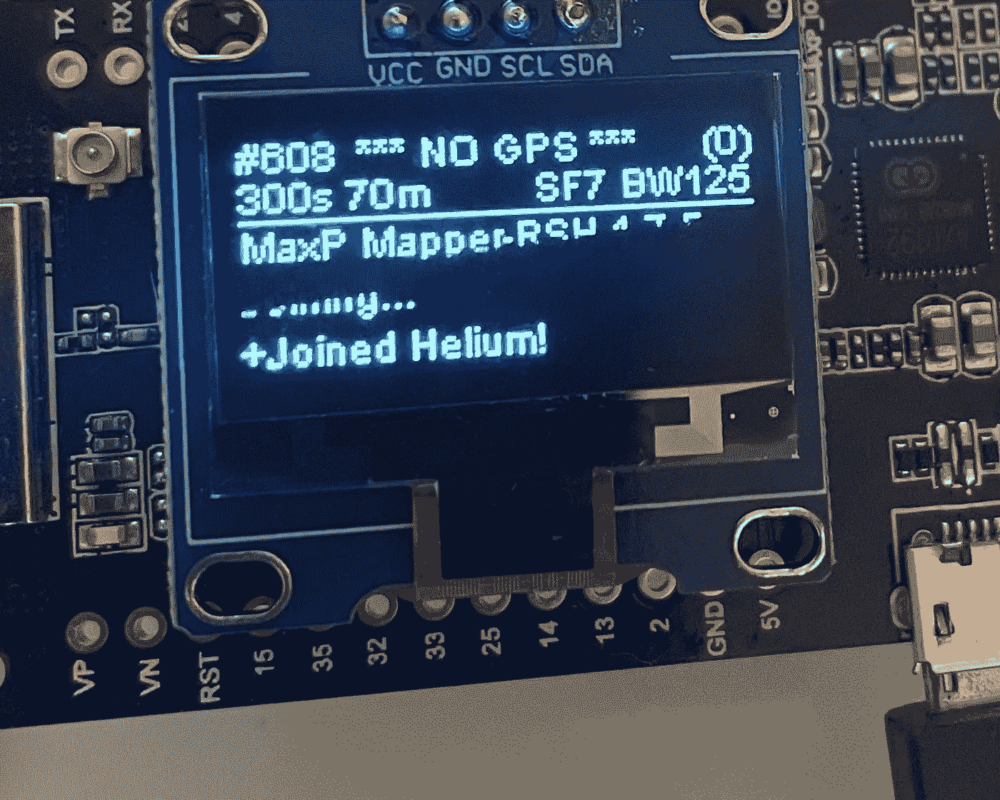

好了，我们可以走了！但是去哪里？好了，困难的部分已经完成了。如果你有你的劳拉天线重视，并有氦网络在你周围，你在说话！您的设备需要一些时间才能加入。所以我们继续吧。我们越来越近了！你可以在这里继续阅读，或者看看[这本指南](https://docs.helium.com/use-the-network/coverage-mapping/mappers-quickstart/)。

## 配置氦控制台

好了，现在我们希望我们的映射器设备实际上为映射做出贡献！所以让我们开始吧。让我们回到氦控制台。我们希望将映射器的输出发送到映射平台。我们需要将正在生成的数据转换成标准格式，然后我们需要将格式化的数据发送到映射平台。

所以，让我们把数据正确格式化…或者“解码”。

让我们从创建一个新函数开始。所以按功能，然后按+号。随便你叫它什么，我叫它“地图解码者”。

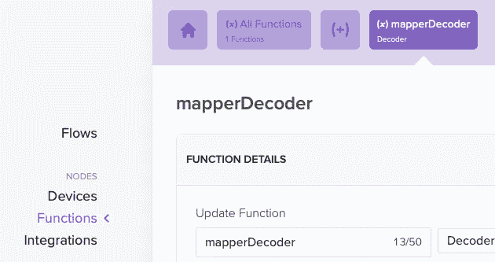

然后，在下面的代码空间中，你将粘贴一些 github 提供给你的代码。在 VSCode 中，您可以转到项目导航器，在 console-decoders 中查找，并选择 unified_decoder.js。只需复制此代码，并将其粘贴到函数屏幕的代码空间中。就是这样。省省吧，我们继续。

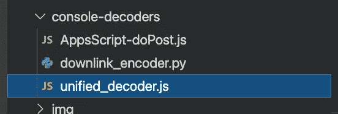

现在，我们将进行集成，这将是数据流路径的最后一部分，从设备开始，经过功能，到达映射器平台。

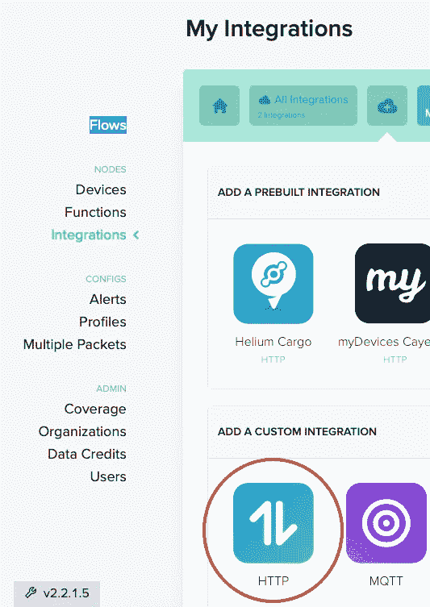

选择 HTTP 集成图标。

*   输入 Mappers API 摄取端点 URL(必需)`[https://mappers.helium.com/api/v1/ingest/uplink](https://mappers.helium.com/api/v1/ingest/uplink)`
*   输入该集成的名称: *Mappers 集成*
*   最后点击*添加集成*完成。

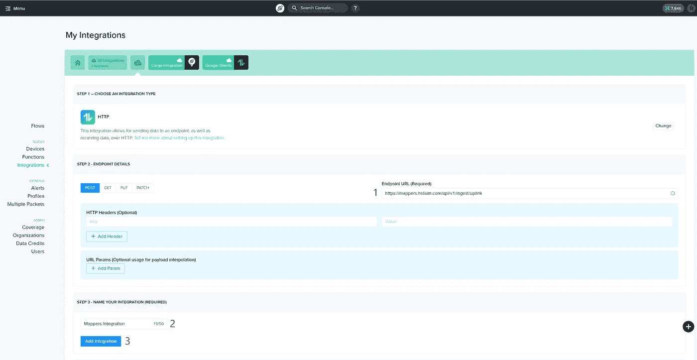

最后，让我们把这东西连起来！我们将创建一个日期“流”。点击“流程”。按+号，然后选择设备。将您的设备拖到工作区。对您创建的函数和集成进行同样的操作。然后，通过点击连接点，将设备连接到功能，以及集成的功能。

把你的设备接入天空，你会发现你得到一些卫星。然后最终你会看到它在工作。您的设备屏幕应该看起来像这样:

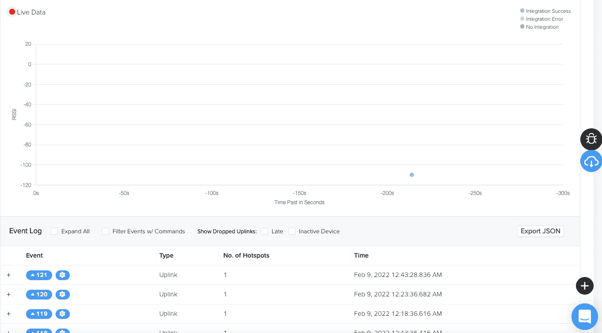

就是这样！你也可以在地图上看到你的贡献！

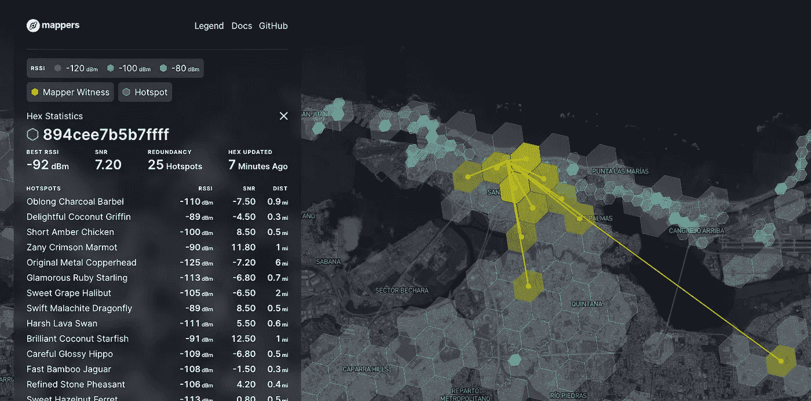

这里你可以看到我的映射器，已经更新了它所在的十六进制。我身边所有的 hexes 都是 5 天到 5 个月前更新的。我知道我的魔法更新了，因为它发生在几分钟前。

# 你从零到氦测绘英雄！