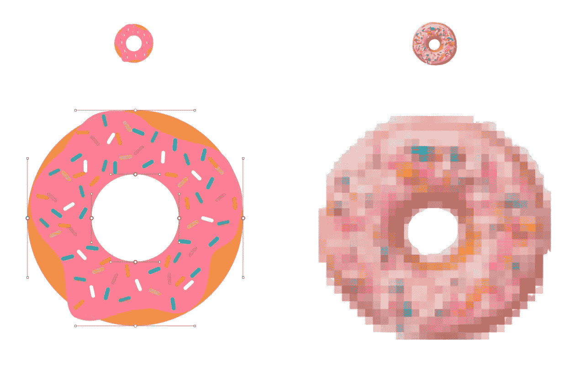
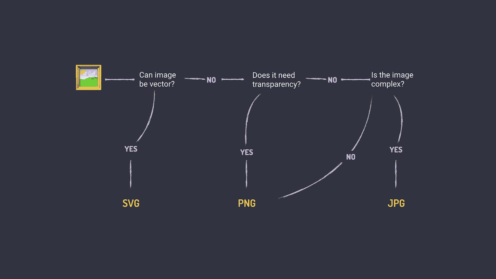
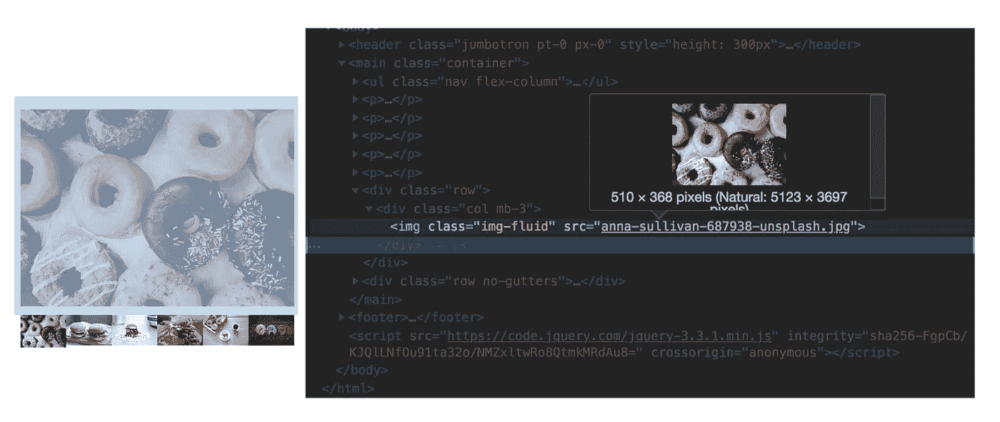
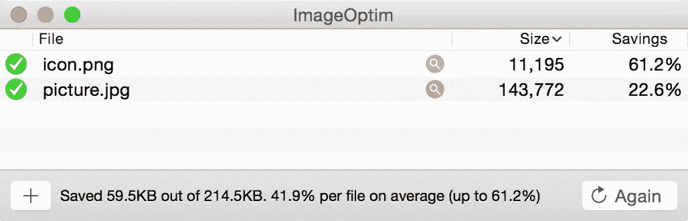

# 图像优化入门

> 原文：<https://levelup.gitconnected.com/getting-started-with-image-optimisation-e85708063f07>



最近，我在珀斯的初级开发者会议上做了一个关于图像优化的入门讲座。[如果您在该地区，请查看青少年发展信息](https://juniordev.io/)。在演示过程中很难记住所有的东西，所以为了帮助大家，我在这篇文章中发布了我演讲的要点，作为快速参考指南，不仅是为与会者，也是为所有对图像优化感兴趣的人。

讲座涵盖了四个方面:

1.  格式
2.  胶料
3.  压缩
4.  自动化

# 格式

图像优化的第一个重要选择是图像的格式。首先要决定图像是矢量还是光栅。矢量图像由点、线和多边形组成，通过数学的力量创建一个独立于分辨率的图像。光栅图像由单个像素组成，它们与分辨率无关，但在需要照片真实感时非常理想。


圆环的矢量和光栅图像比较

有四种图像格式需要考虑:

*   挽救（saving 的简写）
*   PNG
*   使用 jpeg 文件交换格式存储的编码图像文件扩展名
*   WEBP

选择正确的格式很重要，因为每种格式都有优点和缺点。为了帮助选择正确的格式，我想出了这个工作流程:



图像格式工作流程

我将更详细地解释工作流程。

1.  图像可以是矢量的吗？
    这通常适用于标志、图标和插图。当图像不是照片级真实图像，并且您希望分辨率独立时。如果是这样的话，SVG 是最好的选择。
2.  图像有透明度吗？
    如果图像不能是矢量，但需要透明，例如透明背景，那么 PNG 是最佳选择。
3.  形象复杂吗？
    如果图像很复杂，意味着有很多混合颜色(渐变)，就像照片一样，那么 JPG 将是最佳选择。
4.  如果图像不复杂，那么 PNG 可能是最好的选择。

这是一个让你步入正轨的基本工作流程。当你看图像时，你会开始知道哪种图像格式有效，但如果你不确定，尝试每种格式并比较结果也无妨。

您可能会注意到 WEBP 在工作流中的锁定。我通常会在自动化出现之前离开 WEBP 我们稍后会谈到自动化。这是一个很好的选择，它支持透明度，并提供低图像尺寸的高质量。

WEBP 主要是一种 Chrome 格式，但最近的浏览器版本已经改善了对 Edge 18 和 Firefox 65 的支持，增加了对 WEBP 的支持。据说其他厂商正在试验这种格式，因此值得关注[can use 来跟踪 WEBP](https://caniuse.com/#feat=webp) 支持。

# 大小

有了正确格式的图像，下一步是选择最佳(最小)的图像尺寸。一种方法是使用开发人员工具来检查站点。



Chrome developer tools 截图，显示图像的预期大小与实际大小

开发者工具告诉我们两件有趣的事情，浏览器使用的大小和发送的大小。最好的结果是让它们尽可能靠近。您需要清点图像和站点的各种断点，以确定适合您的用例的最佳图像数量。这可能意味着移动、平板、桌面或移动和桌面或介于两者之间的图像。您需要根据您的设计做出决定，并在可维护性和性能之间取得平衡。

一旦你知道了图像的大小，有几种方法可以调整图像的大小。以下是我过去成功的几个选择:

*   Sips
    Sips 是一个命令行工具，可以使用各种选项和通配符来快速修改图像
    例如，这将调整目录中所有 jpg 的大小，以使其中一个边最大为 510px
    `sips -Z 510 *.jpg`
    在终端中键入`man sips`以获得使用说明
*   ImageMagick 可以调整图像的大小(等等)。这是一个很有价值的工具，但是需要一个学习过程。但是文档非常有用。
*   Photoshop
    Photoshop 中的批处理工具非常适合这样的任务。

我们现在有几个图像要在同一个地方显示。这是我们接触图片元素的地方。与 srcsets 结合的图片元素做了很好的工作，不仅显示了正确大小的图像，而且没有下载其他图像，节省了宝贵的带宽。

[浏览器对图片元素](https://caniuse.com/#feat=picture)的支持非常棒。即使对于不支持的浏览器，它们也默认显示 img 标签，这在大多数情况下没问题。

```
<picture>
    <source media="(min-width: 60em)" type="image/webp" srcset="donut-large.webp" />
    <source media="(min-width: 60em)" srcset="donut-large.jpg" />
    
</picture>
```

请注意，在这个例子中，Picture 使我们能够通过 type 属性包含不同的格式，从而打开了在项目中使用 WEBP 的可能性。

# 压缩

我们的图像优化过程的第三部分是压缩。压缩将对周围像素做出有根据的猜测，并从图像中删除不必要的元数据，如位置和设备信息。压缩还有很多，这是一个复杂的领域，但有很好的资源解释压缩，如[乌纳克拉韦茨 Mixin Conf Talk](https://youtu.be/3j6aISzkbS4) 。

# ImageOptim

为了简单起见， [ImageOptim](https://imageoptim.com/mac) 是您应该用于压缩的工具。这是一个简单的拖放工具，使用业界最佳的压缩算法，提供了很好的结果。



# Squoosh

最近谷歌的一个团队发布了 [Squoosh.app](https://squoosh.app/) 。Squoosh 是一个在线工具，可以让你上传图片，并在浏览器中测试不同的图片压缩方法。观察不同的算法和图像类型对压缩的反应是很有趣的。

# 盖茨利

当质量很重要并且你不太担心时间的时候， [Guetzli](https://github.com/google/guetzli) 是一个很好的优化工具。谷歌的另一个工具 Guetzli 给出了类似于 WEBP 的结果。优化一幅图像可能需要很长时间，所以在考虑 Guetzli 时要记住这一点。

```
guetzli --quality 85 source/donut.jpg build/images/donut.jpg
```

# SVGOMG

最后一个工具是 [SVGOMG](https://jakearchibald.github.io/svgomg/) 。谷歌的另一个工具 SVGOMG 允许你上传一个 SVG 并尝试不同的压缩选项来查看结果并下载压缩后的图像。

这是可用于压缩图像的工具列表。还有很多。主要的要点应该是你应该压缩。至少，把你的图片放到 ImageOptim 中，让它自己处理。

为了结束图像压缩，这里还有一些提示:

1.  从原始质量图像开始。这样你就不会有来自其他压缩的假象。
2.  减少颜色。如果可以的话，减少图像中的颜色数量以获得更好的效果
3.  质量的较好范围是 75–85%。这是一个指导方针，尝试不同的品质，看看什么是有效的。一些图像不如其他图像重要，因此可以有更高的压缩级别。

# 自动化

你应该尽可能地自动化这个过程。自动化可能非常依赖于您正在处理的项目及其设置，但是有一些事情需要考虑。

# WEBP

前面我提到过 WEBP 最适用于自动化。当从服务器请求资源时，浏览器将发送 Accept 头。标题可能类似于以下内容:

```
Accept: text/html,application/xhtml+xml,application/xml;q=0.9,image/webp,image/apng,*/*;q=0.8
```

浏览器向服务器发出信号，表示它可以接受 image/webp。然后，您的服务器可以将之前转换的 WEBP 返回给用户，而不是返回原始图像。关于这种方法的更多细节可以在谷歌关于图像优化的文章[中阅读。](https://developers.google.com/web/fundamentals/performance/optimizing-content-efficiency/automating-image-optimization/#how-do-i-serve-webp)

将图像转换成 WEBP 在很大程度上取决于您的构建链，这是本文要涵盖的内容，所以同一篇 Google Web Fundamentals 文章提供了关于将图像转换成 WEBP 的手动和自动过程的大量信息。

# 自动调整大小/压缩

使用前面提到的工具调整图像大小是一个很好的开始，但是您可能有多个图像源或多个提供图像的贡献者。这就是智能种植派上用场的地方。开始智能种植最简单的方法是通过诸如 [Fastly](https://www.fastly.com/) 或 [Cloudinary](https://cloudinary.com/) 这样的服务。两者都有大量的功能，包括比例裁剪、智能裁剪、图像优化和更多相对实惠的价格。值得深入研究他们的文档，看看有什么可能。

如前所述，云服务是有成本的，所以你可能想探索开源的替代品，比如 [Imageflow](https://github.com/imazen/imageflow) 或 [thumbor](https://github.com/thumbor/thumbor) 。你是在用便利换取控制，这同样取决于你项目的需求。

# 不要使用图像

这个建议听起来可能很奇怪，但是不要使用图像——如果你没有必要的话。HTML 和 CSS 有如此强大的功能。你对这些工具了解得越多，你可能就越不需要使用图像，而最有效的图像就是不要有图像。

看看[Diana Smith](http://diana-adrianne.com/purecss-francine/)做的[纯 CSS Francine](https://twitter.com/cyanharlow) 之类的例子。现在，这对于日常图像来说可能不太实用，需要相当多的技巧才能实现，但这是一个仅用 CSS 就能实现的惊人例子。

一个更实际的选择，是下面的[由](https://codepen.io/collection/DamKJW/)[曼迪·迈克尔](https://twitter.com/mandy_kerr/)创作的文本特效笔集合。它们不仅(大部分)是在没有图像的情况下创建的，而且在浏览器中保持可编辑状态。

希望这些例子能让你相信 HTML 和 CSS 的力量，并给你一些惊人的想法去创造。

这就结束了图像优化的介绍，虽然它肯定不是详尽无遗的。这会给你一个很好的基础，让你开始以最好的方式使用图片。如果你对进一步阅读感兴趣，可以看看阿迪·奥斯马尼的[基本图像指南](https://images.guide/)和[自动图像压缩指南](https://developers.google.com/web/fundamentals/performance/optimizing-content-efficiency/automating-image-optimization/)。如果您有任何问题或意见，请通过 Twitter 联系[我。](https://twitter.com/antonjb)

[](https://levelup.gitconnected.com)[](https://gitconnected.com/learn/javascript) [## 学习 JavaScript -最佳 JavaScript 教程(2019) | gitconnected

### 50 大 JavaScript 教程-免费学习 JavaScript。课程由开发人员提交并投票，从而实现…

gitconnected.com](https://gitconnected.com/learn/javascript)