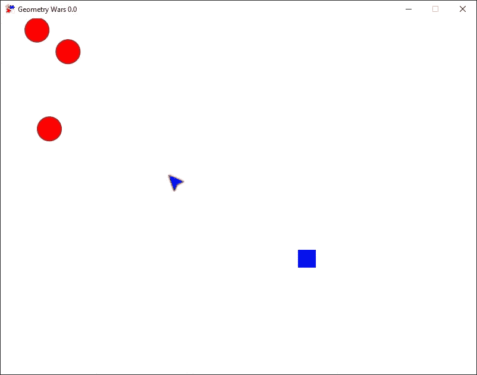

# JavaFX 和 FXGL 游戏开发入门

> 原文：<https://levelup.gitconnected.com/getting-started-with-javafx-and-fxgl-game-development-7f3324727406>

[FXGL](https://github.com/AlmasB/FXGL) 是由 [Almas Baimagambetov](https://twitter.com/AlmasBaim) 制作的 Java、JavaFX、Kotlin 游戏库(引擎)。当我的儿子(快 10 岁了)挑战我在我“呆在家里的时间”做一个游戏时，我很幸运，Almas 提供了一个详细的分步指南。

这将是本教程的最终结果:

我们将使用 JavaFX 游戏开发框架 [FXGL](https://github.com/AlmasB/FXGL) 制作一个*非常*简单的《几何战争》克隆版。你可以在我的 GitHub 上找到这个帖子的完成项目[作为 Maven 项目。](https://github.com/FDelporte/FXGLFirstTest)

要完成这个教程，你首先需要[通过 Maven / Gradle 或者作为一个超级 jar 获得 FXGL](https://github.com/AlmasB/FXGL/wiki/Get-FXGL-%28Maven%2C-Gradle%2C-Uber%29) 。确保你用的是 FXGL 11，目前最新版本是`11.8`。本教程是独立的，不需要以前的 FXGL 知识。

# 属国

我从一个空的 Maven 项目开始，用这个依赖项扩展了 pom.xml 文件:

```
<dependency>
 <groupId>com.github.almasb</groupId>
 <artifactId>fxgl</artifactId>
 <version>11.8</version> 
</dependency>
```

# 密码

代码分为两类

*   GeoWarsApp.java 是主要的应用程序
*   GeoWarsFactory.java 定义了图形元素的外观和行为

# GeoWarsApp 最小代码

创建一个文件`GeoWarsApp.java`，让我们导入所有这些文件，并在本教程的剩余部分中忘记它们。**注意:**静态导入允许我们写例如`getAppHeight()`而不是`FXGL.getAppHeight()`，这使得代码更干净。

```
import static com.almasb.fxgl.dsl.FXGL.getAppHeight;
import static com.almasb.fxgl.dsl.FXGL.getAppWidth;
import static com.almasb.fxgl.dsl.FXGL.getGameController;
import static com.almasb.fxgl.dsl.FXGL.getGameWorld;
import static com.almasb.fxgl.dsl.FXGL.onBtnDown;
import static com.almasb.fxgl.dsl.FXGL.onCollisionBegin;
import static com.almasb.fxgl.dsl.FXGL.onKey;
import static com.almasb.fxgl.dsl.FXGL.run;
import static com.almasb.fxgl.dsl.FXGL.showMessage;
import static com.almasb.fxgl.dsl.FXGL.spawn;

import com.almasb.fxgl.app.GameApplication;
import com.almasb.fxgl.app.GameSettings;
import com.almasb.fxgl.entity.Entity;
import com.almasb.fxgl.entity.EntityFactory;
import javafx.scene.input.KeyCode;
import javafx.scene.input.MouseButton;
import javafx.util.Duration;
```

## 游戏类中最少的代码

本节将介绍每种方法，并解释代码的主要部分。默认情况下，FXGL 将游戏大小设置为 800x600，这适用于我们的游戏。您可以更改这些和其他各种设置，例如`settings.setWidth(1280)`。现在，我们将只设置标题并添加入口点- `main()`。

```
public class GeoWarsApp extends GameApplication {

    public static void main(String[] args) {
        launch(args);
    }

    @Override
    protected void initSettings(GameSettings settings) {
        settings.setTitle("Geometry Wars");
    }
}
```

## 定义游戏实体

下一步是考虑游戏对象的类型，它们被称为实体，我们将在游戏中拥有它们。在这个简单的例子中，我们将有玩家、子弹和敌人。为了标记这些类型，我们将创建一个枚举:

```
public enum EntityType {
 PLAYER, BULLET, ENEMY 
}
```

# 地质工厂

在这个工厂中，我们创建元素类型。在 FXGL 中，有一个创建所有实体的地方，它被称为实体工厂。为了创建您自己的工厂，我们用列出的导入创建了第二个类，其中一些是静态的，以保持代码整洁:

```
import static com.almasb.fxgl.dsl.FXGL.entityBuilder;
import static com.almasb.fxgl.dsl.FXGL.getAppHeight;
import static com.almasb.fxgl.dsl.FXGL.getAppWidth;
import static com.almasb.fxgl.dsl.FXGL.getInput;
import static com.almasb.fxgl.dsl.FXGLForKtKt.getGameWorld;import be.webtechie.GeoWarsApp.EntityType;
import com.almasb.fxgl.dsl.components.OffscreenCleanComponent;
import com.almasb.fxgl.dsl.components.ProjectileComponent;
import com.almasb.fxgl.dsl.components.RandomMoveComponent;
import com.almasb.fxgl.entity.Entity;
import com.almasb.fxgl.entity.EntityFactory;
import com.almasb.fxgl.entity.SpawnData;
import com.almasb.fxgl.entity.Spawns;
import javafx.geometry.Point2D;
import javafx.geometry.Rectangle2D;
import javafx.scene.paint.Color;
import javafx.scene.shape.Circle;
import javafx.scene.shape.Rectangle;

public class GeoWarsFactory implements EntityFactory {

}
```

## 定义玩家实体

工厂需要知道如何创建每个实体。因此，对于我们在 EntityType 枚举中指定的每个类型，首先从`player`开始，我们必须提供以下细节:

```
public class GeoWarsFactory implements EntityFactory {

    @Spawns("player")
    public Entity newPlayer(SpawnData data) {
        return entityBuilder()
                .from(data)
                .type(EntityType.PLAYER)
                .viewWithBBox(new Rectangle(30, 30, Color.BLUE))
                .collidable()
                .build();
    }
}
```

首先，方法签名很重要。它有一个注释，我们稍后可以用它来生成一个播放器。接下来，让我们看看我们是如何定义玩家的。

*   我们使用`entityBuilder()`来帮助我们这样做。
*   `.from(data)`设置职位等典型属性，从`SpawnData data`获取。
*   我们还通过`.type(EntityType.PLAYER)`设置实体的类型。
*   下一行`.viewWithBBox(new Rectangle(30, 30, Color.BLUE))`有两个目的:a)为玩家提供矩形视图，b)为视图中的碰撞生成一个边界框。
*   最后，我们将实体标记为`.collidable()`并构建它。

## 用项目符号实体扩展

现在对子弹采用同样的方法…

```
public class GeoWarsFactory implements EntityFactory {

    // ...

    @Spawns("bullet")
    public Entity newBullet(SpawnData data) {
        Entity player = getGameWorld()
            .getSingleton(EntityType.PLAYER); Point2D direction = getInput().getMousePositionWorld()
            .subtract(player.getCenter());

        return entityBuilder()
                .from(data)
                .type(EntityType.BULLET)
                .viewWithBBox(new Rectangle(10, 2, Color.BLACK))
                .collidable()
                .with(new ProjectileComponent(direction, 1000))
                .with(new OffscreenCleanComponent())
                .build();
    }
}
```

首先我们得到玩家实例。第二行计算子弹创建时的行进方向，从玩家中心开始。除了我们上面已经介绍过的 API，`.with(new ProjectileComponent(direction, 1000))`和`.with(new OffscreenCleanComponent())`将**组件**附加到我们的 bullet 实体上。组件可以包含数据和行为，并为实体带来新的功能。例如，`ProjectileComponent`以给定的速度沿`direction`每帧移动实体。`OffscreenCleanComponent`顾名思义，如果实体超出屏幕边界，就将其从游戏中移除。

## 最后，我们有敌人的实体

敌人是我们在 EntityType 枚举中定义的最后一个。

```
public class GeoWarsFactory implements EntityFactory {

    // ...

    @Spawns("enemy")
    public Entity newEnemy(SpawnData data) {
        Circle circle = new Circle(20, 20, 20, Color.RED);
        circle.setStroke(Color.BROWN);
        circle.setStrokeWidth(2.0);

        return entityBuilder()
                .from(data)
                .type(EntityType.ENEMY)
                .viewWithBBox(circle)
                .collidable()
                .with(new RandomMoveComponent(
                    new Rectangle2D(0, 0, 
                    getAppWidth(), getAppHeight()), 50))
                .build();
    }
}
```

对于我们的敌人，我们将使用一个圆作为视图。上面已经介绍了大多数方法，所以我们将重点介绍`RandomMoveComponent`。该组件使用提供的矩形边界，在这些边界内随机移动实体。这个简单的行为对我们的小游戏来说已经足够了。

我们现在已经完成了工厂类！

# GeoWarsApp 进一步扩展

现在 FXGL 知道了如何创建实体，让我们回到应用程序类 GeoWarsApp 来添加输入和逻辑。

首先，我们添加一个对工厂和我们的播放器的引用，这将在后面生成。

```
public class GeoWarsApp extends GameApplication {

    private final GeoWarsFactory geoWarsFactory = new GeoWarsFactory();
    private Entity player;

    // .. other code
}
```

使用这个引用，我们可以开始添加一些用户操作，称为输入处理:

```
@Override
protected void initInput() {
    onKey(KeyCode.W, () -> player.translateY(-5));
    onKey(KeyCode.S, () -> player.translateY(5));
    onKey(KeyCode.A, () -> player.translateX(-5));
    onKey(KeyCode.D, () -> player.translateX(5));
    onBtnDown(MouseButton.PRIMARY, () -> 
        spawn("bullet", player.getCenter()));
}
```

上面的代码应该是不言自明的，并且利用了 Java 8+ lambda 符号。如果您希望能够在按下鼠标按钮的同时进行拍摄，而不是只按一次，您可以将`onBtnDown`更改为`onBtn`。

我们的游戏中还增加了另外两个东西:初始化逻辑和物理。不要担心，虽然这听起来很复杂，但事实并非如此。初始化逻辑:

```
@Override
protected void initGame() {
    getGameWorld().addEntityFactory(geoWarsFactory);

    player = spawn("player", getAppWidth() / 2 - 15, getAppHeight() / 2 - 15);
    geoWarsFactory.setPlayer(player);

    run(() -> spawn("enemy"), Duration.seconds(1.0));
}
```

首先，我们将我们的工厂添加到游戏世界中，这样我们就可以使用像`spawn()`这样的方法。接下来，我们通过在游戏中心生成玩家实体来初始化我们的`player`引用。我们还需要为我们的 geoWarsFactory 提供这个播放器，因为它需要它来定义新子弹的起点。

最后一个调用设置了一个每秒运行一次的计时器。你能猜出每秒钟发生了什么吗？答案是:`spawn("enemy")`，即产生了一个新的敌人实体。由于我们不提供任何位置，敌人实体将在`(0,0)`出现。

物理代码很简单，因为我们已经设置了最复杂的东西:

```
@Override
protected void initPhysics() {
    onCollisionBegin(EntityType.BULLET, EntityType.ENEMY, (bullet, enemy) -> {
        bullet.removeFromWorld();
        enemy.removeFromWorld();
    });

    onCollisionBegin(EntityType.ENEMY, EntityType.PLAYER, (enemy, player) -> {
        showMessage("You Died!", () -> {
            getGameController().startNewGame();
        });
    });
}
```

我们设置了两个冲突处理程序。第一个处理子弹型和敌人型的碰撞。当这样的冲突发生时，我们简单地从游戏中移除两个实体。在第二个处理程序中，我们显示了一个信息对话框，文本为“你死了！”并重新开始游戏。

# 结论



在 IDE 的 main 方法上点击 run，就这样！用 FXGL 创建的第一个 JavaFX 游戏。

你可以从[github.com/FDelporte/FXGLFirstTest](https://github.com/FDelporte/FXGLFirstTest)那里得到完成的源代码。

访问 [FXGL wiki](https://github.com/AlmasB/FXGL/wiki/FXGL-11) 获取更多教程。从 [itch.io](https://fxgl.itch.io/) 可以获得预建的游戏，让你知道 FXGL 可以实现什么。更复杂的例子可以在 [FXGLGames](https://github.com/AlmasB/FXGLGames) 找到。

*最初发布于*[*https://web techie . be*](https://webtechie.be/post/2020-05-07-getting-started-with-fxgl/)*。*