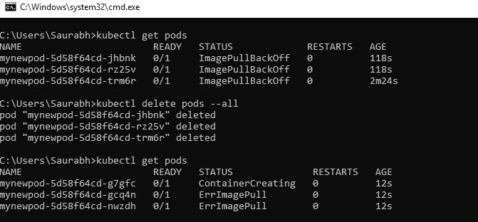

# Kubernetes 和容器编排入门

> 原文：<https://levelup.gitconnected.com/getting-started-with-kubernetes-and-container-orchestration-8a579232e40b>

# 什么是 Kubernetes

ubernetes 或俗称的 K8s 是一个流行的容器编排工具，它运行在我们的容器上(在任何容器引擎上创建，如 Docker、Podman、CRI-O 等。)并管理容器化应用程序的自动化部署、扩展和管理。
Kubernetes 集群可以跨越本地、公共、私有或混合云的主机。因此，Kubernetes 是托管需要快速扩展的云原生应用程序的理想平台，比如通过 Apache Kafka 的实时数据流。

# Kubernetes 的优势:

除了我们已经看到的之外，Kubernetes 还提供了大量的其他工具，这使得它成为一个广泛使用的强大的容器编排工具。其中一些是:

## [1。服务发现和负载平衡](https://kubernetes.io/docs/concepts/services-networking/service/)

无需修改您的应用程序来使用不熟悉的服务发现机制。Kubernetes 为一组 Pods 提供它们自己的 IP 地址和一个 DNS 名称，并且可以在它们之间进行负载平衡。

## [2。自动推出和回滚](https://kubernetes.io/docs/concepts/workloads/controllers/deployment/)

Kubernetes 逐步推出对您的应用程序或其配置的更改，同时监控应用程序的健康状况，以确保它不会同时杀死您的所有实例。如果出现问题，Kubernetes 将为您回滚更改。利用不断增长的部署解决方案生态系统。

## [3。自愈](https://kubernetes.io/docs/concepts/workloads/controllers/replicationcontroller/#how-a-replicationcontroller-works)

重新启动失败的容器，在节点失效时替换和重新安排容器，终止不响应用户定义的运行状况检查的容器，并且在它们准备好提供服务之前不向客户端通告它们。

## [4。自动装箱](https://kubernetes.io/docs/concepts/configuration/manage-resources-containers/)

根据资源需求和其他限制自动放置容器，同时不牺牲可用性。混合关键工作负载和尽力而为工作负载，以提高利用率并节省更多资源。

## [5。容错](https://medium.com/swlh/fault-tolerance-in-kubernetes-clusters-f5d707bc8b5c)

Kubernetes 提供了高可用性和强大的容错能力。它检查容纳从我们的集装箱引擎发射的集装箱的吊舱的健康状况，并知道吊舱何时面临停机时间或不能正常工作，管理和修复吊舱或以几乎零停机时间运行另一个吊舱。

# 必需的 Kubernetes 词汇:

**控制平面:**控制 Kubernetes 节点的流程集合。这是所有任务分配的起点。

**节点:**这些机器执行控制平面分配的请求任务。

**Pod:** 部署到单个节点的一组一个或多个容器。pod 中的所有容器共享一个 IP 地址、IPC、主机名和其他资源。Pods 从底层容器中抽象出网络和存储。这使您可以更容易地在集群中移动容器。

**复制控制器:**它控制集群中某个地方应该运行多少个相同的 pod 副本。

**服务:**这将工作定义从 pod 中分离出来。Kubernetes 服务代理自动将服务请求发送到正确的 pod——无论它在集群中的位置如何，甚至是否被替换。

**Kubelet:** 该服务在节点上运行，读取容器清单，并确保已定义的容器已启动并正在运行。

**ku bectl:**Kubernetes 的命令行配置工具。

# 让我们到引擎盖下…

现在，我们已经了解了 kubernetes 的基础知识，让我们看看编排引擎实际上是如何工作的

Kubernetes 架构主要由两部分组成，即控制器(控制平面)和计算机器(通常称为节点)。

每个节点都有自己的环境，可以是运行裸机操作系统的物理机，也可以是虚拟机。每个节点运行几个 pod，这些 pod 通常由在其中运行的容器组合而成。

控制平面负责维护所需的群集状态，例如哪些应用程序正在运行，以及它们使用哪些容器映像。计算机器实际上运行应用程序和工作负载。
这种移交与多种服务一起工作，以自动决定哪个节点最适合该任务。然后，它分配资源并指派该节点中的 pod 来完成所请求的工作。

## 理想的状态

Kubernetes 集群的理想状态定义了应该运行哪些应用程序或其他工作负载，以及它们使用哪些映像，应该为它们提供哪些资源，以及其他类似的配置细节。它包含由架构师提供的关于给定时间点运行的期望 pod 数量、期望多少副本等的管理要求的信息。

从基础设施的角度来看，管理容器的方式没有什么变化。您对容器的控制只是发生在一个更高的层次，让您更好地控制，而不需要微观管理每个单独的容器或节点。

您的工作包括配置 Kubernetes 和定义节点、pod 以及其中的容器。Kubernetes 负责编排容器。在哪里经营 Kubernetes 由你决定。这可以在裸机服务器、虚拟机、公共云提供商、私有云以及混合云环境中进行。Kubernetes 的主要优势之一是它可以在许多不同类型的基础设施上工作。

# 让我们自己旋转一些集群…

要运行一个集群，有一些先决条件。我们必须在我们的机器上安装一个 minikube 以及一个用于运行和管理集群的 kubectl 程序。

> 安装 Minikube:
> [https://kubernetes.io/docs/tasks/tools/install-minikube/](https://kubernetes.io/docs/tasks/tools/install-minikube/)
> 
> 安装库贝克特尔:
> 【https://kubernetes.io/docs/tasks/tools/install-kubectl/ 

## 启动 minikube 服务

Minikube 用于在我们的机器中设置一些集群编排环境，因为它在我们的虚拟机中启动一个预配置的环境。
运行 minikube:

> minikube 启动

minikube 开始命令工作

该命令将在虚拟箱(默认为 minikube 使用的虚拟环境)中启动一个正在运行的 minikube 实例。你可以看到一个名为 minikube 的环境在你的虚拟盒子的后台运行

minikube 在虚拟盒子中推出

## 凭证…

默认情况下，虚拟机的凭据设置为:

> 用户名:docker
> 密码:tcuser

现在我们已经成功启动了 minikube 环境，现在我们可以尝试一些 kubernetes 命令，我们可以使用 kubernetes 的 kubectl 命令创建、管理和编排容器和 pod。

## 发射舱

> kubectl get pods:
> 这个命令用于获取所有正在运行的 pods。
> 
> ku bectl create deployment<imagename>—image = container _ image _ location:
> 该命令用于在流程编排的 pod 中部署一个新容器</imagename>

nginx 容器在 mynewpod 中启动

上面的命令显示了一个成功运行的 pod (mynewpod ),它包含一个运行 Nginx 映像的容器。
现在，正如我们所说，Kubernetes 是一个非常智能的容器编排工具，可以管理在 pod 内运行的容器的健康状况，因此，如果由于某些原因 pod 可能会死亡或停止正常工作，它会在几秒钟内启动另一个具有相同映像的 pod。

## 让我们破坏发射的吊舱，并实际体验 Kubernetes 的力量…

正如我们所见，原始 pod 已被销毁，当我们在后台检查正在运行的 pod 时，Kubernetes 立即启动了另一个具有不同名称的新 pod 容器，从而确保尽可能减少停机时间。因为容器引擎本身很快，因此将应用程序的停机时间减少到几秒钟。

我们看到了 kubernetes 的自我修复和容错能力，但是 Kubernetes 的复制部分呢

为了检查 kubernetes 提供的复制控制器的能力，让我们将 pod 的副本增加到 3 个，看看会发生什么

当我们告诉我们的 kubernetes 启动我们刚刚创建的 pod 的 3 个副本时，它的复制控制器立即启动 3 个容器，这些容器是我们向 kubernetes 展示的愿望的一部分。kubernetes 现在将管理所有 3 个吊舱，并将确保我们的愿望始终得到满足，即它将确保在未来的任何时间点，我们必须有 3 个内部装有 nginx 容器的健康运行吊舱

一旦我们销毁或删除了所有的豆荚，正如我们的愿望中提到的，kubernetes 立即推出另一套豆荚，以便我们的愿望中提到的配置总是得到满足。

至此，我们都更加熟悉 kubernetes 的词汇和它所拥有的力量，以及它的重要性和用例。

## 接下来[创建 K8s 脚本—深入 K8s](https://medium.com/@dimrisaurabh06/creating-k8s-scripts-deep-dive-to-cluster-orchestration-f0ca70c02c63)

> ………………………………………………………………………………
> 
> “软件就像熵:很难把握，没有重量，遵守热力学第二定律；也就是说，它总是增加。”
> *—诺曼·奥古斯丁*