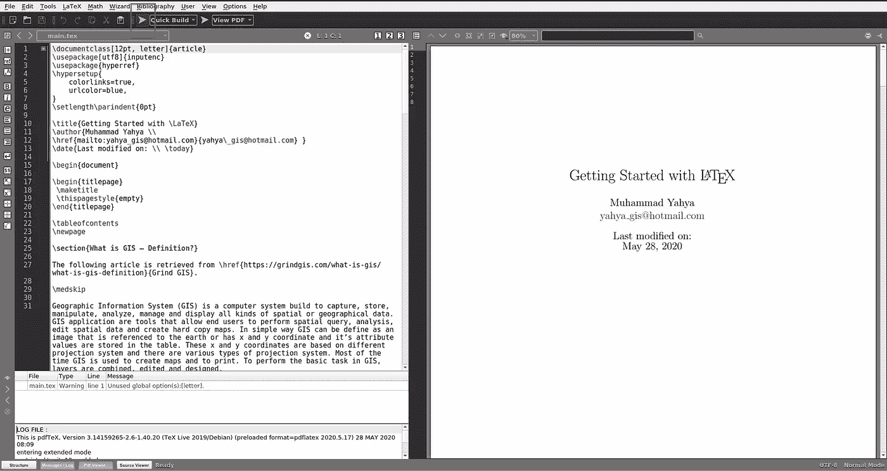
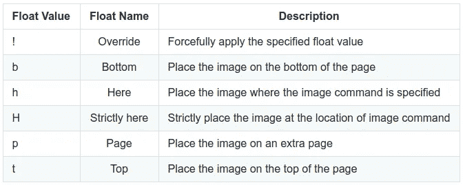

# 乳胶入门

> 原文：<https://levelup.gitconnected.com/getting-started-with-latex-52eac727a21a>

## 学习 LATEX 的一步一步的完整指南

## 学习乳胶从基础到高级水平


图片来源:【https://en.wikipedia.org/wiki/LaTeX 

LaTeX 是一个高质量的文档准备系统，用于制作专业外观的技术和科学文档。要用 LaTex 准备文档，我们需要一个 LaTeX 源文件，其中包含 LaTeX 代码和文档的实际内容。这个文件以扩展名`.tex` *结尾。*我们还需要一个文本编辑器来编辑源文件。运行 LaTeX 编译器会将源文件编译成文档交换格式，如 pdf，然后可以在任何 pdf 查看器中预览。

本系列文章旨在帮助您从初级水平到高级水平开始使用 LaTex。在第一部分中，我们将学习基本的软件安装，并用 LaTex 编写一个带有标题页的简单文档。

# 装置

为了开始用 LaTeX 编写文档，您需要安装两件东西:

1.  乳胶分布
2.  2.文本编辑器

有几个可用的 LaTeX 发行版和编辑器，但是对于本教程，我们将使用 [MikTex](https://miktex.org/) 和 [Texmaker](https://www.xm1math.net/texmaker/) 分别作为发行版和编辑器。

## 下载并安装 MiKTeX

从这个[链接](https://miktex.org/download)下载 MiKTeX 发行版。

下载后，运行下载的文件，并按照默认说明进行操作。你可以在这里看到安装过程[的图片。](https://miktex.org/howto/install-miktex)

## 下载并安装 Texmaker

从这个[链接](http://www.xm1math.net/texmaker/download.html)下载 Texmaker 编辑器。

下载后，运行下载的文件，并按照默认说明进行操作。

## 撰写第一份文件

1.  从这个 [Github repo](https://github.com/m-yahya/latex-tutorial.git) 下载示例项目文件。
2.  在 Texmaker 中打开`main.tex`文件，点击*运行*按钮，瞧🎉。
    **注:**您可能需要点击两次运行按钮来生成目录。此外，如果弹出一个消息窗口，请安装该软件包。



这一部分将解释 LaTeX 文档结构以及如何创建标题页面

# LaTeX 文件的布局

要在 LaTeX 中创建文档，我们需要一个以扩展名'*'结尾的纯文本文件。tex*’。这个文件包含 LaTeX 代码(LaTeX 命令)和文档的实际内容。LaTeX 命令用于定义文档应该如何格式化，每个命令都以反斜杠开头。LaTeX 命令的典型结构是`\commandname{options}`。

LaTeX 编译器需要*。tex* 作为输入并编译成*。pdf* 文件。

*。tex* 文件可以分为两个主要部分:

1.  文件的序言
2.  文件

让我们来看看一个非常简单的*的内容。tex* 文件:

```
\documentclass[12pt, letter]{article}
\usepackage[utf8]{inputenc}\begin{document}
  Hello World!
\end{document}
```

# 序言

*的部分。`\begin{document}`之前的 tex* 文件称为前导码。*的序言部分。tex* 文件包含命令，加载额外的包，并设置不同的参数。在上面的代码块中，我们将文档类定义为一篇文章。文档类的其他选项有:

*   报告
*   信
*   书
*   高球

附加参数可以在括号内以逗号分隔的方式定义。例如在命令`\documentclass[12pt, letter]{article}`中，定义了字体和纸张大小。

# 文件

文档的实际文本，包括段落、表格和图像等。，介于`\begin{document}`和`\end{document}`之间。

更新上面的代码块，如下所示:

```
\documentclass[12pt, letter]{article}
\usepackage[utf8]{inputenc}\begin{document}
  \section{This is First Level Heading}
  This is the first level heading. \subsection{This is Second Level Heading}
  This is the second-level heading. \subsubsection{This is Third Level Heading}
  This is the third level heading.
\end{document}
```

在编辑器中编译文档，并查看 *pdf* 文档。

# 标题页

扉页的内容应该放在序言中。让我们为标题页定义一些内容:

```
\title{This is Title of the Document}
\author{Author's Name}
\date{25 May 2020}
```

现在我们需要在`\begin{document}`之后使用`\maketitle`来显示标题页。但是，这将从标题页开始编写文档，就在完成标题页内容之后。

如果你想从下一页开始写文档，使用`titlepage` 环境。将下面的代码块放在`\begin{document}`之后

```
\begin{titlepage}
\maketitle
\end{titlepage}
```

默认情况下，article 类从标题页开始编号。但是，您可以在`\maketitle`命令后使用`\thispagestyle{empty}`命令删除标题页的页码:

```
\begin{titlepage}
\maketitle
\thispagestyle{empty}
\end{titlepage}
```

在日期命令(`\date{25 May 2020})`中，通过使用`\date{\today}`命令，可以使用当前日期代替手动日期。

从这个 [Github](https://github.com/m-yahya/latex-tutorial/tree/01-doc-structure) repo 下载示例项目文件，在 Texmaker 中打开`main.tex`文件，点击*运行*按钮，瞧🎉。

# 添加图像

在 LaTeX 中，当我们结合使用`figure`环境和`graphicx`包时，图像会被自动索引并标记上连续的数字。为了在 LaTeX 文档中使用图像，我们需要使用一个名为`graphicx`的包。要使用`graphicx`包，在`.tex`文件的前序中添加以下命令:

```
\usepackage{graphicx}
```

在将图像添加到文档之前，让我们创建一个`images`目录，它将保存文档中包含的所有图像，并向其中添加一些图像。我们可以通过在序言中添加以下命令来定义新创建的`images`目录的路径:

```
\usepackage{graphicx}
\graphicspath{ {./images/} }
```

该命令带有一个强制参数，花括号中的图像路径，以及方括号中的可选图像宽度参数。通过使用上面的命令，我们指定`images`是当前工作目录中包含要包含的图像的文件夹，因此编译器将查找该文件夹来添加图像。假设在`images`目录中有一个名为`latex-logo`的图像，使用下面的命令将这个图像添加到文档中:

```
\includegraphics{latex-logo}
```

图像名称中不能有空格，这一点很重要。我们还可以指定图像文件扩展名，例如`latex-logo.png`，但是省略这个扩展名将允许 LaTeX 在`images`文件夹中搜索兼容的格式。

# 高级图像设置

LaTeX 提供了多种选项来配置图像，使它们以您想要的方式呈现。在下一节中，我们将了解一些更常用的映像配置。

## 缩放图像宽度和高度

我们可以通过以下方式调整图像的宽度和高度:

*   **设定图像相对于其原始尺寸的尺寸:**使用选项`scale`调整图像相对于其原始尺寸的尺寸。

```
\includegraphics[scale=2]{latex-logo}
```

*   **使用度量单位:**我们可以使用度量单位来指定图像的高度和宽度。

```
\includegraphics[width=5cm, height=4cm]{latex-logo}
```

重要的是要注意，如果我们只指定一个参数，例如只指定宽度，那么高度将被相应地调整以保持纵横比不变。

```
\includegraphics[width=5cm]{latex-logo}
```

*   **为文档元素设置尺寸:**我们可以为文档的其他一些元素设置宽度和高度参数。例如，下面的命令会将图像的宽度设置为文档中文本的宽度。

```
\includegraphics[width=\textwidth]{latex-logo}
```

我们可以使用的另一个选项是`\linewidth`，它将缩放图像以适合文档的大小。

## 使用图形环境

我们将利用`figure`环境来启用一些额外的特性，比如图像定位、图像标签、标题和引用等。这种环境将图像显示为文档中的浮动元素，并根据文档的流动自动调整它们的位置。另外，`figure`环境会自动给文档中的图像编号。

`figure`环境以`\begin{figure}`开始，以`\end{figure}`命令结束。

*   **定位图像:**以下命令将利用`figure`环境以浮点形式放置图形。此外，我们可以使用`\centering`命令将图像对齐到文档的中央(默认为左对齐)。

```
\begin{figure}[h]
	\includegraphics[width=\textwidth]{latex-logo}
	\centering
\end{figure}
```

在上面的代码块中，我们通过使用附加参数`[h]`形式的浮点值，将图像放置在文本中出现的大致相同的位置。下表解释了可用于定位图像的其他浮点值:



覆盖`!`与其他浮点值的组合将强制应用指定的浮点值。例如，`[h!]`会将图像强制放置在`.tex`文件中图像命令的位置。

*   **添加标题:**使用`\caption`命令，可以添加标题来简要描述图像。图像下方或上方的标题位置由`\caption`命令的位置决定。如果`\caption`命令放在`\\includegraphics`命令之前，标题将出现在图像上方，反之亦然。

```
\begin{figure}[h]
	\centering
	\includegraphics[width=\textwidth]{latex-logo}
	\caption{This is LaTeX project logo}
\end{figure}
```

*   **添加标签:**标签有助于交叉引用文档中的图像。可以使用`\label`命令给图像添加标签，然后使用该标签在文档中引用图像。

```
\begin{figure}[h]
	\centering
	\includegraphics[width=\textwidth]{latex-logo}
	\caption{This is \LaTeX\ project logo}
	\label{logo}
\end{figure}

The figure \ref{logo} show the \LaTeX\ project logo on page \pageref{logo}.
```

*   `\ref`命令引用图像，`\pageref`命令打印引用图像所在的页码。

**注意:**您可能需要点击两次运行按钮来打印文件中的页码。

*   **图表列表:**最后，我们可以在`\begindocument`之后使用`\listoffigures`命令生成图表列表。

## 添加多个图像

我们可以通过使用`subcaption`包和`subfigure`环境的组合来添加多个图像。

让我们在`.tex`文件的前序中添加`subcaption`包，并在`figure`环境中定义`subfigure`环境。

```
\begin{document}\begin{figure}[h!]
	\centering
	\begin{subfigure}[b]{0.4\linewidth}
		\includegraphics[width=\linewidth]{latex-logo}
		\caption{\LaTeX\ logo}
		\label{logo1}
	\end{subfigure}
	\hfill
	\begin{subfigure}[b]{0.4\linewidth}
		\includegraphics[width=\linewidth]{latex-logo}
		\caption{Same \LaTeX\ logo}
		\label{logo2}
	\end{subfigure}
	\caption{\LaTeX\ logo}
	\label{logo3}
\end{figure}We have added figures \ref{logo1} and \ref{logo2} in the figure \ref{logo3} on page \pageref{logo3}.\end{document}
```

在上面的代码块中:

*   我们首先定义了`figure`环境，然后在其中定义了`subfigure`环境
*   对于`subfigure`环境，`[b]`是位置说明符，`{0.4\linewidth}`是图像框的宽度(不是图像本身的宽度)。如果我们希望所有图像都在一行中，所有图像框的宽度总和必须小于行宽。例如，如果我们想将三幅图像放在一行中，我们可以将图像框宽度设置为`0.3\linewidth`。
*   在`\includegraphics[width=\linewidth]{latex-logo}`中，我们指定图像宽度和路径。这里的`linewidth`是我们在`\begin{subfigure}[b]{0.4\linewidth}`中指定的宽度。换句话说，如果我们在`\includegraphics`命令中使用`width=\linewidth`，它将使用`subfigure`命令中指定的所有宽度。
*   我们可以使用水平填充`\hfill`命令在图像之间添加一些空间。
*   此外，我们可以分别使用`\caption`和`\label`命令为每个图像分配标题和标签，以便交叉引用。

## 在图像周围环绕文本

我们可以在图像周围换行，尤其是在文档中有多个小图像的情况下。为了实现这一点，我们将利用另一个叫做`wrapfigure`的环境。让我们看看下面的代码块，它将文本环绕在图像周围。

```
\begin{wrapfigure}{r}{0.48\textwidth}
	\centering
	\includegraphics[width=0.4\textwidth]{latex-logo}
	\caption{\LaTeX\ logo}
	\label{logo4}
\end{wrapfigure}We can wrap text around the images especially in the case when there are multiple small images in the document. To achieve this, we will make use of another environment called 'wrapfigure'. Let's have a look at the following block of code to wrap the text around the images.\begin{wrapfigure}{l}{0.48\textwidth}
	\centering
	\includegraphics[width=0.4\textwidth]{latex-logo}
	\caption{\LaTeX\ logo}
	\label{logo5}
\end{wrapfigure}Other placement specifiers that can be used are 'l', 'i', and 'o' which will place the images left to the text, inside the edge, and outside the edge respectively.
```

在上面的代码块中:

*   在`\begin{wrapfigure}{r}{0.4\textwidth}`中，`{r}`是将图像放置在文本右侧的位置说明符。
*   其他可以使用的位置说明符有`l`、`i`和`o`，它们分别将图像放置在文本左侧、边缘内侧和边缘外侧。
*   图像宽度略小于图像框的宽度，以便在图像和文本之间添加一些空白。

从这个 [Github](https://github.com/m-yahya/latex-tutorial/tree/02-insert-images) repo 下载示例项目文件，在 Texmaker 中打开`main.tex`文件，点击*运行*按钮，瞧🎉。

在第 2 部分中，我们学习创建列表、表格、目录、参考书目等等。

# 资源

[https://www.latex-project.org/](https://www.latex-project.org/)

[https://texfaq.org/](https://texfaq.org/)