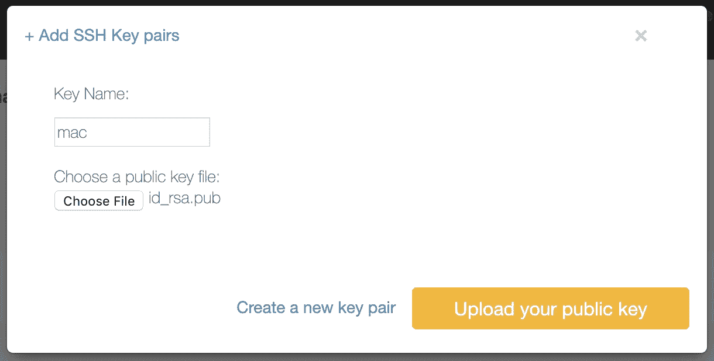

# 大型机 Linux 入门

> 原文：<https://levelup.gitconnected.com/getting-started-with-linux-on-mainframe-fcd4b19d147d>

自上世纪末以来，在大型机(System z)硬件上运行 Linux 并从大型机硬件和 Linux 生态系统中获益是可能的。

最近，IBM 推出了 IBM z/OS 容器扩展(zCX ),因此您可以在 z/OS 的 Docker 容器中运行 Linux。

为什么要在 z/OS 应用程序附近运行 Linux？应用程序的接近性是一个很大的优势，您可以在 Node.js 中开发新的应用程序，或者在同一台大型机中运行，并与现有的 COBOL CICS 应用程序进行有效而可靠的通信，或者访问 DB2 数据库中的数据。

在这里，我们将看看 LinuxONE 和 LinuxONE 社区云。它允许我们在大型机上探索 Linux，即使我们有自己的主机。

# 什么是 LinuxONE

LinuxONE 系统于 2015 年推出。它结合了 IBM 产品组合中的现有组件，并提供了一个旨在满足企业 Linux 服务器高期望的平台。

它可以将许多小型服务器上的工作负载整合到集成的 LinuxONE 机器上。

它提供了一流的安全性，并具有大型机的可靠性和性能，尤其是对于 I/O 受限的工作负载。

# 访问 LinuxONE


你不需要有自己的 LinuxONE 机器。可以用 [LinuxONE 社区云](https://linuxone.cloud.marist.edu/cloud/#/register?flag=vm)试试。它免费开放企业级 Linux 环境试用环境。

首先，你需要注册:【https://linuxone.cloud.marist.edu/cloud/#/register?flag=vm 


输入详细信息后，您将收到一封电子邮件，其中包含如何完成注册的说明。


然后您可以使用地址登录:【https://linuxone.cloud.marist.edu/cloud/#/login 

这将允许您登录。将此地址加入书签，这样您以后可以更容易地找到它。


登录后，您通常希望单击标题中的“虚拟服务器”或下面的“管理实例”来创建一个新实例或管理现有实例。


最初，您的列表将是空的:


# 设置 SSH 密钥

在创建实例之前，最好创建或导入一个 SSH 密钥。部署 Linux 实例需要一个 SSH 公钥。只有使用与公钥匹配的私钥才能访问该实例。

您可以导入现有的公钥，或者让 IBM LinuxOne 社区云生成密钥对，然后将私钥下载到您的计算机上。

作为开发人员，您的计算机上可能有一个 SSH 私钥。例如，您可能有一个为 GitHub 生成的 SSH 密钥—[https://help . GitHub . com/en/GitHub/authenticating-to-GitHub/generating-a-new-SSH-key-and-add-it-the-SSH-agent # generating-a-new-SSH-key](https://help.github.com/en/github/authenticating-to-github/generating-a-new-ssh-key-and-adding-it-to-the-ssh-agent#generating-a-new-ssh-key)。

您可以通过点击右上角的电子邮件地址来访问 SSH 密钥管理。


然后你点击导入按钮，你需要用你的公钥选择一个文件。


如果您使用的是 macOS，您的 SSH 密钥将在`~/.ssh`目录中。从浏览器中选择文件并不容易。

您可以将该文件复制到终端中的**下载**文件夹中:

```
cp .ssh/id_rsa.pub ~/Downloads/
```

然后你可以选择**下载**文件夹，id_rsa.pub 会显示在顶部。



然后，您的密钥将可用于连接到新的虚拟机。

# 创建 LinuxONE 实例

点击**创建**按钮。


您需要提供一些关于新虚拟机的信息，例如:

*   名字
*   描述
*   图片:可以选择 RedHat Enterprise Linux 7.6 或者 SUSE Linux Enterprise 12SP3。在真正的大型机上，您可以运行更多的发行版，包括 Ubuntu、Debian、Fedora、Slackware、CentOS 和 Gentoo。
*   关键配对:选择您已经导入的那个


就是这样。在你按下页面底部的创建按钮后，你的图像将开始被烹饪。

您可以在页面上查看进度:


当它准备好了，你可以检查细节。在这个社区云中，您将获得一个具有 4 GB 内存和 50 GB 磁盘空间的小实例。最新的 LinuxONE 型号支持高达 10 TB 的内存。IBM z15 大型机支持高达 40 GB 内存。


# 连接到 LinuxONE 实例

实例运行后，您可以使用它的 IP 地址和作为用户的 **linux1** 连接到它:

```
$ ssh linux1@148.100.245.17
The authenticity of host '148.100.244.18 (148.100.245.107)' can't be established.
ECDSA key fingerprint is SHA256:TNszk1qJ+PfmUVAvriG4vAT/p+toJv7fHaWRaKUGvvg.
Are you sure you want to continue connecting (yes/no)? yes
==============================================================================
Welcome to IBM LinuxONE Community Cloud!This server is for authorized users only. All activity is logged and monitored.
Individuals using this server must abide to the Terms and Conditions listed here:
[https://developer.ibm.com/linuxone/terms-of-use/](https://developer.ibm.com/linuxone/terms-of-use/)
Your access will be revoked for any non-compliance.
=============================================================================
[linux1@plape ~]$
```

现在我们在 LinuxONE 机器上。

注意:如果您已经下载了在社区云上创建的密钥。您可以使用后面跟有密钥路径的`-i`参数。

让我们检查一下硬件。首先，我们将看到磁盘:

```
[linux1@plape ~]$ df -h
Filesystem      Size  Used Avail Use% Mounted on
devtmpfs        1.9G     0  1.9G   0% /dev
tmpfs           1.9G     0  1.9G   0% /dev/shm
tmpfs           1.9G  8.3M  1.9G   1% /run
tmpfs           1.9G     0  1.9G   0% /sys/fs/cgroup
**/dev/dasda1      50G  2.3G   45G   5% /**
tmpfs           385M     0  385M   0% /run/user/1001
```

然后 CPU:

```
[linux1@plape ~]$ lscpu
**Architecture: **         **s390x**
CPU op-mode(s):        32-bit, 64-bit
**Byte Order:            Big Endian**
CPU(s):                2
On-line CPU(s) list:   0,1
Thread(s) per core:    1
Core(s) per socket:    1
Socket(s) per book:    1
Book(s) per drawer:    1
Drawer(s):             2
**Vendor ID: **            **IBM/S390**
Machine type:          2964
BogoMIPS:              20325.00
**Hypervisor:  **          **z/VM 6.4.0**
Hypervisor vendor:     IBM
Virtualization type:   full
Dispatching mode:      horizontal
L1d cache:             128K
L1i cache:             96K
L2d cache:             2048K
L2i cache:             2048K
L3 cache:              65536K
L4 cache:              491520K
Flags:                 esan3 zarch stfle msa ldisp eimm dfp edat etf3eh highgprs te vx sie
```

我们有两个 **s390x** 架构的 CPU。这很重要，因为我们只能为这个架构安装软件包。与英特尔处理器的另一个区别是字节顺序，即大型机中的[大端字节序](https://en.wikipedia.org/wiki/Endianness)。在移植低级编程语言(如 c)的代码时，需要考虑这一点。

我们可以访问在 z/VM 下运行虚拟化 Linux 的大型机。在接下来的博客文章中，我们将尝试它是否可以运行一些流行的软件，如 Jenkins 和 Nginx，并将尝试运行用流行的编程语言开发的 web 应用程序，如 Java、C++、Python、TypeScript、Go、Swift 和 Rust。