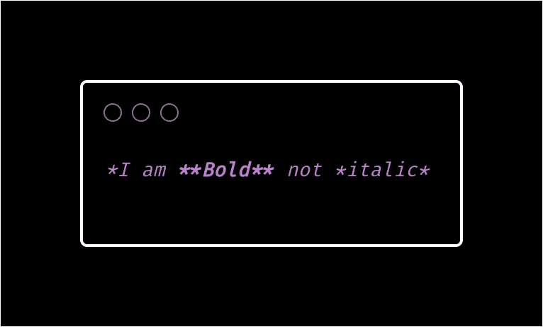

# Markdown 入门

> 原文：<https://levelup.gitconnected.com/getting-started-with-markdown-e2f74d4f2285>


照片由 [Avel Chuklanov](https://unsplash.com/@chuklanov?utm_source=unsplash&utm_medium=referral&utm_content=creditCopyText) 在 [Unsplash](https://unsplash.com/?utm_source=unsplash&utm_medium=referral&utm_content=creditCopyText) 上拍摄

# 什么是降价？

Markdown 是一种纯文本格式语法，旨在使互联网写作更容易。Markdown 也是一种具有纯文本格式语法的轻量级标记语言。

约翰·格鲁伯在 2004 年与艾伦·施瓦茨在语法方面合作创造了 Markdown 语言，其目标是让人们能够使用易读、易写的纯文本格式进行写作，然后将其转换为结构有效的 XHTML(或 HTML)。Markdown 现在是世界上最流行的标记语言之一。

# 语法指南

**标题**

任何带有前缀`#`符号的行都被转换成标题。哈希的数量表示标题的级别。例如:


**段落**

您需要使用一个空行来创建一个新行，并在那里添加文本。


# 强调

**粗体**

要使文本加粗，需要加上双星号(**)或双下划线(__)


***斜体***

要使文本成为斜体，需要加上单个星号(*)或单个下划线(_)


注意:你也可以在文本中组合使用粗体和斜体



**删除线**

删除线使用两个波浪号。


# 列表

您可以将项目组织成无序列表和有序列表。

**无序列表**

有三种方法可以创建无序列表。


**有序列表**


**嵌套列表**


# 链接

要创建链接，请将链接文本括在括号中(例如，`[Twitter]`)，然后在其后紧跟括号中的 URL(例如，`(https://Twitter.com)`)。


# 形象

要添加图像，请添加感叹号(`!`)，后跟括号中的 alt 文本，以及括号中的图像资源的路径或 URL。您可以选择在括号中的 URL 后面添加标题。

图像应该有替代文本(alt-text)


# 大宗报价

要创建块引用，请在段落前添加一个`>`。


Blockquote 可以包含多个段落。在段落之间的空行上加一个`>`。


还可以通过在要嵌套的段落前添加>>来嵌套块引号。


# 换行

要创建换行符，请在段落前添加
。


# 水平标尺

要创建水平线，请在一行中单独使用三个或更多的星号(***)、破折号(— -)、或下划线(___)。


# 代码块

要将单词或短语表示为代码，请用反斜杠(```)将其括起来。


*感谢阅读*😊😊😊😊

关注我了解更多内容